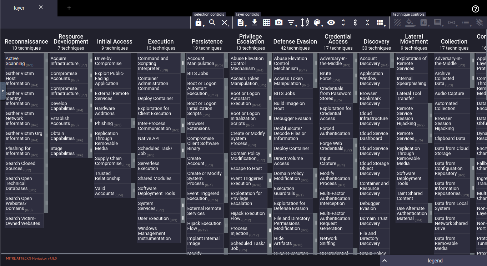
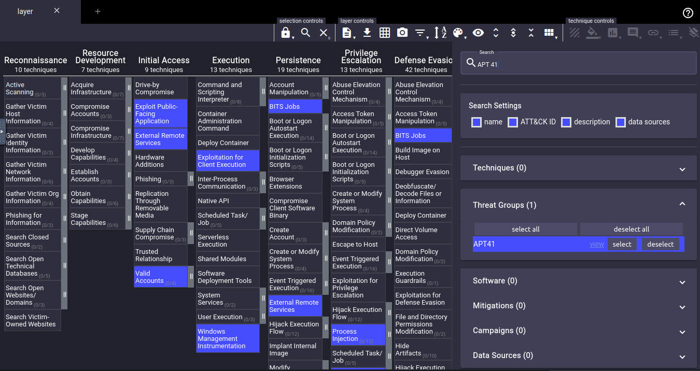

# Threat Modeling

Systematic approach used to identify, prioritze, and address potential security threats  
simulating possible attack scenarios
reduction of overall risk exposure through identification and remediation of vulnerabilties and attack vectors

## Threat

Potential event, occurrence, or actor with potential to exloit vulnerabilities resulting in a loss of confidentiality, integirty and/or availablity.  
Forms: Insider  threat, cyber attack, human error, natural disaster

## Vulnerability 

Weakenss or flaw in a system, application, or process.  
Exploitable by a threat
Bugs, misconfiguraitons, design flaws

## Risk

The likelihood and impact of being compromised when a threat actor takes advantage of avulanerablity  

## High-Level Threat Modeling Process

### Define the Scope

Identification of specific systems, networks, and/or applications subject to the modeling process  

### Asset Identification  

The Architecture and dependenices within the scope
Identification and classification of assets based on value of information stored, processes, and/or transmitted  

### Identify Threats  

The threats with potential to exploit any vulnerability in/on any asset witht the scope  
Cyber attacks, natural disasters, insider threats, social engineering, etc...  

### Analyze Vulnerabiliteis and Priortize Risks  

Assess the risk by identifying the likelihood of successful explitation to acheive a compromise and associating an impact in terms of cost and human impacts

### Develop and Implement Countermeasures

Design and implement security controls to reduce the likelihood and/or impact of successful exploitation
Risk acceptance, Risk mitigation, Risk transfer, Risk avoidance

### Monitor and Evaluation 

Continuously test and monitor the ability of controls to perform as expected to reduce likelihood and impact of exploitation.

## Team Collaboration

### Security Team  

Red and Blue Teams
Leads threat mdoling proceess
Provides expertise on threats, vulnerabilities, and risk strategies
Implement, validate, monitor controls

### Development Team  

Builds secure systems and applications
Moves securit to the earlies parts of development

### IT and Operations Team  

Manages the organization's infrastrucutre: networks, servers, other critical systems
Essential for threat modeling

### Governancne, Risk, and Compliance Team  

Responsible for organization-wide compliance assessments based on industry regulations and internal policies
Collaborates with other teams to align threat modeling with organization risk tolerance

### Business Stakeholders 

Provides insight for the identifcation of critical assets, business process, and risk tolerance
Contributions ensure all efforts align with organizaiton's strategic goals

### End Users  

Groups of people directly interacting with the system and/or application
provide unique insights and perspectives missed by other teams
able to identify vulnerabiliteis and risks specific to user interactsion, behaviors, and workflows.

## MITRE ATT&CK Framework

MITRE ATT&CK (Adversarial Tactics, Techniques, and Common Knowledge)  
knowledge base of cyber adversary bhavior and tactics
Describptions, examples and mitigations for each technique

## ATT&CK Navigator

"The [ATT&CK Navigator](https://github.com/mitre-attack/attack-navigator) is designed to provide basic navigation and annotation of ATT&CK matrices."

### Layers

#### Enterprise

threats and techniques commonly used against enterprise networks

#### Mobile

threats and techniqeus use against mobile devices

#### Industrial Control Systems (ICS)  

Threats  and techniques used against industrial controls sytems, controllling critical infrastructure (power plants, water treatement facilities, transportation systems)

### Searching and Selecting Techniques

  

Use the magnifying glass to search for and see the behaviors of an APT.  

  

Layer Controls allow 

- exporting
- filtering techniquest based on relevant platforms
- sorting of techniques based on alphabetical arrangements or numerical scores
- Expanding techniques to view sub-techniques

Annotating Techniques allows  

- enable or disable one or more selected techniques
- change the background color
- Score each technique or set of techniquess based on criteria for the specific environment
- Add notes and observations
- Add custom tags and labels
- Remove annotations

