# Active Directory Hardening

## Rapid Reference

Active Directory (AD) hardening reduces the chance that one compromised account, weak authentication setting, exposed service, or misconfigured share becomes full-domain compromise. The defensive priority is to protect identity infrastructure first, then prevent privileged credentials from crossing trust or device boundaries, then audit continuously for drift.

| Hardening Area | Operational Meaning | Primary Action |
|---|---|---|
| AD structure | Domains, trees, forests, trusts, containers, and leaf objects define where identity data lives and how resources are shared. | Understand trust paths and administrative boundaries before changing access or policy. |
| Authentication methods | LM hashes, unsigned SMB, unsigned LDAP, weak password policy, and stale service passwords all create credential-theft or relay opportunities. | Disable weak legacy storage, require signing, enforce strong password policy, and manage service account rotation. |
| Least privilege | Administrative rights should be separated by function, asset tier, and operational need. | Use role-based access, tiered administration, and routine account audits. |
| Security baselines | Microsoft-provided baselines reduce manual policy errors and provide a known-good starting point. | Deploy baselines through the Microsoft Security Compliance Toolkit and compare GPO drift with Policy Analyzer. |
| Known attacks | Kerberoasting, weak passwords, RDP brute force, and open shares are common AD entry or escalation paths. | Combine prevention, exposure reduction, monitoring, and periodic validation. |

## Understanding General Active Directory Concepts

### Domain

A domain is the core logical unit in Active Directory. It stores identity and resource information for objects that belong to that domain, such as users, computers, groups, and services.

Operationally, the domain is the boundary where many authentication, authorization, policy, and administrative decisions are made. When hardening AD, always identify which domain owns the object, which policies apply to it, and which trusts might extend access beyond it.

### Domain Controller

A Domain Controller (DC) is an AD server that supervises the Windows domain. It acts as the gatekeeper for user authentication and resource authorization.

A compromised DC can expose authentication material, policy control, and domain-wide administrative capability. Treat Domain Controllers as Tier 0 assets and protect them as the highest-value systems in the environment.

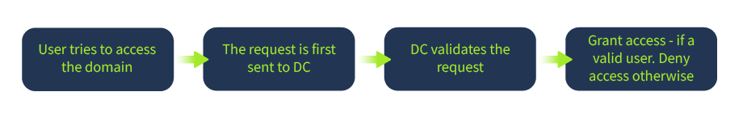

### Trees and Forests

Trees and forests define how multiple domains are grouped and how they can share directory information and resources.

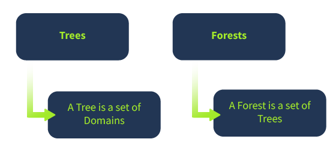

| Concept | Meaning | Hardening Relevance |
|---|---|---|
| Tree | A hierarchy of related AD domains that can share resources through trust relationships. | Trust design affects lateral movement paths and administrative boundaries. |
| Parent domain | The domain to which another domain is added. | Parent-child relationships can create implicit access relationships that must be understood during risk reviews. |
| Offspring/child domain | A domain added beneath a parent domain. | Child domains may inherit or interact with trust and policy structures that affect security posture. |
| Forest | A collection of one or more trees sharing a global catalog, schema, logical structure, and directory configuration. | The forest is often the broadest AD security boundary. Forest-level compromise can affect all contained trees and domains. |

### Trusts in Active Directory

AD trust is the communication bridge that allows one domain to use or access resources in another domain. Trusts do not make every resource automatically available; they define the relationship that allows access decisions to be made across domains.

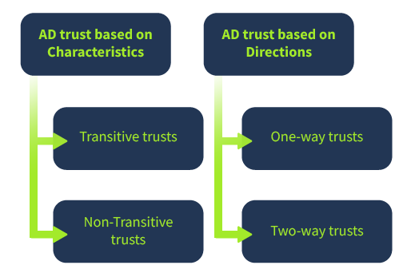

| Trust Type | What It Means | Risk and Defensive Use |
|---|---|---|
| Transitive trust | If Domain A trusts Domain B and Domain B trusts Domain C, Domain A can automatically trust Domain C. | Expands potential access paths. Review because one weak domain can affect other connected domains. |
| Non-transitive trust | Trust does not extend beyond the two explicitly connected domains. | Limits inherited access paths and can reduce unintended lateral movement. |
| One-way trust | Trust flows in one direction between a trusting and trusted domain. | Determine which side can access resources; do not assume mutual access. |
| Two-way trust | Both domains trust each other. | Easier collaboration but broader attack surface if either domain is compromised. |
| Forest-level trust | Trust between two forests. | High-impact relationship. Validate business need, monitoring, and segmentation before allowing it. |

Access AD trust configuration through:

```text
Server Manager > Tools > Active Directory Domains and Trust
```

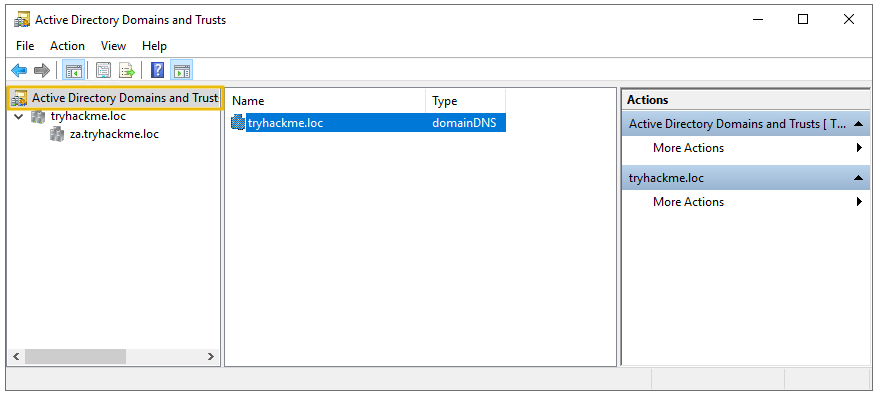

### Containers and Leaf Objects

In AD, users, services, network resources, and other directory entries are treated as objects. An object that holds other objects is a container. An object that does not hold other objects is a leaf object.

This matters for hardening because containers affect organization, delegation, and policy targeting. Misplacing objects can cause the wrong users or computers to receive the wrong policies or delegated permissions.

## Securing Authentication Methods

Authentication hardening focuses on reducing credential theft, relay attacks, downgrade risks, and weak password exposure. Use Group Policy Management Editor to configure the policies that enforce these controls.

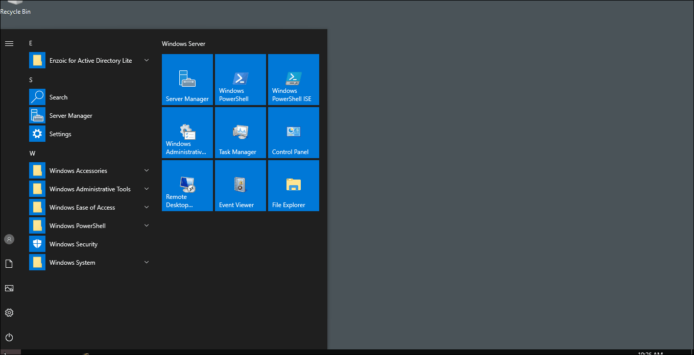

### Authentication Hardening Checklist

| Control | Why It Matters | Recommended Configuration Path / Action |
|---|---|---|
| Disable LM hash storage | LM hashes are weaker than NT hashes and can be brute-forced more quickly. | `Group Policy Management Editor > Computer Configuration > Policies > Windows Settings > Security Settings > Local Policies > Security Options > Network security - Do not store LM hash value on next password change > Define policy setting` |
| Enable SMB signing | Helps detect and prevent tampering with SMB traffic during man-in-the-middle activity. | `Group Policy Management Editor > Computer Configuration > Policies > Windows Settings > Security Settings > Local Policies > Security Options > Microsoft network server: Digitally sign communication (always) > Enable` |
| Require LDAP signing | Rejects unsigned LDAP requests that may support replay or man-in-the-middle attacks. | `Group Policy Management Editor > Computer Configuration > Policies > Windows Settings > Security Settings > Local Policies > Security Options > Domain controller: LDAP server signing requirements > Require signing` |
| Enforce password policy | Reduces success of brute force, dictionary attacks, password spraying, and credential reuse. | `Group Policy Management Editor > Computer Configuration > Policies > Windows Settings > Security Settings > Account Policies > Password Policy` |
| Rotate service passwords | Limits the usable lifetime of compromised service credentials. | Prefer gMSAs for supported services; otherwise use controlled rotation automation and MFA where appropriate. |

### LAN Manager Hash

Windows does not store clear-text passwords, but older compatibility behavior can store both LM and NT hash forms when passwords are set or changed. LM hashes are weaker and should not be retained.

Operational meaning: disabling LM hash storage reduces the value of stolen password material and removes a legacy weakness attackers can exploit offline.

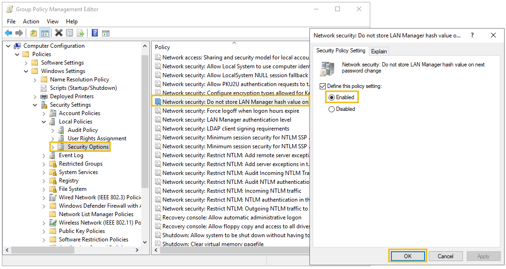

### SMB Signing

Server Message Block (SMB) supports file and print communication in Microsoft networks. SMB signing helps protect integrity by requiring SMB traffic to be digitally signed.

Operational meaning: enabling SMB signing reduces the risk that an attacker can intercept and modify SMB traffic in transit. This is especially important where relay or man-in-the-middle attacks are plausible.

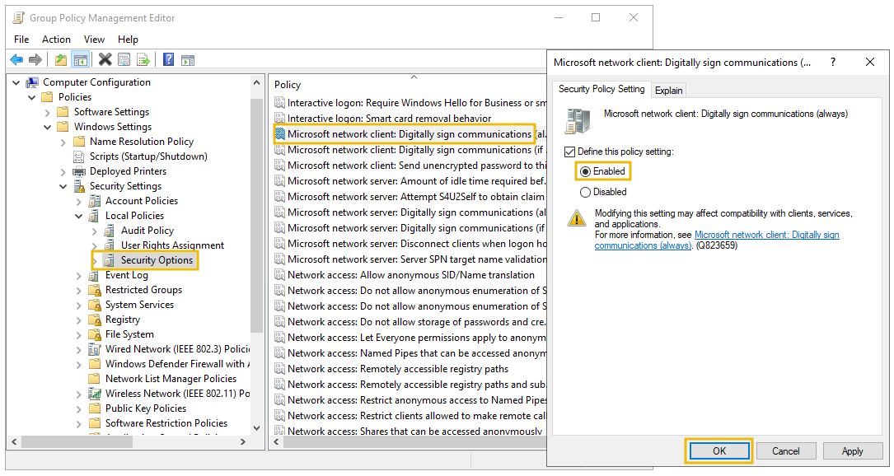

### LDAP Signing

Lightweight Directory Access Protocol (LDAP) is used to locate and authenticate resources in the network. LDAP signing requires LDAP requests to be signed and rejects unsigned or plain requests.

Operational meaning: requiring LDAP signing helps defend against replay and man-in-the-middle attacks that attempt to manipulate directory communication.

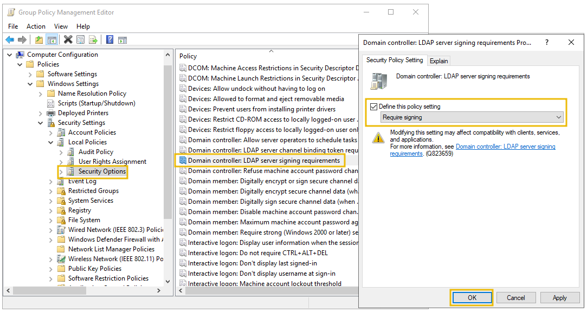

### Password Rotation

Password rotation is difficult in AD because credentials may be used across users, services, scheduled tasks, applications, and scripts. The goal is to reduce credential lifetime without breaking operational dependencies.

| Method | Value | Caution |
|---|---|---|
| PowerShell scheduled rotation | Automates password updates and reduces manual effort. | Requires script development, testing, monitoring, and maintenance. Poor automation can cause outages. |
| MFA with less frequent password changes | Adds an authentication layer and reduces reliance on constant password resets. | MFA does not fix exposed legacy authentication or service-account misuse by itself. |
| Group Managed Service Accounts (gMSAs) | Microsoft-supported service account password rotation, commonly every 30 days. | Requires service/application compatibility and correct deployment. |

### Password Policies

Password policy defines the minimum standards for password creation and reuse. Strong policy reduces the likelihood that automated guessing, reused credentials, and dictionary attacks succeed.

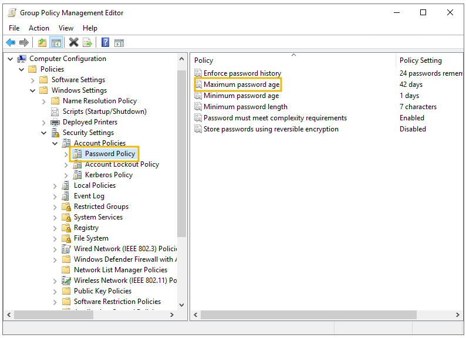

| Setting | Recommended Meaning |
|---|---|
| Enforce password history | Prevent at least 10 to 15 previous passwords from being reused. |
| Minimum password length | Set minimum length between 10 and 14 characters. Longer passphrases are usually stronger and easier to remember. |
| Complexity requirements | Prevent passwords based on the account name and require a mix of uppercase letters, lowercase letters, digits, or special characters. |

## Implementing the Least Privilege Model

Least privilege limits users and applications to only the access needed for their legitimate duties. In AD, this reduces the blast radius of compromised credentials and limits privilege escalation opportunities.

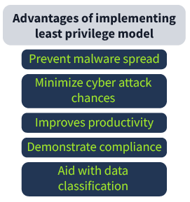

### Creating the Right Type of Accounts

| Account Type | Intended Use | Hardening Guidance |
|---|---|---|
| User accounts | Routine work for most people in the network. | Use for daily productivity. Do not grant broad administrative rights unless clearly required. |
| Privileged accounts | Elevated administration and sensitive operations. | Separate from daily-use accounts. Scope to role and tier. Monitor closely. |
| Shared accounts | Limited group or visitor access for narrow scenarios. | Avoid where possible. If used, restrict heavily, time-limit access, and audit usage. |

### Role-Based Access Control on Hosts

Role-Based Access Control (RBAC) assigns rights based on operational responsibility rather than personal preference or convenience. Access can be scoped at levels such as DNS zone, server, or individual resource record.

Operational meaning: RBAC makes permissions easier to review and defend because each right should map to a role-backed business function.

### Tiered Access Model

The Tiered Access Model separates AD assets into security tiers so privileged credentials do not cross into lower-trust systems. The key principle is preventing privileged credentials from crossing boundaries accidentally or intentionally.

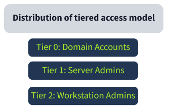

| Tier | Includes | Operating Rule |
|---|---|---|
| Tier 0 | Domain Controllers, domain/enterprise administrators, and top-level AD control groups. | Highest protection. Do not use Tier 0 credentials on lower-tier systems. |
| Tier 1 | Domain member servers and server applications. | Administer servers without exposing Tier 0 credentials. |
| Tier 2 | End-user devices such as HR and sales workstations. | Standard user activity only; no privileged domain administration from these endpoints. |

### Implementing the Tiered Access Model

Use Group Policy Objects and administrative process controls to deny or permit access according to tier boundaries. The goal is to prevent credential leakage from high-value administrative accounts into lower-trust workstations and applications.

Operationally, review logon rights, remote administration paths, privileged group membership, and where administrative accounts are allowed to authenticate.

### Auditing Accounts

Account audits validate whether access still matches operational need. They should occur periodically and after major personnel, application, or architecture changes.

| Audit Type | What to Check | Why It Matters |
|---|---|---|
| Usage audit | What each account is actually doing. | Confirms the account is still needed and behaving as expected. |
| Privilege audit | Whether each account has only required permissions. | Finds overprivileged users, service accounts, and administrative groups. |
| Change audit | Permission, password, and settings changes. | Detects improper modifications that could support persistence, privilege escalation, or data breach. |

## Microsoft Security Compliance Toolkit

Microsoft Security Compliance Toolkit (MSCT) provides Microsoft-developed security baselines and tools for managing local and domain-level policies. Use it to avoid manually building every hardening setting from scratch.

Operational meaning: baselines provide a defensible starting point, while Policy Analyzer helps identify conflicting, redundant, or missing policy settings.

### Installing Security Baselines

Download baselines only from the official Microsoft website. In the lab environment, baselines and Policy Analyzer are available under `Desktop > Scripts`.

Basic baseline workflow:

1. Open the Microsoft Security Compliance Toolkit website.
2. Select **Download**.
3. Download the relevant Windows Server Security Baseline zip file.
4. Extract the folder.
5. Open the `Scripts` folder.
6. Select the desired baseline and execute it with PowerShell.

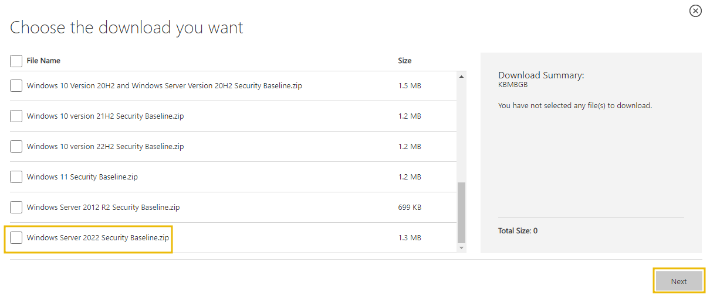

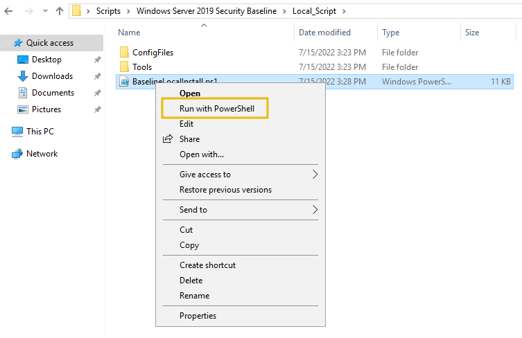

### Policy Analyzer

Policy Analyzer compares Group Policy settings so administrators can identify inconsistencies, redundant settings, and changes needed across local or domain-level policy sets.

Use Policy Analyzer when multiple GPOs apply at different levels and you need to understand which settings conflict, overlap, or drift from the intended baseline.


| Use Case | Why It Helps |
|---|---|
| Compare baselines against current GPOs | Shows drift from Microsoft-recommended configurations. |
| Identify redundant settings | Reduces unnecessary policy complexity. |
| Identify conflicting settings | Prevents unexpected or ineffective hardening controls. |
| Validate policy changes before rollout | Lowers risk of operational disruption. |

## Protecting Against Known Attacks

If an attacker gains domain admin access, the organization may have to treat the domain as fully compromised. Defensive work should assume attackers will target identity, credentials, remote access, and misconfigured shares.

### Known Attack and Misconfiguration Reference

| Threat / Weakness | How It Works | Defensive Focus |
|---|---|---|
| Kerberoasting | An authenticated user requests Kerberos Ticket Granting Service material for a service account and cracks it offline. | Use MFA where applicable, rotate KDC/service account credentials where appropriate, reduce service account privilege, and use strong service account passwords. |
| Weak and easy-to-guess passwords | Attackers use brute force, dictionary attacks, password spraying, or known compromised passwords. | Enforce strong password policy, block known bad passwords, and conduct password audits. |
| RDP brute force | Attackers scan for RDP and try weak credentials to gain interactive access. | Do not expose RDP directly to the public internet. Use additional security controls and monitor for scanning/brute-force attempts. |
| Publicly accessible shares | Unauthenticated or overly permissive shares provide footholds and lateral movement opportunities. | Review SMB shares, remove unnecessary public access, and validate permissions with PowerShell. |

### Kerberoasting

Kerberoasting is a common post-exploitation technique against Kerberos. The attacker uses an approved account to request encrypted service-ticket material and then attempts to crack it offline. This can be difficult to detect because the initial request may appear legitimate.

Operational meaning: privileged or weakly protected service accounts are high-risk. Prioritize strong service-account passwords, least privilege, service account review, and rotation practices.

### Weak and Easy-to-Guess Passwords

Weak passwords remain one of the easiest ways to breach AD. Strong passwords should combine length, complexity, and resistance to known-bad or reused values.

Operational meaning: password policy alone is not enough. Pair policy with audits, user education, MFA where possible, and monitoring for password spraying or brute-force patterns.

### Brute Forcing Remote Desktop Protocol

RDP brute force uses scanning and repeated credential attempts to gain access. Once successful, attackers commonly attempt privilege escalation and persistence.

Operational meaning: public RDP exposure should be treated as a critical risk. Use VPN or secure access gateways, enforce MFA, monitor authentication failures, and alert on unusual login sources.

### Publicly Accessible Shares

Public shares can provide attackers with discovery data, scripts, credentials, installers, or writable locations for staging. Use PowerShell to inspect open SMB files and review undesired share exposure.

```powershell
Get-SmbOpenFile
```

Operational meaning: review both share permissions and NTFS permissions. A share that appears harmless may still support lateral movement or data exposure if permissions are too broad.

## Practitioner Checklist

Use this checklist during AD hardening reviews, control validation, or audit preparation.

- Confirm domain, tree, forest, and trust relationships are documented and still required.
- Treat Domain Controllers and domain-wide administrative groups as Tier 0 assets.
- Disable LM hash storage for future password changes.
- Require SMB signing where operationally feasible.
- Require LDAP signing for Domain Controllers.
- Enforce password history, minimum length, and complexity requirements.
- Prefer gMSAs for service accounts that support them.
- Separate daily-use accounts from privileged administration accounts.
- Prevent Tier 0 credentials from authenticating to Tier 1 or Tier 2 systems.
- Audit account usage, privilege assignments, and changes on a recurring schedule.
- Deploy Microsoft security baselines from trusted sources only.
- Use Policy Analyzer to compare GPOs and detect drift or conflict.
- Review service account exposure for Kerberoasting risk.
- Do not expose RDP directly to the public internet without additional controls.
- Audit SMB shares and open files for unnecessary public or broad access.
