# Alert Triage with Elastic

## Introduction

### Learning Objectives  

- Use Kibana to analyze common security logs
- Learn how to identify key indicators of compromise
- Correlate events across multiple log sources
- Uncover the breach through a series of SOC alerts

## Scenario

- Managing several small businesses' servers, applications, and network infrastructure
- Suspicious activity in infrastructure, has triggered multiple alerts
- Use the provided logs, dashboards, and tools to investigate the activity
- determine if it is malicious, and reconstruct the attack sequence.

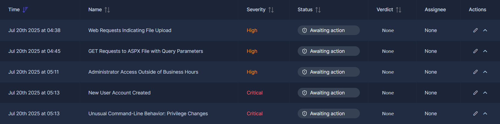  

Access the dashboard and choosing the correct filters.

    1. Access Kibana : Start the VM, wait up to five minutes, and open https://LAB_WEB_URL.p.thmlabs.com/
    2. Select the Data view: You need to choose Alert Triage With Elastic for this room
    3. Select the time range: For now, select Entire data range to view all ingested logs

 

The Data view selected includes two indices
Use `_index:weblogs` for the second question.

### Scenario Questions

#### How many logs are available for analysis within the entire time range?

1467

#### What is the field value for the client.ip in the weblogs index?

203.0.113.55

## Investigating Web Attacks

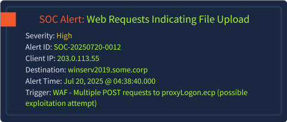  

- Severity Rating: High  
- Alert ID SOC-20250720-0012  
- client IP: 203.0.113.55
- destination host:  winserv2019.some.corp
- timestamp: Jul 20, 2025, at 04:38:40.000.
- trigger: multiple POST requests to proxyLogon.ecp (possible exploitation attempt).

First goal: view the log data in a more structured and legible manner, making it easier to identify indicators.  

Append your current query with the IP address and highlight POST requests: `_index:weblogs and client.ip:203.0.113.55 and http.request.method:POST`  
Build the table by hitting the `+` next to any field on the left side to add it as a column  
Add: client.ip, user.agent, http.request.method, url.path, and http.response.status_code

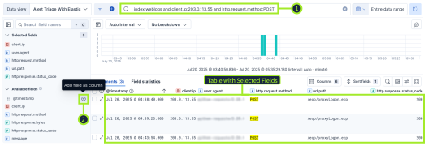  

**Current analysis**: Red Flag (The requests are automated and related to the ProxyLogon (opens in new tab) vulnerability.)

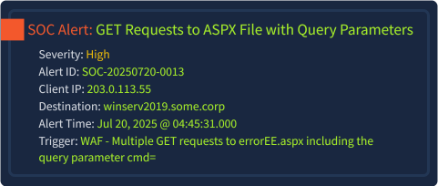  

- severity rating: High
- Alert ID:  SOC-20250720-0013
- client IP: 203.0.113.55
- destination host: winserv2019.some.corp
- timestamp: Jul 20, 2025, at 04:45:31.000
- trigger: multiple GET requests to errorEE.aspx including the query parameter cmd=

Observations: 

- same client IP address  
- seven minutes after the first one
- the cmd= parameter is a hallmark of web shell activity  

Alter your query to search for GET requests and the file name errorEE.aspx:  

`_index:weblogs and client.ip:203.0.113.55 and http.request.method:GET and errorEE.aspx`  
Sort Old-New to see the requests that came in first at the top

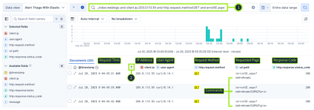  

Analysis: breach  
Action: Escalate both alerts to your senior as True Positives.  

### Investigating Web Attack Questions

#### How many POST requests did the IP address 203.0.113.55 make to proxyLogon.ecp?

 3 

#### Which user.agent paired with the IP address 203.0.113.55 made the POST requests?

python-requests/2.25.1

#### How many logs contain the cmd= query parameter in the url.path field?

`_index:weblogs and url.path:*cmd=*`  
20

#### Which command was run utilizing errorEE.aspx on Jul 20, 2025 @ 04:45:50.000?

`@timestamp:"2025-07-20T04:45:50" and url.path:*cmd=*`  

hostname 

## Uncovering Account Activity

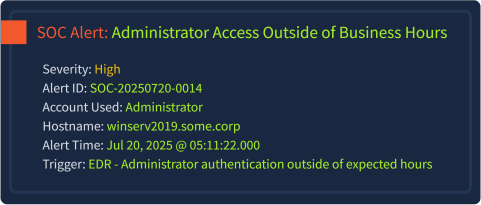  

- Severity Rating: High
- Alert ID: SOC-20250720-0014  
- account used: Administrator  
- hostname:  winserv2019.some.corp  
- timestamp: Jul 20, 2025, at 05:11:22.000
- trigger:  indicates administrator authentication outside of expected hours through the EDR.

Findings: 
- web log investigation raised red flags
- suspicious network traffic is only part of the story  
- pivot to host-based evidence to determine if the attacker has moved further
- alert shows that the Administrator account accessed the server outside of business hours  

**Confirm the logon:**  When, how, and from where did it occur; focus on events that occurred on or after the specified time in the alert; focus on Security Event ID 4624 (Logon), the client's hostname, and the Administrator user.

`@timestamp >= "2025-07-20T05:11:22" and winlog.event_id:4624 and host.name:winserv2019.some.corp and winlog.event_data.TargetUserName:Administrator`

Add fields as columns to construct a table, allowing relevant information to be easily highlighted.

- **winlog.event_id:** Windows Event ID
- **host.name:** Target hostname on which the logon occurred
- **winlog.event_data.TargetUserName:** User account that logged in
- **winlog.logon.type:** How the user accessed the system (e.g., remotely via RDP)
- **winlog.event_data.IpAddress:** The source IP address of the client, a very important field

**Findings:**  the Administrator logged on at the specified time and from the same IP 203.0.113.55  

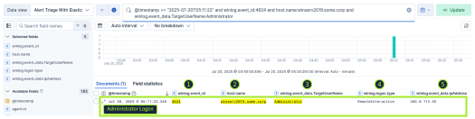  

Both Windows Security logs and Sysmon logs are available for investigation  
Can be correlated to validate the Administrator authentication and to investigate what happened afterward  

Use the timestamp from the previous 4624 logon event and adjust your query to look for Event ID 1 (Process Creation) and the Administrator username.

`@timestamp >= "2025-07-20T05:11:22" and winlog.event_id:1 and user.name:Administrator`

These fields have been added to a table in the screenshot below. You can do the same in your VM.

- **user.name:** User account that launched the process
- **process.parent.name:** Executable name of the parent process
- **process.command_line:** The actual process with its full command line

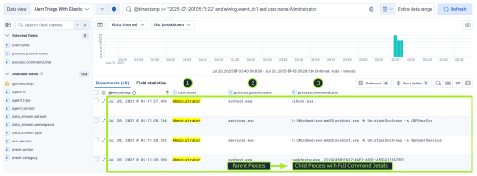  

Findings:  
- verified the Administrator logon  
- the Administrator logon initiated a process chain that aligns with Windows session initialization  

The evidence you have so far is not enough to validate whether this behavior is malicious  
Investigate the next alert to determine what the Administrator account was up to.

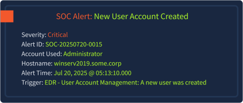  

- **Severity Rading:** Critical
- **Alert ID:** SOC-20250720-0015
- **account used:** Administrator
- **hostname:** winserv2019.some.corp 
- **timestamp:** Jul 20, 2025, at 05:13:09.000 
- **trigger:** User Account Management: A new user was created through the EDR.

The Query: `@timestamp >= "2025-07-20T05:13:10.000" and winlog.channel:Security and winlog.task:User Account Management`

Focuses on Windows Security logs and the winlog.task field  
This field gives a human-readable context about what type of activity the event represents  
Create a table with these three fields after submitting the query  

1. winlog.event_id 
2. winlog.task 
3. message

### Account Activity Questions

#### What is the winlog.record_id of the Administrator 4624 logon event?

`@timestamp >= "2025-07-20T05:11:22" and winlog.event_id:4624 and host.name:winserv2019.some.corp`

17166

#### What is the process.pid of the Sysmon 1 event that occurred on Jul 20, 2025 @ 05:11:27.996?

964

#### What is the winlog.event_id for the new user account being created?

google

#### What is the name of the new user account?

`winlog.event_id:4720`

## Exposing Command Execution

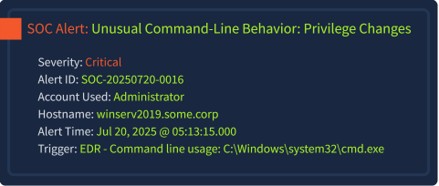  

- **Severity:** High
- **Alert ID :** SOC-20250720-0016
- **account:** Administrator  
- **hostname:** winserv2019.some.corp  
- **timestamp:** Jul 20, 2025, at 05:13:15.000  
- **trigger:** indicates command-line usage: C:\Windows\system32\cmd.exe

First steps:  

- **Scope the alert:** Identify the child processes launched by cmd.exe
- **Confirm the origin:** Find out who launched cmd.exe and why
- **Check for privilege changes:** Look for commands like net used to add users to groups
- **Correlate across log sources:** Use Sysmon and Windows Security logs to confirm the malicious behavior

Craft a query to highlight Sysmon events that occurred on or after the stated time and include the parent process cmd.exe: 

`@timestamp >= "2025-07-20T05:13:15" and process.parent.name:cmd.exe and user.name:Administrator`

Create a simple table to investigate the commands executed by adding `process.command_line`, `process.name`, and `process.parent.name`  

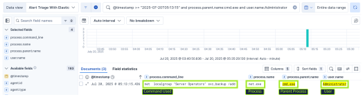  

**Correlate with Security Event ID 4732(Security Group Management)**

`@timestamp >= "2025-07-20T05:13:15" and (winlog.event_id:4732 or process.parent.name:cmd.exe)`

A table has been constructed that highlights various fields from each event type, both and Security  
Use the same fields to build your table or experiment with other fields that you believe might be valuable.  

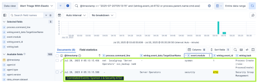  

### PowerShell Usage

It has been verified that Administrator used `CMD` to create a user and modify security groups  
But did the attack end there, or continue from the newly created user?  
To answer this, you can use the same Sysmon approach, but let's also examine logs:

1. **Query:** `@timestamp >= "2025-07-20T05:13:15" and event.module:powershell and event.code:4104`
2. Add the field `powershell.file.script_block_text` as a column to show commands run in plaintext
3. Sort by Old-New

Findings: The first commands visible in your search results are `whoami` and `whoami /priv`  
These are classic discovery commands, often used by attackers to learn which account they are running under and what privileges are available.   

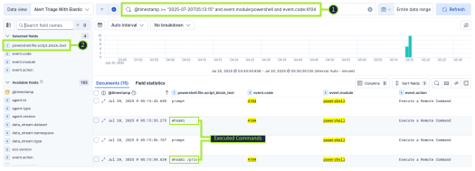  

**Finding:** confirmed that the adversary didn't just stop after creating a backdoor  
Timeline is build: ProxyLogon exploitation of the web app, RDP login as Administrator, backdoor user setup via CMD, and now further evidence through  

### No Alert Created

Not every malicious action is covered by SOC alerts.  
Hunting may be required to look deeper into the logs to uncover the full attack  
During the investigation, you might have noticed the compression tool Rar.exe being utilized by the newly created account  
No alert was created because this is legitimate software used by your client  
Investigate the usage of the executable using Sysmon logs to answer the final question with this query.

`process.name: "Rar.exe"`

Even though no alert was generated, this is your chance to seal the deal on the investigation. As a analyst, your responsibility is not only to find artifacts, but also to determine what they mean in context:

 - Do you have sufficient evidence to suggest that this activity is malicious, or is it benign?
 - Can you correlate across log sources to show which account executed the tool, when, and how?
 - Does the timing or parent process indicate potential abuse?

If the answers point to suspicious use, you now have the evidence needed to escalate the case with confidence.

### Command Execution Questions

#### What command does the attacker use to add the new account to the "Remote Desktop Users" group?

net localgroup "Remote Desktop Users" svc_backup /add

#### What is the winlog.record_id of the 4732 Security event when the attacker adds the user to the Administrator group?

`winlog-event_id:4732` 

add winlog.record_id  

Review messages  

17254  

#### What PowerShell command did the attacker run on Jul 20, 2025 @ 05:16:14.628?

net group "Domain Admins" /domain

#### What is the name of the archive that the attacker creates using the Rar.exe executable?

Review winlog.event_data.CommandLine

