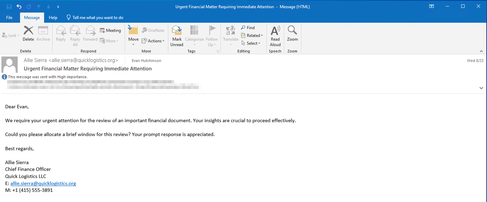
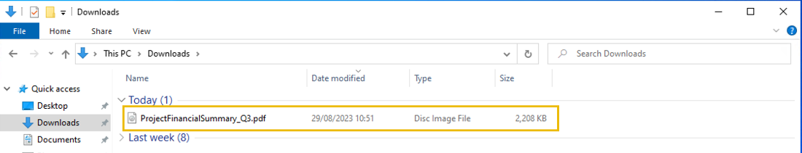
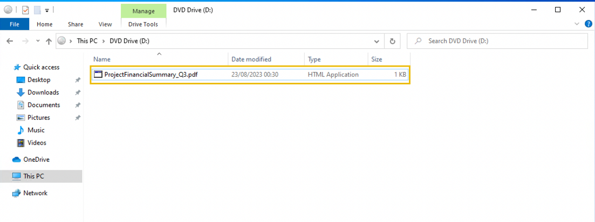

# Boogeyman 3

> Structured cybersecurity study notes converted from the source DOCX. Commands, indicators, answers, and investigation pivots are preserved for rapid reference.

Due to the previous attacks of Boogeyman, Quick Logistics LLC hired a managed security service provider to handle its Security Operations Center. Little did they know, the Boogeyman was still lurking and waiting for the right moment to return.
In this room, you will be tasked to analyze the new tactics, techniques, and procedures (TTPs) of the threat group named Boogeyman.
## Lurking in the Dark

Without tripping any security defenses of Quick Logistics LLC, the Boogeyman was able to compromise one of the employees and stayed in the dark, waiting for the right moment to continue the attack. Using this initial email access, the threat actors attempted to expand the impact by targeting the CEO, Evan Hutchinson.


The email appeared questionable, but Evan still opened the attachment despite the scepticism. After opening the attached document and seeing that nothing happened, Evan reported the phishing email to the security team.
## Initial Investigation

Upon receiving the phishing email report, the security team investigated the workstation of the CEO. During this activity, the team discovered the email attachment in the downloads folder of the victim.


In addition, the security team also observed a file inside the ISO payload, as shown in the image below.


Lastly, it was presumed by the security team that the incident occurred between August 29 and August 30, 2023.
Given the initial findings, you are tasked to analyze and assess the impact of the compromise.
## Questions and Answers

### What is the PID of the process that executed the initial stage 1 payload?

```text
search: "ProjectFinancialSummary_Q3.pdf
```

- note… had to be literal. Searching for part of the file title returned zero results
- four records returned
- fourth record had a PID
- **Answer:** 6392
### The stage 1 payload attempted to implant a file to another location. What is the full command-line value of this execution?

- Same set of results,, in another event records
- **Answer:** C:\Windows\System32\xcopy.exe" /s /i /e /h D:\review.dat C:\Users\EVAN~1.HUT\AppData\Local\Temp\review.dat
### The implanted file was eventually used and executed by the stage 1 payload. What is the full command-line value of this execution?

- same set of results
- **Answer:** C:\Windows\System32\rundll32.exe" D:\review.dat,DllRegisterServer
### The stage 1 payload established a persistence mechanism. What is the name of the scheduled task created by the malicious script?

- same set of results
- in the "process.args" field
- **Answer:** Review
The execution of the implanted file inside the machine has initiated a potential C2 connection. What is the IP and port used by this connection? (format: IP:port)
```text
filters: winlog.event_id:3 host.hostname: WKSTN-0051
```

- this covers the specific events for the initiaiton of a network connection on the specific host where the activity is happening
- The very first entry contains the answer
- **Answer:** 165.232.170.151:80
### The attacker has discovered that the current access is a local administrator. What is the name of the process used by the attacker to execute a UAC bypass?

- searched internet for "detect windows UAC bypass"
- found two main methods using fodhelper and eventviewer
- filtered host.hostname: WKSTN-0051 and searched for *fodhelper*
- **Answer:** fodhelper.exe
### Having a high privilege machine access, the attacker attempted to dump the credentials inside the machine. What is the GitHub link used by the attacker to download a tool for credential dumping?

```text
search: *github* and *download*
```

- can see that mimikatz was downloaded
- **Answer:** https://github.com/gentilkiwi/mimikatz/releases/download/2.2.0-20220919/mimikatz_trunk.zip
After successfully dumping the credentials inside the machine, the attacker used the credentials to gain access to another machine. What is the username and hash of the new credential pair? (format: username:hash)
Filter: process.name is mimikatz.exe
## Search: *ntlm*

- leaves easy six results to scan through
- **Answer:** itadmin:F84769D250EB95EB2D7D8B4A1C5613F2
### Using the new credentials, the attacker attempted to enumerate accessible file shares. What is the name of the file accessed by the attacker from a remote share?

Filters: host.hostname is WKSTN-0051 and winlog.event_id=1
- **Search:** `mimi*`
- these leaves about 11 events
- can view where mimikatz is downloaded, and subsequent events show the hacker reaching out to WKSTN-1327
| A: IT_Automation.ps1 |  |
| --- | --- |

After getting the contents of the remote file, the attacker used the new credentials to move laterally. What is the new set of credentials discovered by the attacker? (format: username:password)
### What is the hostname of the attacker's target machine for its lateral movement attempt?

### Using the malicious command executed by the attacker from the first machine to move laterally, what is the parent process name of the malicious command executed on the second compromised machine?

The attacker then dumped the hashes in this second machine. What is the username and hash of the newly dumped credentials? (format: username:hash)
### After gaining access to the domain controller, the attacker attempted to dump the hashes via a DCSync attack. Aside from the administrator account, what account did the attacker dump?

### After dumping the hashes, the attacker attempted to download another remote file to execute ransomware. What is the link used by the attacker to download the ransomware binary?
