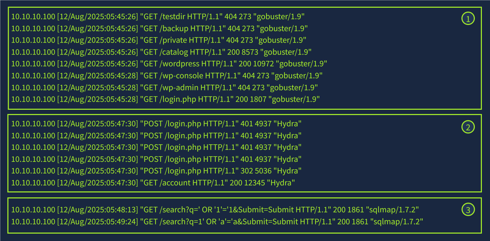

# Detecting Web Attacks

## Server-Side Attacks

explitation of vulnerabilities witin server, application code, or backend.  
exploit flaws, vulnerabilities, server logic, misconfigurations, input handdling  

### Catching Server-Side Attacks

Logs from various network attached endpoints  

### Common Server-Side Attacks

#### Brute-Force

Repeated attempts to login with varied usernames/passwords  

#### SQL Injection

Attacking the backend database  
database uses string concatenation rather than parameterized queries  

#### Command Injection

WEbsite receives a command and executes the command without sanitization.

## Log-Based Detection  

capures evidence in access and error logs.  
patterns reveal scanning, exploitation attempts, or other attacks  

**Access Log Format**  

| Log Field                  | Example Indicator                                                      |
|----------------------------|-------------------------------------------------------------------------|
| **Client IP Address**       | A known malicious or outside of the expected geo range                   |
| **Timestamp and Requested Page** | Requests made at unusual hours or repeated in a short period of time  |
| **Status Code**             | Repeated 404 responses indicating a page could not be found            |
| **Response Size**           | Significantly smaller or larger than normal response sizes             |
| **Referrer**                | Referring pages that don't fit normal site navigation                   |
| **User-Agent**              | Outdated browser versions or common attack tools (e.g. sqlmap, wpscan)  |  

### Attacks in Logs

1. use of gobustter to probe for available directories, where `200` represents a valid respons.  
2. Attacker identifies the login page and employs hydra to bruture force the login using `POST` requests. Response code `302` is a redirection response; indicates a successful login to the resource which is at a differnet URL than the originaly requested URL.  
3. Once access is gained, attacker uses SQL map to perform automated SQLi.  
  

### Log Limitations 

Access logs do not capture full contents of a request.  
Must combine access logs, application logs, and other logs to gain full visibility (SIEM)  

