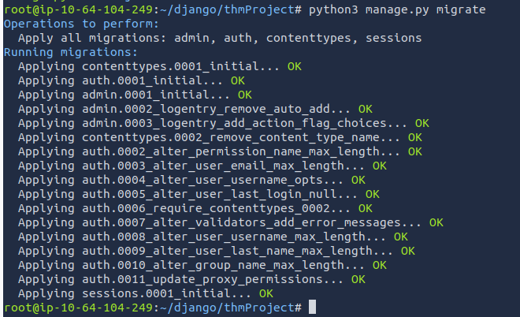

# Django 

high-level Python web framework  
enables rapid development of secure and maintainable websites within hours  
can automatically compile HTML reducing barriers to entry for beginning develoeprs
highly secure  

## Getting Started 

`:> apt install python3-django`  

`:> pip3 install Django==<version number>`  

`:> mkdir <project name>`  

start a new project: `:> django-admin startproject <project name>`  

  

### Migrate

`:> python3 manage.py migrate` : auto-configure new files  

  

`manage.py` is a command-line utility allowing interaction with the Django project

syntax: `:> python3 manage.py <command>`  

### Runserver

Example: `:> python3 manage.py runserver`  : deploys the website on the server.

  

Example: `:> python3 manage.py runserver 0.0.0.0:8000`  : deploys the website on the local network  

Add to settings.py in the project folder: `ALLOWED_HOSTS = ['0.0.0.0'. '127.0.0.1']`  


### Createsuperuser  

Create and admin account for the project  

`:> python3 manage.py createsuperuser`  

  

### startapp 

initialize and app for the project  

`:> python3 manage.py startapp <app name>`  

## Creating a Website

### 1. Create the Project

`:> django-admin startproject newProject .`  

`:> python3 manage.py migrate`  

  


### 2. Verify

`:> python3 manage.py runserver`  

open the browser to 127.0.0.1:8000 to ensure the server is running  

### 3. Create the first app

`:> python3 manage.py startapp firstApp`  


### 4. Register the apps

Add the app name to `settings.py`  

  

### 5. Create the Admin Account

`:> python manage.py createsuperuser`  

  

### 7. Run the server

`:> python3 manage.py runserver`  

Log in with the admin user  

  

### 8. Edit URLS

`:> nano newProject/urls.py`  

```python
from django.contrib import admin
from django.urls import path, include

urlpatterns = [
	path('firstApp/', include('firstApp.urls')),
    path('admin/', admin.site.urls),
]
```


### 9. Create App URLS

`:> touch firstApp/urls.py`

```python
from django.urls import path
from . import views

app_name = 'firstApp'

urlpatterns = [
    path('', views.index, name='index'),
]
```

Paths with a blank directory ('') are going to call the function whenever the app is accessed at `https://IP/{app name}`
other directories extend the link  
`views.py` carries out functions called using url.py  

### 10. Add Functions

`:> nano firstApp/views.py`

```python
from django.shortcuts import render
from django.http import HttpResponse


# Create your views here.

def index(request): #<- the name of the function reflects the value of the variable 'name' in urlpatterns array of urls.py
    return HttpResponse("Hello, World!")
```

### 11. Run the server

`:> python3 manage.py runserver`  

Visit the app url `http://127.0.0.1:8000/firstApp`  

  

### 12. Simplify With Templates

Make the templates directory: `:> mkdir firstApp/Templates`  

Create the base file: `:> touch firstApp/Templates/base.html`

```html
# base.thml

<!DOCTYPE html>
<html lang='en'>
<head>
    <meta charset="UTF-8">
    <title>My Website</title>
</head>
<body>
     
</body>
</html>
```

Create a new template `:> touch firstApp/Templates/index.html`  

uses base.html and allows for altered content between block identifiers  

```md
# index.html



 

Hello, World 2!


```

Alter `firstApp/views.py`  

```python
from django.shortcuts import render

from django.http import HttpResponse


# Create your views here.

def index(request):
    return render(request, 'index.html')

```

Edit `firstApp/urls.py`  

```python
from django.urls import path
from . import views 

app_name = 'firstApp'

urlpatterns = [
    path('', views.index, name='index'),
]
```


## CTF - Fix the Errors

### Copy


`:> scp django-admin@10.65.171.193:messagebox/ .`  


From the project folder "messagebox":

`:> grep -r "THM{"`

Identifies the Admin flag and the Hidden Flag.  

`:> python3 manage.py createsuperuser`  

Log in with the new user: 

  


Get the password hash from pastebin and put it into crackstation.net:  

SSH into the remote box to get the flag.  