# Elastic Stack: The Basics

## Introduction

Elastic Stack, commonly called ELK, is used to collect, normalize, search, analyze, and visualize logs. For SOC work, the practical value is that it gives analysts a searchable workspace for turning raw endpoint, network, VPN, and application logs into investigation evidence.

### Learning Objectives

- Understand the core Elastic Stack components and how they support SOC operations.
- Explore the major ELK features used during log analysis.
- Search, filter, and narrow log data in Kibana.
- Investigate VPN logs to identify anomalies.
- Create basic visualizations and dashboards that improve operational visibility.

## Elastic Stack Overview

Elastic Stack was originally developed to store, search, and visualize large volumes of data. In security operations, the same capability supports log analysis, anomaly detection, and incident investigation.

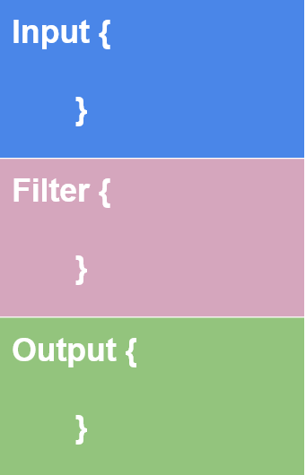

> **SOC analyst note:** Analysts do not need to be infrastructure specialists for every Elastic component, but they must understand the flow of data well enough to know where logs come from, how they are normalized, and where to search them during an investigation.

### Component Quick Reference

| Component | Primary Function | SOC Use | What to Remember During Investigation |
|---|---|---|---|
| **Elasticsearch** | Search and analytics engine for JSON-formatted documents. | Stores, searches, analyzes, and correlates log data. | This is where indexed log data lives. Kibana queries Elasticsearch when analysts search. |
| **Logstash** | Data processing and normalization engine. | Ingests logs from sources, parses them, normalizes fields, and forwards results. | If fields look wrong or inconsistent, ingestion or parsing may be the reason. |
| **Beats** | Lightweight host-based data shippers. | Sends endpoint, Windows, network, and other telemetry to Elastic. | Beats determine which endpoint or telemetry source is feeding the stack. |
| **Kibana** | Web interface for search, analysis, visualization, and dashboards. | Main analyst workspace for triage and investigation. | Most SOC analysis in this lesson happens in Kibana, especially the Discover tab. |

### 1. Elasticsearch

Elasticsearch is a full-text search and analytics engine for JSON-formatted documents. It stores, analyzes, and correlates data and supports RESTful API interaction.

For SOC use, Elasticsearch is the searchable backend that makes large log volumes operationally useful. Instead of manually reading raw logs, analysts can query fields such as usernames, IP addresses, countries, event outcomes, timestamps, or VPN connection results.

### 2. Logstash

Logstash is a data processing engine. It receives data from multiple sources, filters or normalizes it, and sends the transformed data to a destination such as Elasticsearch, a listening port, a database, or a file.


A Logstash configuration commonly has three major parts:

| Logstash Section | Purpose | SOC Meaning |
|---|---|---|
| **Input** | Defines where the data is coming from. | Identifies the source of evidence, such as Beats, ports, files, or other collectors. |
| **Filter** | Parses, enriches, and normalizes the ingested data. | Converts raw logs into usable fields so analysts can search consistently. |
| **Output** | Defines where the processed data is sent. | Determines where analysts will later search or visualize the data. |

Logstash supports many input, output, and filter plugins. The key operational point is that properly parsed logs become field-value pairs that are much faster to search and correlate.

### 3. Beats

Beats are host-based agents known as data shippers. They transfer specific data from endpoints or services into Elastic Stack.

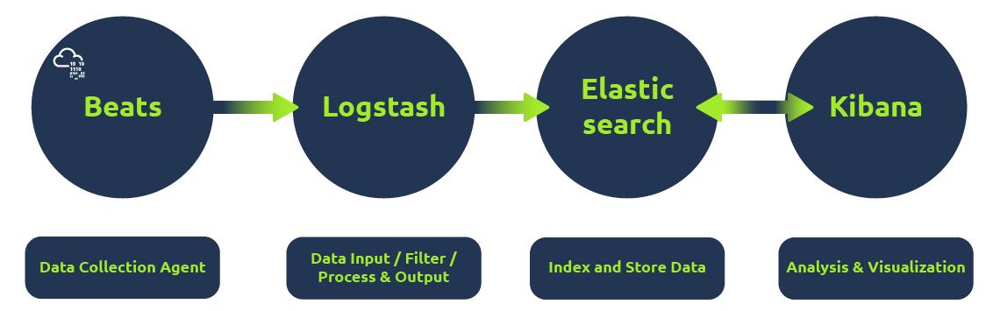

Each Beat is single-purpose. For example:

- **Winlogbeat** collects Windows event logs.
- **Packetbeat** collects network traffic flow data.
- Other Beats collect system, audit, file, or application telemetry depending on deployment.

For investigations, Beats matter because they define what telemetry is available. If a relevant event is missing, the collection path may need to be checked before assuming the activity did not occur.

### 4. Kibana

Kibana is a web-based visualization and analysis tool that works with Elasticsearch. Analysts use Kibana to search logs, filter events, create visualizations, and build dashboards.

For SOC work, Kibana is the primary interface for answering investigation questions such as:

- Which user generated this VPN activity?
- Which source IP made repeated failed attempts?
- Did events spike at a specific time?
- Which countries, users, or IPs appear most often?

### How the Components Work Together

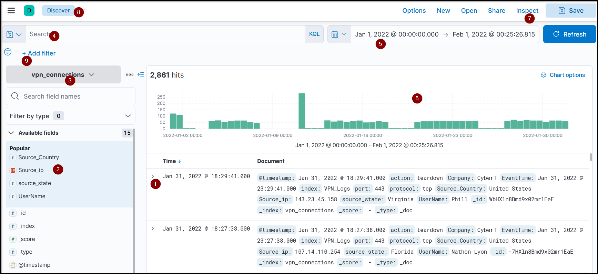

1. **Beats collect data** from endpoints and services. For example, Winlogbeat collects Windows logs and Packetbeat collects network traffic flows.
2. **Logstash receives and processes data** from Beats, files, or ports. It parses and normalizes events into field-value pairs.
3. **Elasticsearch stores and indexes data** so it can be searched and analyzed efficiently.
4. **Kibana displays and visualizes data** so analysts can search, investigate, chart, and dashboard the evidence.

## Discover Tab

The Discover tab is the main investigation workspace in Kibana. Analysts use it to search raw logs, inspect normalized fields, apply filters, identify anomalies, and narrow results by time.

### Discover Tab Elements

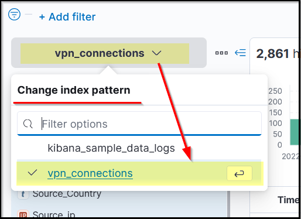

| Element | What It Does | SOC Use |
|---|---|---|
| **Logs** | Displays each event as a row. | Review individual records and expand events for full field details. |
| **Fields Pane** | Lists parsed fields from the selected index pattern. | Quickly identify searchable fields and common values. |
| **Index Pattern** | Selects the dataset Kibana should search. | Choose the right log source, such as VPN connection logs. |
| **Search Bar** | Accepts KQL queries and search terms. | Search for users, IPs, countries, outcomes, or suspicious values. |
| **Time Filter** | Limits results to a time window. | Focus the investigation on the period of suspected activity. |
| **Time Interval / Timeline** | Charts event counts over time. | Spot spikes that may indicate scanning, brute force, outages, or abnormal usage. |
| **Top Bar** | Provides save, open, share, and other workspace options. | Save useful searches for repeat investigation workflows. |
| **Discover Tab Workspace** | Main area for searching and analyzing raw data. | Primary place to pivot from raw logs to field-based evidence. |
| **Add Filter** | Applies filters to specific fields. | Narrow results without manually writing complete KQL queries. |

### Index Pattern

An index pattern tells Kibana which Elasticsearch data to explore. Each log source can have a different structure, so logs are normalized into corresponding fields and values through an index pattern.

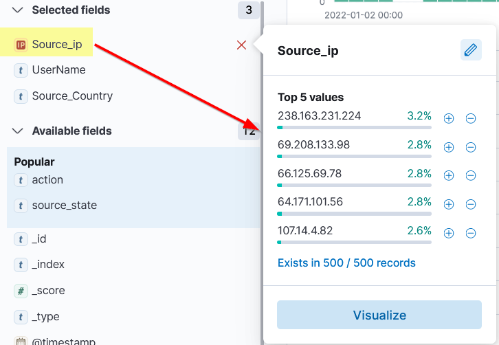

Operationally, choosing the correct index pattern is the first step in avoiding false conclusions. If the wrong index is selected, the relevant logs may not appear even though they exist elsewhere in Elasticsearch.

In the lab scenario, the relevant index pattern is **VPN connections**, which contains VPN log data.

### Fields Pane

The Fields Pane shows normalized fields found in the available logs. Selecting a field displays the top values and their approximate frequency.

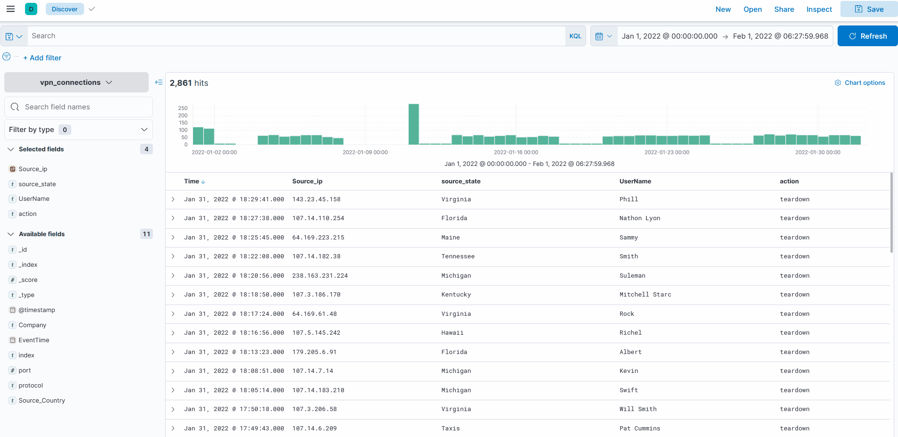

Use the Fields Pane to quickly answer early triage questions:

- Which usernames appear most often?
- Which source IPs are common or unusual?
- Which countries or locations dominate the dataset?
- Which result values, such as failed or successful attempts, appear frequently?

The `+` control includes logs containing a selected value. The `-` control excludes logs containing that value. This is useful for rapidly narrowing a large dataset without writing every query manually.


### Time Filter

The time filter narrows results to a specific period.

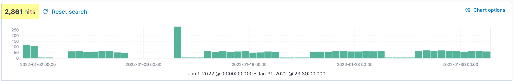

For SOC investigations, time filtering is critical. Most investigations begin with an alert time, user report time, or known incident window. Filtering too broadly creates noise; filtering too narrowly can hide precursor or follow-on activity.

### Timeline

The timeline pane shows event volume over time. It helps analysts recognize spikes, gaps, or abnormal activity windows.


In the example, the timeline shows an unusual spike on **January 11, 2022**. In a real SOC workflow, this spike would justify narrowing the time range and reviewing the highest-volume fields, affected users, source IPs, and outcomes.

### Create Table

By default, logs may appear in raw form. Analysts can expand logs and select important fields to create a table that displays only relevant columns.


This is useful because raw logs are noisy. A table focused on fields such as time, user, source IP, source country, destination, and connection result can turn a large log set into a usable triage view.

Saved table formats allow analysts to reuse the same field layout when returning to the dashboard or search.

## KQL

KQL, or Kibana Query Language, is used in the Kibana search bar to search ingested logs and documents in Elasticsearch.

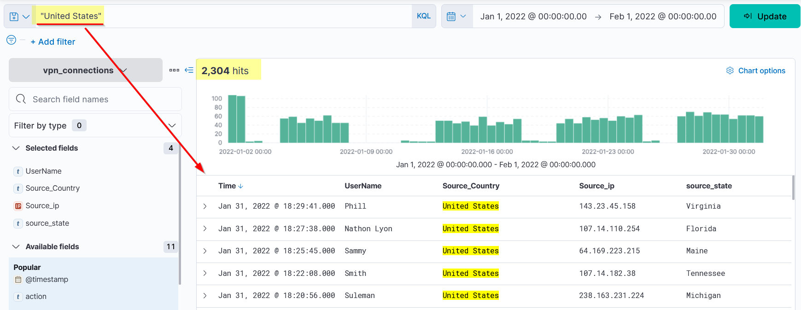

KQL supports two major search approaches:

| Search Type | Description | Best SOC Use |
|---|---|---|
| **Free text search** | Searches for text across documents regardless of field. | Quick discovery when the relevant field is unknown. |
| **Field-based search** | Searches a specific field for a specific value. | Precise filtering during triage, scoping, and evidence collection. |

### Free Text Search

Free text search returns logs based on text, regardless of which field contains the value. For example, searching for `United States` returns all documents containing that full term.

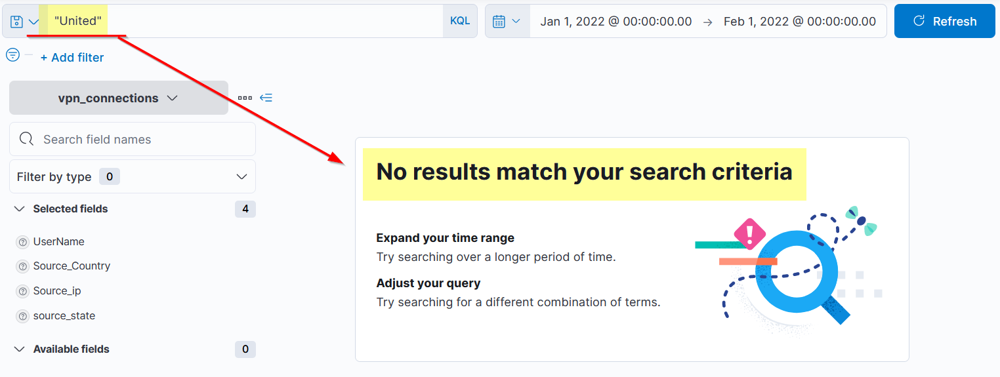

#### Whole-Term Matching

KQL looks for the whole term or word. Searching for only `United` may not return results if the indexed value is stored as the complete phrase `United States`.


#### Wildcard Search

Use the wildcard `*` to match partial terms.

```kql
United*
```


This returns results containing terms that begin with `United`, such as `United States` or `United Nations`, if those values exist in the dataset.

### Logical Operators

KQL supports logical operators to combine or exclude terms.

| Operator | Purpose | Example Query | Investigation Meaning |
|---|---|---|---|
| **AND** | Requires both terms to match. | `"United States" AND "Virginia"` | Find events that contain both country and state/location terms. |
| **OR** | Requires either term to match. | `"United States" OR "England"` | Compare or include multiple locations, users, or indicators. |
| **NOT** | Excludes a term. | `"United States" AND NOT ("Florida")` | Remove known-good or irrelevant values from a broader result set. |

#### AND Operator

Use `AND` when both values must be present.

```kql
"United States" AND "Virginia"
```

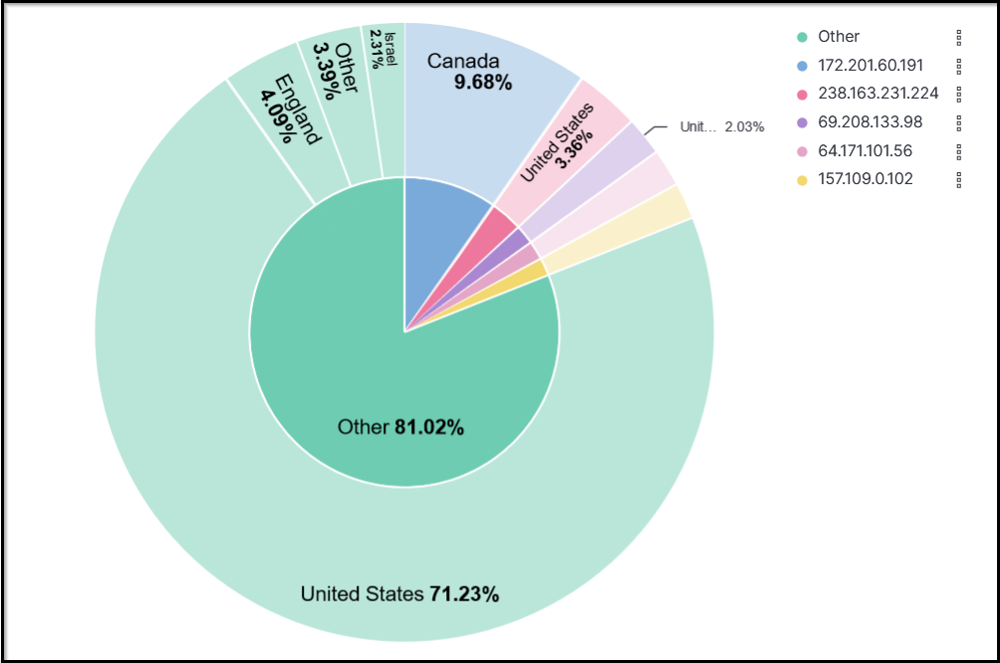

#### OR Operator

Use `OR` when either value is acceptable.

```kql
"United States" OR "England"
```

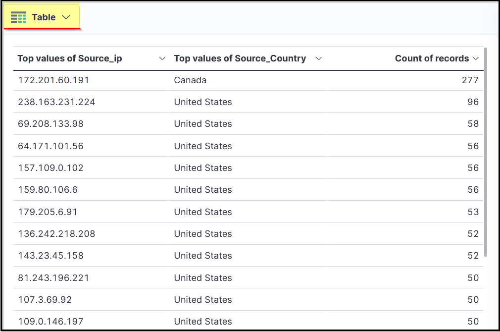

#### NOT Operator

Use `NOT` to remove specific values from the result set.

```kql
"United States" AND NOT ("Florida")
```

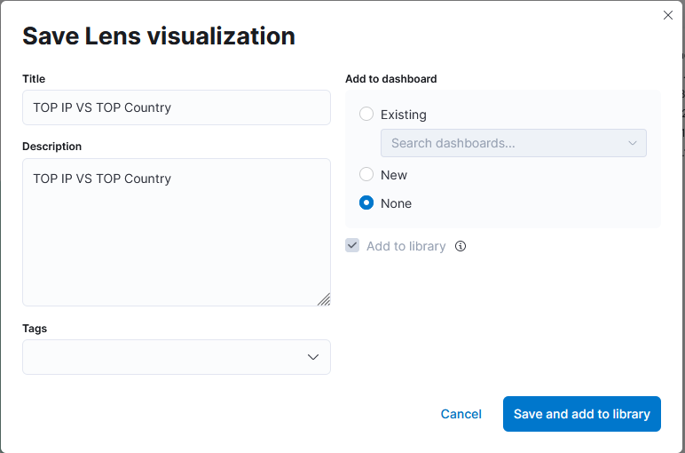

### Field-Based Search

Field-based search uses a specific field name and value. The syntax is:

```kql
field_name : value
```

Example:

```kql
Source_ip : 238.163.231.224 AND UserName : Suleman
```

This tells Kibana to display logs where `Source_ip` contains `238.163.231.224` and `UserName` is `Suleman`.


Field-based searches are usually better for investigation notes and evidence because they are more precise and repeatable than broad free-text searches.

### KQL Quick Reference

| Need | Query Pattern | Example |
|---|---|---|
| Search for an exact phrase | `"phrase"` | `"United States"` |
| Search for a prefix | `term*` | `United*` |
| Require two values | `value1 AND value2` | `"United States" AND "Virginia"` |
| Include either value | `value1 OR value2` | `"United States" OR "England"` |
| Exclude a value | `value1 AND NOT (value2)` | `"United States" AND NOT ("Florida")` |
| Search a field | `field : value` | `Source_ip : 238.163.231.224` |
| Combine field searches | `field1 : value1 AND field2 : value2` | `Source_ip : 238.163.231.224 AND UserName : Suleman` |

## Creating Visualization

Visualizations turn searched or filtered data into tables, pie charts, bar charts, and other graphical views. In SOC work, visualizations help analysts quickly identify distribution, frequency, spikes, and relationships that may be harder to see in raw logs.

### Create Visualization

One way to create a visualization is to select a field in the Discover tab and choose the visualization option.


Common visualization uses include:

- Top source countries.
- Top source IPs.
- Failed connection attempts by user.
- Failed connection attempts by IP address.
- Event counts over time.

### Correlation Option

Correlations help compare multiple fields. For example, correlating `Source_IP` with `Source_Country` can show where VPN connections are coming from and whether a specific IP or location appears suspicious.


A table can also show selected fields as columns, making the same data easier to use as an investigation reference.


### Save Visualizations

Saving visualizations makes them reusable and allows them to be added to dashboards.


Steps:

1. Create the visualization.
2. Click **Save** at the top right.
3. Add a descriptive title and description.
4. Click **Save and add to library**.

Use descriptive names that explain the security purpose, such as `VPN Failed Attempts by User and Source IP` rather than generic names like `Table 1`.

### Failed Connection Attempts Visualization

A failed connection attempts visualization can show the user and IP address involved in failed VPN activity.


This is operationally useful for identifying:

- Users targeted by repeated failures.
- Source IPs involved in suspicious login attempts.
- Potential password spraying or brute-force patterns.
- Outlier geolocations or unexpected access sources.

## Creating Dashboards

Dashboards combine saved searches and visualizations into a single view. For SOC teams, dashboards provide quick visibility into recurring monitoring needs such as VPN activity, failed logins, geographic access patterns, and authentication anomalies.

### Creating a Custom Dashboard

A dashboard can be created after useful searches and visualizations are saved.


Steps:

1. Go to the **Dashboard** tab.
2. Click **Create dashboard**.
3. Click **Add from Library**.
4. Select saved visualizations and saved searches.
5. Arrange the items into a useful investigation layout.
6. Save the dashboard.


### Dashboard Design Tips for SOC Use

- Put high-level counts or trends near the top.
- Group related visuals together, such as VPN failures, source countries, and source IPs.
- Use saved searches for raw evidence tables.
- Use charts for trends and distribution.
- Save dashboards with names that describe the use case, such as `VPN Anomaly Review`.

## SOC Analyst Rapid Reference

Use this workflow when investigating VPN or similar log data in Kibana:

1. **Select the correct index pattern.** Confirm the logs you need are actually in scope.
2. **Set the time filter.** Start with the alert or suspected activity window, then expand as needed.
3. **Review the timeline.** Look for spikes, gaps, or unusual event concentration.
4. **Inspect common fields.** Use the Fields Pane to identify top users, IPs, countries, and outcomes.
5. **Build a focused table.** Add only fields that support the investigation question.
6. **Use KQL for precision.** Start broad, then pivot to field-based searches.
7. **Filter out known-good noise carefully.** Avoid excluding values before confirming they are truly irrelevant.
8. **Create visualizations when patterns matter.** Use charts or tables to expose frequency, location, and correlation.
9. **Save searches and dashboards.** Preserve repeatable workflows for future triage.
10. **Document the query and findings.** A good finding should include time range, index pattern, KQL, fields reviewed, and observed anomaly.
