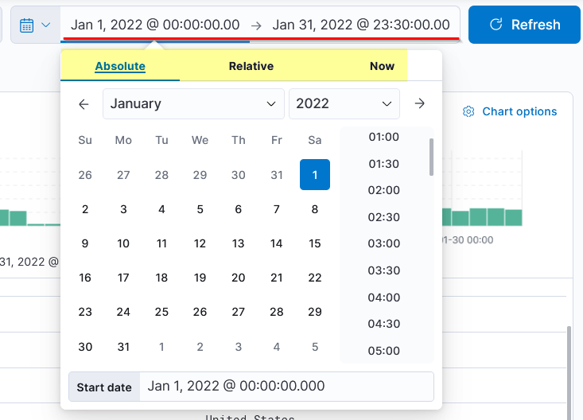
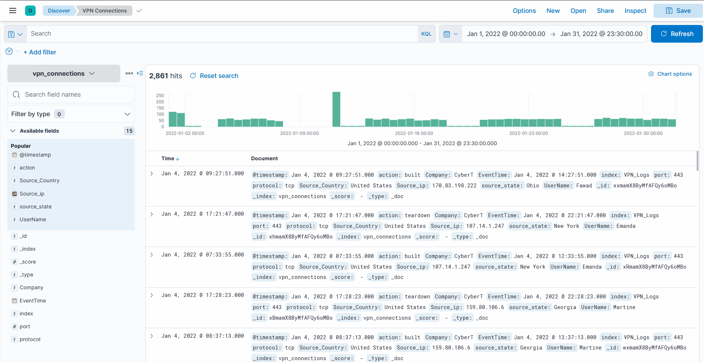
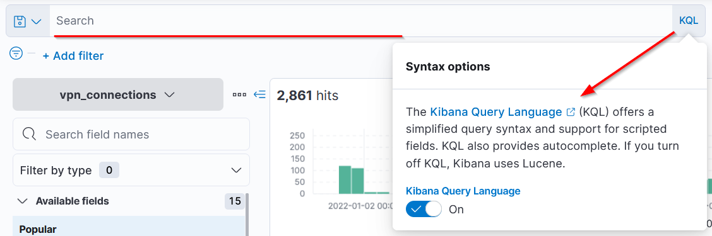
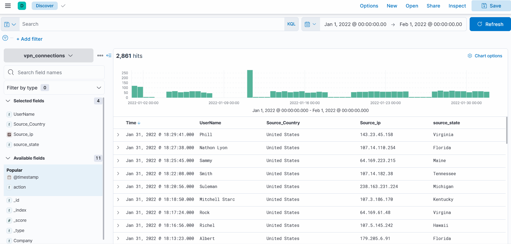

# Elastic Stack: The Basics

## Elastic Stack Overview

### Purpose

* Elastic Stack was originally developed to store, search, and visualize large volumes of data.  
* Organizations used it for:  

  * application performance monitoring  
  * searching large datasets  
* It later became widely used in security operations.  
* Many teams now use it as a security solution.  

### Definition

* Elastic Stack is a collection of open-source components that work together to:  

  * collect data from many sources  
  * store and search that data  
  * visualize data in real time  

### Key Point for Security Analysts

* A security analyst primarily uses **Kibana** to perform:  

  * log analysis  
  * investigations  
* Deep specialization in every backend component is not required.  
* A basic understanding of the main components is still important.  

### Core Components

#### 1. Elasticsearch

* Elasticsearch is a full-text search and analytics engine.  
* It works with **JSON-formatted documents**.  
* Main functions:  

  * stores data  
  * analyzes data  
  * correlates data  
* It supports a **RESTful API** for interaction.  

#### 2. Logstash

* Logstash is a data processing engine.  
* It takes data from different sources, filters or normalizes it, and sends it to a destination.  
* Possible destinations include:  

  * Elasticsearch  
  * a listening port  
  * a database  
  * a file  
  * an interface  

##### Logstash Configuration Sections

  

* **Input**  
  * Defines the source of incoming data.  
* **Filter**  
  * Normalizes or processes the ingested data.  
* **Output**  
  * Defines where the processed data is sent.  

##### Additional Note

* Logstash supports many input, filter, and output plugins.  

#### 3. Beats

* Beats are host-based agents that act as data shippers.  
* They transfer data from endpoints to Logstash.  
* Each Beat is designed for a specific purpose.  
* Examples:  

  * **Winlogbeat** collects Windows event logs.  
  * **Packetbeat** collects network traffic flow data.  

#### 4. Kibana

* Kibana is a web-based data visualization tool.  
* It works with Elasticsearch.  
* Main functions:  

  * analyze data  
  * investigate data  
  * visualize data streams in real time  
* It allows users to create:  

  * visualizations  
  * dashboards  

### How the Components Work Together

#### Step 1: Data Collection

* Beats collect data from endpoints and systems.  

#### Step 2: Data Processing

* Logstash receives data from:  

  * Beats  
  * ports  
  * files  
* It parses and normalizes the data into field-value pairs.  

#### Step 3: Data Storage and Search

* Elasticsearch stores the processed data.  
* It functions as the database for searching and analysis.  

#### Step 4: Data Visualization

* Kibana displays and visualizes the data stored in Elasticsearch.  
* Data can be presented as:  

  * dashboards  
  * time charts  
  * infographics  
  * other visual formats  

  

## Discover Tab

* The **Discover** tab is the primary workspace for analysts.  
* It is used to:  

  * view ingested logs  
  * search logs  
  * investigate anomalies  
  * apply filters  
  * analyze data over time  

  

### Logs

* Each row represents a single log event.  
* Each log contains event details, including fields and values.  

### Fields Pane

* The left panel lists normalized fields parsed from the logs.  
* Analysts can click fields to:  

  * inspect values  
  * add filters  
  * exclude results  

### Index Pattern

* The index pattern determines which dataset is being viewed.  
* Different log types are stored in different index patterns.  
* Analysts select the index pattern that matches the data source.  

### Search Bar

* Used to enter search queries.  
* Used to apply filters and narrow results.  

### Time Filter

* Restricts results to a selected time range.  

### Time Interval Chart

* Displays event counts over time.  

### Top Bar

* Contains options to:  

  * save searches  
  * open saved searches  
  * share results  
  
### Add Filter

* Lets analysts filter specific fields without writing full queries manually.  

## Index Pattern 

* Kibana requires an index pattern to access data stored in Elasticsearch.  
* The index pattern defines which data will be explored.  
* A single index pattern can point to multiple indices.  

  

### Why It Matters

* Each log source has a different structure.  
* When logs are ingested into Elasticsearch, they are normalized into fields and values.  
* A dedicated index pattern is created for each data source.  

### Example

* In the lab, the index pattern **vpn_connections** contains VPN logs.  

## Fields Pane 

### Function

* Shows the normalized fields found in the available logs.  

  

### Field Details

* Clicking a field shows:  

  * the top five values  
  * the percentage of occurrence  

### Filter Actions

* **+** adds a filter to include logs with that value.  
* **-** adds a filter to exclude logs with that value.  

  

### Alternative Filtering Method

* Analysts can also use **Add filter** under the search bar to filter by available fields.  

## Time Filter

* Used to filter logs by time.  
* Supports multiple time-range options.  

  

## Timeline

  

### Purpose

* Provides an overview of event volume over time.  

### Use

* Analysts can select a bar in the chart to display logs from that period.  
* The count at the top left shows the number of matching events.  

### Value for Analysis

* Helps identify spikes or unusual activity in logs.  
* Example: a spike on **11 January 2022** may indicate abnormal activity.  

## Create Table

### Purpose

* Logs are shown in raw form by default.  
* Analysts can select important fields from a log to build a table.  

  

### Benefits

* Reduces noise
* Improves readability
* Makes data more meaningful and presentable

### Persistence

* The table format can be saved.
* Saved tables preserve selected fields for future sessions.

## KQL Search in Kibana

### Purpose

* The **Search Bar** in the Discover tab is used to find logs.  
* Searches are performed with **KQL**.  

### KQL
 
* **KQL** stands for **Kibana Query Language**.  
* It is used to search logs and documents stored in **Elasticsearch**.   

  

### Search Types

* KQL supports two main search methods:  

  * free text search  
  * field-based search  

### Free Text Search

#### Definition

* Free text search looks for a term anywhere in the logs.  
* It does not require a field name.  

#### Example

* Searching for `security` returns all documents containing that term.  
* Searching for `"United States"` returns all logs containing that exact term, regardless of field.  
  

#### Whole-Term Matching

* KQL searches for complete words or terms.  
* Searching for `United` alone may return no results if that exact term is not present by itself.  

#### Wildcards

* KQL supports the `*` wildcard to match partial words.  

##### Example

* `United*`  

  * returns results containing terms that begin with `United`  
  * may match phrases such as `United States`  

  

### Logical Operators

* KQL supports logical operators to refine searches:  

  * `AND`  
  * `OR`  
  * `NOT`  

#### AND

* Returns logs containing both terms.  

#### OR

* Returns logs containing either term.  

#### NOT

* Excludes a term from the results.  

### Field-Based Search

#### Definition

* Field-based search looks for a value in a specific field.  

#### Syntax

* `Field: Value`  

#### Example

* `Source_ip: 238.163.231.224 AND UserName: Suleman`  

  

#### Meaning

* Returns logs where:

  * `Source_ip` is `238.163.231.224`
  * `UserName` is `Suleman`

### Search Bar Assistance

* Clicking the search bar shows available fields.
* These fields can be used directly in field-based queries.

## Creating Visualization

### Purpose

* The **Visualization** tab displays data in visual formats.
* Common formats include:

  * tables
  * pie charts
  * bar charts

### Creating Visualizations

#### Access

* One way to open the Visualization tab is from the **Discover** tab.  
* Select a field, then choose the visualization option.  

  

#### Available Output Types

* Multiple visualization types can be created, including:  

  * tables  
  * pie charts  
  * other chart formats  

### Correlation Between Fields

#### Purpose

* Visualizations can show relationships between multiple fields.  

#### Method

* Drag a field into the center of the visualization area to create a correlation view.  

#### Example

* Adding `Source_Country` as a second field can show its relationship to `Source_IP`.  

### Example Visualizations

#### Pie Chart

* A pie chart can display the **top five `Source_Country` values**.  

  

#### Table

* A table can display selected fields as columns.  
* Example:  

  * IP addresses versus country count  

  

### Saving Visualizations

#### Importance

* Saving is a key final step.  

  

#### Steps

1. Create the visualization.  
2. Click **Save** in the top-right corner.  
3. Enter a title and description.  
4. Click **Save and add to library**.  

### Example Use Case

#### Failed Connection Attempts

  

* A table can be created to show:  

  * the user involved  
  * the IP address involved  
* This can be used to review failed connection attempts.  

## Dashboards Overview

### Purpose

* Dashboards improve visibility into collected logs.
* Users can create multiple dashboards for specific needs.
* Dashboards combine saved searches and visualizations into one view.

### Creating a Custom Dashboard

#### Prerequisites

* Saved searches from the **Discover** tab
* Saved visualizations

#### Steps

1. Open the **Dashboard** tab.
2. Click **Create dashboard**.
3. Click **Add from Library**.
4. Add saved visualizations and saved searches.
5. Arrange the items as needed.
6. Save the dashboard.

