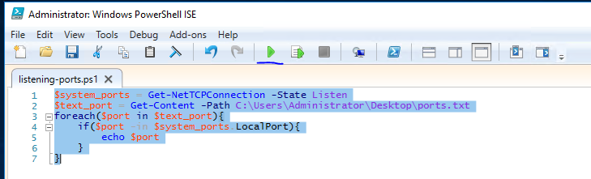

# Hacking With PowerShell

## What is PowerShell

PowerShell is both a Windows scripting language and a shell environment built on the .NET framework.

Key points:

- PowerShell can execute .NET functions directly from the shell.
- PowerShell commands are called **cmdlets** and are written in .NET.
- Cmdlet output is object-based, not plain text by default.
- Because cmdlets output objects, one cmdlet can pass structured data to another cmdlet through the pipeline.
- Cmdlets commonly use the `Verb-Noun` naming format.
  - Example: `Get-Command` lists commands.
- Reference: [Approved Verbs for PowerShell Commands](https://learn.microsoft.com/en-us/powershell/scripting/developer/cmdlet/approved-verbs-for-windows-powershell-commands?view=powershell-7.6&viewFallbackFrom=powershell-7)

## Basic PowerShell Commands

### Using `Get-Help`

`Get-Help` displays information about a cmdlet.

Basic syntax:

```powershell
Get-Help <Command-Name>
```

Use the `-Examples` flag to understand how a command is used in practice.

```powershell
PS C:\Users\Administrator> Get-Help Get-Command -Examples

NAME
    Get-Command

SYNOPSIS
    Gets all commands.

Example 1: Get cmdlets, functions, and aliases

PS C:\> Get-Command
```

### Using `Get-Command`

`Get-Command` lists cmdlets installed on the current computer.

Pattern matching is useful when searching for commands by verb or noun:

```powershell
Get-Command Verb-*
Get-Command *-Noun
Get-Command New-*
```

Example output:

```powershell
PS C:\Users\Administrator> Get-Command New-*

CommandType     Name                                               Version    Source
-----------     ----                                               -------    ------
Alias           New-AWSCredentials                                 3.3.563.1  AWSPowerShell
Alias           New-EC2FlowLogs                                    3.3.563.1  AWSPowerShell
Alias           New-EC2Hosts                                       3.3.563.1  AWSPowerShell
Alias           New-RSTags                                         3.3.563.1  AWSPowerShell
Alias           New-SGTapes                                        3.3.563.1  AWSPowerShell
Function        New-AutologgerConfig                               1.0.0.0    EventTracingManagement
Function        New-DAEntryPointTableItem                          1.0.0.0    DirectAccessClientComponents
Function        New-DscChecksum                                    1.1        PSDesiredStateConfiguration
Function        New-EapConfiguration                               2.0.0.0    VpnClient
Function        New-EtwTraceSession                                1.0.0.0    EventTracingManagement
Function        New-FileShare                                      2.0.0.0    Storage
Function        New-Fixture                                        3.4.0      Pester
Function        New-Guid                                           3.1.0.0    Microsoft.PowerShell.Utility
```

### Object Manipulation

PowerShell output is object-based. Effective object manipulation requires:

- Passing cmdlet output to other cmdlets.
- Using object-oriented cmdlets to extract, filter, sort, or reshape information.

#### The Pipeline `|`

The pipeline passes output from one cmdlet to another.

Important distinction:

- Traditional shells often pipe text.
- PowerShell pipes objects.

This makes PowerShell especially useful for system administration, enumeration, and security analysis because the next cmdlet can operate on object properties instead of parsing raw text.

#### Methods and Properties

PowerShell objects expose:

- **Methods**: functions that can be applied to the output object.
- **Properties**: variables or data fields contained in the output object.

Use `Get-Member` to inspect the object type, methods, and properties returned by a cmdlet.

```powershell
Verb-Noun | Get-Member
```

You can also narrow the output by member type.

```powershell
PS C:\Users\Administrator> Get-Command | Get-Member -MemberType Method

   TypeName: System.Management.Automation.AliasInfo

Name             MemberType Definition
----             ---------- ----------
Equals           Method     bool Equals(System.Object obj)
GetHashCode      Method     int GetHashCode()
GetType          Method     type GetType()
ResolveParameter Method     System.Management.Automation.ParameterMetadata ResolveParameter(string name)
ToString         Method     string ToString()

   TypeName: System.Management.Automation.FunctionInfo

Name             MemberType Definition
----             ---------- ----------
Equals           Method     bool Equals(System.Object obj)
GetHashCode      Method     int GetHashCode()
GetType          Method     type GetType()
ResolveParameter Method     System.Management.Automation.ParameterMetadata ResolveParameter(string name)
ToString         Method     string ToString()

   TypeName: System.Management.Automation.CmdletInfo

Name             MemberType Definition
----             ---------- ----------
Equals           Method     bool Equals(System.Object obj)
GetHashCode      Method     int GetHashCode()
GetType          Method     type GetType()
ResolveParameter Method     System.Management.Automation.ParameterMetadata ResolveParameter(string name)
ToString         Method     string ToString()

PS C:\Users\Administrator>
```

### Creating Objects From Previous Cmdlets

`Select-Object` creates a new object by selecting specific properties from existing cmdlet output.

This is useful when you only need certain fields, such as file mode and name.

```powershell
PS C:\Users\Administrator> Get-ChildItem | Select-Object -Property Mode, Name

Mode   Name
----   ----
d-r--- Contacts
d-r--- Desktop
d-r--- Documents
d-r--- Downloads
d-r--- Favorites
d-r--- Links
d-r--- Music
d-r--- Pictures
d-r--- Saved Games
d-r--- Searches
d-r--- Videos

PS C:\Users\Administrator>
```

Useful `Select-Object` flags:

- `-First`: returns the first number of objects specified.
- `-Last`: returns the last number of objects specified.
- `-Unique`: returns unique objects.
- `-Skip`: skips the number of objects specified.

### Filtering Objects

`Where-Object` filters objects based on property values.

Common syntax options:

```powershell
Verb-Noun | Where-Object -Property PropertyName -Operator Value
Verb-Noun | Where-Object { $_.PropertyName -Operator Value }
```

The second syntax uses `$_` to represent the current object being evaluated as PowerShell iterates through the pipeline.

Common comparison operators:

- `-Contains`: returns true when any item in the property value exactly matches the specified value.
- `-EQ`: returns true when the property value equals the specified value.
- `-GT`: returns true when the property value is greater than the specified value.

Example: show only stopped services.

```powershell
PS C:\Users\Administrator> Get-Service | Where-Object -Property Status -eq Stopped

Status   Name               DisplayName
------   ----               -----------
Stopped  AJRouter           AllJoyn Router Service
Stopped  ALG                Application Layer Gateway Service
Stopped  AppIDSvc           Application Identity
Stopped  AppMgmt            Application Management
Stopped  AppReadiness       App Readiness
Stopped  AppVClient         Microsoft App-V Client
Stopped  AppXSvc            AppX Deployment Service (AppXSVC)
Stopped  AudioEndpointBu... Windows Audio Endpoint Builder
Stopped  Audiosrv           Windows Audio
Stopped  AxInstSV           ActiveX Installer (AxInstSV)
Stopped  BITS               Background Intelligent Transfer Ser...
Stopped  Browser            Computer Browser
Stopped  bthserv            Bluetooth Support Service
-- cropped for brevity --
```

### `Sort-Object`

`Sort-Object` sorts cmdlet output so information can be reviewed more efficiently.

Basic format:

```powershell
Verb-Noun | Sort-Object
```

Example: sorting the contents of the current user directory.

```powershell
PS C:\Users\Administrator> Get-ChildItem | Sort-Object

    Directory: C:\Users\Administrator

Mode                LastWriteTime         Length Name
----                -------------         ------ ----
d-r---        10/3/2019   5:11 PM                Contacts
d-r---        10/5/2019   2:38 PM                Desktop
d-r---        10/3/2019  10:55 PM                Documents
d-r---        10/3/2019  11:51 PM                Downloads
d-r---        10/3/2019   5:11 PM                Favorites
d-r---        10/3/2019   5:11 PM                Links
d-r---        10/3/2019   5:11 PM                Music
d-r---        10/3/2019   5:11 PM                Pictures
d-r---        10/3/2019   5:11 PM                Saved Games
d-r---        10/3/2019   5:11 PM                Searches
d-r---        10/3/2019   5:11 PM                Videos
PS C:\Users\Administrator>
```

### Basic PowerShell Questions

#### What is the location of the file `interesting-file.txt`?

```powershell
Get-ChildItem -Path C:\ -Recurse -Force -ErrorAction SilentlyContinue -Include *interesting-file.txt*
```

#### Specify the contents of this file

```powershell
Get-Content interesting-file.txt
```

#### How many cmdlets are installed on the system, excluding functions and aliases?

```powershell
(Get-Command -CommandType Cmdlet).Count
```

#### Get the MD5 hash of `interesting-file.txt`

```powershell
Get-FileHash -Algorithm MD5 interesting-file.txt
```

#### What is the command to get the current working directory?

```powershell
Get-Location
```

#### Does the path `C:\Users\Administrator\Documents\Passwords` exist?

```powershell
Test-Path -Path "C:\Users\Administrator\Documents\Passwords"
```

#### What command would you use to make a request to a web server?

```powershell
Invoke-WebRequest
```

#### Base64 decode the file `b64.txt` on Windows

```powershell
certutil -decode b64.txt plain.txt
Get-Content plain.txt
```

> Note: The source notes also included a recursive search for `interesting-file.txt` under this question. The operationally relevant Base64 decoding commands are preserved above.

## Enumeration

### Local Users and Groups

#### How many users are there on the machine?

```powershell
(Get-LocalUser).Count
```

#### Which local user does this SID belong to?

SID:

```text
S-1-5-21-1394777289-3961777894-1791813945-501
```

Command:

```powershell
Get-LocalUser | Select-Object Name, SID
```

#### How many users have `PasswordRequired` set to false?

```powershell
(Get-LocalUser | Where-Object { $_.PasswordRequired -eq $false }).Count
```

#### How many local groups exist?

```powershell
(Get-LocalGroup).Count
```

### Network Enumeration

#### What command did you use to get the IP address information?

```powershell
Get-NetIPAddress
```

#### How many ports are listed as listening?

```powershell
(Get-NetTCPConnection -State Listen).Count
```

#### What is the remote address of the local port listening on port 445?

```powershell
Get-NetTCPConnection -LocalPort 445 -State Listen | Select-Object LocalAddress, LocalPort, RemoteAddress
```

### Patch and File Enumeration

#### How many patches have been applied?

```powershell
(Get-HotFix).Count
```

#### When was the patch with ID `KB4023834` installed?

```powershell
Get-HotFix | Where-Object { $_.HotFixID -match "4023834" } | Select-Object InstalledOn
```

#### Find the contents of a backup file

```powershell
Get-ChildItem -Path C:\ -Recurse -Force -ErrorAction SilentlyContinue -Include "*.bak*" |
    Get-Content |
    Add-Content C:\Users\Administrator\Desktop\outfile.txt

Get-Content outfile.txt |
    Sort-Object |
    Get-Unique |
    Add-Content unique.txt

Get-Content unique.txt
```

#### Search all backup files for `API_KEY`

```powershell
Get-ChildItem -Path C:\ -Recurse -Force -ErrorAction SilentlyContinue -Include "*.bak" |
    Get-Content |
    findstr API_KEY
```

### Process, Scheduled Task, and ACL Enumeration

#### What command lists all running processes?

```powershell
Get-Process
```

#### What is the path of the scheduled task called `new-sched-task`?

```powershell
Get-ScheduledTask
```

#### Who is the owner of `C:\`?

```powershell
Get-Acl -Path "C:\" | Select-Object Owner
```

## Basic Scripting Challenge

### Scenario

Given a list of port numbers, identify whether each local port is listening.

### Instructions

Open `listening-ports.ps1` on the Desktop using PowerShell ISE. PowerShell scripts usually use the `.ps1` file extension.

```powershell
$system_ports = Get-NetTCPConnection -State Listen # Create a variable to store the list of listening ports

$text_port = Get-Content -Path C:\Users\Administrator\Desktop\ports.txt # Create an object to store the list of ports contained in the ports.txt file

# Open a loop
foreach ($port in $text_port) {

    # If a port in text_port matches a port in system_ports, send that port to STDOUT
    if ($port -in $system_ports.LocalPort) {
        echo $port
    }
}
```

To run the script, call the script path from PowerShell or use the run button in PowerShell ISE.



### Basic Scripting Questions

The `emails` folder on the Desktop contains copies of emails John, Martha, and Mary have been sending to each other and themselves.

Operational goal:

- Answer the questions without manually opening each file.
- Use recursive file search and string matching.

Example search setup:

```powershell
$source_path = "C:\Users\Administrator\Desktop\emails\"
$target_string = "HTTPS"
$find_password = Get-ChildItem -Path $source_path -Recurse | Select-String -Pattern "Password"
$find_link = Get-ChildItem -Path $source_path -Recurse | Select-String -Pattern "HTTPS"
```

#### What file contains the password?

Use `$find_password` results to identify the file path containing the password string.

#### What is the password?

Use the matching line returned by `Select-String -Pattern "Password"`.

#### What files contain an HTTPS link?

Use `$find_link` results to identify files containing `HTTPS` links.

## Intermediate Scripting

Sometimes utilities such as Nmap and Python may not be available, requiring PowerShell scripts for basic administrative or lab tasks.

A simple port-scanning workflow should define:

- The IP range to scan.
  - In this lab, localhost is the intended target.
- The port range to scan.
- The scan type.
  - In this lab, the intended method is a basic TCP connect-style check.

### Intermediate Scripting Questions

#### How many open ports did you find between 130 and 140, inclusive?

The source notes include an Nmap-backed PowerShell wrapper. This is useful when Nmap is available, but it is not a pure PowerShell port scanner.

```powershell
<#
========================================================================
Script Execution Notes:
* Requirements: This script requires `nmap` to be installed and
  accessible within your system's PATH variables to execute successfully.
* Execution Policy: You may need to bypass or update your local
  PowerShell execution policy, for example:
  `Set-ExecutionPolicy -Scope Process -ExecutionPolicy Bypass`
  depending on your environment configuration.
* Privileges: Some scans, such as the default TCP SYN scan `-sS`, require
  administrative or root privileges depending on the host operating system.
========================================================================
#>

# Prompt for CIDR notation IP range with default to localhost
$targetIP = Read-Host "Enter the CIDR notation IP range to scan (Press Enter to default to 127.0.0.1)"
if ([string]::IsNullOrWhiteSpace($targetIP)) {
    $targetIP = "127.0.0.1"
}

# Prompt for lowest port number (Required)
$validLowPort = $false
while (-not $validLowPort) {
    $lowestPort = Read-Host "Enter the lowest port number to scan (Required)"
    if (-not [string]::IsNullOrWhiteSpace($lowestPort)) {
        $validLowPort = $true
    }
}

# Prompt for highest port number (Required)
$validHighPort = $false
while (-not $validHighPort) {
    $highestPort = Read-Host "Enter the highest port number to scan (Required)"
    if (-not [string]::IsNullOrWhiteSpace($highestPort)) {
        $validHighPort = $true
    }
}

# Present scan techniques
Write-Host "`nSelect a scan technique to use:"
Write-Host "1. TCP SYN Scan (-sS) [Default]"
Write-Host "2. TCP Connect Scan (-sT)"
Write-Host "3. UDP Scan (-sU)"
Write-Host "4. TCP ACK Scan (-sA)"
Write-Host "5. TCP Window Scan (-sW)"
Write-Host "6. TCP Maimon Scan (-sM)"

# Prompt for technique choice
$techniqueChoice = Read-Host "Enter the number corresponding to your choice (Press Enter for Default)"

# Determine the nmap flag based on choice
switch ($techniqueChoice) {
    "2" { $scanFlag = "-sT" }
    "3" { $scanFlag = "-sU" }
    "4" { $scanFlag = "-sA" }
    "5" { $scanFlag = "-sW" }
    "6" { $scanFlag = "-sM" }
    default { $scanFlag = "-sS" } # Default is TCP SYN
}

# Construct the final nmap command
$nmapCommand = "nmap $scanFlag -p $lowestPort-$highestPort $targetIP"

# Display and execute the command
Write-Host "`n[+] Executing command: $nmapCommand`n"
Invoke-Expression $nmapCommand
```

Operational caution:

- Run scans only against systems and networks where you have explicit authorization.
- For this lab, keep the target constrained to `127.0.0.1` unless the exercise authorizes a different target.
