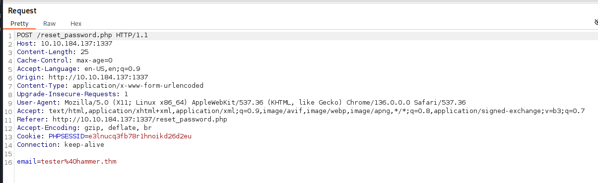
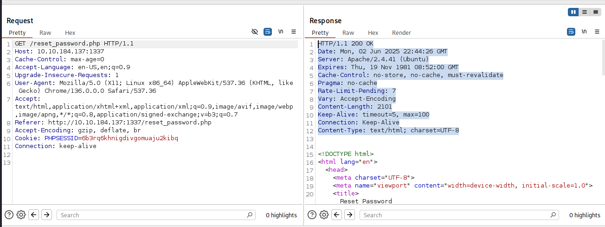
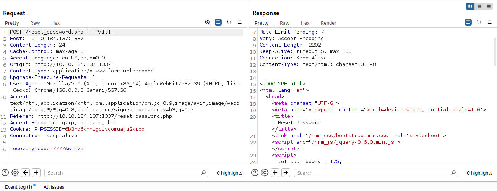

# Hammer

> Converted from cybersecurity DOCX notes into a structured markdown outline and study reference.

Use your exploitation skills to bypass authentication mechanisms on a website and get RCE.

## Step 1: Nmap

```text
:>nmap 10.10.64.62 -Pn -p- -sS
```

## Port State Service

22/tcp open ssh

1337/tcp open waste

MAC Address: 02:A6:C0:7D:E8:C9 (Unknown)

```text
:> nmap 10.10.64.62 -Pn -p 1337 -sV
```

## Port State Service Version

1337/tcp open http Apache httpd 2.4.41 ((Ubuntu))

MAC Address: 02:A6:C0:7D:E8:C9 (Unknown)

Step 2. Access http://10.10.64.62:1337

## Login page

## Step 3: Review Login Page Source Code

There is a note that indicates a directory naming convention: hmr_<DIRECTORY NAME>

## Step 4: DIRB

```text
:> dirb http://10.10.183.3:1337/ /usr/share/wordlists/dirb/big.txt -o directories.txt -M hmr_ -r
```

Didn't find anything different from the last time. Not sure if I made an error in the command or what.

## Try fuff

## Step 5: Directory Enumeration with FFUF

```text
:> ffuf -u 'http://10.10.183.3:1337/hmr_FUZZ' -t 100 -w /usr/share/wordlists/dirb/common.txt
```

css [Status: 301, Size: 319, Words: 20, Lines: 10, Duration: 136ms]

images [Status: 301, Size: 322, Words: 20, Lines: 10, Duration: 142ms]

js [Status: 301, Size: 318, Words: 20, Lines: 10, Duration: 132ms]

logs [Status: 301, Size: 320, Words: 20, Lines: 10, Duration: 133ms]

:: Progress: [20469/20469] :: Job [1/1] :: 746 req/sec :: Duration: [0:00:29] :: Errors: 0 ::

"Logs" is different

indicates there is a directory "hmr_logs"

## Step 6: Attempt to access http://10.10.183.3:1337/hmr_logs/error.logs

found "error.logs"

## Contents

```text
[Mon Aug 19 12:00:01.123456 2024] [core:error] [pid 12345:tid 139999999999999] [client 192.168.1.10:56832] AH00124: Request exceeded the limit of 10 internal redirects due to probable configuration error. Use 'LimitInternalRecursion' to increase the limit if necessary. Use 'LogLevel debug' to get a backtrace.
[Mon Aug 19 12:01:22.987654 2024] [authz_core:error] [pid 12346:tid 139999999999998] [client 192.168.1.15:45918] AH01630: client denied by server configuration: /var/www/html/
[Mon Aug 19 12:02:34.876543 2024] [authz_core:error] [pid 12347:tid 139999999999997] [client 192.168.1.12:37210] AH01631: user tester@hammer.thm: authentication failure for "/restricted-area": Password Mismatch
[Mon Aug 19 12:03:45.765432 2024] [authz_core:error] [pid 12348:tid 139999999999996] [client 192.168.1.20:37254] AH01627: client denied by server configuration: /etc/shadow
[Mon Aug 19 12:04:56.654321 2024] [core:error] [pid 12349:tid 139999999999995] [client 192.168.1.22:38100] AH00037: Symbolic link not allowed or link target not accessible: /var/www/html/protected
[Mon Aug 19 12:05:07.543210 2024] [authz_core:error] [pid 12350:tid 139999999999994] [client 192.168.1.25:46234] AH01627: client denied by server configuration: /home/hammerthm/test.php
[Mon Aug 19 12:06:18.432109 2024] [authz_core:error] [pid 12351:tid 139999999999993] [client 192.168.1.30:40232] AH01617: user tester@hammer.thm: authentication failure for "/admin-login": Invalid email address
[Mon Aug 19 12:07:29.321098 2024] [core:error] [pid 12352:tid 139999999999992] [client 192.168.1.35:42310] AH00124: Request exceeded the limit of 10 internal redirects due to probable configuration error. Use 'LimitInternalRecursion' to increase the limit if necessary. Use 'LogLevel debug' to get a backtrace.
[Mon Aug 19 12:09:51.109876 2024] [core:error] [pid 12354:tid 139999999999990] [client 192.168.1.50:45998] AH00037: Symbolic link not allowed or link target not accessible: /var/www/html/locked-down
```

## Important content

tester@hammer.thm

/home/hammerthm

/home/hammerthm/test.php

/admin-login

## STEP 9: Use Burp Suite To Inspect Functioning

Open http://10.10.184.137:1337/reset_password.php in the proxy

reset password for tester@hammer.thm and intercept traffic

////



email=tester%40hammer.thm

///

Identify that the Response has a "Rate-Limit-Pending" control

///



///

Submit "7777", an incorrect code.

The recovery code and the time remaining are submitted as payload



## STEP 10: Modify and Reuse the Code from Task 3 of "Multi-Factor Authentication" room
