# Linux System Hardening

- [Physical Security](#physical-security)
  - [Grub Password](#grub-password)
- [Filesystem Partitioning and Encryption](#filesystem-partitioning-and-encryption)
  - [LUKS (Linux Unified Key Setup)](#luks-linux-unified-key-setup)
  - [LUKS Installation and Implementation Guide](#luks-installation-and-implementation-guide)
- [Firewall](#firewall)
  - [NetFilter](#netfilter)
  - [Uncomplicated Firewall (UFW)](#uncomplicated-firewall-ufw)
- [Remote Access](#remote-access)
  - [Disable remote login as root](#disable-remote-login-as-root)
  - [Disable password authentication](#disable-password-authentication)
  - [Linux SSH Public Key Authentication Implementation](#linux-ssh-public-key-authentication-implementation)
  - [Backup and Recovery](#backup-and-recovery)
- [Securing User Accounts](#securing-user-accounts)
  - [Sudo](#sudo)
  - [Disable Root (and other accounts)](#disable-root-and-other-accounts)
  - [Password Policy](#password-policy)
- [Software and Services](#software-and-services)
- [Update and Upgrade Policies](#update-and-upgrade-policies)
- [Audit and Log Configuration](#audit-and-log-configuration)
- [GNU Privacy Guard](#gnu-privacy-guard)
  - [Overview of Pretty Good Privacy](#overview-of-pretty-good-privacy)
  - [Creating GPG Keys](#creating-gpg-keys)
  - [GPG File Encryption](#gpg-file-encryption)
- [SSH](#ssh)
  - [Protocol 1](#protocol-1)
  - [Creating and SSH Key Set](#creating-and-ssh-key-set)
  - [Disable Username \& Password SSH Login](#disable-username--password-ssh-login)
  - [X11 Forwarding \& SSH Tunneling](#x11-forwarding--ssh-tunneling)
  - [Improving SSH Logging](#improving-ssh-logging)
- [Mandatory Access Control](#mandatory-access-control)
  - [AppArmor](#apparmor)
  - [AppArmor Configuration](#apparmor-configuration)
  - [AppArmor Command Line Utilities](#apparmor-command-line-utilities)


## Physical Security

### Grub Password

***GRUB (Grand Unified Bootloader)** password protection 
prevents unauthorized users from modifying boot parameters, accessing the GRUB command line, or booting into single-user mode without proper authentication
protects against physical access attacks and unauthorized system modifications during the boot process.

***Protects Against:***

- Single-user mode access without authentication
- Kernel parameter modification (e.g., bypassing init)
- GRUB command line access for system manipulation
- Alternative boot device selection without authorization
- Recovery mode exploitation for privilege escalation

`:> grub2-mkpasswd-pbkdf2` : generates a secure, hashed password using the PBKDF2 (Password-Based Key Derivation Function 2) algorithm for GRUB2 configuration.  

```md
grub.pbkdf2.sha512.100000.SALT.HASH
│     │      │      │      │    │
│     │      │      │      │    └── Derived key (password hash)
│     │      │      │      └─────── Salt value (random)
│     │      │      └────────────── Iteration count
│     │      └───────────────────── Hash algorithm (SHA-512)
│     └──────────────────────────── Key derivation function
└────────────────────────────────── GRUB identifier
```

## Filesystem Partitioning and Encryption

### LUKS (Linux Unified Key Setup)

```md
Physical Drive with LUKS Encryption
┌─────────────────────────────────────────────────────────────────────────────┐
│                           /dev/sda (Physical Drive)                         │
├─────────────────────────────────────────────────────────────────────────────┤
│                                                                             │
│  ┌─────────────────────────────────────────────────────────────────────┐    │
│  │                        LUKS Header                                  │    │
│  │                        (2MB typical)                                │    │
│  │                                                                     │    │
│  │  ┌─────────────────┐ ┌─────────────────┐ ┌─────────────────────┐    │    │
│  │  │   Magic Bytes   │ │   Version Info  │ │   Cipher Specs      │    │    │
│  │  │   "LUKS\xba\xbe"│ │   LUKS1/LUKS2   │ │   Algorithm/Mode    │    │    │
│  │  └─────────────────┘ └─────────────────┘ └─────────────────────┘    │    │
│  │                                                                     │    │
│  │  ┌─────────────────┐ ┌─────────────────┐ ┌─────────────────────┐    │    │
│  │  │   Master Key    │ │   Key Slots     │ │   Salt Values       │    │    │
│  │  │   (Encrypted)   │ │   (8 slots)     │ │   (Random data)     │    │    │
│  │  └─────────────────┘ └─────────────────┘ └─────────────────────┘    │    │
│  │                                                                     │    │
│  │  Key Slot Details:                                                  │    │
│  │  ┌─────────────────────────────────────────────────────────────┐    │    │
│  │  │ Slot 0: [ENABLED]  - Primary user password                  │    │    │
│  │  │ Slot 1: [ENABLED]  - Backup admin password                  │    │    │
│  │  │ Slot 2: [DISABLED] - Available for additional users         │    │    │
│  │  │ Slot 3: [DISABLED] - Available for key files                │    │    │
│  │  │ Slot 4: [DISABLED] - Available for recovery                 │    │    │
│  │  │ Slot 5: [DISABLED] - Available                              │    │    │
│  │  │ Slot 6: [DISABLED] - Available                              │    │    │
│  │  │ Slot 7: [DISABLED] - Available                              │    │    │
│  │  └─────────────────────────────────────────────────────────────┘    │    │
│  └─────────────────────────────────────────────────────────────────────┘    │
│                                                                             │
│  ┌─────────────────────────────────────────────────────────────────────┐    │
│  │                    Encrypted Data Area                              │    │
│  │                    (Rest of the drive)                              │    │
│  │                                                                     │    │
│  │  ┌─────────────────────────────────────────────────────────────┐    │    │
│  │  │                Encrypted File System                        │    │    │
│  │  │              (e.g., ext4, xfs, btrfs)                       │    │    │
│  │  │                                                             │    │    │
│  │  │    /dev/mapper/encrypted_drive                              │    │    │
│  │  │                                                             │    │    │
│  │  │  ┌─────────┐ ┌─────────┐ ┌─────────┐ ┌─────────────┐        │    │    │
│  │  │  │   /     │ │  /home  │ │  /var   │ │    swap     │        │    │    │
│  │  │  │  (root) │ │ (users) │ │ (logs)  │ │ (virtual    │        │    │    │
│  │  │  │         │ │         │ │         │ │  memory)    │        │    │    │
│  │  │  └─────────┘ └─────────┘ └─────────┘ └─────────────┘        │    │    │
│  │  │                                                             │    │    │
│  │  │           All data encrypted with AES-256                   │    │    │
│  │  └─────────────────────────────────────────────────────────────┘    │    │
│  └─────────────────────────────────────────────────────────────────────┘    │
│                                                                             │
└─────────────────────────────────────────────────────────────────────────────┘
```

### LUKS Installation and Implementation Guide

#### Step 1: Install cryptsetup Package

##### Ubuntu/Debian

```bash
sudo apt update
sudo apt install cryptsetup
```

##### RHEL/CentOS

```bash
sudo yum install cryptsetup-luks
# or for newer versions:
sudo dnf install cryptsetup-luks
```

##### Fedora

```bash
sudo dnf install cryptsetup-luks
```

#### Step 2: Identify Target Partition

##### List available storage devices

```bash
# Method 1: View all partitions
sudo fdisk -l

# Method 2: Tree view of block devices
lsblk

# Method 3: Show UUIDs and filesystem types
sudo blkid
```

##### Create partition if needed

```bash
# Create new partition using fdisk
sudo fdisk /dev/sdb

# Follow fdisk prompts:
# - Type 'n' for new partition
# - Select partition number
# - Accept default start/end sectors
# - Type 'w' to write changes
```

#### Step 3: Set Up LUKS Encryption

##### Initialize LUKS on the partition

```bash
# Replace /dev/sdb1 with your target partition
sudo cryptsetup -y -v luksFormat /dev/sdb1
```

**Command breakdown:**

- `-y`: Prompt for password twice for verification
- `-v`: Verbose output
- `luksFormat`: Initialize LUKS header on device

**Expected output:**

```md
WARNING!
========
This will overwrite data on /dev/sdb1 irrevocably.

Are you sure? (Type uppercase yes): YES
Enter passphrase for /dev/sdb1: [enter strong password]
Verify passphrase: [re-enter password]
Command successful.
```

#### Step 4: Open LUKS Container

##### Create device mapping

```bash
# Create mapping named "EDCdrive" (choose any name)
sudo cryptsetup luksOpen /dev/sdb1 EDCdrive
```

**What this does:**

- Creates `/dev/mapper/EDCdrive` device
- Prompts for LUKS password
- Makes encrypted partition accessible

#### Step 5: Verify Mapping

##### Check device mapping

```bash
# Verify mapper device exists
ls -l /dev/mapper/EDCdrive

# Check detailed status
sudo cryptsetup -v status EDCdrive
```

**Expected output:**

```md
/dev/mapper/EDCdrive is active and is in use.
  type:    LUKS2
  cipher:  aes-xts-plain64
  keysize: 512 bits
  key location: keyring
  device:  /dev/sdb1
  sector size:  512
  offset:  32768 sectors
  size:    xxxx sectors
  mode:    read/write
```

#### Step 6: Secure Data Wipe (Optional but Recommended)

##### Overwrite existing data

```bash
# Fill encrypted device with zeros for security
# WARNING: This can take a long time for large devices
sudo dd if=/dev/zero of=/dev/mapper/EDCdrive bs=1M status=progress

# Alternative for faster wipe (less secure):
sudo dd if=/dev/zero of=/dev/mapper/EDCdrive bs=1M count=100
```

**Purpose:** Ensures any existing data is completely overwritten

#### Step 7: Create Filesystem

##### Format the encrypted device

```bash
# Create ext4 filesystem with custom label
sudo mkfs.ext4 /dev/mapper/EDCdrive -L "Strategos USB"

# Alternative filesystems:
# sudo mkfs.xfs /dev/mapper/EDCdrive -L "Strategos USB"
# sudo mkfs.ntfs /dev/mapper/EDCdrive -L "Strategos USB" -f
```

#### Step 8: Mount and Use

##### Create mount point and mount

```bash
# Create mount directory
sudo mkdir -p /media/secure-USB

# Mount the encrypted filesystem
sudo mount /dev/mapper/EDCdrive /media/secure-USB

# Verify mount
df -h /media/secure-USB
```

##### Set permissions (if needed)

```bash
# Allow user access
sudo chown $USER:$USER /media/secure-USB

# Or set specific permissions
sudo chmod 755 /media/secure-USB
```

#### Step 9: Daily Usage Commands

##### Opening encrypted drive

```bash
# Open LUKS container
sudo cryptsetup luksOpen /dev/sdb1 EDCdrive

# Mount filesystem
sudo mount /dev/mapper/EDCdrive /media/secure-USB
```

##### Safely closing encrypted drive

```bash
# Unmount filesystem
sudo umount /media/secure-USB

# Close LUKS container
sudo cryptsetup luksClose EDCdrive
```

#### Step 10: Additional LUKS Management

##### Add additional passwords/key slots

```bash
# Add new password to different key slot
sudo cryptsetup luksAddKey /dev/sdb1

# Add key file instead of password
sudo cryptsetup luksAddKey /dev/sdb1 /path/to/keyfile
```

##### View LUKS header information

```bash
# Display detailed LUKS information
sudo cryptsetup luksDump /dev/sdb1
```

##### Remove key slot

```bash
# Remove specific key slot (0-7)
sudo cryptsetup luksKillSlot /dev/sdb1 1
```

#### Troubleshooting

##### Common Issues

| Issue | Cause | Solution |
|-------|-------|----------|
| "Device is busy" | Device still mounted | `sudo umount /dev/mapper/EDCdrive` |
| "Cannot format" | LUKS not opened | `sudo cryptsetup luksOpen /dev/sdb1 EDCdrive` |
| "Permission denied" | Need root access | Add `sudo` to commands |
| "Device not found" | Wrong device path | Verify with `lsblk` or `fdisk -l` |

##### Recovery commands

```bash
# Check if LUKS container is open
sudo cryptsetup status EDCdrive

# Force close if stuck
sudo cryptsetup luksClose EDCdrive --force

# Check filesystem for errors
sudo fsck /dev/mapper/EDCdrive
```

#### Security Best Practices

1. **Use strong passphrases** (12+ characters, mixed case, numbers, symbols)
2. **Backup LUKS header** to separate secure location
3. **Test recovery procedures** before storing important data
4. **Use multiple key slots** for backup access methods
5. **Secure wipe** device before disposal

##### Backup LUKS header

```bash
# Backup header
sudo cryptsetup luksHeaderBackup /dev/sdb1 --header-backup-file luks-header-backup

# Restore header (if needed)
sudo cryptsetup luksHeaderRestore /dev/sdb1 --header-backup-file luks-header-backup
```

#### Automatic Mounting (Optional)

##### Add to /etc/crypttab for automatic unlock

```bash
# Edit crypttab
sudo nano /etc/crypttab

# Add line:
EDCdrive /dev/sdb1 none luks
```

##### Add to /etc/fstab for automatic mount

```bash
# Edit fstab
sudo nano /etc/fstab

# Add line:
/dev/mapper/EDCdrive /media/secure-USB ext4 defaults,noauto 0 2
```

**Result**: After completing these steps, you will have a fully encrypted partition that appears as random data to unauthorized users but functions normally when unlocked with the correct passphrase.

## Firewall

Current Linux firewalls are stateful firewalls
it is impossible to allow and deny packets based on the process but instead on the port number
On Linux SELinux or AppArmor can provide more granular control over processes and their network access

### NetFilter

The netfilter project provides packet-filtering software
The netfilter hooks require a front-end such as iptables or nftables to manage

#### IPTABLES

provides the user-space command line tools to configure the packet filtering rule set using the netfilter hooks using 'chains'  

    Input: This chain applies to the packets incoming to the firewall.  
    Output: This chain applies to the packets outgoing from the firewall.  
    Forward This chain applies to the packets routed through the system.  

#### iptables SSH Port Configuration Guide

##### Step 1: View Current iptables Rules

###### Check existing rules

```bash
# View current INPUT chain rules
sudo iptables -L INPUT -n --line-numbers

# View current OUTPUT chain rules  
sudo iptables -L OUTPUT -n --line-numbers

# View all rules in table format
sudo iptables -L -n -v
```

##### Step 2: Add Stateful SSH Rules

***Allow incoming SSH with connection state tracking***

```bash
# Accept new and established incoming SSH connections
sudo iptables -A INPUT -p tcp --dport 22 -m state --state NEW,ESTABLISHED -j ACCEPT

# Accept established outgoing SSH responses
sudo iptables -A OUTPUT -p tcp --sport 22 -m state --state ESTABLISHED -j ACCEPT
```

***Allow outgoing SSH connections***

```bash
# Accept new and established outgoing SSH connections
sudo iptables -A OUTPUT -p tcp --dport 22 -m state --state NEW,ESTABLISHED -j ACCEPT

# Accept established incoming SSH responses
sudo iptables -A INPUT -p tcp --sport 22 -m state --state ESTABLISHED -j ACCEPT
```

##### Step 3: Verify Rules Are Applied

```bash
# View INPUT chain to confirm incoming SSH rule
sudo iptables -L INPUT -n --line-numbers | grep :22

# View OUTPUT chain to confirm outgoing SSH rule
sudo iptables -L OUTPUT -n --line-numbers | grep :22

# Test SSH connection (from another terminal)
ssh username@localhost
```

##### Step 4: Test SSH Connectivity

```bash
# Test local SSH connection
ssh localhost

# Test SSH to remote host (if applicable)
ssh user@remote-server

# Check active SSH connections
netstat -tnlp | grep :22
ss -tnlp | grep :22
```

##### Step 5: Make Rules Persistent

***Ubuntu/Debian***

```bash
# Install iptables-persistent
sudo apt update
sudo apt install iptables-persistent

# Save current rules
sudo netfilter-persistent save

# Or manually save rules
sudo sh -c "iptables-save > /etc/iptables/rules.v4"
```

***RHEL/CentOS/Fedora***

```bash
# Save iptables rules
sudo service iptables save

# Or for systemd systems
sudo iptables-save > /etc/sysconfig/iptables

# Enable iptables service
sudo systemctl enable iptables
```

##### Manual backup method (works on all distributions)

```bash
# Create backup of current rules
sudo iptables-save > ~/iptables-backup-$(date +%Y%m%d).rules

# Save current rules to restore on boot
sudo iptables-save > /etc/iptables.rules
```

##### Troubleshooting Errors

| Issue | Symptom | Solution |
|-------|---------|----------|
| **Locked out of SSH** | Cannot connect remotely | Use console access, check rule order |
| **Rules not working** | SSH still blocked | Verify rule placement and syntax |
| **Rules disappear** | Works until reboot | Make rules persistent |
| **Partial connectivity** | Can connect but not respond | Check both INPUT and OUTPUT rules |

##### Emergency Recovery

```bash
# If locked out, use console/KVM access and run:
sudo iptables -F INPUT
sudo iptables -F OUTPUT
sudo iptables -P INPUT ACCEPT
sudo iptables -P OUTPUT ACCEPT
```

#### NFTABLES

adds improvements over iptables, particularly in scalability and performance
start with no tables or chains

***nftables SSH Port Configuration Guide***

##### Step 2: Create Basic nftables Structure

***Create new table and chains (if none exist)***

```bash
# Create inet table (handles both IPv4 and IPv6)
sudo nft add table inet filter

# Create input chain with default drop policy
sudo nft add chain inet filter input { type filter hook input priority 0 \; policy drop \; }

# Create output chain with default accept policy  
sudo nft add chain inet filter output { type filter hook output priority 0 \; policy accept \; }

# Allow loopback traffic
sudo nft add rule inet filter input iif lo accept
sudo nft add rule inet filter output oif lo accept
```

##### Step 3: Add Statefule SSH Rules

***Allow incoming SSH with connection tracking***

```bash
# Allow established and related connections
sudo nft add rule inet filter input ct state established,related accept

# Allow new incoming SSH connections
sudo nft add rule inet filter input tcp dport 22 ct state new accept
```

***Allow outgoing SSH connections***

```bash
# Allow new and established outgoing SSH connections
sudo nft add rule inet filter output tcp dport 22 ct state new,established accept

# Allow SSH response packets
sudo nft add rule inet filter input tcp sport 22 ct state established accept
```

***Source-Specific SSH Rules (Most secure)***

```bash
# Allow incoming SSH only from specific subnet
sudo nft add rule inet filter input ip saddr 192.168.1.0/24 tcp dport 22 accept

# Allow SSH from specific IP address
sudo nft add rule inet filter input ip saddr 203.0.113.100 tcp dport 22 accept

# Allow outgoing SSH to anywhere
sudo nft add rule inet filter output tcp dport 22 accept
```

##### Step 4: Verify Rules Are Applied

***Check the new rules***

```bash
# View all rules in the filter table
sudo nft list table inet filter

# View only input chain rules
sudo nft list chain inet filter input

# View only output chain rules
sudo nft list chain inet filter output

# View rules with handle numbers (for easier deletion)
sudo nft --handle list table inet filter
```

***Test SSH connectivity***

```bash
# Test local SSH connection
ssh localhost

# Check SSH daemon status
sudo systemctl status sshd

# Check listening ports
ss -tnlp | grep :22
```

##### Step 5: Complete Working Configuration Examples

***Advanced SSH Configuration with Logging**

```bash
# Add SSH rules with logging and rate limiting
sudo nft add rule inet filter input tcp dport 22 limit rate 10/minute log prefix \"SSH Connection: \" accept

# Add rule to log and drop SSH brute force attempts
sudo nft add rule inet filter input tcp dport 22 ct state new limit rate over 5/minute log prefix \"SSH Brute Force: \" drop
```

---Scenario 3: SSH with IP Restrictions and Connection Tracking***

```bash
# Allow SSH only from management network with full connection tracking
sudo nft add rule inet filter input ip saddr 192.168.1.0/24 tcp dport 22 ct state new,established accept
sudo nft add rule inet filter output ip daddr 192.168.1.0/24 tcp sport 22 ct state established accept

# Block SSH from other sources
sudo nft add rule inet filter input tcp dport 22 log prefix \"SSH Blocked: \" drop
```

##### Step 6: Make Configuration Persistent

***Save current configuration to file***

```bash
# Save current ruleset to nftables configuration file
sudo nft list ruleset > /etc/nftables.conf

# Or save with proper formatting
sudo sh -c 'nft list ruleset > /etc/nftables.conf'

# Verify the saved configuration
cat /etc/nftables.conf
```

***Create custom configuration file***

```bash
# Create backup of current configuration
sudo nft list ruleset > ~/nftables-backup-$(date +%Y%m%d).conf

# Edit main nftables configuration
sudo nano /etc/nftables.conf
```

***Sample /etc/nftables.conf file:***

```bash
#!/usr/sbin/nft -f

flush ruleset

table inet filter {
    chain input {
        type filter hook input priority 0; policy drop;
        
        # Allow loopback
        iif lo accept
        
        # Allow established connections
        ct state established,related accept
        
        # Allow SSH
        tcp dport 22 accept
        
        # Allow ping
        icmp type echo-request accept
    }
    
    chain forward {
        type filter hook forward priority 0; policy drop;
    }
    
    chain output {
        type filter hook output priority 0; policy accept;
    }
}
```

***Enable persistent configuration***

```bash
# Enable nftables service to load on boot
sudo systemctl enable nftables

# Test configuration reload
sudo systemctl reload nftables

# Verify service status
sudo systemctl status nftables
```

##### Step 7: Advanced nftables SSH Management

***Add rules to specific positions***

```bash
# Insert rule at the beginning of input chain
sudo nft insert rule inet filter input tcp dport 22 accept

# Add rule after a specific handle (use --handle to see handle numbers)
sudo nft add rule inet filter input handle 5 tcp dport 22 accept
```

***Delete specific rules***

```bash
# List rules with handles
sudo nft --handle list chain inet filter input

# Delete rule by handle number (replace X with actual handle)
sudo nft delete rule inet filter input handle X

# Delete all SSH rules (be careful!)
sudo nft delete rule inet filter input tcp dport 22
```

***Common Issues and Solutions***

| Issue | Symptom | Solution |
|-------|---------|----------|
| **Locked out of SSH** | Cannot connect remotely | Use console access, flush ruleset |
| **Rules not persisting** | Rules lost after reboot | Check nftables.service and config file |
| **Syntax errors** | Commands fail | Check nftables syntax documentation |
| **Rules not matching** | SSH still blocked | Verify rule order and chain policies |

***Emergency Recovery Commands***

```bash
# If locked out, use console/KVM access:
# Flush all rules (removes firewall completely)
sudo nft flush ruleset

# Set permissive policies
sudo nft add table inet filter
sudo nft add chain inet filter input { type filter hook input priority 0 \; policy accept \; }
sudo nft add chain inet filter output { type filter hook output priority 0 \; policy accept \; }
```

##### Step 8: Verification and Testing

***Rule Check***

```bash
# 1. Check rules are present and correct
sudo nft list table inet filter

# 2. Test SSH connection
ssh -o ConnectTimeout=10 localhost

# 3. Verify configuration file
cat /etc/nftables.conf

# 4. Test configuration reload
sudo systemctl reload nftables && sudo nft list ruleset

# 5. Check SSH daemon
sudo systemctl status sshd
sudo ss -tnlp | grep :22

# 6. Test from external host (if available)
# ssh user@your-server-ip
```

***Performance check***
```bash
# View rule statistics
sudo nft list table inet filter -s

# Monitor rule hits
watch -n 2 'sudo nft list table inet filter -s | grep ssh'
```

### Uncomplicated Firewall (UFW)

user-friendly frontend for iptables/netfilter
designed to make firewall configuration accessible to administrators who need simple, effective protection without complex syntax
provides an intuitive command-line interface and simplified rule management while maintaining the power of the underlying iptables framework 

#### UFW Syntax Comparison Tables

| Task | iptables | nftables | UFW |
|------|----------|----------|-----|
| **Allow SSH** | `iptables -A INPUT -p tcp --dport 22 -j ACCEPT` | `nft add rule inet filter input tcp dport 22 accept` | `ufw allow ssh` |
| **Block IP** | `iptables -A INPUT -s 1.2.3.4 -j DROP` | `nft add rule inet filter input ip saddr 1.2.3.4 drop` | `ufw deny from 1.2.3.4` |
| **List Rules** | `iptables -L -n` | `nft list ruleset` | `ufw status` |
| **Enable Firewall** | `iptables-save` + service config | `systemctl enable nftables` | `ufw enable` |

#### Detailed Feature Comparison

| Aspect | iptables | nftables | UFW |
|--------|----------|----------|-----|
| **Learning Curve** | Steep - complex syntax | Moderate - improved syntax | Easy - intuitive commands |
| **Rule Management** | Manual chain/rule handling | Advanced table/chain structure | Automatic rule organization |
| **IPv6 Support** | Separate ip6tables commands | Unified inet family | Automatic IPv4/IPv6 rules |
| **Application Profiles** | Manual port definitions | Manual service definitions | Built-in app profiles |
| **Default Security** | Permissive by default | Depends on configuration | Secure by default |
| **Performance** | Direct kernel interface | Optimized kernel interface | Slight overhead (frontend) |
| **Flexibility** | Maximum control | Maximum control + modern features | Limited advanced features |
| **Persistence** | Manual save/restore | Configuration files | Automatic persistence |
| **Debugging** | Complex log analysis | Advanced tracing | Simplified status output |
| **Enterprise Use** | Industry standard | Modern replacement | Small to medium environments |

#### UFW SSH Configuration Steps

##### Step 1: Set Default Policies (Security Best Practice)

```bash
# Deny all incoming traffic by default
sudo ufw default deny incoming

# Allow all outgoing traffic by default  
sudo ufw default allow outgoing

# Verify default policies are set correctly
sudo ufw status verbose
```

##### Step 3: Allow Incoming SSH Connections (TCP Port 22)

***Option A: Allow SSH from anywhere (less secure)***

```bash
# Allow incoming SSH connections from any source
sudo ufw allow ssh

# Alternative syntax using port number
sudo ufw allow 22/tcp

# Add descriptive comment for documentation
sudo ufw allow ssh comment 'SSH administrative access'
```

***Option B: Allow SSH from specific sources (more secure)***

```bash
# Allow SSH only from management network
sudo ufw allow from 192.168.1.0/24 to any port ssh

# Allow SSH from specific IP address
sudo ufw allow from 203.0.113.100 to any port ssh comment 'Admin workstation'

# Allow SSH with rate limiting to prevent brute force
sudo ufw limit ssh
```

##### Step 4: Allow Outgoing SSH Connections (TCP Port 22)

```bash
# Explicitly allow outgoing SSH connections (usually not needed due to default allow outgoing)
sudo ufw allow out 22/tcp

# Allow outgoing SSH with comment
sudo ufw allow out ssh comment 'Outbound SSH for management'
```

**Note:** If you set the default outgoing policy to "allow" in Step 2, outgoing SSH traffic is already permitted and Step 4 is optional.

##### Step 5: Enable UFW Firewall

```bash
# Enable UFW (will prompt for confirmation if this is first time enabling)
sudo ufw enable

# If you're confident about the rules, force enable without prompt
sudo ufw --force enable
```

##### Step 6: Verify SSH Rules Are Active

```bash
# Check firewall status and rules
sudo ufw status numbered

# View detailed status with policies
sudo ufw status verbose

# Expected output should show:
# Status: active
# To                         Action      From
# --                         ------      ----
# 22/tcp                     ALLOW       Anywhere
# 22/tcp (v6)               ALLOW       Anywhere (v6)
```

##### Step 7: Test SSH Connectivity

```bash
# Test local SSH connection
ssh localhost

# Verify SSH daemon is running
sudo systemctl status sshd

# Check SSH is listening on port 22
sudo ss -tnlp | grep :22

# Test from remote system (if available)
# ssh username@server-ip-address
```

##### Step 8: Configure Logging (Optional but Recommended)

```bash
# Enable UFW logging for security monitoring
sudo ufw logging on

# Set logging level (low, medium, high, full)
sudo ufw logging medium

# View UFW logs
sudo tail -f /var/log/ufw.log

# Check for SSH-related log entries
sudo grep "DPT=22" /var/log/ufw.log
```

##### Step 9: Make Configuration Persistent

```bash
# UFW automatically persists rules, but verify service will start on boot
sudo systemctl enable ufw

# Check UFW service status
sudo systemctl status ufw

# Backup current UFW configuration (optional)
sudo cp /etc/ufw/user.rules /etc/ufw/user.rules.backup
sudo cp /etc/ufw/user6.rules /etc/ufw/user6.rules.backup
```

## Remote Access

### Disable remote login as root

force login as non-root users.

#### Edit /etc/ssh/sshd_config

Disable root login by adding: `PermitRootLogin no`

### Disable password authentication

force public key authentication instead

### Linux SSH Public Key Authentication Implementation

#### Summary Process Flow

```md
Client Side          →          Server Side          →          Security Result
─────────────────────────────────────────────────────────────────────────────────
1. Generate Key Pair → 2. Configure SSH Daemon    → Password auth disabled
2. Copy Public Key   → 3. Install Public Key       → Only key auth allowed  
3. Test Connection   → 4. Disable Password Auth    → Brute force protection
4. Secure Private Key→ 5. Restart SSH Service      → Enhanced security
```

#### Step 1: Generate SSH Key Pair

```bash
# Generate RSA key pair (4096-bit for enhanced security)
ssh-keygen -t rsa -b 4096 -C "admin@company.com"

# Generate Ed25519 key pair (recommended - modern, secure, fast)
ssh-keygen -t ed25519 -C "admin@company.com"

# Generate with custom filename
ssh-keygen -t ed25519 -f ~/.ssh/company_server_key -C "server-access-key"
```

#### Step 2: Secure the Private Key

```bash
# Set restrictive permissions on private key
chmod 600 ~/.ssh/id_ed25519
chmod 600 ~/.ssh/id_rsa

# Set proper ownership
chown $USER:$USER ~/.ssh/id_ed25519*
chown $USER:$USER ~/.ssh/id_rsa*

# Verify permissions
ls -la ~/.ssh/
```

#### Step 3: Public Key Distribution

***Method 1: Using ssh-copy-id (Easiest)***

```bash
# Copy public key to remote server
ssh-copy-id username@server-ip-address

# Copy specific key file
ssh-copy-id -i ~/.ssh/id_ed25519.pub username@server-ip-address

# Copy to specific port
ssh-copy-id -p 2222 username@server-ip-address
```

***Method 2: Using SCP***

```bash
# Copy public key file to server
scp ~/.ssh/id_ed25519.pub username@server:/tmp/

# On the server, add to authorized_keys
mkdir -p ~/.ssh
cat /tmp/id_ed25519.pub >> ~/.ssh/authorized_keys
chmod 700 ~/.ssh
chmod 600 ~/.ssh/authorized_keys
rm /tmp/id_ed25519.pub
```

#### Step 4: Backup SSH Configuration

```bash
# Create backup of SSH daemon configuration
sudo cp /etc/ssh/sshd_config /etc/ssh/sshd_config.backup.$(date +%Y%m%d)

# Verify backup exists
ls -la /etc/ssh/sshd_config*
```

#### Step 5: Configure SSH Daemon for Key-Only Authentication

```bash
# Edit SSH daemon configuration
sudo nano /etc/ssh/sshd_config
```

***Required SSH Configuration Changes***

```bash
# Essential security settings for key-only authentication
Port 22                                    # Change to non-standard port (optional)
Protocol 2                                 # Use SSH protocol version 2 only
PermitRootLogin no                         # Disable root login
PasswordAuthentication no                  # Disable password authentication
ChallengeResponseAuthentication no         # Disable challenge-response auth
UsePAM no                                  # Disable PAM authentication
PubkeyAuthentication yes                   # Enable public key authentication
AuthorizedKeysFile .ssh/authorized_keys    # Specify authorized keys location
PermitEmptyPasswords no                    # Prevent empty password login
MaxAuthTries 3                             # Limit authentication attempts
LoginGraceTime 30                          # Reduce login grace period
ClientAliveInterval 300                    # Keep connections alive
ClientAliveCountMax 2                      # Disconnect idle clients
```

***Optional Enhanced Security Settings***

```bash
# Additional hardening options
AllowUsers username1 username2             # Restrict specific users
AllowGroups ssh-users                      # Restrict to specific groups
DenyUsers baduser                          # Explicitly deny users
DenyGroups wheel                           # Explicitly deny groups
MaxStartups 10:30:60                       # Limit concurrent connections
X11Forwarding no                           # Disable X11 forwarding (if not needed)
AllowTcpForwarding no                      # Disable TCP forwarding (if not needed)
PermitTunnel no                            # Disable tunneling
```

#### Step 6: Test Configuration Before Applying

```bash
# Test SSH configuration syntax
sudo sshd -t

# Test configuration with verbose output
sudo sshd -T

# Expected output: "Configuration OK" or detailed config dump
```

#### Step 7: Apply Configuration Changes

```bash
# Restart SSH service to apply changes
sudo systemctl restart sshd

# Alternative for older systems
sudo service ssh restart

# Verify SSH service is running
sudo systemctl status sshd
```

#### Step 7: Test Key Authentication

```bash
# Test connection with verbose output
ssh -v username@server-ip-address

# Test with specific key file
ssh -i ~/.ssh/id_ed25519 username@server-ip-address

# Test with specific port
ssh -p 2222 username@server-ip-address
```

#### Step 8: Verify Password Authentication is Disabled

```bash
# Attempt connection without keys (should fail)
ssh -o PubkeyAuthentication=no username@server-ip-address

# Expected result: Permission denied (publickey)
```

#### Step 9: Configure SSH Client for Convenience

```bash
# Edit SSH client configuration
nano ~/.ssh/config

# Add server configuration
Host myserver
    HostName server-ip-address
    User username
    Port 22
    IdentityFile ~/.ssh/id_ed25519
    IdentitiesOnly yes

# Connect using alias
ssh myserver
```

### Backup and Recovery

#### Key Backup Strategy

```bash
# Backup SSH keys securely
tar -czf ssh-keys-backup-$(date +%Y%m%d).tar.gz ~/.ssh/
gpg --symmetric --cipher-algo AES256 ssh-keys-backup-*.tar.gz

# Store encrypted backup in secure location
# Remove unencrypted backup
rm ssh-keys-backup-*.tar.gz
```

#### Recovery Procedure

```bash
# If locked out, use console access to:
# 1. Re-enable password authentication temporarily
sudo sed -i 's/PasswordAuthentication no/PasswordAuthentication yes/' /etc/ssh/sshd_config
sudo systemctl restart sshd

# 2. Fix key issues
# 3. Re-disable password authentication
sudo sed -i 's/PasswordAuthentication yes/PasswordAuthentication no/' /etc/ssh/sshd_config
sudo systemctl restart sshd
```

## Securing User Accounts

### Sudo

Use of an account created specifically for administrative purposes
added to `sudoers` group

#### Adding User 'example-user' to Sudoers Group - Linux Distribution Commands

##### Ubuntu/Debian

```bash
# Method 1: Add to sudo group (primary method)
sudo usermod -aG sudo example-user

# Method 2: Add to admin group (legacy Ubuntu)
sudo usermod -aG admin example-user

# Method 3: Using adduser command
sudo adduser example-user sudo

# Verify group membership
groups example-user
id example-user
```

##### Red Hat Enterprise Linux (RHEL) / CentOS / Rocky Linux / AlmaLinux

```bash
# Method 1: Add to wheel group
sudo usermod -aG wheel example-user

# Method 2: Using gpasswd command
sudo gpasswd -a example-user wheel

# Verify group membership
groups example-user
id example-user
```

##### Fedora

```bash
# Add to wheel group (same as RHEL)
sudo usermod -aG wheel example-user

# Alternative using gpasswd
sudo gpasswd -a example-user wheel

# Verify group membership
groups example-user
id example-user
```

### Disable Root (and other accounts)

modify `/etc/passwd`
change the root shell to `/sbin/nologin`
Change `root:x:0:0:root:/root:/bin/bash` to `root:x:0:0:root:/root:/sbin/nologin`

### Password Policy

#### Primary Configuration Files

| File | Purpose | Scope |
|------|---------|-------|
| `/etc/login.defs` | Default password aging and basic policies | System-wide defaults |
| `/etc/pam.d/common-password` | PAM password complexity rules | All PAM-aware applications |
| `/etc/pam.d/passwd` | Password change policies | passwd command specifically |
| `/etc/security/pwquality.conf` | libpwquality password quality settings | System-wide password complexity |
| `/etc/shadow` | Individual user password aging | Per-user password data |

#### Configuration Methods

***Method 1: Using /etc/login.defs***

```bash
# Edit system defaults
sudo nano /etc/login.defs

# Key settings:
PASS_MAX_DAYS 90        # Maximum password age
PASS_MIN_DAYS 1         # Minimum password age  
PASS_WARN_AGE 7         # Warning days before expiration
PASS_MIN_LEN 8          # Minimum password length
```

***Method 2: PAM Configuration***

```bash
# Edit PAM password module
sudo nano /etc/pam.d/common-password

# Add/modify pam_pwquality line:
password requisite pam_pwquality.so retry=3 minlen=12 maxrepeat=2 ucredit=-1 lcredit=-1 dcredit=-1 ocredit=-1
```

***Method 3: pwquality Configuration***
```bash
# Edit password quality settings
sudo nano /etc/security/pwquality.conf

# Example settings:
minlen = 12
minclass = 3
maxrepeat = 2
ucredit = -1
lcredit = -1
dcredit = -1
ocredit = -1
difok = 8
```

#### Basic Complexity Rules

| Parameter | Description | Example Value |
|-----------|-------------|---------------|
| `minlen` | Minimum password length | 12 characters |
| `minclass` | Minimum character classes required | 3 (upper, lower, digits) |
| `maxrepeat` | Maximum consecutive identical characters | 2 |
| `ucredit` | Uppercase letter requirement | -1 (at least 1) |
| `lcredit` | Lowercase letter requirement | -1 (at least 1) |
| `dcredit` | Digit requirement | -1 (at least 1) |
| `ocredit` | Special character requirement | -1 (at least 1) |

#### Advanced Restrictions

| Parameter | Description | Example Value |
|-----------|-------------|---------------|
| `difok` | Minimum different characters from old password | 8 |
| `dictcheck` | Enable dictionary checking | 1 (enabled) |
| `usercheck` | Check against username | 1 (enabled) |
| `enforcing` | Enforce for root user | 1 (enabled) |
| `badwords` | List of forbidden words | "password,123456,admin" |
| `retry` | Number of retry attempts | 3 |


#### Bulk User Policy Changes

```bash
# Apply policy to all users in a group
for user in $(getent group developers | cut -d: -f4 | tr ',' ' '); do
    sudo chage -M 90 -m 1 -W 7 $user
done

# Apply to all regular users (UID > 1000)
awk -F: '$3 >= 1000 && $1 != "nobody" {print $1}' /etc/passwd | while read user; do
    sudo chage -M 90 -m 1 -W 7 $user
done
```


#### Test Password Policy

```bash
# Test password change as regular user
passwd

# Check current policy settings
sudo pwscore
echo "testpassword" | pwscore

# View user password status
sudo chage -l username
sudo passwd -S username

# Check PAM configuration
sudo pam-auth-update --package
```

#### Monitor Password Policy Compliance

```bash
# Check users with old passwords
sudo awk -F: '$3 >= 1000 {print $1}' /etc/passwd | while read user; do
    last_change=$(sudo chage -l $user | grep "Last password change" | cut -d: -f2)
    echo "$user: $last_change"
done

# Check accounts without password aging
sudo awk -F: '$3 >= 1000 && $2 != "!" {print $1}' /etc/shadow | while read user; do
    sudo chage -l $user | grep -E "(Maximum|Minimum|Warning)"
done
```

## Software and Services

- Disable Unnecessary Services
- Block Unneeded Network Ports
- Avoid Legacy Protocols
- Remove Identification Strings

## Update and Upgrade Policies

- Kernel Updates+
- Automatic Updates

## Audit and Log Configuration  

/var/log/messages - a general log for Linux systems
/var/log/auth.log - a log file that lists all authentication attempts (Debian-based systems)
/var/log/secure - a log file that lists all authentication attempts (Red Hat and Fedora-based systems)
/var/log/utmp - an access log that contains information regarding users that are currently logged into the system
/var/log/wtmp - an access log that contains information for all users that have logged in and out of the system
/var/log/kern.log - a log file containing messages from the kernel
/var/log/boot.log - a log file that contains start-up messages and boot information

## GNU Privacy Guard

### Overview of Pretty Good Privacy

Widely used to encrypt and decrypt email by using asymmetrical and symmetrical systems.  
When you first send your email, it is encrypted with your own public key, as well as a session key, which is a one-time use random number called a nonce.  
The session key is then encrypted into the public key and sent with the cipher text.  
To decrypt your email, the receiving end must use their private key in order to discover the session key.  
The session key combined with the private key are then used to decrypt the cipher text back into the original document.

### Creating GPG Keys

When you first want to use GPG, it requires you to create your own keys. To do that we use `:> gpg --gen-key.`
auto-generates files and directories  

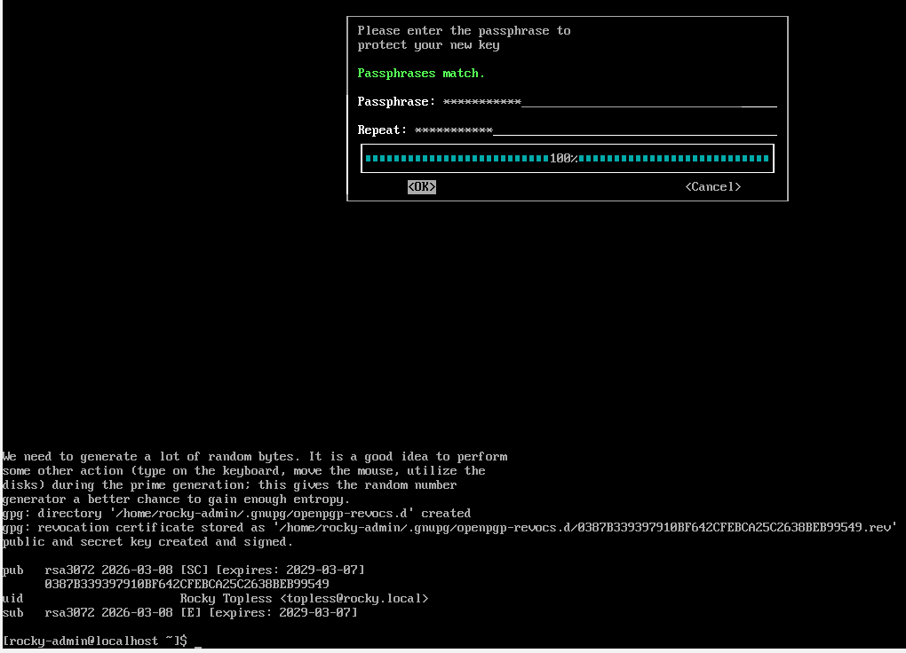  

verify the keys were created with `:> gpg --list-keys`  

### GPG File Encryption

#### Symmetric

encrypt a text file with a passphrase and then anyone that wants to decrypt and read that file must know the passphrase: `:> gpg -c <our_file>`  
This will prompt the user to enter a passphrase to protect the file.  
*Note* This is not the passphrase you used to create your keys  

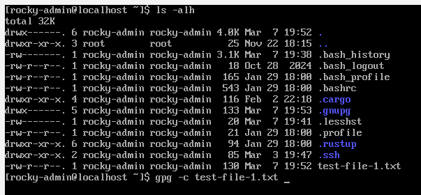  
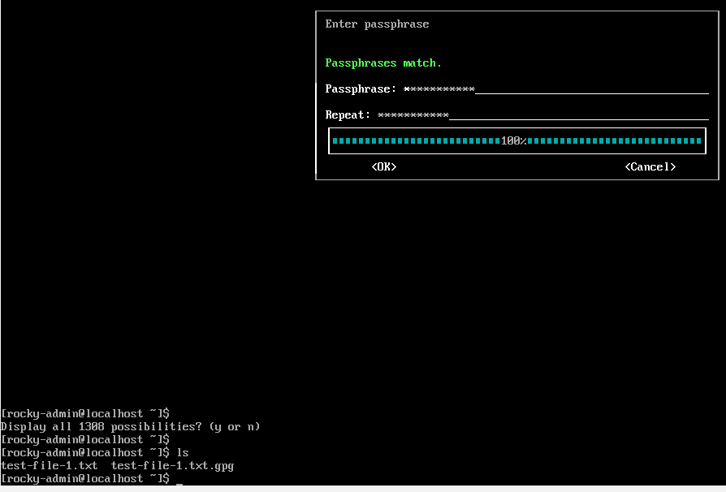  

Symmetrically encrypting your file leaves a backup copy that's unencrypted. You can remove it with shred or rm.  
Then let's decrypt our file and see what's inside! `:> gpg -d <file>.gpg`  

#### Asymmetric

We'll need two users here: Nick and Spooky.  
To perform Asymmetric encrption, both parties need to have previously generated keys.  

The public key is used to encrypt the data, both Nick and Spooky need to extract their public keys and send them to each other.  

1. Navigate to Nick's .gnupg folder  
2. `:> gpg --export -a -o <filename>` : exports Nick's public key as ASCII armored output as the `<filename>`
3. Move to Spooky's .gnupg folder (or know the path)  
4. `:>  gpg --import nick_public_key.txt`

Now, let's say Nick wants to send Spooky an encrypted file.  
Encrypt his document asymmetrically with `:> gpg -e <document>`  
Nick would send this file to Spooky  
When Spooky goes to decrypt it: `:> gpg -d <filename>.txt.gpg`  
Spooky is prompted for his passphrase for his private key.  

## SSH

### Protocol 1

In your /etc/ssh/sshd_config file, if you see `Protocol 1` or `Protocol 1, 2`, disable Protocol version 1 as soon as possible.  
It's available to run on Legacy machines but has been compromised and is no longer considered secure.  
SSH Protocol Version 2 is the current, more secure version of SSH.

### Creating and SSH Key Set

#### Creating SSH Keys

`:> ssh-keygen` to generate a pair of public and private keys.  

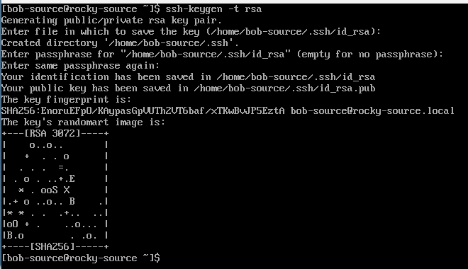

#### Copying Using ssh-copy-id

`:> ssh-copy-id username@remote-host`  

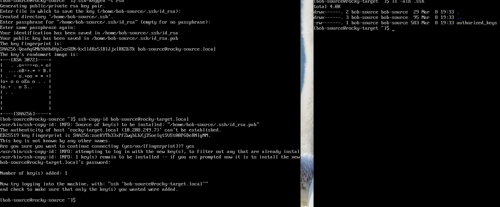

#### Creating Keys with Updated Encryption Algorithms

`ssh-keygen`, by default uses RSA with a 2048 size key.  

#### RSA

To create that modified RSA key, we can use the following command during key generation

`:> ssh-keygen -t rsa -b 3072`  

The -t option specifies the encryption type and the -b option specifies the bit size.  

#### ECDSA

`:> ssh-keygen -t ecdsa -b 384

The max key size with ECDSA is 521 bits.  
NIST does not recommend this key size as they could be susceptible to padding attacks.  
384 bits is quite strong and although the key size is smaller than RSA's 3072 key size, it's just as strong as RSA while also requiring less computing power, which is a plus.

### Disable Username & Password SSH Login

Only do this after you've verified that your key exchange login works. Otherwise, you risk locking yourself or other users out of the system.  
Go to the /etc/ssh/sshd_config file and edit the following line  

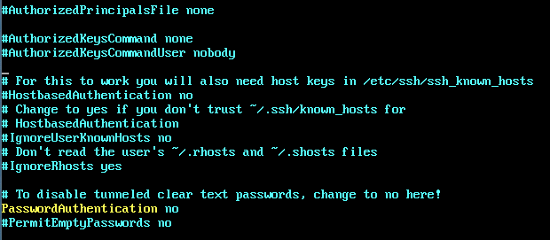  

to completely remove password based logins

### X11 Forwarding & SSH Tunneling

#### X11 Forwarding

You've connected to your workstation that has SSH enabled and you go about your work on the command-line.  
Everything is going great. But then you run into a problem. You need to run a program that only has a GUI.  How would you accomplish that via SSH?  
X11 allows you to forward GUI application displays to your local environment (thought it has to have a GUI itself, right?).  
X11 has some flaws that make it dangerous to use. So let's look at turning it off.

#### Turn off X11 Forwarding

Another setting in sshd_config. You'll want to find the line that says  

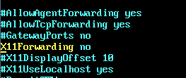  

#### SSH Tunneling

Scenario: you're on your computer at work and your favorite streaming service is blocked.  
By forwarding the SSH connection to a computer or device running SSH that you own (most likely at home), you can browse blocked sites at work.  
There's a few settings in the sshd_config that allow a user to accomplish (or block) this.  

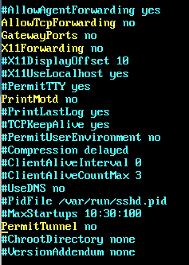  

### Improving SSH Logging

A log file is created any time someone logs in with a Protocol that uses SSH. So that would be SSH, SCP, or SFTP.  
By default, linux stores this log file in /var/log/auth.log.  

Therea re different levels of logging described on `:> man sshd_config`:  

  INFO (default setting)  
  QUIET  
  FATAL  
  ERROR  
  INFO  
  VERBOSE  
  DEBUG1  
  DEBUG2  
  DEBUG3  

INFO is the default setting. This is one of the two we would normally care about. The other would be VERBOSE.  
To change the logging level,avigate to /etc/ssh/sshd_config  
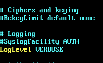  

## Mandatory Access Control

considered the strongest form of access control due to allowing more control over who has access over what.  
In a Linux system, there are multiple ways to implement MAC. Two of which being SELinux and AppArmor.  

### AppArmor

Both, AppArmor and SELinux can be used to implement MAC on a Linux system  
can prevent malicious actors from accessing the data on your systems. As a system administrator, this is extremely important; protecting the confidentiality of your data
Applications have their own profiles thus making it a little easier
SELinux and AppArmor have the capability to create your own custom profiles but the scripting in AppArmor is a little easier to understand and reduces the learning curve

### AppArmor Configuration

The AppArmor directory is located at `/etc/apparmor.d`.  
This directory contains all of the AppArmor profiles. The sbin.dhclient and usr.* files are AppArmor profiles. 

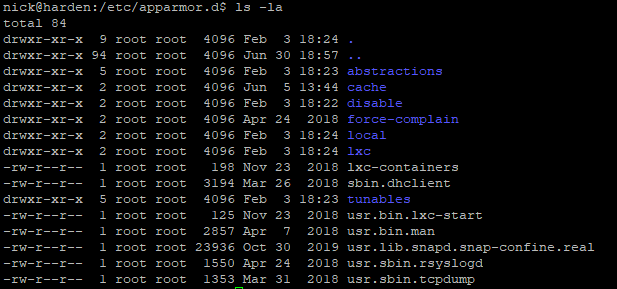  

The `abstractions` directory is a sort of "includes" folder that has partially written profiles that can be used and included in your own profiles.  

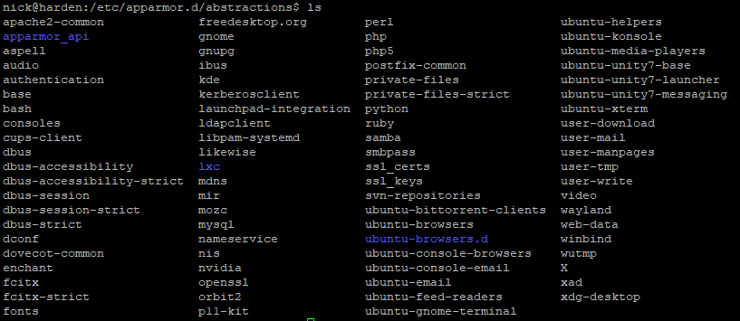

For this example, look at the gnupg file.

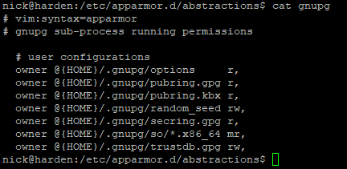  

each line/rule ends in a comma. This is required syntax (even for the last rule).  
each rule has an owner @{HOME} portion for each listing. The @{HOME} is an AppArmor variable that allows the rule to work with any user's home directory.  
The access methods before the end of the rule: r for reading, w for writing. These indicate that the AppArmor daemon have those permissions to read and write to that location preceding it.  
`m` indicates that the file can be used for executable mapping - the file can be mapped into memory using mmap.  
these are not configured profiles. They are partials meant to be included in custom profiles.  
The only two profiles upon a fresh install of Ubuntu are `sbin.dhclient` and `usr.*`.

Additional profiles can be installed with `:> sudo apt install apparmor-profiles apparmor-profiles-extra`

### AppArmor Command Line Utilities

To get the AppArmor status, we can enter `:> aa-status`.  

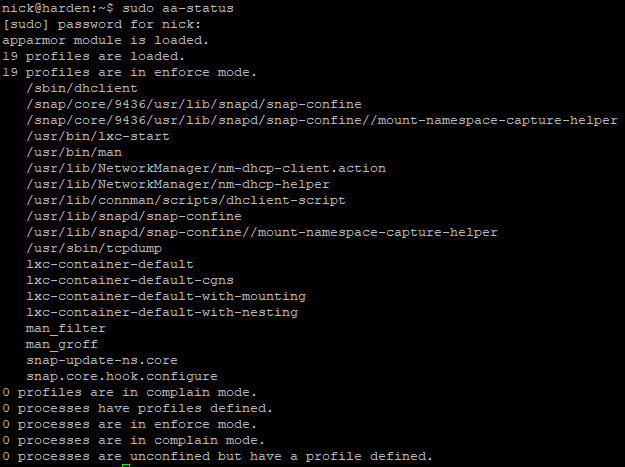  

***AppArmor modes***

- Enforce - Enforces the active profiles
- Complain - Allows processes to perform disallowed actions by the profile and are logged
- Audit - The same as Enforce mode but allowed and disallowed actions get logged to /var/log/audit/audit.log or system log (depending on if auditd is installed)

Install apparmor command-line utilities: `:> sudo apt install apparmor-utils`  
enables the following commands  

- aa-enforce
- aa-disable
- aa-audit
- aa-complain  

Let's set the usr.sbin.rsyslogd profile to enforce mode and then check the status.

`:> sudo aa-enforce usr.sbin.rsyslogd`  

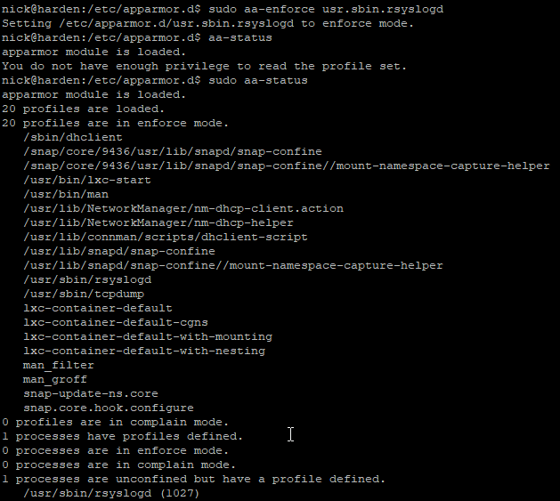  
