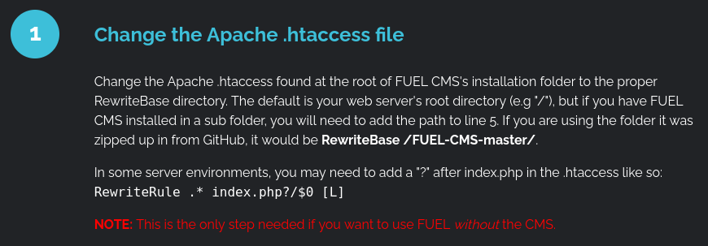
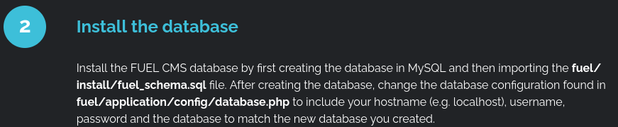
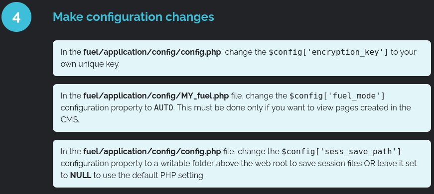
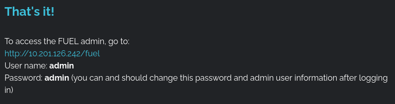

# IGNITE

## NMAP

`nmap -Pn -sV -O 10.201.126.242`  

PORT   STATE SERVICE VERSION
80/tcp open  http    Apache httpd 2.4.18 ((Ubuntu))

## Visit the Page  

A number of useful instructions  

  

 

 

 

 