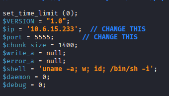

# IGNITE

## The Background

  

Fuel is based on PHP.

## NMAP

### Basic Scan  

`:> nmap -Pn -sV -O 10.201.126.242`  

PORT   STATE SERVICE VERSION  
80/tcp open  http    Apache httpd 2.4.18 ((Ubuntu))  

### Vulnerability Scan

`:> nmap --script vuln 10.6.15.233`  

  

### Target Revealed Ports

`:> nmap 10.6.15.233 -p 3390,5901 -Pn -sV --script vuln`  

  

## Visit the Page  

A number of potentially useful instructions  

Default installation directory:  
  

Software and location of the database:  
  

Instructions which, if followed, make certain directories very useful for exploitation activities:  
  

A place to look for hardcoded encryption keys; The potential for a directory above the web root that becomes vulnerable to traversal atacks.  
  

Finally, default credentials  
  

### Check robots.txt  

`http://10.201.126.242/robots.txt`  

Webcrawlers are prevented from scanning the FUEL admin portal, unless the webcrawler ignores the robots.txt contents.
  

### Visit the FUEL admin portal  

Use the default credentials to log into the portal  
Change the password now or later...  

  

### Upload a reverse shell

It's already known that Fuel is based on PHP.

Grab a web shell from Kali's resources.  

  

Edit the shell to add the Attacker IP and port.  

  

Attempt, and fail, to upload the php reverse shell.  

  

Change the file extension in an attempt to get around the extension checks.  

  

Failed to upload a second time.  

 

Try additional extension including: php1, php2, and php3.

Nothing worked.

## Available Exploits

`:> searchsploit FUEL`  

Several options exist  

  

