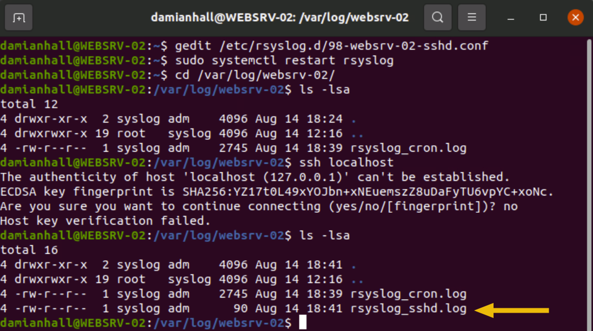
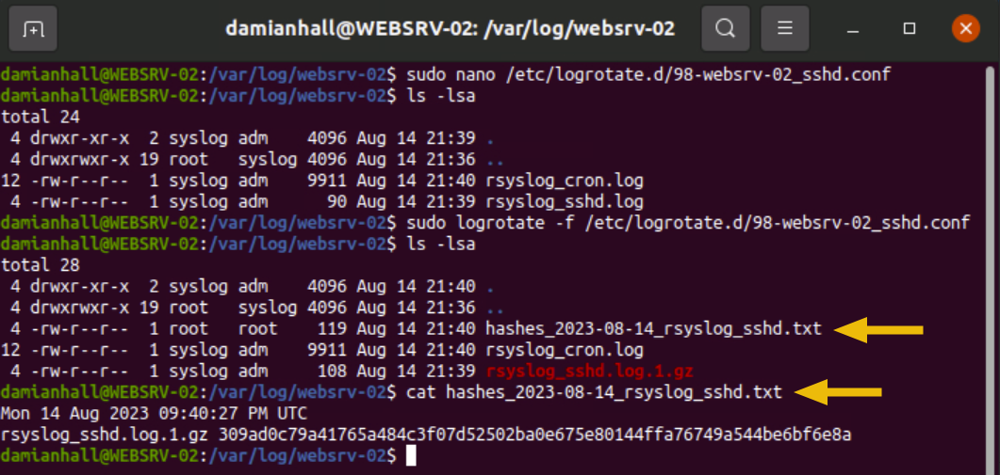
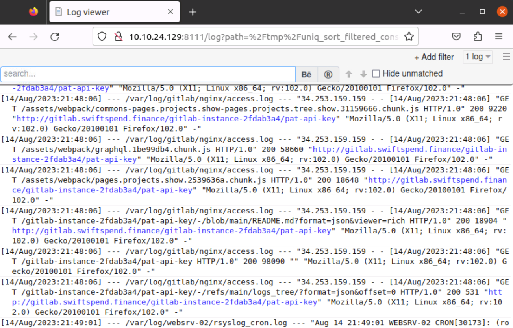

# Introduction to Logs

## Learning Objectives

- Understand the importance of logs as a historical activity record for identifying and mitigating potential threats.
- Explore log types, logging mechanisms, collection methods, formats, and standards across multiple platforms.
- Gain hands-on experience detecting and investigating adversary activity through log analysis.

## Logs as Evidence of Historical Activity

## Scenario

A web server is constantly bombarded with scans from an adversary. The objective is to identify what the adversary is doing by configuring logging and analyzing the logs collected from the system.

Operational notes:

- The user `damianhall` has limited `sudo` privileges.
- Use `sudo -l` to identify which commands this user is allowed to run.
- The allowed commands are sufficient to complete the follow-on tasks.

### In the Heart of Data: Logs

In the digital world, every interaction with a computer system leaves a digital footprint in the form of logs.

Logs provide a detailed account of what a system has been doing. They can capture events such as:

- User logins
- File access
- System errors
- Network connections
- Changes to data
- Changes to system configuration

A log entry usually includes:

- A timestamp showing when the event was logged
- The system or application that generated the event
- The type of event that occurred
- Additional event details, such as the user who initiated the action or the source IP address involved

A log file contains aggregated entries showing what occurred on a system over time. Log files can grow rapidly depending on how much activity is logged and how verbose the logging configuration is.

### Contextual Correlation

Log data becomes more powerful when it is aggregated, analyzed, and cross-referenced with other sources of information. For security operations, logs help answer critical investigative questions:

- What happened?
- When did it happen?
- Where did it happen?
- Who is responsible?
- Were the actions successful?
- What was the result of the action?

### Historical Activity Questions

#### What is the name of your colleague who left a note on your Desktop?

Use a simple `cat` command to read the note.

#### What is the full path to the suggested log file for initial investigation?

The path is inside the note.

## Types, Formats, and Standards

### Log Types

- **Application Logs:** Messages generated by specific applications, including status, errors, and warnings.
- **Audit Logs:** Records of operational activities that are important for accountability and regulatory compliance.
- **Security Logs:** Security-relevant events such as logins, permission changes, and user activity.
- **Server Logs:** Logs generated by servers, including system, event, error, and access logs.
- **System Logs:** Kernel activity, system errors, boot sequences, and hardware status.
- **Network Logs:** Network traffic, network connections, and related communication events.
- **Database Logs:** Database activity such as queries, updates, errors, and access events.
- **Web Server Logs:** Requests processed by a web server, including URLs, response codes, source addresses, and user agents.

### Log Formats

A log format specifies how log data is encoded, how entries are delimited, and which fields are included in each row. Formats vary widely, but they commonly fall into three categories:

- Semi-structured logs
- Structured logs
- Unstructured logs

#### Semi-structured Logs

Semi-structured logs contain predictable components while still allowing free-form text. They are partially parseable but may require flexible parsing rules.

##### Syslog Message Format

Syslog is a widely adopted logging protocol and format for system and network logs.

```syslog
# Example of a log file using the Syslog format

damianhall@WEBSRV-02:~/logs$ cat syslog.txt
May 31 12:34:56 WEBSRV-02 CRON[2342593]: (root) CMD ([ -x /etc/init.d/anacron ] && if [ ! -d /run/systemd/system ]; then /usr/sbin/invoke-rc.d anacron start >/dev/null; fi)
```

##### Windows Event Log (EVTX) Format

EVTX is a proprietary Microsoft log format used by Windows systems.

```powershell
# Example of a log file using the Windows Event Log (EVTX) format

PS C:\WINDOWS\system32> Get-WinEvent -Path "C:\Windows\System32\winevt\Logs\Application.evtx"

   ProviderName: Microsoft-Windows-Security-SPP

TimeCreated                      Id LevelDisplayName Message
-----------                      -- ---------------- -------
31/05/2023 17:18:24           16384 Information      Successfully scheduled Software Protection service for re-start
31/05/2023 17:17:53           16394 Information      Offline downlevel migration succeeded.
```

#### Structured Logs

Structured logs use strict and standardized formats, which makes them easier to parse, normalize, search, and analyze.

##### Field-delimited Formats

Comma-Separated Values (CSV) and Tab-Separated Values (TSV) are commonly used for tabular log data.

```csv
# Example of a log file using CSV format

damianhall@WEBSRV-02:~/logs$ cat log.csv
"time","user","action","status","ip","uri"
"2023-05-31T12:34:56Z","adversary","GET",200,"34.253.159.159","http://gitlab.swiftspend.finance:80/"
```

##### JavaScript Object Notation (JSON)

JSON is readable, structured, and highly compatible with modern programming languages and log-processing tools.

```json
{"time": "2023-05-31T12:34:56Z", "user": "adversary", "action": "GET", "status": 200, "ip": "34.253.159.159", "uri": "http://gitlab.swiftspend.finance:80/"}
```

##### W3C Extended Log Format (ELF)

The W3C Extended Log Format is defined by the World Wide Web Consortium. It is customizable for web server logging and is commonly associated with Microsoft Internet Information Services (IIS).

```text
# Example of a log file using W3C Extended Log Format

damianhall@WEBSRV-02:~/logs$ cat elf.log
#Version: 1.0
#Fields: date time c-ip c-username s-ip s-port cs-method cs-uri-stem sc-status
31-May-2023 13:55:36 34.253.159.159 adversary 34.253.127.157 80 GET /explore 200
```

##### eXtensible Markup Language (XML)

XML is flexible and customizable for creating standardized logging formats.

```xml
<!-- Example of a log file using XML format -->

<log><time>2023-05-31T12:34:56Z</time><user>adversary</user><action>GET</action><status>200</status><ip>34.253.159.159</ip><url>https://gitlab.swiftspend.finance/</url></log>
```

#### Unstructured Logs

Unstructured logs use free-form text. They may be rich in context, but they can be harder to parse consistently.

##### NCSA Common Log Format (CLF)

NCSA Common Log Format is a standardized web server log format for client requests. It is commonly used by Apache HTTP Server by default.

```text
# Example of a log file using NCSA Common Log Format

damianhall@WEBSRV-02:~/logs$ cat clf.log
34.253.159.159 - adversary [31/May/2023:13:55:36 +0000] "GET /explore HTTP/1.1" 200 4886
```

##### NCSA Combined Log Format

NCSA Combined Log Format extends CLF by adding fields such as referrer and user agent. It is commonly used by Nginx Server by default.

```text
# Example of a log file using NCSA Combined Log Format

damianhall@WEBSRV-02:~/logs$ cat combined.log
34.253.159.159 - adversary [31/May/2023:13:55:36 +0000] "GET /explore HTTP/1.1" 200 4886 "http://gitlab.swiftspend.finance/" "Mozilla/5.0 (X11; Ubuntu; Linux x86_64; rv:109.0) Gecko/20100101 Firefox/115.0"
```

#### Custom-defined Formats

Custom-defined formats are crafted for specific applications or use cases. They provide flexibility, but they may require specialized parsing tools, field extraction, or custom normalization rules before they can be analyzed effectively.

### Log Standards

Log standards define how logs should be generated, transmitted, stored, and retained. A standard may specify a format, but it can also cover event selection, secure transmission, integrity, and retention requirements.

Examples of log standards and guidance include:

- **Common Event Expression (CEE):** Provides a common structure for log data, making logs easier to generate, transmit, store, and analyze.
- **Logging Cheat Sheet:** Guidance for developers building application logging mechanisms, especially for security logging.
- **Syslog Protocol:** A standard for message logging that separates the software generating messages from the systems storing, reporting, and analyzing them.
- **Special Publication 800-92:** Guidance for computer security log management.
- **Azure Monitor Logs:** Guidance for log monitoring on Microsoft Azure.
- **Google Cloud Logging:** Guidance for logging on Google Cloud Platform (GCP).
- **Oracle Cloud Infrastructure Logging:** Guidance for logging on Oracle Cloud Infrastructure (OCI).
- **Virginia Tech - Standard for Information Technology Logging:** Example log review and compliance guidance.

### Types, Formats, and Standards Questions

#### Based on the list of log types in this task, what log type is used by the log file specified in the note from Task 2?

Review the file path identified in the note, then map it to the log type list above.

#### Based on the list of log formats in this task, what log format is used by the log file specified in the note from Task 2?

Inspect the structure of the specified log file and match it to the format examples above.

## Collection, Management, and Centralization

### Log Collection

Log collection is the aggregation of logs from diverse sources such as servers, network devices, applications, software platforms, and databases.

For logs to accurately represent a chronological sequence of events, system time must be accurate. Network Time Protocol (NTP) is commonly used to synchronize time and preserve the integrity of log timelines.

Key collection steps:

- **Identify sources:** List potential log sources, including servers, databases, applications, and network devices.
- **Choose a log collector:** Select a collector that fits the infrastructure and the required log sources.
- **Configure collection parameters:** Enable time synchronization through NTP, define which events should be logged, and prioritize events based on importance.
- **Test collection:** Confirm that logs are being collected from every required source.

Important operational notes:

- NTP-based time synchronization may not be possible to replicate in an isolated lab environment without internet connectivity.
- Use `pool.ntp.org` to locate an NTP server.
- On Linux-based systems, time synchronization can be automatic or manually initiated with `ntpdate pool.ntp.org`.

```bash
# Example of time synchronization on a Linux-based system

root@WEBSRV-02:~# ntpdate pool.ntp.org
12 Aug 21:03:44 ntpdate[2399365]: adjust time server 85.91.1.180 offset 0.000060 sec
root@WEBSRV-02:~# date
Saturday, 12 August, 2023 09:04:55 PM UTC
root@WEBSRV-02:~#
```

### Log Management

Log management ensures that collected logs are stored securely, organized systematically, and ready for quick retrieval.

Core activities:

- **Storage:** Choose a secure storage solution based on retention period, accessibility, compliance, and cost.
- **Organization:** Classify logs by source, type, system, sensitivity, or investigation value.
- **Backup:** Back up logs regularly to prevent data loss.
- **Review:** Periodically confirm that logs are stored correctly and categorized consistently.

### Log Centralization

Centralization consolidates logs into a unified system. A centralized logging platform improves searchability, monitoring, alerting, incident response, and investigation speed.

Common steps:

- **Choose a centralized system:** Examples include the Elastic Stack and Splunk.
- **Integrate sources:** Connect all required log sources to the centralized platform.
- **Set up monitoring:** Configure real-time monitoring and alerting for key events.
- **Integrate with incident management:** Ensure that alerts and findings can support response workflows.

### Practical Activity: Log Collection with rsyslog

This activity introduces `rsyslog` and shows how it can improve centralized log collection and management. The example configures `rsyslog` to write all `sshd` messages to `/var/log/websrv-02/rsyslog_sshd.log`.

Procedure:

1. Open a terminal.
2. Confirm that `rsyslog` is installed:

```bash
sudo systemctl status rsyslog
```

3. Create a configuration file using a text editor:

```bash
gedit /etc/rsyslog.d/98-websrv-02-sshd.conf
nano /etc/rsyslog.d/98-websrv-02-sshd.conf
vi /etc/rsyslog.d/98-websrv-02-sshd.conf
vim /etc/rsyslog.d/98-websrv-02-sshd.conf
```

4. Add the following configuration to direct `sshd` messages to a specific log file:

```bash
$FileCreateMode 0644
:programname, isequal, "sshd" /var/log/websrv-02/rsyslog_sshd.log
```

5. Save and close the configuration file.
6. Restart `rsyslog` to apply the change:

```bash
sudo systemctl restart rsyslog
```

7. Verify the configuration by initiating an SSH connection to localhost or checking the generated log file after a minute or two:

```bash
ssh localhost
```



If remote log forwarding is not configured, tools such as `scp` and `rsync` can be used for manual log collection.

### Collection, Centralization, and Management Questions

#### After configuring rsyslog for sshd, what username repeatedly appears in the sshd logs at `/var/log/websrv-02/rsyslog_sshd.log`, indicating failed login attempts or brute forcing?

Look for an invalid username that repeatedly appears in the SSH logs.

#### What is the IP address of SIEM-02 based on the rsyslog configuration file `/etc/rsyslog.d/99-websrv-02-cron.conf`, which is used to monitor cron messages?

Use `cat` to inspect the configuration file.

#### Based on the generated logs in `/var/log/websrv-02/rsyslog_cron.log`, what command is being executed by the root user?

Use `grep root` to isolate cron activity executed by the root user.

## Storage, Retention, and Deletion

### Log Storage

Storage choices depend on the operational, legal, and security requirements of the organization.

Considerations include:

- **Security requirements:** Logs must be stored in compliance with organizational and regulatory security protocols.
- **Accessibility needs:** Retrieval speed and permitted access roles influence the storage design.
- **Storage capacity:** High-volume logging can require significant storage space.
- **Cost considerations:** Budget may influence whether cloud-based or local storage is used.
- **Compliance regulations:** Industry-specific rules may define how logs must be stored and protected.
- **Retention policies:** Required retention time and ease of retrieval affect storage architecture.
- **Disaster recovery plans:** Logs may need to remain available even during system failure.

### Log Retention

Log storage is not infinite. Retention planning balances future investigative need against storage cost.

Common storage tiers:

- **Hot Storage:** Logs from the past 3-6 months. These should be the most accessible and support near-real-time query speed when possible.
- **Warm Storage:** Logs from approximately six months to two years. These act as a data lake and remain accessible, but not as immediately as hot storage.
- **Cold Storage:** Archived or compressed logs from approximately two to five years. These are harder to access and are usually used for retroactive analysis, scoping, or compliance needs.

Carefully choosing hot, warm, and cold storage strategies helps manage the cost of storing logs.

### Log Deletion

Log deletion must be handled carefully to avoid removing logs that still have investigative, operational, compliance, or legal value. Important logs should be backed up before deletion.

Deletion policies help organizations:

- Maintain a manageable volume of logs for analysis.
- Comply with privacy regulations, such as GDPR, when unnecessary data must be deleted.
- Keep storage costs under control.

### Best Practices: Log Storage, Retention, and Deletion

- Define storage, retention, and deletion policies based on business needs and legal requirements.
- Review and update log management guidelines as conditions and regulations change.
- Automate storage, retention, and deletion processes to improve consistency and reduce human error.
- Encrypt sensitive logs to protect data.
- Make regular backups, especially before deletion or rotation.

### Practical Activity: Log Management with logrotate

`logrotate` automates log rotation, compression, and removal. It helps keep log files manageable and supports systematic log handling.

Procedure:

1. Create the configuration file using one of the following commands:

```bash
sudo gedit /etc/logrotate.d/98-websrv-02_sshd.conf
sudo nano /etc/logrotate.d/98-websrv-02_sshd.conf
sudo vi /etc/logrotate.d/98-websrv-02_sshd.conf
sudo vim /etc/logrotate.d/98-websrv-02_sshd.conf
```

2. Define log settings:

```bash
/var/log/websrv-02/rsyslog_sshd.log {
    daily
    rotate 30
    compress
    lastaction
        DATE=$(date +"%Y-%m-%d")
        echo "$(date)" >> "/var/log/websrv-02/hashes_"$DATE"_rsyslog_sshd.txt"
        for i in $(seq 1 30); do
            FILE="/var/log/websrv-02/rsyslog_sshd.log.$i.gz"
            if [ -f "$FILE" ]; then
                HASH=$(/usr/bin/sha256sum "$FILE" | awk '{ print $1 }')
                echo "rsyslog_sshd.log.$i.gz "$HASH"" >> "/var/log/websrv-02/hashes_"$DATE"_rsyslog_sshd.txt"
            fi
        done
        systemctl restart rsyslog
    endscript
}
```

3. Save and close the file.
4. Manually execute log rotation:

```bash
sudo logrotate -f /etc/logrotate.d/98-websrv-02_sshd.conf
```



### Storage, Retention, and Deletion Questions

#### Based on the logrotate configuration `/etc/logrotate.d/99-websrv-02_cron.conf`, how many versions of old compressed log file copies will be kept?

Use `cat` to inspect the configuration and find the `rotate` value.

#### Based on the logrotate configuration `/etc/logrotate.d/99-websrv-02_cron.conf`, what is the log rotation frequency?

Use `cat` to inspect the configuration and identify the frequency directive, such as `daily`, `weekly`, or `monthly`.

## Hands-on Exercise: Log Analysis Process, Tools, and Techniques

Logs are more than records of historical events. They can guide diagnostics, cybersecurity investigations, compliance activities, and operational decision-making. Their value depends on collection integrity, effective analysis, and the ability to learn from the events they preserve.

### Log Analysis Process

- **Data Sources:** Systems or applications configured to log system events or user activity. These are the origins of the logs.
- **Parsing:** Breaking log data into more manageable components. Because logs appear in many formats, parsing extracts the fields needed for analysis.
- **Normalisation:** Standardizing parsed data into a common format so logs from different systems can be compared and queried consistently.
- **Sorting:** Organizing logs by time, source, event type, severity, or other fields. Sorting supports efficient retrieval and helps identify trends and anomalies.
- **Classification:** Assigning categories to logs based on their characteristics. Classification helps analysts filter for the logs that matter most.
- **Enrichment:** Adding context to logs, such as geographic data, user details, threat intelligence, or related data from other systems. Enrichment improves decision-making and incident response accuracy.
- **Correlation:** Linking related records and identifying relationships between log entries. Correlation helps uncover complex event chains, threats, and system performance issues.
- **Visualisation:** Representing log data in charts, graphs, heat maps, or other visual formats to make patterns and anomalies easier to recognize.
- **Reporting:** Summarizing log data in structured formats for stakeholders such as management, security teams, auditors, or incident responders.

### Log Analysis Tools

Security Information and Event Management (SIEM) tools, such as Splunk or Elasticsearch-based solutions, support complex log analysis tasks.

During incident response or rapid triage, Linux systems can use built-in tools such as:

- `cat`
- `grep`
- `sed`
- `sort`
- `uniq`
- `awk`
- `sha256sum`

Windows systems can use tools such as EZ-Tools and the default `Get-FileHash` cmdlet for similar purposes.

For forensic integrity and potential legal admissibility, hash log files during collection. Hashing helps demonstrate that logs were not altered after acquisition.

### Log Analysis Techniques

- **Pattern Recognition:** Identifies recurring sequences or trends in log data. This can highlight normal behavior or suspicious activity.
- **Anomaly Detection:** Identifies data points that deviate from expected patterns. This is useful for early detection of operational problems or malicious activity.
- **Correlation Analysis:** Connects related log entries to understand event relationships, causation, and dependencies.
- **Timeline Analysis:** Examines logs over time to understand event order, trends, periodic behavior, and incident progression.
- **Machine Learning and AI:** Automates and improves classification, enrichment, anomaly detection, and predictive analysis.
- **Visualisation:** Uses charts and graphs to make complex data easier to interpret quickly.
- **Statistical Analysis:** Uses quantitative methods, such as regression analysis or hypothesis testing, to support data-driven decisions.

These techniques can be used individually or together depending on the complexity and goal of the analysis.

### Working with Logs: Practical Application

This tutorial uses two approaches:

- **Unparsed raw log files:** Raw files are accessed directly through a Log Viewer tool. This is useful for quick inspection or preserving the original log format.
- **Parsed and consolidated log file:** Unix tools such as `cat`, `grep`, `sed`, `sort`, `uniq`, and `awk` are used to merge, filter, and standardize logs into a clearer file for analysis.

Both approaches are useful. Raw logs preserve original evidence, while parsed and consolidated logs improve readability and pattern identification.

#### Unparsed Raw Log Files

Raw log files can be accessed directly through the Log Viewer tool by specifying paths in the URL.

Example URL containing multiple log files:

```text
http://MACHINE_IP:8111/log?log=%2Fvar%2Flog%2Fgitlab%2Fnginx%2Faccess.log&log=%2Fvar%2Flog%2Fwebsrv-02%2Frsyslog_cron.log&log=%2Fvar%2Flog%2Fwebsrv-02%2Frsyslog_sshd.log&log=%2Fvar%2Flog%2Fgitlab%2Fgitlab-rails%2Fapi_json.log
```

Paste the URL into the browser to view unparsed raw log files through the Log Viewer tool.

> Note: You can access the URL using the AttackBox or VM browser. Firefox on the VM may take a few minutes to start.

#### Parsed and Consolidated Log File

To create a parsed and consolidated log file, use a combination of Unix tools such as `awk`, `sed`, `sort`, and `uniq`.

1. Use `awk` and `sed` to normalize log entries into the desired format. This example sorts by date and time.

```bash
# Process nginx access log
awk -F'[][]' '{print "[" $2 "]", "--- /var/log/gitlab/nginx/access.log ---", "\"" $0 "\""}' /var/log/gitlab/nginx/access.log  | sed "s/ +0000//g" > /tmp/parsed_consolidated.log

# Process rsyslog_cron.log
awk '{ original_line = $0; gsub(/ /, "/", $1); printf "[%s/%s/2023:%s] --- /var/log/websrv-02/rsyslog_cron.log --- \"%s\"\n", $2, $1, $3, original_line }' /var/log/websrv-02/rsyslog_cron.log >> /tmp/parsed_consolidated.log

# Process rsyslog_sshd.log
awk '{ original_line = $0; gsub(/ /, "/", $1); printf "[%s/%s/2023:%s] --- /var/log/websrv-02/rsyslog_sshd.log --- \"%s\"\n", $2, $1, $3, original_line }' /var/log/websrv-02/rsyslog_sshd.log >> /tmp/parsed_consolidated.log

# Process gitlab-rails/api_json.log
awk -F'"' '{timestamp = $4; converted = strftime("[%d/%b/%Y:%H:%M:%S]", mktime(substr(timestamp, 1, 4) " " substr(timestamp, 6, 2) " " substr(timestamp, 9, 2) " " substr(timestamp, 12, 2) " " substr(timestamp, 15, 2) " " substr(timestamp, 18, 2) " 0 0")); print converted, "--- /var/log/gitlab/gitlab-rails/api_json.log ---", "\""$0"\""}' /var/log/gitlab/gitlab-rails/api_json.log >> /tmp/parsed_consolidated.log
```

2. Optionally filter for specific entries:

```bash
grep "34.253.159.159" /tmp/parsed_consolidated.log > /tmp/filtered_consolidated.log
```

3. Sort all log entries by date and time:

```bash
sort /tmp/parsed_consolidated.log > /tmp/sort_parsed_consolidated.log
```

4. Remove duplicate entries:

```bash
uniq /tmp/sort_parsed_consolidated.log > /tmp/uniq_sort_parsed_consolidated.log
```

5. Access the parsed and consolidated log file through the Log Viewer tool:

```text
http://MACHINE_IP:8111/log?path=%2Ftmp%2Funiq_sort_parsed_consolidated.log
```



> Note: You can access the URL using the AttackBox or browser. Firefox on the VM may take a few minutes to start.

### Practical Applications Questions

#### Upon accessing the log viewer URL for unparsed raw log files, what error does `/var/log/websrv-02/rsyslog_cron.log` show when selecting the different filters?

The error is visible in the Log Viewer menu.

#### What is the process of standardising parsed data into a more easily readable and query-able format?

Use search within the lesson text to locate the relevant process term.

#### What is the process of consolidating normalised logs to enhance the analysis of activities related to a specific IP address?

Use search within the lesson text to locate the relevant process term.
