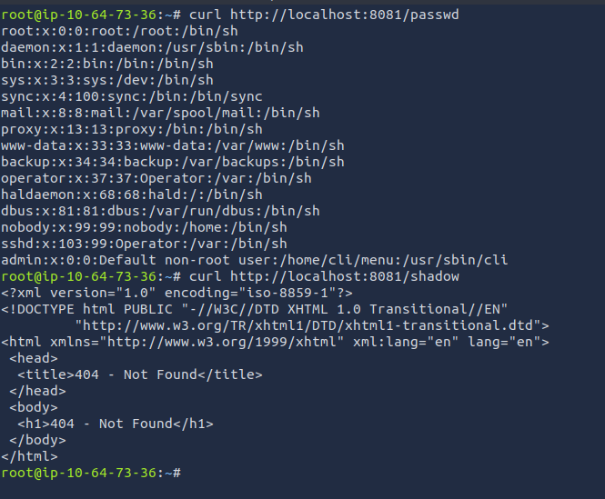
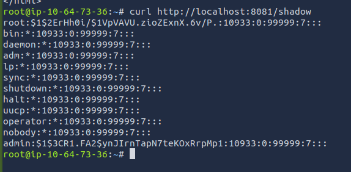

# Intro to IoT Pentesting

A beginner friendly walkthrough for internet of things (IoT) pentesting.  

## Tools

- unzip
- tar
- binwalk
- [Firmadyne](https://github.com/firmadyne/firmadyne) automated and scalable system for performing emulation and dynamic analysis of Linux-based embedded firmware  
  
## Theory

### what is firmware

communicates between the hardware and the rest of the infrastructure

### How to obtain

Vendor website

Internet Search

Reversing the mobile application

Sniffing OTA update mechanisms

Dumping from device

### Target Firmware for room

Netgear AP products

CVE-2016-1555

## Connecting to the Machine

Username: iot
Password: tryhackme123!

## Unpacking Firmware

`:> unzip "filename"`

`:> tar -xf <filename>`

file list:  

```md
-rw-r--r--  1 iot  iot    36 iun 23  2011 kernel.md5
-rw-rw-r--  1 iot  iot  2,7K apr  3  2012 ReleaseNotes_WNAP320_fw_2.0.3.HTML
-rw-r--r--  1 iot  iot    36 iun 23  2011 root_fs.md5
-rwx------  1 iot  iot  4,3M iun 23  2011 rootfs.squashfs
-rw-r--r--  1 iot  iot  961K iun 23  2011 vmlinux.gz.uImage

```  

`:> binwalk -e rootfs.squashfs`

file list:  

`:>_rootfs.squashfs.extracted/squashfs-root$ ls -alh`  

```md

total 52K
drwxr-xr-x 13 iot iot 4,0K iun 23  2011 .
drwxrwxr-x  3 iot iot 4,0K ian 28 05:21 ..
drwxr-xr-x  2 iot iot 4,0K iun 23  2011 bin
drwxr-xr-x  3 iot iot 4,0K iun 23  2011 dev
drwxr-xr-x  6 iot iot 4,0K iun 23  2011 etc
drwxr-xr-x  4 iot iot 4,0K iun 23  2011 home
drwxr-xr-x  3 iot iot 4,0K iun 23  2011 lib
lrwxrwxrwx  1 iot iot   11 iun 23  2011 linuxrc -> bin/busybox
drwxr-xr-x  2 iot iot 4,0K aug 22  2008 proc
drwxr-xr-x  2 iot iot 4,0K aug 22  2008 root
drwxr-xr-x  2 iot iot 4,0K iun 23  2011 sbin
drwxr-xr-x  2 iot iot 4,0K aug 22  2008 tmp
drwxr-xr-x  7 iot iot 4,0K iun 23  2011 usr
drwxr-xr-x  2 iot iot 4,0K nov 11  2008 var
```

Find the web app:  

`:> ~/Desktop/_rootfs.squashfs.extracted/squashfs-root$ ls -alh home/www`

```md
total 500K
drwxr-xr-x 7 iot iot 4,0K iun 23  2011 .
drwxr-xr-x 4 iot iot 4,0K iun 23  2011 ..
-r--r--r-- 1 iot iot  900 iun 21  2011 background.html
-r--r--r-- 1 iot iot  862 iun 21  2011 BackupConfig.php
-r--r--r-- 1 iot iot 3,6K iun 21  2011 boardDataNA.php
-r--r--r-- 1 iot iot 3,6K iun 21  2011 boardDataWW.php
-r--r--r-- 1 iot iot  393 iun 21  2011 body.php
-r--r--r-- 1 iot iot 2,8K iun 21  2011 button.html
-r--r--r-- 1 iot iot 2,5K iun 21  2011 checkConfig.php
-r--r--r-- 1 iot iot  800 iun 21  2011 checkSession.php
-r--r--r-- 1 iot iot  139 iun 21  2011 clearLog.php
-r--r--r-- 1 iot iot 139K iun 21  2011 common.php
-r--r--r-- 1 iot iot 3,5K iun 23  2011 config.php
-r--r--r-- 1 iot iot 2,5K iun 21  2011 data.php
-r--r--r-- 1 iot iot 1,5K iun 21  2011 downloadFile.php
-r--r--r-- 1 iot iot 3,0K iun 21  2011 getBoardConfig.php
-r--r--r-- 1 iot iot 1,8K iun 21  2011 getJsonData.php
-r--r--r-- 1 iot iot 5,8K iun 21  2011 header.php
drwxr-xr-x 2 iot iot 4,0K iun 23  2011 help
drwxr-xr-x 2 iot iot 4,0K iun 23  2011 images
drwxr-xr-x 5 iot iot 4,0K iun 21  2011 include
-r--r--r-- 1 iot iot  353 iun 21  2011 index.php
-r--r--r-- 1 iot iot   79 iun 21  2011 killall.php
-r--r--r-- 1 iot iot 2,4K iun 21  2011 login_button.html
-r--r--r-- 1 iot iot 4,4K iun 21  2011 login_header.php
-r--r--r-- 1 iot iot 1,1K iun 21  2011 login.php
-r--r--r-- 1 iot iot  579 iun 21  2011 logout.html
-r--r--r-- 1 iot iot  310 iun 21  2011 logout.php
-r--r--r-- 1 iot iot 178K iun 21  2011 monitorFile.cfg
-r--r--r-- 1 iot iot  796 iun 21  2011 packetCapture.php
-r--r--r-- 1 iot iot  424 iun 21  2011 recreate.php
-r--r--r-- 1 iot iot  318 iun 21  2011 redirect.html
-r--r--r-- 1 iot iot  481 iun 21  2011 redirect.php
-r--r--r-- 1 iot iot  263 iun 21  2011 saveTable.php
-r--r--r-- 1 iot iot 4,1K iun 21  2011 siteSurvey.php
-r--r--r-- 1 iot iot   49 iun 21  2011 support.link
drwxr-xr-x 2 iot iot 4,0K iun 21  2011 templates
-r--r--r-- 1 iot iot   31 iun 21  2011 test.php
-r--r--r-- 1 iot iot 2,5K iun 21  2011 thirdMenu.html
-r--r--r-- 1 iot iot  177 iun 21  2011 thirdMenu.php
-r--r--r-- 1 iot iot   94 iun 21  2011 titleLogo.php
drwxr-xr-x 2 iot iot 4,0K iun 21  2011 tmpl
-r--r--r-- 1 iot iot 4,3K iun 21  2011 UserGuide.html
```

## Attacking the application

Analyze files to find vulnerabilities.  

`boardDataWW.php` contains the vulnerability  

```php
?php
	$flag=false;
	$msg='';
	if (!empty($_REQUEST['writeData'])) {
		if (!empty($_REQUEST['macAddress']) && array_search($_REQUEST['reginfo'],Array('WW'=>'0','NA'=>'1'))!==false && ereg("[0-9a-fA-F]{12,12}",$_REQUEST['macAddress'],$regs)!==false) {
			//echo "test ".$_REQUEST['macAddress']." ".$_REQUEST['reginfo'];
			//exec("wr_mfg_data ".$_REQUEST['macAddress']." ".$_REQUEST['reginfo'],$dummy,$res);
			exec("wr_mfg_data -m ".$_REQUEST['macAddress']." -c ".$_REQUEST['reginfo'],$dummy,$res); //<-- blind command execution, no verification the correct program is being run
			if ($res==0) {
				conf_set_buffer("system:basicSettings:apName netgear".substr($_REQUEST['macAddress'], -6)."\n");
				conf_save();
				$msg = 'Update Success!';
				$flag = true;
			}
		}
		else
			$flag = true;
	}

?>
<html>
	<head>
		<title>Netgear</title>
		<style>
			<!--
				TABLE {
					margin-left: auto;
					margin-right: auto;
				}
				TD {
					padding: 5px;
					text-align: left;
					vertical-align: top;
				}
				.right {
					text-align: right;
				}
			-->
		</style>
		<script type="text/javascript">
			<!--
				function checkMAC(eventobj,mac) {
					if (!(/^[0-9A-Fa-f]{12,12}$/.test(mac))) {
						document.getElementById('br_head').innerHTML='Enter valid MAC Address!';
						document.getElementById('errorMessageBlock').style.display='block';
						document.getElementById('macAddress').focus();
						if (!eventobj || ((navigator.userAgent.toLowerCase().indexOf("msie") != -1) && (navigator.userAgent.toLowerCase().indexOf("opera") == -1)))
						{
							window.event.returnValue = false;
							window.event.cancelBubble = true;
							event.returnValue = false;
						}
						else
						{
							eventobj.stopPropagation();
							eventobj.preventDefault();
						}
						return false;
					}
					else {
						document.getElementById('errorMessageBlock').style.display='none';
					}
				}
			-->
		</script>
	</head>
	<body align="center">
		<form name="hiddenForm" action="boardDataWW.php" method="post" align="center">
			<div align="center">
			<table align="center" style="margin: 20px; width: 40%; text-align: center; border: 1px solid #46008F">
				<tr>
					<td width="100%" colspan="2" align="center">
						<div align="center" style="margin:auto;">
							<table id="errorMessageBlock" align="center" style="margin: 4px auto 10px auto; <?php if ($flag != true) echo 'display: none;' ?>">
								<tr>
									<td style="padding: 5px; vertical-align: top;"></td>
									<td style="padding: 5px 5px 5px 0px; vertical-align: middle;"><b id="br_head" style="color: #CC0000;"><?php if ($flag == true) echo ($msg=='')?"Invalid Data!":$msg; ?></b></td>
								</tr>
							</table>
						</div>
					</td>
				</tr>
				<tr>
					<td width="30%" class="right"><label for="macAddress"><b>MAC Address</b></label></td>
					<td width="70%"><input type="text" id="macAddress" name="macAddress" label="MAC Address" value="<?php echo $_REQUEST['macAddress'] ?>" onasdf="checkMAC(this.value);">&nbsp;<small>* Format: xxxxxxxxxxxx (x = Hex String)</small></td>
				</tr>
				<tr>
					<td width="30%" class="right"><label for="reginfo"><b>Region</b></label></td>
					<td width="70%">
						<input type="radio" id="reginfo" name="reginfo" value="0" checked="true"><small>Worldwide (WW)</small>
					</td>
				</tr>
				<tr>
					<td width="30%" class="right"><input type="submit" name="writeData" value="Submit" onclick="checkMAC(event, document.getElementById('macAddress').value);"></td>
					<td width="70%"><input type="reset" name="reset" value="Reset Form"></td>
				</tr>
			</table>
			</div>
		</form>
	</body>
</html>
```

### Firmware Analysis Tool (FAT)

"[FIRMADYNE](https://github.com/firmadyne/firmadyne) is an automated and scalable system for performing emulation and dynamic analysis of Linux-based embedded firmware."  

Copy the OS folder to the FIRMADYNE folder.

`:> cp -r root.fs.squashfs/ ../firmware-analysis-toolkit/`  

Change ownership of `rootfs.squashfs` to `root`:  

`:> sudo chown root:root rootfs.squashfs`  

Initiate the emulation: 

`:> sudo ./fat.py rootfs.squashfs`  

  

Note: IP Address: 192.168.0.100

Create a port forwarding

`:> ssh -N iot@10.64.169.141 -L 8081:192.168.0.100:80`  

There is a need to intercept traffic. Open Burpsuite and set up to intercept traffic.  
Open browser and visit the web app page.  

`:> http://localhost:8081`  


username: admin
password: password  

  


Visit the vulnerable file:  `http://localhost:8081/boardDataWW.php`


Turn on the proxy and capture a request for submitting the MAC address.  

  

We know the exec command is vulnerable to remote code injection.  

Alter the macAddress field to include a command to copy the password file.  


Submit the request and move back to the attacking device.  

The attacker can now curl from the passwd file, but not hte shadow file.  

 

Use repeater to send another entry which includes a copy command for the `shadow` file.  

  

Request the shadow file:  

  

``md
root:$1$2ErHh0i/$1VpVAVU.zioZExnX.6v/P.:10933:0:99999:7:::
admin:$1$3CR1.FA2$ynJIrnTapN7teKOxRrpMp1:10933:0:99999:7:::
``