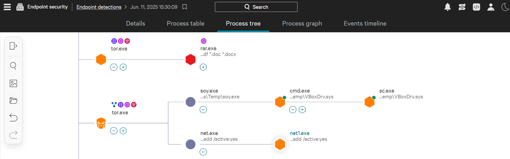
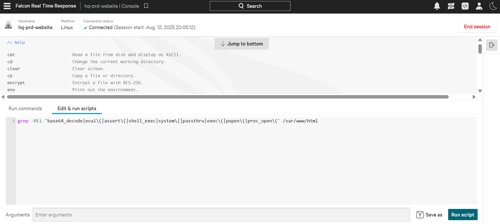
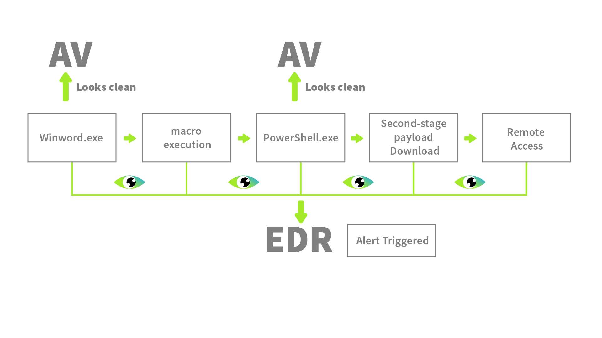
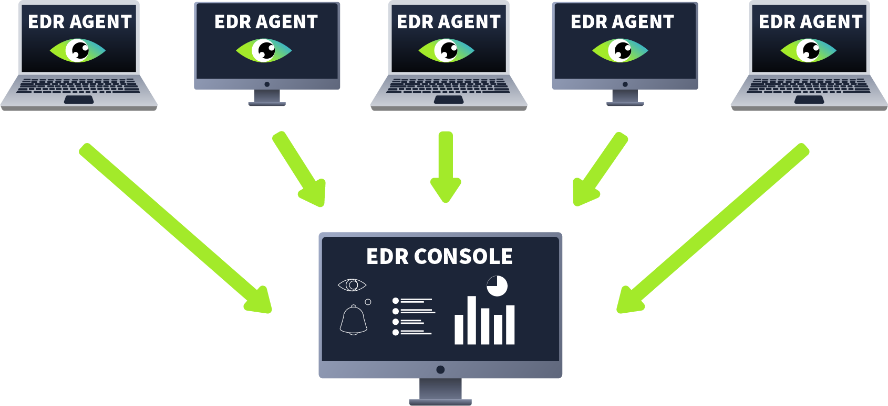
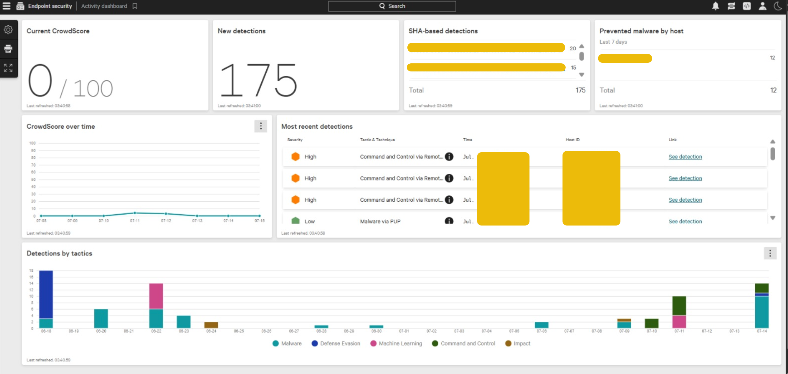

# Introduction to EDR

## What is EDR?

ensure endpoint devices are protected even out of the network
security solution that guards all devices in different areas and is capable of fighting advanced threats
Endpoint Detection and Response (EDR) is a security solution that offers deep-level protection for endpoints. No matter where the endpoints are

[CrowdStrike Falcon(opens in new tab)](https://safe.menlosecurity.com/doc/docview/viewer/docN2F36EEA69BD2c87c8bd17bf5cd76ba9a1fc0de173e8c460f2cc95226ca24946dba341404cf30)
[SentinelOne ActiveEDR(opens in new tab)](https://sentinelone.com/resources/datasheets/assets/usecase/sentinel-one-active-#page=1)
[Microsoft Defender for Endpoint(opens in new tab)](https://learn.microsoft.com/en-us/defender-endpoint/microsoft-defender-endpoint)
[OpenEDR(opens in new tab)](https://www.openedr.com/)
[Symantec EDR](https://safe.menlosecurity.com/doc/docview/viewer/docN38BD7B8D9AF5fd7803f47e7ecad6b1bde0ebd4f6051410f1c2108a31f36c6d5089898b795486)

### Visibility

Provides extensive visibility into endpoint activity, which is a key differentiator from other security solutions.
Collects a wide range of detailed data, including modifications to processes, registries, files, folders, and user actions.
Presents collected data in a structured format, enabling effective analysis.
Offers a graphical process tree that visualizes spawned processes and their relationships.
Allows analysts to inspect individual processes for associated activities, such as network connections and changes to registries and files.
Provides access to historical endpoint data for purposes like threat hunting.
Ensures that all detections are delivered with their full context.

### Detection

Employs both signature-based and behavior-based detection methods.
Utilizes machine learning to detect and flag deviations from baseline behavior, including unexpected user activities.
Detects fileless malware that resides only in memory.
Supports the use of custom Indicators of Compromise (IOCs) for tailored threat detection.
Features a dashboard that displays all detections across different endpoints.
Provides detailed information for each detection, including severity, time, hostname, username, and the triggering file.
Maps each detection to a tactic and technique, offering rich details for analysis.

### Response

Empowers analysts to take direct action on detected threats from a central console.
Enables the isolation of a compromised endpoint to prevent lateral movement.
Allows for the termination of malicious processes.
Provides the capability to quarantine suspicious files.
Allows analysts to connect remotely to a host to execute independent actions.

## Beyond the Antivirus

### Why do we need and EDR when we already have an Antivirus (AV) on the enpoints.

Both Antivirus (AV) and Endpoint Detection and Response (EDR) are designed to protect endpoints, but they differ in the level and method of protection.
Antivirus is analogous to an immigration check, using signature-based detection to match against a database of known threats and block them.
A primary limitation of AV is that it can be bypassed by new, advanced, or unknown threats that are not in its signature database.
EDR is like security officers inside the endpoint, continuously monitoring behaviors and activities for anything suspicious.
EDR can detect advanced threats that evade traditional AV by monitoring and recording endpoint behaviors, not just relying on pre-defined signatures.
EDR provides organization-wide visibility, allowing a threat detected on one endpoint to be investigated across all other endpoints.
EDR allows security personnel to take action based on monitored activities, such as isolating a host or terminating a process.

### Scenario Breakdown  

Step #1: A user receives a phishing email with a Word document embedded with a malicious macro (VBA script)
Step #2: The user downloads the document and opens it
Step #3: The malicious macro is silently executed, and it spawns PowerShell
Step #4: The malicious macro runs an obfuscated PowerShell command to download a sophisticated second-stage payload
Step #5: The payload is injected into a legitimate svchost.exe
Step #6: The attacker gains remote access to the system

| Attack Steps | Antivirus's Response | EDR's Response |
|---|---|---|
| **Step #1** (File Download) | Does nothing if the downloaded file has no previous signature in the database | Logs the file download activity and monitors it |
| **Step #2** (Document Opening) | Does nothing upon the opening of the document since winword.exe is a legitimate utility | Records the execution of winword.exe and keeps monitoring |
| **Step #3** (Macro Execution) | Does nothing if the executed macro has no previous signature | Detects and flags the macro execution due to the unusual parent-child relationship of winword.exe and .exe processes |
| **Step #4** (Obfuscated Script) | Typically, AVs will not detect obfuscated scripts | Flags the obfuscated script execution |
| **Step #5** (Process Injection) | Will not flag malicious injection into svchost.exe since it does not monitor the memory injections | Detects Process Injection in svchost.exe |
| **Step #6** (Outbound Connection) | Lacks Network Level Visibility | Flags the unexpected behaviour of svchost.exe, making an outbound connection |
| **Final Action** | May be marked as clean | Generates an alert with the full attack chain and enables the analyst to take actions from within the console |

## How EDR Works

### Agents

Endpoint Detection and Response (EDR) systems use a centralized console to manage multiple endpoints.
Agents, also called sensors, are deployed on these endpoints to monitor all activities.
These agents send detailed activity data to the central console in real time.
Agents can perform some local signature-based and behavior-based detections and send alerts to the console.

### EDR Console

The central console correlates and analyzes the detailed data sent by endpoint agents.
This analysis uses complex logic, machine learning algorithms, and threat intelligence to connect activities and identify threats.
A detected threat generates an alert.
A dashboard provides a comprehensive overview of the current detection status across all monitored endpoints.

### After Detection

Analysts are responsible for acknowledging and prioritizing incoming alerts.
The EDR system assists prioritization by assigning severity levels (e.g., Critical, High, Medium) to each alert.
Analysts investigate high-severity alerts first by clicking on them to view detailed information, including executed files, processes, network connections, and registry modifications.
Using their expertise and the provided data, analysts determine if an alert is a true positive or a false positive.
If the alert is a true positive, the analyst can take response actions directly from the console.

### EDR with other tools

*   While an EDR provides substantial endpoint protection, it is part of a larger security ecosystem.
*   This ecosystem includes other security solutions like Firewalls, Data Loss Prevention (DLP), Email Security Gateways, and Identity and Access Management (IAM).
*   To maximize efficiency, these security solutions are integrated with a central solution.
*   This central solution becomes the primary point of investigation for analysts.

## EDR Telemetry

### Telemetry Definition

Telemetry is the detailed data collected by EDR agents from endpoints, serving as a "black box" for detection and investigation.

### Types of Collected Telemetry

Process Activity: Tracks process executions and terminations to identify suspicious parent-child relationships and malware payloads.

Network Connections: Monitors all network activity to detect connections to malicious servers, unusual port usage, data exfiltration, or lateral movement.

Command Line Activity: Captures executed commands to identify malicious scripts often missed by traditional antivirus.

File and Folder Modifications: Tracks changes to files and folders, which can indicate ransomware or data staging.

Registry Modifications: Monitors changes to the Windows registry, a common target during malicious attacks.

### Purpose and Value

Extensive telemetry helps an EDR differentiate between legitimate and malicious activities, even when attackers use legitimate system utilities.

It enables analysts to understand the full attack chain, identify the root cause, and reconstruct the incident timeline.

## Detection and Response Capabilities

Here is a summary of the text in markdown format:

### Detection Techniques

EDR systems use several advanced techniques to analyze telemetry data from endpoints:

*   **Behavioral Detection:** Observes the actions of files and processes rather than relying solely on signatures. It flags unusual behavior, such as a word processor spawning an executable.
*   **Anomaly Detection:** Establishes a baseline of normal endpoint activity and flags any deviations. This can identify unusual actions like a process modifying an auto-start registry key.
*   **IOC Matching:** Compares endpoint activity against threat intelligence feeds to identify known Indicators of Compromise (IOCs), such as malicious file hashes.
*   **ATT&CK® Mapping:** Maps detected malicious activities to specific tactics and techniques in the MITRE ATT&CK® framework, providing context for analysts.
*   **Machine Learning:** Uses algorithms trained on large datasets to detect complex attack patterns, such as fileless malware and multi-stage intrusions, that might otherwise appear as a series of harmless individual actions.

### Response Mechanisms

Once a threat is detected, an EDR provides both automated and manual response options:

*   **Isolate Host:** Disconnects a compromised endpoint from the network to contain the threat and prevent lateral movement.
*   **Terminate Process:** Allows an analyst to stop a specific malicious process without taking the entire host offline, which is useful for critical systems.
*   **Quarantine:** Moves a malicious file to an isolated location, preventing its execution and allowing for further analysis.
*   **Remote Access:** Provides a remote shell to the endpoint, enabling analysts to perform deeper investigations, run custom scripts, and take actions not available in the standard EDR console.

*   **Artifacts Collection:** Enables analysts to remotely extract data like memory dumps, event logs, and registry hives for detailed forensic investigation.

