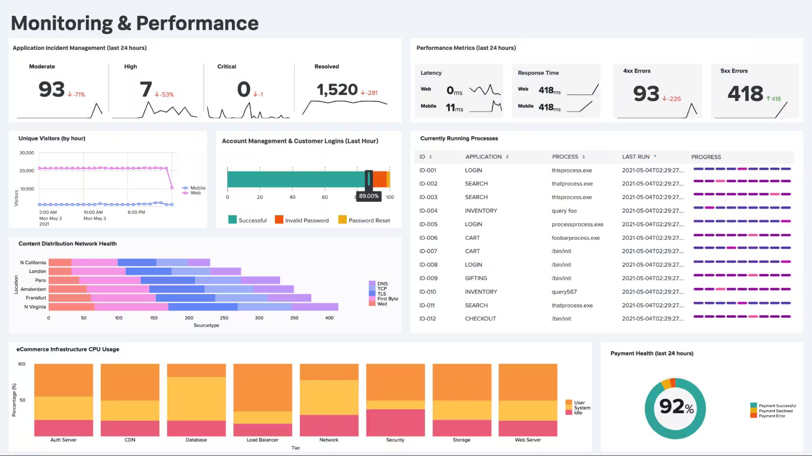

# Intro to Log Analysis

## Log Analysis Basics


### Importance of Logs

**System Troubleshooting:** Analyzing system errors and warning logs helps IT teams understand and quickly respond to system failures, minimizing downtime, and improving overall system reliability.  
**Cyber Security Incidents:** In the security context, logs are crucial in detecting and responding to security incidents.  
logs, intrusion detection system () logs, and system authentication logs, for example, contain vital information about potential threats and suspicious activities. Performing log analysis helps
teams and Security Analysts identify and quickly respond to unauthorized access attempts, malware, data breaches, and other malicious activities.  
**Threat Hunting:** On the proactive side, cyber security teams can use collected logs to actively search for advanced threats that may have evaded traditional security measures. Security Analysts and Threat Hunters can analyze logs to look for unusual patterns, anomalies, and indicators of compromise (IOCs) that might indicate the presence of a threat actor.  
**Compliance:** Organizations must often maintain detailed records of their system's activities for regulatory and compliance purposes. Regular log analysis ensures that organizations can provide accurate reports and demonstrate compliance with regulations such as GDPR, HIPAA, or PCI DSS.  

### Types of Logs  

**Application Logs:** Messages from specific applications, providing insights into their status, errors, warnings, and other operational details.  
**Audit Logs:** Events, actions, and changes occurring within a system or application, providing a history of user activities and system behavior.  
**Seurity Logs:** Security-related events like logins, permission alterations, activities, and other actions impacting system security.  
**Server Logs:** System logs, event logs, error logs, and access logs, each offering distinct information about server operations.  
**System Logs:** Kernel activities, system errors, boot sequences, and hardware status, aiding in diagnosing system issues.  
**Network Logs:** Communication and activity within a network, capturing information about events, connections, and data transfers.  
**Database Logs:** Activities within a database system, such as queries performed, actions, and updates.  
**Web Server Logs:** Requests processed by web servers, including URLs, source IP addresses, request types, response codes, and more.  

## Investigation Theory

### Timeline

Understanding the sequence of events WITHING systems, devices, and applications  
chronological representation of logged events, ordered based on their occurrence  
crucial role in reconstructing securiyt incidents  

### Timestamp

Understanding and evaluating each log's timestamp, time zone, and format
Need to convert (normalize) timestampts to a consistent time zone

### Super Timelines

consoidated timeline that provides comprehensivie view of events across different systems ,devices, and applciations, and across types of logs
allows understanding of event sequency holistically  

**[Plaso](https://github.com/log2timeline/plaso):** ***super timeline all the things***, is a Python-based engine used by several tools for automatic creation of timelines. Plaso default behavior is to create super timelines but it also supports creating more targeted timelines.

### Data Visualization

Kibana and SPlunk  
converts raw log data into interactive visual represenatasions  



### Log Monitoring and Alerting

allow teams to proactivly identify threats and immediately respond when an alert is generated.  

### External Research and Threat Intel  

Threat intelligence feeds like [ThreatFox](https://threatfox.abuse.ch/), allow searching log files for known malicious actors' presence.

## Detection Engineering

### Common Log File Locations

```markdown

    Web Servers:
        Nginx:
            Access Logs: `/var/log/nginx/access.log`
            Error Logs: `/var/log/nginx/error.log`
        Apache:
            Access Logs: `/var/log/apache2/access.log`
            Error Logs: `/var/log/apache2/error.log`

    Databases:
        MySQL:
            Error Logs: `/var/log/mysql/error.log`
        PostgreSQL:
            Error and Activity Logs: `/var/log/postgresql/postgresql-{version}-main.log`

    Web Applications:
        PHP:
            Error Logs: `/var/log/php/error.log`

    Operating Systems:
        Linux:
            General System Logs: `/var/log/syslog`
            Authentication Logs: `/var/log/auth.log`

    Firewalls and IDS/IPS:
        iptables:
            Firewall Logs: `/var/log/iptables.log`
        Snort:
            Snort Logs: `/var/log/snort/`
```

### Common Patterns

identifiable artifacts left behind in logs by threat actors or cyber security incidents.  
 
#### Abnormal User Behavior

actions or activities conducted by users that deviate from their typical or expected behavior.  

Organizations employ log analysis solutions that incorporate detection engines and machine learning algorithms to establish normal behavior patterns. Deviations from these patterns or baselines can then be alerted as potential security incidents.  

[Splunk User Behavior Analytics (UBA)](https://www.splunk.com/en_us/products/user-and-entity-behavior-analytics.html)  
[IBM QRadar UBA](https://www.ibm.com/docs/en/qradar-common?topic=app-qradar-user-behavior-analytics)  
[Azure AD Identity Protection](https://learn.microsoft.com/en-us/entra/id-protection/overview-identity-protection)  

Multiple failed login attempts  
Unusual login times  
Geographic anomalies  
Frequent password changes  
Unusual user-agent strings  

### Common Attack Signatures  

Identifying common attack signatures in log data is an effective way to detect and quickly respond to threats. Attack signatures contain specific patterns or characteristics left behind by threat actors. They can include malware infections, web-based attacks (SQL injection, cross-site scripting, directory traversal), and more.  

#### SQL Injections

SQL injection attempts to exploit vulnerabilities in web applications that interact with databases. Look for unusual or malformed SQL queries in the application or database logs to identify common SQL injection attack patterns.

Suspicious SQL queries might contain unexpected characters, such as single quotes ('), comments (--, #), union statements (UNION), or time-based attacks (WAITFOR DELAY, SLEEP()). A useful SQLi payload list to reference can be found here (opens in new tab).

In the below example, an SQL injection attempt can be identified by the ' UNION SELECT section of the q= query parameter. The attacker appears to have escaped the SQL query with the single quote and injected a union select statement to retrieve information from the users table in the database. Often, this payload may be URL-encoded, requiring an additional processing step to identify it efficiently.

#### Cross-Site Scripting (XSS)

#### Path Traversal


## Automated vs. Manual Analysis

## Log Analysis Tools: Command Line

## Log Analysis tools: Regular Expressions

## Log Analysis Tools: Cyber Chef

## Log Anlaysis Tools: Yara and Sigma
