# Investigating The Windows Operating System  
A windows machine has been hacked, its your job to go investigate this windows machine and find clues to what the hacker might have done.

This room is great because you can explore different ways to accomplish a task.
this room is not so great because it relies on local functions, which are quickly dying.

## Whats the version and year of the windows machine?

### GUI

Systme information is quickly and easily available through the properties window of "This PC'.  
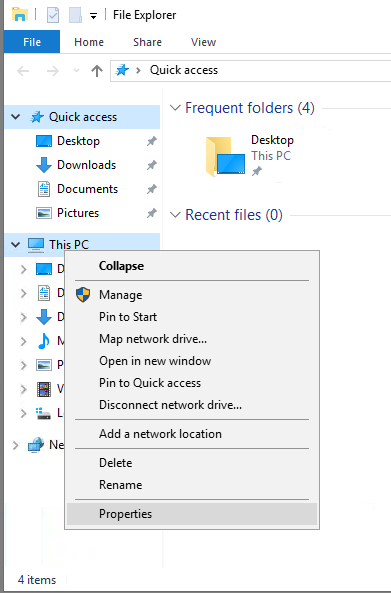  
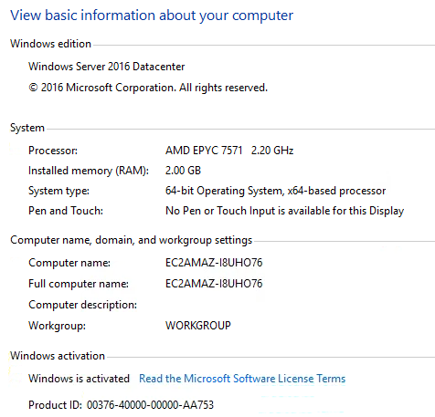  

### Powershell

A basic powershell query reveals significant information. A visual search can reveal the information.  
`:> Get-ComputerInfo`  
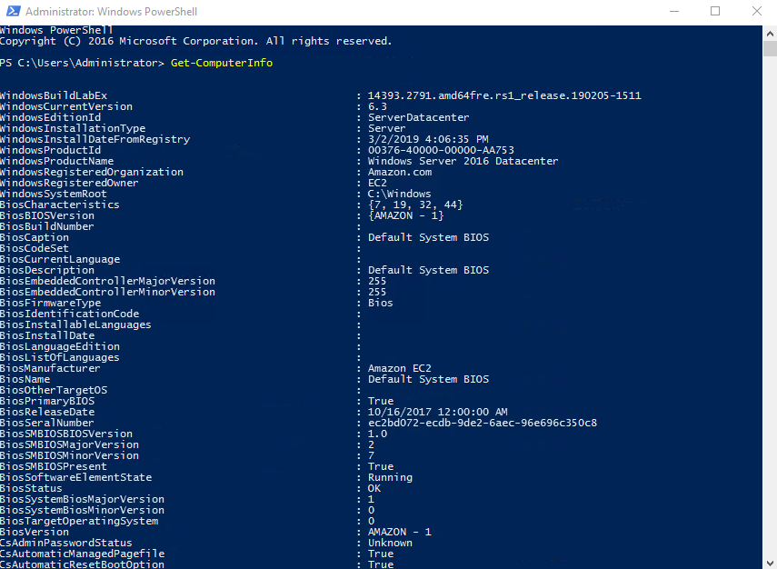  
  
Users can add "Select-Object" and the name of the field to quickly refine the search to something more useful.  
`:> Get-ComputerInfo | Select-Object WindowsProductName` 
  
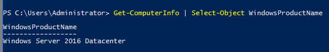  
  
## Which user logged in last?

### GUI

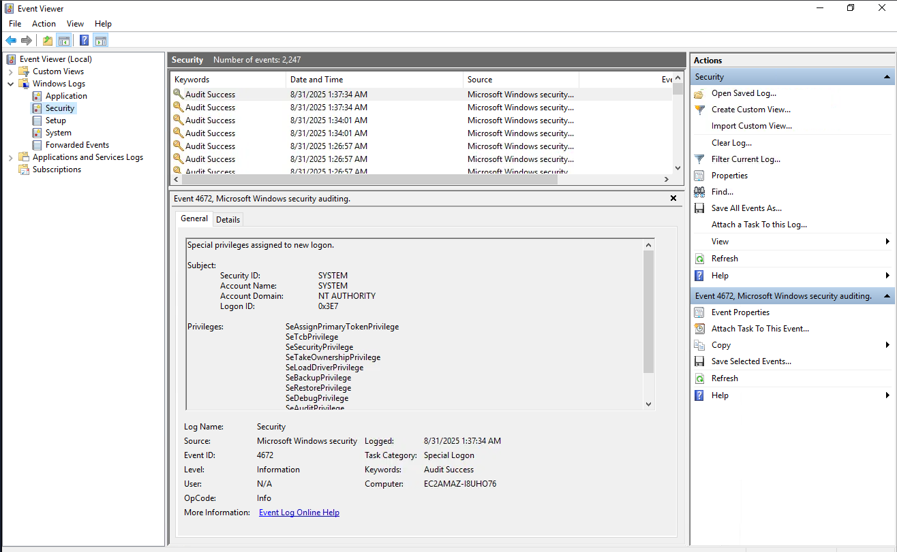
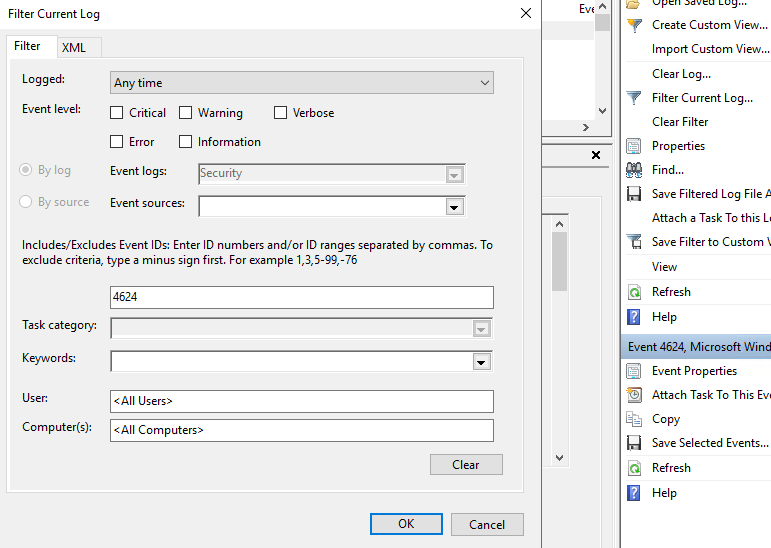
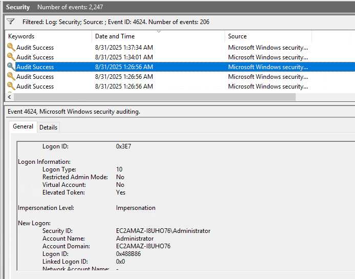

### Powershell

`Get-LocalUser | Where-Object { $_.LastLogon -ne $null} | Select-Object Name, LastLogon`
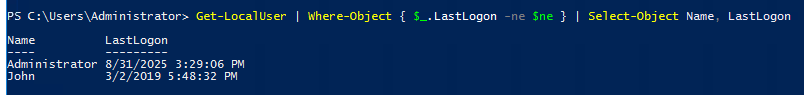

## When did John log onto the system last?

### GUI

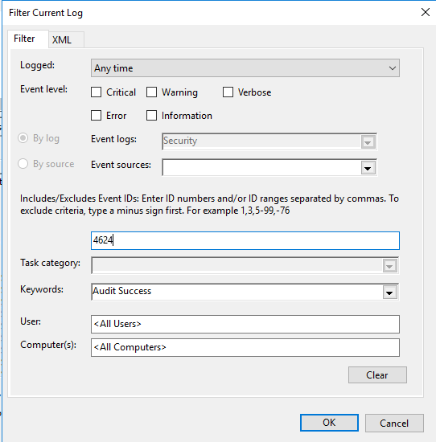
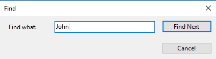
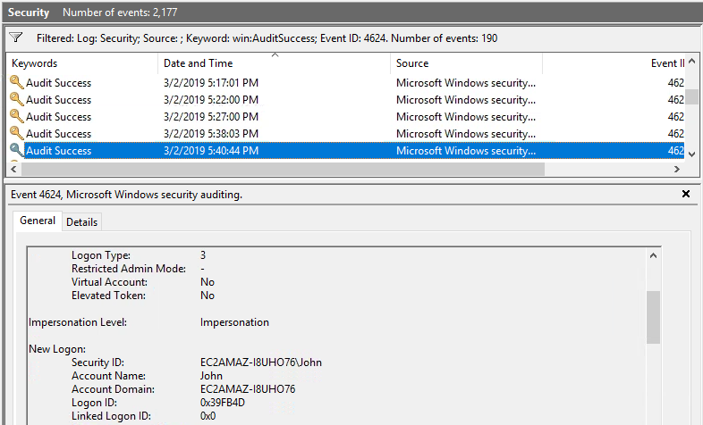
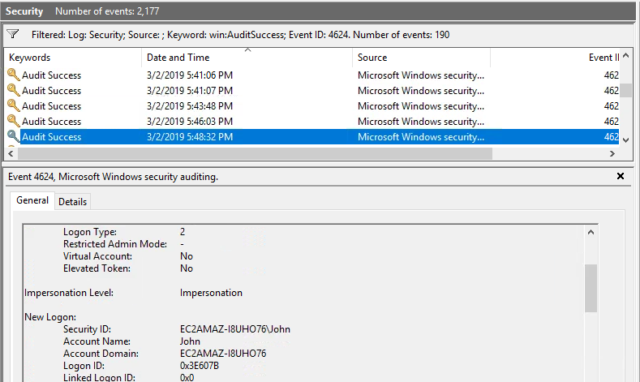

### Powershell

`Get-LocalUser | Where-Object { $_.LastLogon -ne $null} | Select-Object Name, LastLogon`

### Answer format: MM/DD/YYYY H:MM:SS AM/PM

## What IP does the system connect to when it first starts?

## What two accounts had administrative privileges (other than the Administrator user)?

## Whats the name of the scheduled task that is malicous.

## What file was the task trying to run daily?

## What port did this file listen locally for?

## When did Jenny last logon?

## At what date did the compromise take place?

### Answer format: MM/DD/YYYY

## During the compromise, at what time did Windows first assign special privileges to a new logon?

### Answer format: MM/DD/YYYY HH:MM:SS AM/PM*

## What tool was used to get Windows passwords?

## What was the attackers external control and command servers IP?

## What was the extension name of the shell uploaded via the servers website?

## What was the last port the attacker opened?

## Check for DNS poisoning, what site was targeted?
