# Investigating The Windows Operating System  
A windows machine has been hacked, its your job to go investigate this windows machine and find clues to what the hacker might have done.

This room is great because you can explore different ways to accomplish a task.
this room is not so great because it relies on local functions, which are quickly dying.

## 1. Whats the version and year of the windows machine?

### GUI

  System information is quickly and easily available through the properties window of "This PC'.  
  
    
    

### Powershell

  A basic powershell query reveals significant information. A visual search can reveal the information.  
  `:> Get-ComputerInfo`  
    
  
  Users can add "Select-Object" and the name of the field to quickly refine the search to something more useful.  
  
  `:> Get-ComputerInfo | Select-Object WindowsProductName` 
  
    
  
## 2. Which user logged in last?

  ### GUI

  Remaining in the EventViewer Security logs..  
  
    

  Filter for event ID 4624, which is a successful login as well as the "Audit Success" Keyword.  
  
  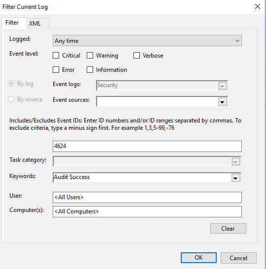
  
  There is some manual searching involved. Note the third item in the list has an Account Name as well as a Logon Type of "10". This type of logon is "RemoteInteractive". This indicates that some protocol such as RDP or powershell has been used.  
  
  

  ### Powershell

  `:> Get-LocalUser | Where-Object { $_.LastLogon -ne $null} | Select-Object Name, LastLogon`
  
  

## 3. When did John log onto the system last?

  ### GUI

  Keep filters for the Security log as they were for the prvious question.  
    
  
  Since there is a request for a specific name, it is possible to use the "Find..." button to search for "John".  
  
    
  
  The question asks for the last (or latest) logon which indicates more than one logon and the "Find Next" button will help identify the latest logon.  
    
  
  ### Powershell

  Conversely, the powershell query in the previous question already answered this query.  
  
  `:> Get-LocalUser | Where-Object { $_.LastLogon -ne $null} | Select-Object Name, LastLogon`  
    

  ### NET Commands

  Finally, there is a third method by which the information may be revealed
  
  `:> net user John`  
  
  The "net user' command allows administrators to add, modify, and delete user accounts in addition to displaying detailed information.  
  
  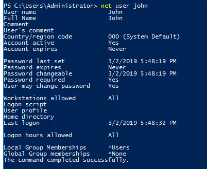

## 4. What IP does the system connect to when it first starts?
  
  If we assume the first IP address will be contacted during the startup, the System Information > Startup Programs panel is the likely source of information. In this case, the writer of the challenge provided a script that reaches out to the IP address relevant to the answer.  
  
  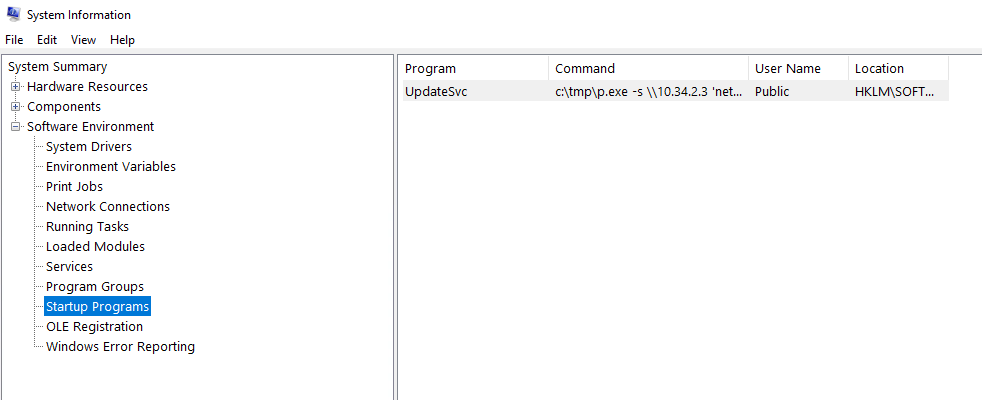

## 5. What two accounts had administrative privileges (other than the Administrator user)?
  
  The first question asked must be, "What accounts are there?"  
  For this use `:> net user`  
  
  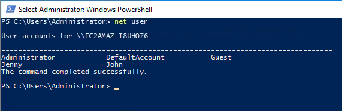  
  
  As done prevously, quickly check the groups to which accounts are assigned.
  
  First, `:> net user Guest`  
  
  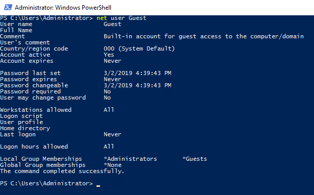  
  
  An attacker has attempted to obfuscate malicious activities by adding a built-in account to the administrator group.  

  Second, `:> net user Jenny`
  
  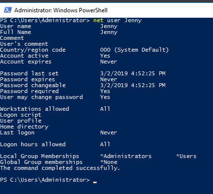  

## 6. Whats the name of the scheduled task that is malicous.
  
  Assume there is a powershell method for listing schedule tasks and their commands.  
  
  First is to request powershell help: `:> Get-Command *-*scheduled*`  
  
  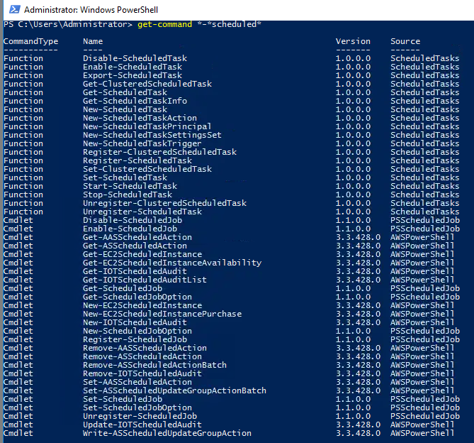  
  
  There are two possibilities: Get-ScheduledTask and Get-ScheduledTaskinfo. The second command most likely requires a parameter specifying the name of the task. Get-ScheduledTask is the most likely best choice.  
  
  Second, Get a list of scheduled tasks. Each schedule tasks has multiple possible States denoting is ability / readiness to run. Filter the list of tasks "Ready" to run.  
  
  `:> Get-ScheduleTask | Where-Object { $_.Status -eq 'Ready'}`

  Most schedule tasks are inside the OS area. Only a few are in the root area  
  
  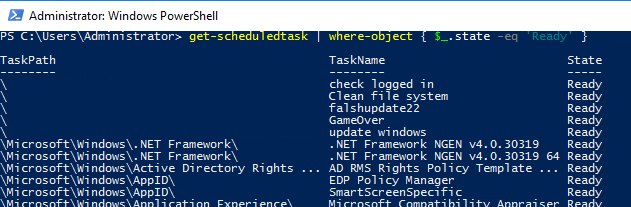  
  
  `:> Get-ScheduleTask | Where-Object { $_.Status -eq 'Ready' -and $_.TaskPath -eq '\' }`
  
  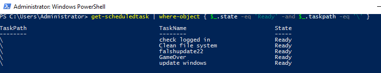  
  
  Determing which has potential for malicous activity requires seeing the task's "Actions". Extending the current query doesn't actually work.  
  
  `:> Get-ScheduleTask | Where-Object { $_.Status -eq 'Ready' -and $_.TaskPath -eq '\' } | Select-Object TaskName, Actions`  
  
  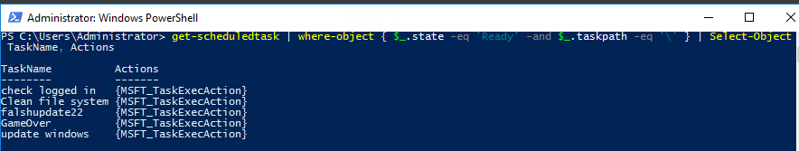
  
  There is another method to extract more specific detials. This includes listing the actions specifically  
  
  `:> (Get-ScheduleTask | Where-Object { $_.Status -eq 'Ready' -and $_.TaskPath -eq '\' }.actions` 
  
  This shows a particular command which sets up a shell and is likely the most malicious of activities. There are certainly simpler ways of reviewing this information in the GUI, but powershell is the most powerfull of Windows security tools. There are certainly even better Powershell commands for querying such information, but that is not introductory information. It can be found using your favorite LLM.

  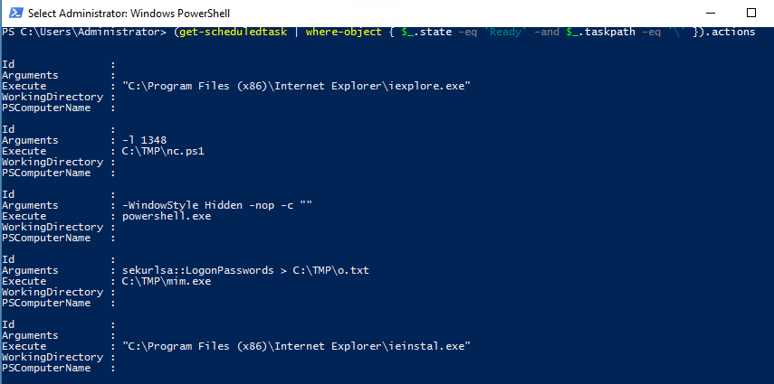  

## 7. What file was the task trying to run daily?
  
  Just answered..  
    

## 8. What port did this file listen locally for?

  Just answered..  
    

## 9. When did Jenny last logon?
  

## 10. At what date did the compromise take place?

## 11. During the compromise, at what time did Windows first assign special privileges to a new logon?

## 12. What tool was used to get Windows passwords?

## 13. What was the attackers external control and command servers IP?

## 14. What was the extension name of the shell uploaded via the servers website?

## 15. What was the last port the attacker opened?

## 16. Check for DNS poisoning, what site was targeted?
