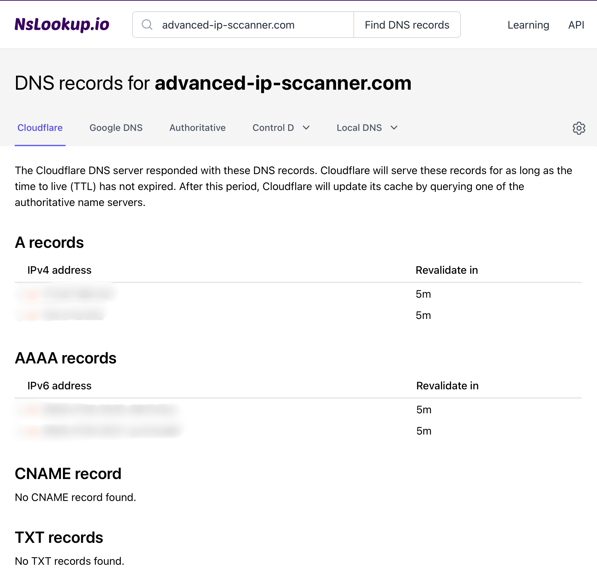
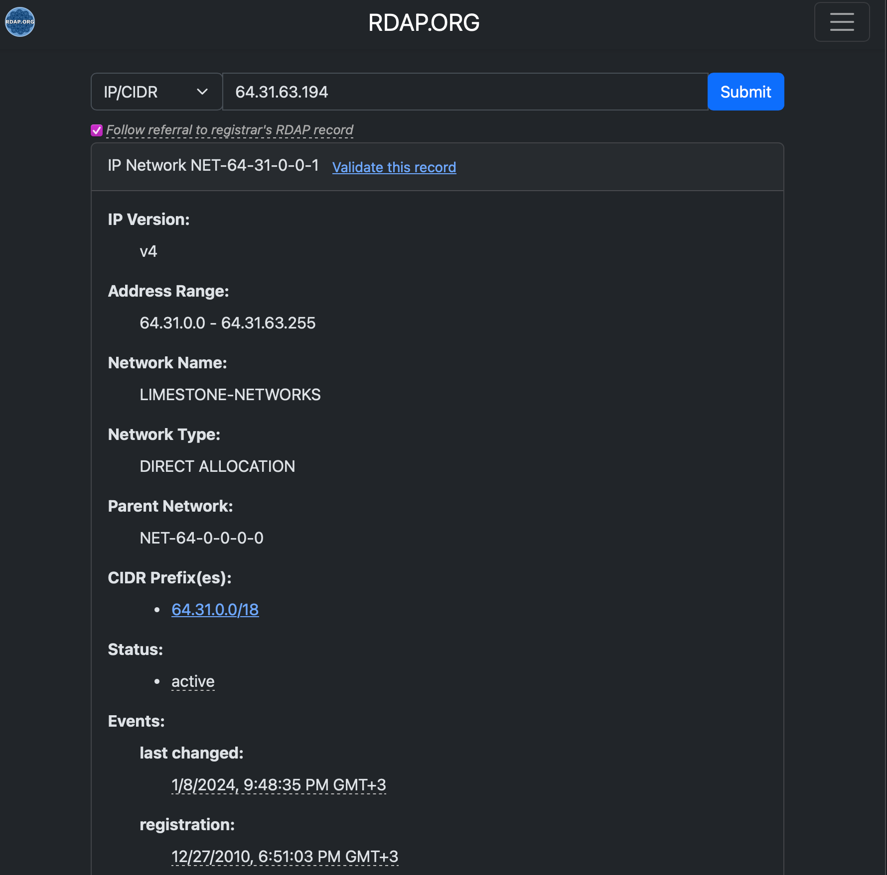
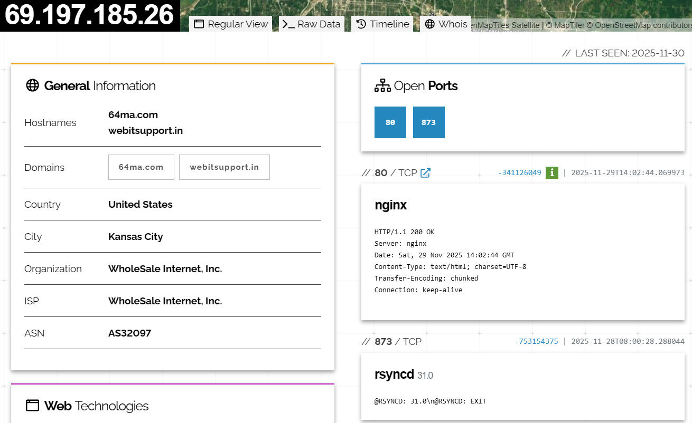
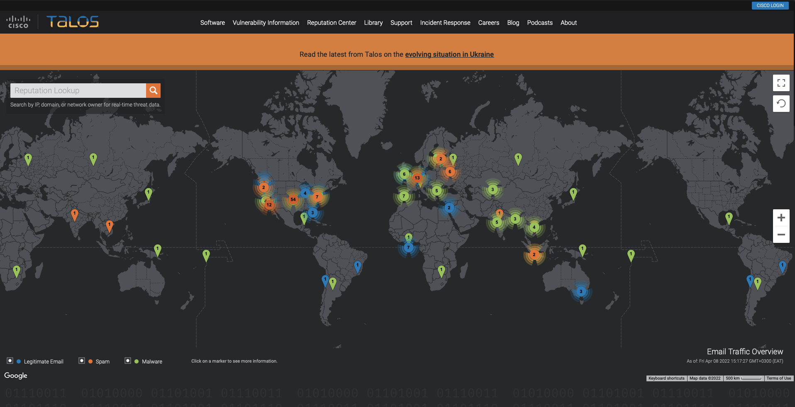
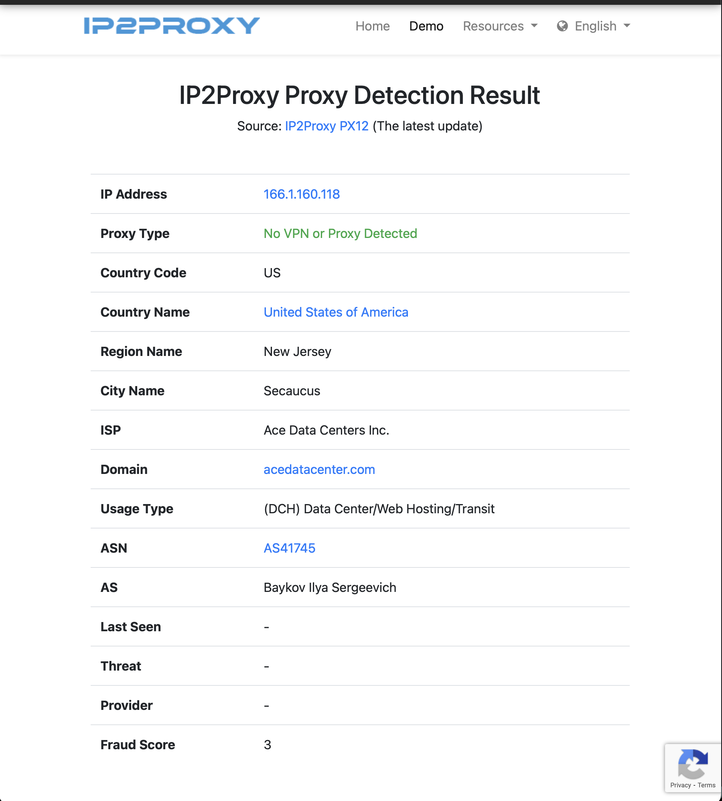

# IP and Domain Threat Intel

## Introduction

### Learning Objectives

- Understand IP a nd domain threat inteelligence for a SOC
- Gelocate IPs and interprete their Autonomous System Numbers (ASNs)
- Detect red-flag infrastructure via Shodan/Censys service banners
- Assess reputation with tools
- Enrich domains with WHOIS age, DNS records, and certificate transparnecy

### Scenario

Two suspicous domains in phishing emailss and three IP addresses in outbound proxy logs.  
Task: Triage all seven artifacts, enrich availabe information, recommend actions with expir

- advanced-ip-sccanner[.]com
- 166[.]1[.]160[.]118
- 64[.]31[.]63[.]194
- 69[.]197[.]185[.]26
- 85[.]188[.]1[.]133

## IP Building Blocks

### Why DNS matters in the SOC

DNS is the mecahnism that convertss human-friendly names into IP addresses machines can understand.  
DNS is the central 'playground' for attackers  

DNS is a rich early-warning dataset
- suspicious domains appear in alets before a plyload hash is known
- adversaries rapidly register, configure, and abandon domains to stay ahead of defences.

Analysis turn raw domain into contextual arifact
- who owns it
- What IP addres does a domain resolve to
- How often does the IP change?
- Does the IP behave more lik a normal content delivery network (CDN) or a throwaway setup  

#### Core DNS Records for Triage

##### A/AAAA Records

Maps the domain to IPv4 (A) and IPv6(AAAA) addresses  
several records that hop between different networks indicate suspiscious rapid rotation  
In  practice, coyt A record from [nslookup.io](https://www.nslookup.io/) or [dnschecker.org](https://dnschecker.org/) and follow with pasting teh IP into VirusTotal for triage

##### NS Records

Identifies nameservers controlling the domain  
Unusual or recently change NS entries can mark fresh setup.  
L1 analysis must note the provider name rather than chasing low-level details  

##### MX Records

Defines which servers handle email.  
Attacks configure MX records to deliver phishing campaigns  directly  
If the alert relates to web browsing, record whether MX eists  

##### TXT Records

Store SPF and DKIM rules or verification tags  
Poorly configured or absent SPF increases mail risk.  

##### Start of Authroity (SOA) Record

Points to the zone's primary authority  
may include contact information  
Worth noting the primary host and serial, which supports basic ownership picture  

##### Time to Live (TTL)

Tlls resolvers the length of time answers should be cached.  
Very low TTLs point to frequent chagnes and should be treated as clues  

### Scenario SOC Use Cases

The SIEM raises and alert pointing to the domain advanced-ip-sccanner[.]com  

  

### Attack Technique Using DNS

#### Fast Flux Hosting

Adversaries rotate many IP addresses quicly with short cache times  
often changes providers  
avoids simple blocks  
analysts record and escalate when identified

#### CDN Abuse

Legitimate CDNs (cloudflare, adamai) change IP addresses wtihin their ASN ecosystem.
If an A/AAAA records points to major CDN and other values are normal, not and carry repuration and ownership checks  

#### Typosquatting

malicious domains clone known brands, with minor typing differences  
escalated as high risk

#### IDN (Internationized Domain Name)  

Malicious domains use Unicode to create look-alike domains.  
[Decode Punycode](https://dnschecker.org/idn-punycode-converter.php) and compare to known brands using online decode.  

### Soc Analyst Workflow  

#### 1. Snapshot Current DNS

- capture A, NS, MX, TXT, SOA, and TTL values from the domain using a single page view

#### 2. Basic Ownership Check

Use WHOIS to note registratn, creation date, and contact pattern  

#### 3. Interpret Patterns

Assess whether the DNS behavior aligns with benigh CDN activity or indicates malicious throwaway domain  
note the details of changing IPs

#### 4. Log Evidence

Save screenshots or JSON extracts  
Save DNS and reputation pages to case file for audit and escalation

#### 5. Recommend Action

Advise blocking, if high risk  
monitor if suspicious but inconclusive 
close an alert if its benign

### IP Building Block Questions

From the [downloadable report](assets/ip-domain-intel-task2.pdf), what are the IP addresses for the A Record associated with our flagged domain, advanced-ip-sccanner[.]com? Answer: IP-1, IP-2.

What nameserver addresses are associated with the IP address? Defang the addresses.

## IP Enrichment: Geolocation and ASN

### Enrichment: 

adding ownership, ASN, geolocation, and service context to an IP;  
enables evidence-base decision-makin

### Registration Data Access Protocol (RDAP)

Authoritative source for IP ownership  
data is maintain by regional internet registries (RIR)
 - RIPE NCC
 - ARIN
 - APNIC

**NetRange**: range of addresses delegated to the owner  
**Organization**: Registered holder (e.g. AWS, Vodaphon, TryHackMe)  
**Remarks**: whether the blocks is used for hosting, broadband, or mobile  
**Abuse Contact**: offical mailbox ofr incident reporting  

#### Preserving RDAP evidence

pivoting to domain or certificat informtion to narrow scope of incident  

preserve RDAP information in the raw RDAP JSON to prevent potential reliance on secondary sources  

### Scenario RDAP Details  

  

### Autonomous Systems

collection of IP prefixes under a sginle organization's control  
Each AS is assigned a unique 16 or 32 bit ASN, required only for external communications
Knowing the ASN helps assess the liekly rol of an IP  

**Hosting ASN:** many small netbloxk with diverse tenants; suspicious domains are requently hsoted in hosting ASN  
**Residentail ISPs:** huge ranges that ocver millions of users; alert may indicate compromised home routers or consumer devices.  
**Cloud/CDN ASN:** Global anycast; dozens of prefixes; shared edges; Blocking entire ranges causes collateral damage  

### Heuristics of ASN Classification

**AS32934 - Facebook/Meta"** social media infrastructure; malicious use may likely indicate an accout issue rather than malicious hosting  

**AS16509 - Amazon/AWS:** Massive cloud space; attackers use use for short-lived servers; blockng the entire ASN is catastrophic, so limit scope to FQDN or narrow to the CIDR  

**AS124888 - Vodaphone:** an ISP; malicious activity would likely come from compromised customer device

### Geolocaiton: Value and Limitations

Sources of Gelocation include [ipinfo.io](https://app.cyberpeace.global/chapter/66fe4b4f6ae7499887d5e83c) and [iplocation.net](https://www.iplocation.net/)  

- **country missmatches:** common; CDN and clud provider register ranges in one controu but host edges globally
- **City-level Accuracy:** unreliable; never justify a block based on a city  
- **jurisdiction:** matters in legal escalations; legal teams can pursue takdow requests via the abuse contact; requries the host location to be cooperative and friently

**Best Practice** - record the coutnry reported by at least two sources and note discrepancies; this information is a hint, not a fact  

### SOC Analyst Workflow for IP Enrichment  

- **RDAP:** confirm netrange, org, ASN, and abuse contacts  
- **ASN Context** : enrich with [bgp.tools](https://bgp.tools/) or ipinfo.io for ASN details and role  
- **Geolocation:** Capture coutnry from at least two soruces; record mismatches  
- **rDNS Patterns:** Reverse DNS can hint at hostyping typ; decisions cannot be based solely on rDNS  
- **Internal Logs:** Hs the IP appeared in the last 30 days? What was the context, if so?  
- **Classify Roles:**  Hosting, residential, CDN, cloud? Record the reasoning  
- **Plan Outreach:** if confirmed as malicious and in a cooperateive ASN, prepare a report for the abuse contact

### Enrichment Questions

#### Open client.rdap.org (opens in new tab) and identify when the 64[.]31[.]63[.]194 IP was logged for registration.
##### Answer in UTC: MM/DD/YYYY, H:MM:SS AM/PM  

Remember to convert.  

#### What roles are assigned to the entity Entity NOC2791-ARIN associated with the IP address?
##### Note: Answer via comma, in alphabetical order.  

#### What is the country's name for the same IP address (64[.]31[.]63[.]194)?   

ipinfo.io

Can you identify the Autonomous System linked with the same IP address?   

ipinfo.io

## Service Exposures

Exposed services reval potential balst radius.

### Shodan Reconnnaissance

Shodan: indexes intenet-connected devices and services; details information about open ports, running services, and system configuratins.; can real all system associated with speific domains; can reveal all vulnerable system associated with a particualr software version  

Searching  69[.]197[.]185[.]26  

  

Open ports and service banners become threat intelligence  

### TLS Certificate Transparency

Investigating TLS certifcates at [crt.sh](https://crt.sh/)  

- **Issuer:** who signed the certificate; self-signed certificates signal a hastily deployed (vulnerable) system  
- **Validity Period:** Short lived certificates  are for normal usage; bursts of reissued certifricates may indicate malicious behavior (e.g. phishing)  
- **Subject Alternative Name:** details on domains covered by the certificate.

### Censys Search

[Censys.io](https://search.censys.io/)  alternative to Shodan  
shows exposed services on standard and non-standard ports.  
provides some advanced search capabilities  

### Service Exposure Workflow For SOC Analysts  

- **Check Shodan/Censys banners:**  Identify exposted services and possible misconfigurations
- **Review TLS Certificates:**  record issues, SANs, and validity period
- **Loook for anomalies:**  Instances of multiple SANs, brand look-alikes, or suddent bursts of issueance
- **Pivot:**  use certificate and banner artifacts ot uncover related infrastructure
- **Assess  blast radious:**  
  - RDP/SSH on residental ASN shows likelihood of compromised endpoints
  - TLS with manu unrelated SANs on CDN ASN indicate shared infrastructure, avoid IP block
  - Self-signed TLS on small rnages indicates attacker panels and/or proxies

### Service Exposure Questions   

#### Using shodan.io (opens in new tab), what is the first exposed service name of the 85[.]188[.]1[.]133 IP?

Note: If the information in Shodan has been changed, please check out the hint.  

Hint: must know ports, not just read.

#### How many ports have been identified as open on the server from Question 1?

Note: If the information in Shodan has been changed, please check out the hint.

#### Using search.censys.io (opens in new tab), what is the TLS certificate fingerprint for the IP address?

Note: If the information in Censys has been changed, please check out the hint.

#### According to crt.sh (opens in new tab), what is the Subject's commonName of the identified TLS certificate?

Note: Search for the TLS fingerprint you identified in Question 3.

## Reputation Checks and Passive DNS

Identify what the infrastructure has been doing over time.  
IP addresses may be reassigned and float between malicious nad non-malicious activities.

### Reputation Services 

#### Cisco Talos 

Cisco Talos Intelligence provides updated web and email reputation scores and category labels  
default dashboard provides overview of internation eamil traffic.  
- inidicators of legitimate/spam/malware email  
- adds to information gained about IP and hostname addresses, daily volume, and type.  

**Vulnerability Information:** 
- disclosure and zero-day vulnerability reports; CVE numbers; CVSS
- reports include vulnerabilite details

**Reputation Center:**
- searchable threat data related ti OPs and files (using SHA256)
- additional email and spam data tabs

#### IP2Proxy

labels VPN, proxy, and Tor exit nodes.  

  

### Passive DNS

adds time context to domain enrochment  
provides histoircal record of how domains resolved over time

**First Seen/Last Seen** : reveal of the domain is new or long-lived  
**Number of IPs in a Time Window**  high churn over days would suggest flux or agile hosting  
**ASN Spread**: suspicous IPs often belong to unrelated ASNs; IPs limtied to one ASN are stable or might be a CDN 
**Certificat Transparency Logs**:  certificate issuance history; useful for detecting sudden bursts of domains registerd under phishing themes
**Wayback Machine**:  historical website conten; long-lived blog hosting  that suddently switches to phishing kit is high risk  

### SOC Workflow for Reputations

**Check VirusTotal**:  Record detection ratio, first seen, last seen, community notes
**Check Cisco Talos**:  record reputation score and category, not changes in last 30 days
**Check IP2Proxy**:  Flag IPs used as VPN/proxy/Tor, adjust severity accordingly
**Check Passive DNS**:  Record first and last seen, number of IPs in last 7 days, and ASN Spread
**Check Certificate Transparency Logs**:  not certifcate bursts and suspicioius SANs
**Cross-REference with Wiayback**:  Idnetify content shifts between benight/malicious
**Decision**:  block, monitor, or close with expiry tied to observed activity  

### Reputation Questions

#### What file has been linked to the IP 166[.]1.160[.]118?

VirusTotla

#### What organisation is identified on historical WHOIS lookups?

Whoise.com

## Operational Integration

### Safe Integration Patterns  

Prefer hostnames when domains are stabel: IPs change frequently on CDNs or anycast platforms. Use DNS response policy zones, proxy categoreis, or SNI filtering.  
Use narrow IPs for single-purpose VPS: When an address is clearly dedicated to staging or command and control, a /32 block is effective with minimal blast radius.  
Set expiry on blocks: infrastructure is reused and recycles. A seven-day or fourteen day expiry, with auto-renew on re-observation, prevents permanent collateral damage. Document evidence in SOAR: Inlcude scrrenshots, RDAP events, Certificate excdertps, and reasoning.  

### Geofencing Cautions 

Country blocks feel attractive
geofencing blocks break real workflows.  
Colleagues travel, third-party services use overseas POPs, and some vendors terminate TLS in unexpected regions.  
We treat geolocation as enrichment to raise priority, not as a primary control, unless the riks decision has been reviewed with the business and tested  

### Cloud and Large Provider Pitfalls  

do not add entire CDN IP ranges to a deny list; they are always reused.  
Take action at the domain or path level.  

### Legal and Provider Considerations 

Provider and country indicates ability to preserve evidence or get rapid takewon.  
Different companies have strong or weak "abuse" oepartions; may respond quickly, or not, to requests.  
Jurisdictional legal frameworks speed or slow requests..   
Record the RIR ownership and the abuse contacts gathere from RDAP for escalation paths.

### From Data to Decision  

We can now follow a simple playbook to make informed decisions when investigating an indicator.

 - Verify: Confirm that the indicator appears in our telemetry and is relevant to our environment.
 - Enrich: Collect geolocation, ASN, banners, certificates, reputation, and history.
 - Score: Apply the confidence matrix and record the rationale.
 - Decide: Block, monitor, or allow. Prefer precise controls, add expiry, and document.
 - Hunt and notify: Search for related indicators, inform stakeholders, and create follow-up tasks.

## Challenge

It’s 09:10 on a Monday. Over the weekend, Finance reported a burst of “account verification” emails that looked unusually polished. Your secure email gateway caught a subset; one clicked sample was redirected to santagift[.]shop.
At the same time, your EDR shows workstations briefly beaconing to 170[.]130[.]202[.]134.  

### What is the RIR associated with 170[.]130[.]202[.]134?

RDAP.ORG  

### What ASN is the IP connected with?

bgp.tools  

### Identify the number of NS records for the domain santagift[.]shop.

nslookup.io  

### Which NS is identified as the Start of Authority (SOA) for the domain?

### When was the domain registered? (Answer: DD/MM/YYYY)