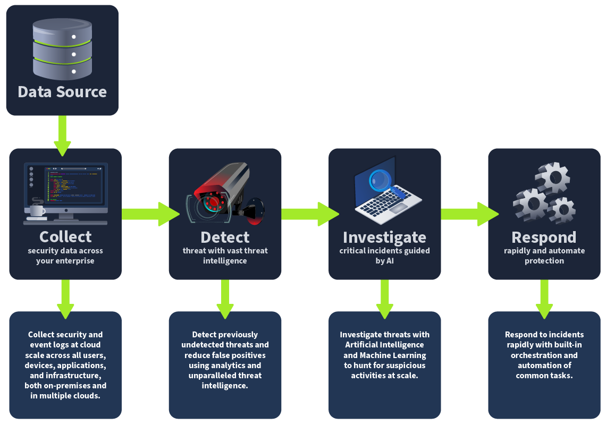

# KQL (Kusto) Introduction

## Introduction

Microsoft Sentinal: cloud-native SIEM and SOAR.  
KQL: Microsoft Sentinel Query Language

### Learning Objectives

This room aims to provide you with the fundamental knowledge and skills necessary to use Kusto Query Language (KQ:) for security analysis within MS Sentinel Log Analytics workspace. Upon completion, you will be able to:

- Better understand the core concepts and functionalities of Microsoft Sentinel as a Security Information and Event Management (KQL) solution.
- Easily understand the benefits of using Kusto Query Language (KQL) in Microsoft Sentinel for day-to-day security operations.
- Understand how KQL interacts with data stored within MS Sentinel Log Analytics workspaces and its uses in querying and analyzing them.

## Overview of Microsoft Sentinel

### Microsoft Sentinel Workflow

Collect : Centralize event logs across all users, devices, applications, and infrastrucutre
Detect : Detect previously undeteted thrats; reduce false positives; use analytics; employ threat intelligence
Investigate : Use AI to investigate indicators of compromise
Respond : Build-in orchestration and automation or common IR tasks. 

  

### Integration with Microsoft Services

#### Microsoft Entra ID

- Sentinel integrats for IdAM and threat detection
- Monior user activities, filter audit logs, identify suspicious login attemps; enforce conditional access policies

#### Microsoft Defender

- Sentinel expads threat detection capabilitese to VMs, databaes, and containers  
- Sentinel users Defender's advanced threat protection for more comprehensiive security analysis

#### Azure Logic Apps

- Sentinel leverages Azure Logic Apps to automate response and remediation workflows
- Harmonize complex responses across different services

#### Azurre Monitor

- Sentinal allows ingestion of metrics and logs  
- Generate comprhensive security insights and analytics

### Integration with Third-Party Services

- Use of built-in data connectors for third-party security products  
- Includes, but not limited to: Palo Alto Networks, CrowdStrike, Fortinet, MacAfee, Splunk, AWS  
- Syslog : Sentinel will ingest the Syslog format 
- REST API : Used as alternative when Sentinel lacks a built-in connector  

## What is KQL

## KQL Concepts in Microsoft Sentinel

## KQL Statement Structure

## KQL Use Cases