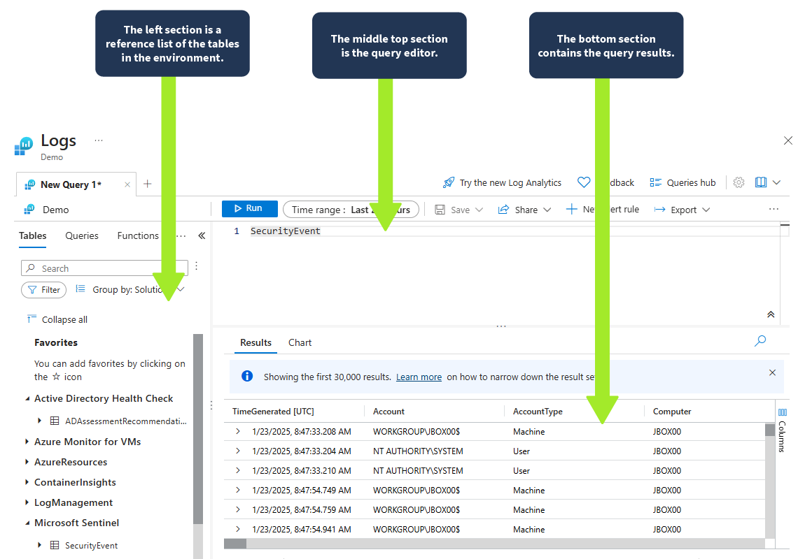
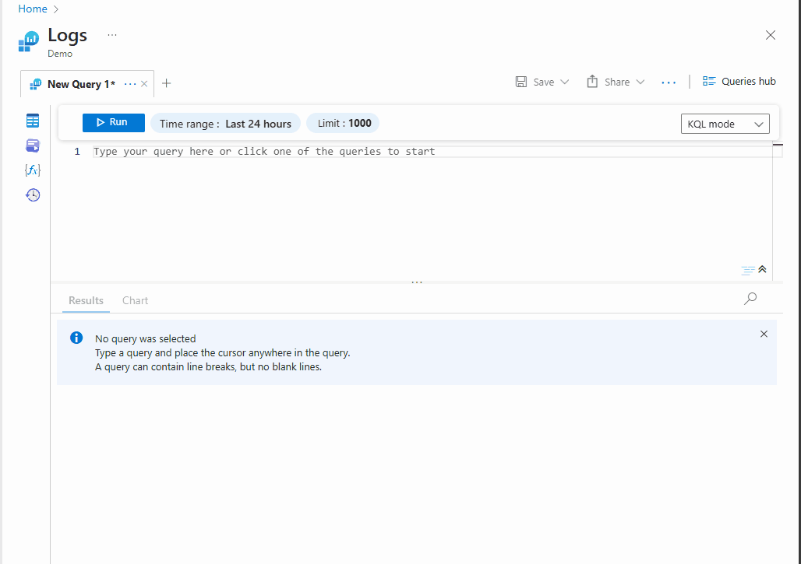
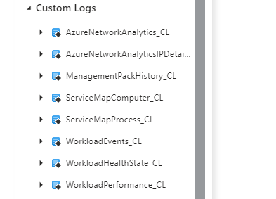
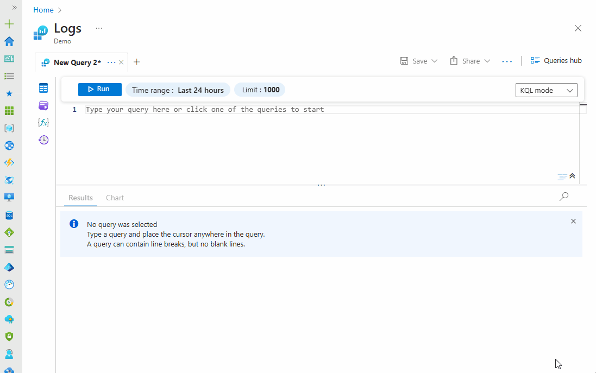
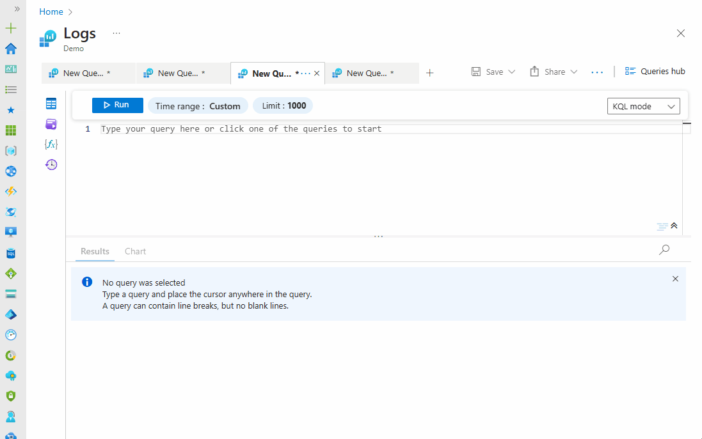
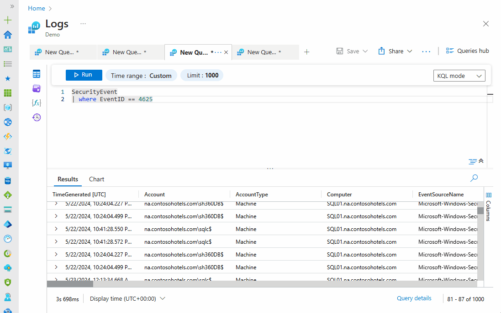

# KQL (Kusto) Introduction

## Introduction

Microsoft Sentinal: cloud-native SIEM and SOAR.  
KQL: Microsoft Sentinel Query Language

### Learning Objectives

This room aims to provide you with the fundamental knowledge and skills necessary to use Kusto Query Language (KQ:) for security analysis within MS Sentinel Log Analytics workspace. Upon completion, you will be able to:

- Better understand the core concepts and functionalities of Microsoft Sentinel as a Security Information and Event Management (KQL) solution.
- Easily understand the benefits of using Kusto Query Language (KQL) in Microsoft Sentinel for day-to-day security operations.
- Understand how KQL interacts with data stored within MS Sentinel Log Analytics workspaces and its uses in querying and analyzing them.

## Overview of Microsoft Sentinel

### Microsoft Sentinel Workflow

Collect : Centralize event logs across all users, devices, applications, and infrastrucutre
Detect : Detect previously undeteted thrats; reduce false positives; use analytics; employ threat intelligence
Investigate : Use AI to investigate indicators of compromise
Respond : Build-in orchestration and automation or common IR tasks. 

  

### Integration with Microsoft Services

#### Microsoft Entra ID

- Sentinel integrats for IdAM and threat detection
- Monior user activities, filter audit logs, identify suspicious login attemps; enforce conditional access policies

#### Microsoft Defender

- Sentinel expads threat detection capabilitese to VMs, databaes, and containers  
- Sentinel users Defender's advanced threat protection for more comprehensiive security analysis

#### Azure Logic Apps

- Sentinel leverages Azure Logic Apps to automate response and remediation workflows
- Harmonize complex responses across different services

#### Azurre Monitor

- Sentinal allows ingestion of metrics and logs  
- Generate comprhensive security insights and analytics

### Integration with Third-Party Services

- Use of built-in data connectors for third-party security products  
- Includes, but not limited to: Palo Alto Networks, CrowdStrike, Fortinet, MacAfee, Splunk, AWS  
- Syslog : Sentinel will ingest the Syslog format 
- REST API : Used as alternative when Sentinel lacks a built-in connector  

## What is KQL

### Simple Description 

1. Security analysis language: Used to filter, search, and analyze security logs and events.
2. Powerful and flexible tool: Used to run simple and complex queries to extract detailed security insights.
3. Tool for large datasets: Optimized for handling massive amounts of security logs.
4. Tool built-in for Microsoft Sentinel: Seamlessly integrated for data exploration and threat hunting.
5. Tool used in other Microsoft services: Such as Azure Data Explorer, Log Analytics, Azure Monitor, and Azure Sentinel.

### KQL Editor

  

```kql
Heartbeat
| summarize AggregatedHeartbeatCount = count() by Computer
| order by AggregatedHeartbeatCount desc
| take 10
```

#### KQL Query

  

- This query retrieves data from the Heartbeat table, which typically contains information about the health and status of devices or systems within the organization.
- Then, the summarize operator aggregates the data by counting the number of heartbeats for each unique computer.
- The result is then outputted in descending order based on the aggregated heartbeat count.
- Finally, the take operator limits the output to the top 10 computers with the highest heartbeats.

## KQL Concepts in Microsoft Sentinel

### Table

The log repository uses tables to manage logs ingested.  
Each table is associated with a specific data source.  
Queries act on data in tables.

Custom logs are identified with`_CL` at the end of the name.  



### Functions and Operators

Symbolks and keywords that carry out operations  
Used to manipulate, aggregate, filter, transform, or analyze data.  
typically invoked by name or customized paramters. 

#### Examples

`count()`, `sum()`, `avg()`, `where()`, `parse()`

`==` - `(equal to)`

`!`= - `(not equal to)`

`<` - `(less than)`

`render`

`summarize`

`|` - (Pipeline)

### Expressions

Combinations of values, functions, operators, and table names that evaluate a single meaninful unit.  
Defines conditions, calculations, tranformation,s, and other operations  

#### Example 

```kql
SecurityEvent
| where TimeGenerated >= ago(3h) and TargetUserName == "JBOX00$"
| project TimeGenerated, Account, Activity, Computer
| sort by TimeGenerated desc
```

#### Explanation

`SecurityEvents` - The table to query.

`where TimeGenerated >= ago(3h) and TargetUserName == "JBOX00$"` - This expression checks if the time column value is within three hours and the user account name is equal to JBOX00$.

`project TimeGenerated, Account, Activity, Computer` - This expression outputs the selected columns.

`sort by TimeGenerated desc` - This expression arranges the output in a descending order.

[kql-expreessions](assets/kql-intro-105.gif)  

#### Common KQL Functions

From the [KQL quick reference](https://learn.microsoft.com/en-us/kusto/query/kql-quick-reference?view=azure-data-explorer&preserve-view=true)  

| Operator / Function Name | Description                                                                                                                                              | Example                                                                 |
| ------------------------ | -------------------------------------------------------------------------------------------------------------------------------------------------------- | ----------------------------------------------------------------------- |
| `search`                 | Searches the specified table for matching value or pattern                                                                                               | `search "failed"`                                                       |
| `where`                  | Filters the specified table based on specified conditions                                                                                                | `SigninLogs \| where EventID == "4624"`                                 |
| `take`                   | Used to limit the number of returned rows in the result set                                                                                              | `SigninLogs \| take 5`                                                  |
| `sort`                   | Sort records in ascending or descending order based on the specified column                                                                              | `SigninLogs \| sort by TimeGenerated, Identity desc \| take 5`          |
| `ago`                    | Returns the time offset relative to the time the query executes                                                                                          | `ago(1h)`                                                               |
| `print`                  | Outputs a single row with one or more scalar expressions                                                                                                 | `print bin(4.5, 1)`                                                     |
| `project`                | Selects specific columns from a table                                                                                                                    | `Perf \| project ObjectName, CounterValue, CounterName`                 |
| `extend`                 | Used to create a new calculated column and add it to the result set                                                                                      | `Perf \| extend AlertThreshold = 80`                                    |
| `count`                  | Calculates the number of records in a table                                                                                                              | `SecurityAlert \| count()`                                              |
| `join`                   | Combines data from multiple tables based on common columns                                                                                               | `LeftTable \| join [JoinParameters] ( RightTable ) on Attributes`       |
| `union`                  | Combines two or more tables and returns all their rows                                                                                                   | `OfficeActivity \| union SecurityEvent`                                 |
| `range`                  | Specifies a time range for your query                                                                                                                    | `range LastWeek from ago(7d) to now() step 1d`                          |
| `summarize`              | Aggregates data based on specified columns and aggregation functions                                                                                     | `Perf \| summarize count() by CounterName`                              |
| `top`                    | Returns the top N records based on a specified column (optional)                                                                                         | `SigninLogs \| top 5 by TimeGenerated desc`                             |
| `parse`                  | Evaluates a string expression and parses its value into one or more calculated columns using regular expressions; used for structuring unstructured data | `parse kind=regex Col with * var1:string var2:long`                     |
| `render`                 | Renders results as a graphical output                                                                                                                    | `SecurityEvent \| render timechart`                                     |
| `distinct`               | Removes duplicate records from the table and returns a table with a distinct combination of the provided columns                                         | `SecurityEvent \| distinct Account, Activity`                           |
| `bin`                    | Rounds all values in a timeframe and groups them                                                                                                         | `bin(StartTime, 1d)`                                                    |
| `let`                    | Allows you to create and set a variable or assign a name to an expression                                                                                | `let aWeekAgo = ago(7d); SigninLogs \| where TimeGenerated >= aWeekAgo` |

## KQL Statement Structure

KQL statements consist of multiple components  

```kql
SecurityEvent
| where TimeGenerated > ago(1d)
| summarize EventCount = count() by Computer
| order by EventCount desc | limit 10 
```

  

- **Data source:** The data source specifies the table from which you want to retrieve data.
    - `SecurityEvent`- Specifies the table from which data will be retrieved.
- **Conditions:** They are used to perform specific actions on data.
    - `| where TimeGenerated > ago(1d)` - Filters the data to include only events that occurred within the last 24 hours `ago(1d)`). This ensures that only recent events are analyzed.
    - `| summarize EventCount = count()` by Computer - Aggregates the filtered events by the `Computer` column and counts the number of events for each device.
- **Output:** This defines how you want to view the output result.
    - `| order by EventCount desc` - Sorts the aggregated data by the `EventCount` column in descending order desc).
    - `| limit 10` - Limits the output to the top 10 devices with the highest number of security events.

## KQL Use Cases

### Real-Life Example

### KQL Technical Use Cases

**Scenario:** You need to identify failed login attempts for a specific user account to investigate potential unauthorized access.

**Solution:** To identify failed login attempts, you can search the SecurityEvent table for failed login attempts using the query below. This will find all failed login attempts across your organization. You can modify the time range to expand your search.

```kql
SecurityEvent
| where EventID == 4625
```

  

Focusing on a specific account:

```kql
SecurityEvent
| where EventID == 4625 and TargetUserName contains "admin"
```

  

### KQL Technical Use Cases  

- **Investigating security incidents:** You can use KQL to analyze security alerts, identify the root cause of incidents, and investigate attack timelines by querying relevant logs.
- **Hunting for malware:** KQL queries can be used to detect anomalies and search for suspicious malware-related activities, such as malicious file downloads, unusual registry changes, or network manipulations.
- **Detecting lateral movement:** KQL can identify suspicious user logins from different devices or locations, which may indicate unauthorized access and lateral movement within your network.
- **Monitoring user activity:** As a security analyst, you can review login attempts, access patterns, and privileged user activity using KQL queries, which can help detect account misuse or compromises.
- **Security operations automation:** Security admins can automate security operations and incident response by integrating KQL queries into workflows and triggering alerts, notifications, or remedial actions based on query results.
- **Alerting:** In Microsoft Sentinel, custom alerts can be created using KQL queries to inform you of possible security events by specifying particular criteria in the query. Also, an alert rule can be created within KQL from a query.
- **Log analysis and reporting:** Additionally, you can use KQL queries to extract and analyze security logs, creating custom reports to determine your current security posture, usage and performance metrics, compliance requirements, and threat trends.