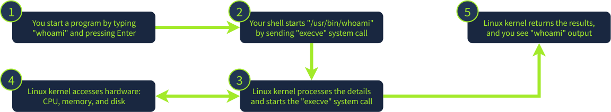
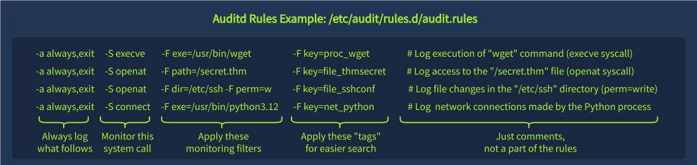

# Linux Logging for SOC

## Working with Text Logs

### Working With Logs

Linux logs most events into plain text files  
This means you can read the logs via any text editor without the need for specialized tools like Event Viewer  
default Linux logs are less structured as there are no event codes or strict log formatting rules  
Most Linux logs are located in the `/var/log` folder

    ```ms           
    root@thm-vm:~$ cat /var/log/syslog | head
    [...]
    2025-08-13T13:57:49.388941+00:00 thm-vm systemd-timesyncd[268]: Initial clock synchronization to Wed 2025-08-13 13:57:49.387835 UTC.
    2025-08-13T13:59:39.970029+00:00 thm-vm systemd[888]: Starting dbus.socket - D-Bus User Message Bus Socket...
    2025-08-13T14:02:22.606216+00:00 thm-vm dbus-daemon[564]: [system] Successfully activated service 'org.freedesktop.timedate1'
    2025-08-13T14:05:01.999677+00:00 thm-vm CRON[1027]: (root) CMD (command -v debian-sa1 > /dev/null && debian-sa1 1 1)
    [...]
```
        

### Filtering Logs

filter logs and narrow down your search as much as possible. 
        

`root@thm-vm:~$ cat /var/log/syslog | grep CRON`  
# Or "grep -v CRON" to exclude "CRON" from results  
```md
2025-08-13T14:17:01.025846+00:00 thm-vm CRON[1042]: (root) CMD (cd / && run-parts --report /etc/cron.hourly)
2025-08-13T14:25:01.043238+00:00 thm-vm CRON[1046]: (root) CMD (command -v debian-sa1 > /dev/null && debian-sa1 1 1)
2025-08-13T14:30:01.014532+00:00 thm-vm CRON[1048]: (root) CMD (date > mycrondebug.log)
```

### Discovering Logs

Linux system logs are stored in the /var/log/ folder in plain text, so you can simply grep for related keywords like "login", "auth", or "session" in all log files there and narrow down your next searches:
           
# List what's logged by your system (/var/log folder)  

`root@thm-vm:~$ ls -l /var/log`  

    ```md
    drwxr-xr-x  2 root      root               4096 Aug 12 16:41 apt
    drwxr-x---  2 root      adm                4096 Aug 12 12:40 audit
    -rw-r-----  1 syslog    adm               45399 Aug 13 15:05 auth.log
    -rw-r--r--  1 root      root            1361277 Aug 12 16:41 dpkg.log
    drwxr-sr-x+ 3 root      systemd-journal    4096 Oct 22  2024 journal
    -rw-r-----  1 syslog    adm              214772 Aug 13 13:57 kern.log
    -rw-r-----  1 syslog    adm              315798 Aug 13 15:05 syslog
    [...]
  
    # Search for potential logins across all logs (/var/log)
    root@thm-vm:~$ grep -R -E "auth|login|session" /var/log
    [...]
    ```

        
### Logging Caveats

Linux allows you to easily change log format, verbosity, and storage location.  

### Use the /var/log/syslog file on the VM to answer the questions.  

#### Which time server domain did the VM contact to sync its time?

`:> cat /var/log/syslog | grep -i ntp`

#### What is the kernel message from Yama in /var/log/syslog?

`:> cat /var/log/syslog | grep -i yama`

## Authetnication Logs

many ways users authenticate into a Linux machine: locally, via SSH, using "sudo" or "su" commands, or automatically to run a cron job.  
Each successful logon and logoff is logged, and you can see them by filtering the events containing the "session opened" or "session closed" keywords:

### Local and Remote Logins

`:>root@thm-vm:~$ cat /var/log/auth.log | grep -E 'session opened|session closed'`  

    ```md       
    # Local, on-keyboard login and logout of Bob (login:session)
    2025-08-02T16:04:43 thm-vm login[1138]: pam_unix(login:session): session opened for user bob(uid=1001) by bob(uid=0)
    2025-08-02T19:23:08 thm-vm login[1138]: pam_unix(login:session): session closed for user bob
    # Remote login examples of Alice (via SSH and then SMB)
    2025-08-04T09:09:06 thm-vm sshd[839]: pam_unix(sshd:session): session opened for user alice(uid=1002) by alice(uid=0)
    2025-08-04T12:46:13 thm-vm smbd[1795]: pam_unix(samba:session): session opened for user alice(uid=1002) by alice(uid=0)
    ```

### Cron and Sudo Logins

`:>root@thm-vm:~$ cat /var/log/auth.log | grep -E 'session opened|session closed'`  

    ```md         
    # Traces of some cron job launch running as root (cron:session)
    2025-08-06T19:35:01 thm-vm CRON[41925]: pam_unix(cron:session): session opened for user root(uid=0) by root(uid=0)
    2025-08-06T19:35:01 thm-vm CRON[3108]: pam_unix(cron:session): session closed for user root
    # Carol running "sudo su" to access root (sudo:session)
    2025-08-07T09:12:32 thm-vm sudo: pam_unix(sudo:session): session opened for user root(uid=0) by carol(uid=1003)
    ```
        

### SSH Specific Events

the SSH daemon stores its own log of successful and failed SSH logins  
These logs are sent to the same auth.log file, but have a slightly different format. Let's see the example of two failed and one successful SSH logins  

`:>root@thm-vm:~$ cat /var/log/auth.log | grep "sshd" | grep -E 'Accepted|Failed'`  

    ```md
    # Common SSH log format: <is-successful> <auth-method> for <user> from <ip>
    2025-08-07T11:21:25 thm-vm sshd[3139]: Failed password for root from 222.124.17.227 port 50293 ssh2
    2025-08-07T14:17:40 thm-vm sshd[3139]: Failed password for admin from 138.204.127.54 port 52670 ssh2
    2025-08-09T20:30:51 thm-vm sshd[1690]: Accepted publickey for bob from 10.19.92.18 port 55050 ssh2: <key>
    ```
        

### Miscellaneous Events

You can also use the same log file to detect user management events.  
This is easy if you know basic Linux commands: If useradd is a command to add new users, just look for a "useradd" keyword to see user creation events!  

#### User Management Events

`:> root@thm-vm:~$ cat /var/log/auth.log | grep -E '(passwd|useradd|usermod|userdel)\['`

    ```md
    2023-02-01T11:09:55 thm-vm passwd[644]: password for 'ubuntu' changed by 'root'
    2025-08-07T22:11:11 thm-vm userdel[1887]: delete user 'oldbackdoor'
    2025-08-07T22:11:29 thm-vm useradd[1878]: new user: name=backdoor, UID=1002, GID=1002, shell=/bin/sh
    2025-08-07T22:11:54 thm-vm usermod[1906]: add 'backdoor' to group 'sudo'
    2025-08-07T22:11:54 thm-vm usermod[1906]: add 'backdoor' to shadow group 'sudo'
    ```
        
#### Sudo or other unexpected events

Lastly, depending on system configuration and installed packages, you may encounter interesting or unexpected events.  
For example, you may find commands launched with sudo, which can help track malicious actions.  
In the example below, the "ubuntu" user used sudo to stop EDR, read firewall state, and finally access root via "sudo su":

`:>root@thm-vm:~$ cat /var/log/auth.log | grep -E 'COMMAND='`

    ```md           
    2025-08-07T11:21:49 thm-vm sudo: ubuntu : TTY=pts/0 ; [...] COMMAND=/usr/bin/systemctl stop edr
    2025-08-07T11:23:18 thm-vm sudo: ubuntu : TTY=pts/0 ; [...] COMMAND=/usr/bin/ufw status numbered
    2025-08-07T11:23:33 thm-vm sudo: ubuntu : TTY=pts/0 ; [...] COMMAND=/usr/bin/su
    ```

### Continue with the VM and use the /var/log/auth.log file.

#### Which IP address failed to log in on multiple users via SSH?

`:> cat /var/log/auth.log | grep -i failed`  

#### Which user was created and added to the "sudo" group?

`:> cat /var/log/auth.log | grep -i usermod`

## Common Linux Logs

### Generic System Logs

`/var/log/kern.log` : Kernel messages and errors, useful for more advanced investigations  
`/var/log/syslog` or `/var/log/messages` : A consolidated stream of various Linux events  
`/var/log/dpkg.log` or `/var/log/apt` : Package manager logs on Debian-based systems  
`/var/log/dnf.log` or `/var/log/yum.log` : Package manager logs on RHEL-based systems  

valuable during DFIR  
rarely seen in a daily SOC routine as they are often noisy and hard to parse

### App-Specific Logs

monitor specific programs using its logs  

***Nginx Web Access Logs***

`:> root@thm-vm:~$ cat /var/log/nginx/access.log`  

    ```md
    # Every log line corresponds to a web request to the web server
    10.0.1.12 - - [11/08/2025:14:32:10 +0000] "GET / HTTP/1.1" 200 3022
    10.0.1.12 - - [11/08/2025:14:32:14 +0000] "GET /login HTTP/1.1" 200 1056
    10.0.1.12 - - [11/08/2025:14:33:09 +0000] "POST /login HTTP/1.1" 302 112
    10.0.4.99 - - [11/08/2025:17:11:20 +0000] "GET /images/logo.png HTTP/1.1" 200 5432
    10.0.5.21 - - [11/08/2025:17:56:23 +0000] "GET /admin HTTP/1.1" 403 104
    ```
        

### Bash History

a feature that records each command you run after pressing Enter  
By default, commands are first stored in memory during your session, and then written to the per-user ~/.bash_history file when you log out  
open the ~/.bash_history file to review commands from previous sessions or use the history command to view commands from both your current and past sessions:

#### Bash History File and Command

`:> ubuntu@thm-vm:~$ cat /home/ubuntu/.bash_history`  
    ```md
    echo "hello" > world.txt
    nano /etc/ssh/sshd_config
    sudo su
    ubuntu@thm-vm:~$ history
    1 echo "hello" > world.txt
    2 nano /etc/ssh/sshd_config
    3 sudo su
    4 ls -la /home/ubuntu
    5 cat /home/ubuntu/.bash_history
    6 history
    ```

rarely used by SOC teams in their daily routine  
it does not track non-interactive commands (like those initiated by your OS, cron jobs, or web servers) and has some other limitations  

#### Bash History Limitations

    ```md           
    # Attackers can simply add a leading space to the command to avoid being logged
    ubuntu@thm-vm:~$  echo "You will never see me in logs!"

    # Attackers can paste their commands in a script to hide them from Bash history
    ubuntu@thm-vm:~$ nano legit.sh && ./legit.sh
    
    # Attackers can use other shells like /bin/sh that don't save the history like Bash
    ubuntu@thm-vm:~$ sh
    $ echo "I am no longer tracked by Bash!"  
    ```

### According to the VM's package manager logs, 

#### which version of unzip was installed on the system?

`:> cat /var/log/apt/history.log | grep -i unzip`

#### What is the flag you see in one of the users' bash history?  

`:> sudo su`
`:> history`

## Runtime Monitoring

by default, Linux doesn't log process creation, file changes, or network-related events, collectively known as `runtime events`  

### System Calls

whenever you need to open a file, create a process, access the camera, or request any other OS service, you make a specific system call  
There are over 300 system calls in Linux, like `execve` to `execute` a program.  

high-level flowchart of how it works:

  

Modern EDRs and logging tools rely on system calls  
they monitor the main system calls and log the details in a human-readable format  
Since there is nearly no way for attackers to bypass system calls, all you have to do is choose the system calls you'd like to log and monitor  

### Questions

Which Linux system call is commonly used to execute a program?

Can a typical program open a file or create a process bypassing system calls? (Yea/Nay)

## Auditd

### Audit Daemon

Built-in auditing solution often used by the SOC team for runtime monitoring.  
instructions located in `/etc/audit/rules.d/`  define which system calls to monitor and which filters to apply:  

  

Monitoring every process, file, and network event can quickly produce gigabytes of logs each day.  
more logs don't always mean better detection since an attack buried in a terabyte of noise is still invisible.  
SOC teams often focus on the highest-risk events and build balanced rulesets  

### Using Auditd

view generated logs in real time in `/var/log/audit/audit.log`  
easier to use the `ausearch` command, as it formats the output for better readability and supports filtering options.  

`:> root@thm-vm:~$ ausearch -i -k proc_wget`  

    ```md
    ----
    type=PROCTITLE msg=audit(08/12/25 12:48:19.093:2219) : proctitle=wget https://files.tryhackme.thm/report.zip
    type=CWD msg=audit(08/12/25 12:48:19.093:2219) : cwd=/root
    type=EXECVE msg=audit(08/12/25 12:48:19.093:2219) : argc=2 a0=wget a1=https://files.tryhackme.thm/report.zip
    type=SYSCALL msg=audit(08/12/25 12:48:19.093:2219) : arch=x86_64 syscall=execve [...] ppid=3752 pid=3888 auid=ubuntu uid=root tty=pts1 exe=/usr/bin/wget key=proc_wget
    ``
        
The above shows a log of a single "wget" command.  
Here, auditd splits the event into four lines:  

- the PROCTITLE shows the process command line,  
- CWD reports the current working directory,  
- remaining two lines show the system call details, like:


`pid=3888, ppid=3752` : Process ID and Parent Process ID. Helpful in linking events and building a process tree  
`auid=ubuntu` : Audit user. The account originally used to log in, whether locally (keyboard) or remotely (SSH)  
`uid=root` : The user who ran the command. The field can differ from auid if you switched users with sudo or su  
`tty=pts1` : Session identifier. Helps distinguish events when multiple people work on the same Linux server  
`exe=/usr/bin/wget` : Absolute path to the executed binary, often used to build SOC detection rules  
`key=proc_wget` : Optional tag specified by engineers in auditd rules that is useful to filter the events  

### File Events

look at the file events matching the "file_sshconf" key.  
auditd tracked the change to the /etc/ssh/sshd_config file via the "nano" command.  
SOC teams often set up rules to monitor changes in critical files and directories (e.g., SSH configuration files, cronjob definitions, or system settings)  


#### Looking for SSH Configuration Changes
           
`:> root@thm-vm:~$ ausearch -i -k file_sshconf`  

```md
----
type=PROCTITLE msg=audit(08/12/25 13:06:47.656:2240) : proctitle=nano /etc/ssh/sshd_config
type=CWD msg=audit(08/12/25 13:06:47.656:2240) : cwd=/
type=PATH msg=audit(08/12/25 13:06:47.656:2240) : item=0 name=/etc/ssh/sshd_config [...]
type=SYSCALL msg=audit(08/12/25 13:06:47.656:2240) : arch=x86_64 syscall=openat [...] ppid=3752 pid=3899 auid=ubuntu uid=root tty=pts1 exe=/usr/bin/nano key=file_sshconf
```

### Auditd Alternatives

although auditd provides a verbose logging, it is hard to read and ingest into SIEM.  
many SOC teams resort to the alternative runtime logging solutions, for example:

`Sysmon for Linux` : A perfect choice if you already work with Sysmon and love XML
`Falco` : A modern, open-source solution, ideal for monitoring containerized systems
`Osquery` : An interesting tool that can be broadly used for various security purposes
`EDRs` : Most EDR solutions can track and monitor various Linux runtime events

The key to remember is that all listed tools work on the same principle - monitoring system calls.  
Once you've understood system calls, you will easily learn all the mentioned tools.  

### Uncover the threat actor

For this task, continue with the VM and use auditd logs to answer the questions.
You may need to use ausearch -i and grep commands for this task.

#### When was the secret.thm file opened for the first time? (MM/DD/YY HH:MM:SS)

Note: Access to this file is logged with the "file_thmsecret" key.  

`ausearch -i | grep secret.thm`

#### What is the original file name downloaded from GitHub via wget?

Note: Wget process creation is logged with the "proc_wget" key.  

`:> ausearch -i | grep -i wget | grep -i github`

#### Which network range was scanned using the downloaded tool?

Note: There is no dedicated key for this event, but it's still in auditd logs.  
`:> ausearch -i | grep -i naabu`  

