# Linux Modules

## du

short for disk usage  
identify what files/directories are consuming how much space  

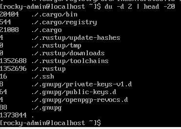  

The folders in their respective folders are listed here with the size they occupy on the disk.  
The size here is shown in KB.  
Note: The files inside a folder are not shown, only the folders are listed by running `:> du /<directory>` command.


### Important flags

`-a` : Will list files as well with the folder.
`-h` : Will list the file sizes in human readable format(B,MB,KB,GB)
`-c` : Using this flag will print the total size at the end. Jic you want to find the size of directory you were enumerating
`-d <number>` : Flag to specify the depth-ness of a directory you want to view the results for (eg. -d 2)
`--time` :  To get the results with time stamp of last modified.


### Examples

`:> du -a /home/` :  list every file in the /home/ directory with their sizes in KB.

`:> du -a /home/ | grep user` : list any file/directory whose name contains the string "user"  

`:> du --time -d 1 .` : alternate for `ls` but will not display ownership though

`:> stat <filename>` : display the owner of `<filename>`

## Grep, Egrep, Fgrep

The grep filter searches a file for a particular pattern of characters, and displays all lines that contain that pattern.  
The pattern that is searched in the file is referred to as the regular expression.  

Syntax: `:> grep "PATTERN" file.txt` 
search the file.txt for the specified "PATTERN" string, if the string is found in the line, the grep will return the whole line containing the "PATTERN" string.  

### The Family Tree

egrep and fgrep are no different from grep(other than 2 flags that can be used with grep to function as both).  
`egrep` matches the regular expressions in a string  
`fgrep` searches for a fixed string inside text  
`grep` can do both their jobs by using `-E` and `-F` flag, respectively.  

### Important Flags

`-R` : recursive grep search for the files inside the folders(if found in the specified path for pattern search; else grep won't traverse diretory for searching the pattern you specify)  
`-h` : If you're grepping recursively in a directory, this flag disables the prefixing of filenames in the results.  
`-c` : This flag won't list you the pattern only list an integer value, that how many times the pattern was found in the file/folder.  
`-i` : search for the PATTERN while IGNORING the case  
`-l` : only list the filename instead of pattern found in it.  
`-n` : list the lines with their line number in the file containing the pattern.  
`-v` : prints all the lines that are NOT containing the pattern  
`-E` : will consider the PATTERN as a regular expression to find the matching strings.  
`-e` : can be used to specify multiple patterns and if any string matches with the pattern(s) it will list it.  

`-e` : can be used to specify multiple patterns, with multiple use of -e flag : `:>  grep -e PATTERN1 -e PATTERN2 -e PATTERN3 file.txt`  and works on the BREs(Basic Regular Expressions); BREs match a single pattern in a file (Simplest examples can be direct words like "sun", "comic")

`-E` : specify one single pattern; can't use -E multiple times within a single grep statement.  works on EREs (Extended Regular Expressions); EREs tend to match 2 or more patterns in a file (To select a no of words like (sun sunyon sandston) the pattern could be "^s.*n$")

official GNU documentation: [Basic vs Extended](https://www.gnu.org/software/grep/manual/html_node/Basic-vs-Extended.html) 

Use [linux-module-grep.txt](assets/linux-module-grep.txt) to answer the following questions.  


What user did you find in that file?  

What is the password of that user?  

Can you find the comment that user just left?  

## String Manipulations (STRing OPerationS) (STROPS)

### tr

Translate command(tr)  
capabilities ranging from changing character cases in a string to replacing characters in a string.  
easiest command and a must know module for quick operations on strings.  

Syntax: `:> tr [flags] [source]/[find]/[select] [destination]/[replace]/[change]`

#### Flags

`-d` : delete a given set of characters
`-t` : concat source set with destination set(destination set comes first; t stands for truncate)
`-s` : replace the source set with the destination set(s stands for squeeze)
`-c` : This is the REVERSE card in this game. If you specify -c with -d to delete a set of characters then it will delete the rest of the characters leaving the source set which we specified (c stands for complement; as in doing reverse of something)

#### tr Examples

Convert every alphabetic character to uppercase 

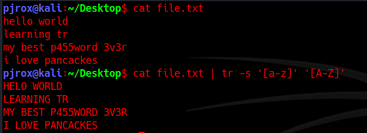  

`:> cat file.txt | tr -s '[a-z]' '[A-Z]'`
`:> cat file.txt | tr -s '[:lower:]' '[:upper:]'`

vew creds of a user which are in digits  
`:> cat creds.txt | tr -d '[a-zA-Z]'`  

  

### awk

"Awk is a scripting language used for manipulating data and generating reports.The awk command programming language requires no compiling, and allows the user to use variables, numeric functions, string functions, and logical operators."

`awk` commands can be longer than comparable commands in sed or xargs.  

Syntax: `:> awk [flags] [select pattern/find(sort)/commands] [input file]`
awk does support getting output via piping.  
If the commands you wrote are in a script you can execute the script commands by using the -f flag and specifying the name of the script file. `:> awk -f script.awk input.txt` 

#### Using AWK

To simply print a file with awk.

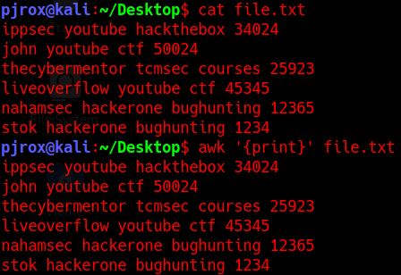  

To search for a pattern inside a file you enclose the pattern in forward slashes /pattern/ . For instance, if I want to know who all plays CTF competitions the command should be like: `:> awk '/ctf/' file.txt`  

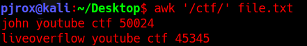  

#### Built-In variables in AWK

 Built-in variables include field variables ($1, $2, $3 .. $n). These field variables are used to specify a piece of data (data separated by a delimeter defaulting to space).  
 `:> awk '{print $1 $3}' file.txt` lists the words contained at 1st and 3rd fields.  

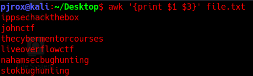  

it joined the words together because we didn't specify the output delimeter.  

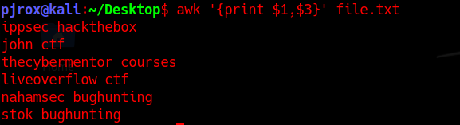  

The use of {} around the print statement indicates use of a function. To use commands in awk scripts, you need to mention them inside a function.

The `$0` variable points to the whole line.  
use single quotes ('') to specify patterns, awk treats double quotes("") as a raw string. To use double quotes make sure that you escape the ($) sign(s) with a backslash (\) each, to make it work properly.

#### More on variables

**NR** : (Number Record) the variable that keeps count of the rows after each line's execution... You can use NR command to number the lines (`awk '{print NR,$0}' file.txt`).   
Note that awk considers rows as records.

**FS** : (Field Separator) the variable to set in case you want to define the field for input stream. FS can be defined to another character(s)(yea, can be plural) at the `BEGIN{command}`.  

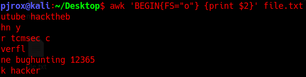  

`BEGIN` is a pattern that we specify followed the action on that pattern.  
Similarly, there is `END` command. This is a pattern that we specify, followed by the action to perform on that pattern  
We use them to define actions like Field Separator, Record Separator etc.  
They are performed at the start and at the end of the script, respectively.  

`:> awk "BEGIN {FS='o'} {print $1,$3} END{print 'Total Rows=',NR}"`  

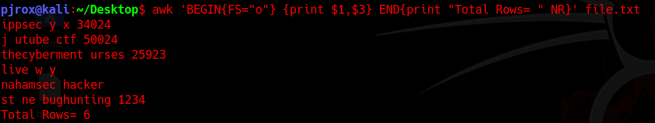  

The output is weird because I separated the fields using a letter that was making sense with the words in text. In short, this is actually how a complete script is written in awk.

**RS**: (Record Separator): By default it separate rows with '\n', you can specify something else too.  

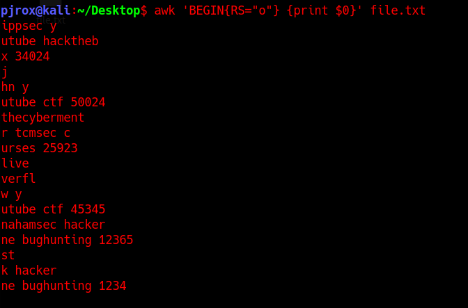  

Notice that their has been a new line created wherever 'o' was used. It also interpreted '\n' used in the text file, so there are new lines after end of every number too.
  
**OFS**: (Output Field Separator) You must have gathered some idea by the full form, it is to specify a delimeter while outputing... 

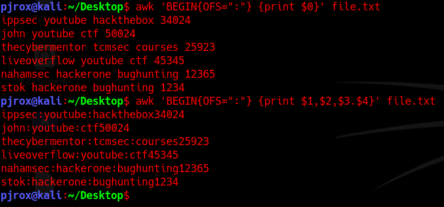  

Only in 2nd one the delimiter was used. Note that the output field separator will separate fields using (:) only when the fields are defined with the print statement.  
With $0 I didn't had anything else, if it were to be $0,$0 then the lines would be joining their reflection(non-laterally) with a colon(:).  

**ORS**:(Output Record Separator):  The imiter is a double new-line character.

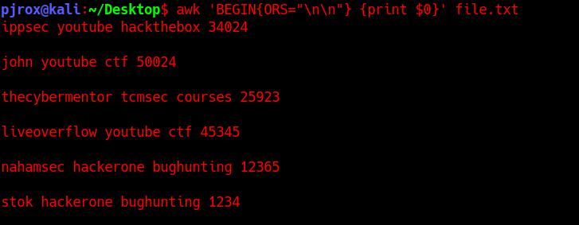  

#### awk Flags

`-F` :	With this flag you can specify FIELD SEPARATOR (FS), and thus don't need to use the BEGIN rule
`-v` :	Can be used to specify variables(like we did in BEGIN{OFS=":"}
`-D` :	You can debug your .awk scripts specifying this flag(awk -D script.awk) 
`-o` :	To specify the output file (if no name is given after the flag, the output is defaulted to awkprof.out)

#### resources regarding awk scripting

    • [AWK - Workflow - Tutorialspoint](https://www.tutorialspoint.com/awk/index.htm) (For learning awk scripting in brief and quick)  

Use [linux-modules-awk.txt](assets/linux-module-awk.txt) and the awk command to print the following output:

    ```md
    ippsec:34024  
    john:50024  
    thecybermentor:25923  
    liveoverflow:45345  
    nahamsec:12365  
    stok:1234  
    ```

How will you make the output as following (there can be multiple; answer it using the above specified variables in BEGIN pattern):

`ippsec, john, thecybermentor, liveoverflow, nahamsec, stok,`

### sed

**Stream EDitor**  
performs string operations  
FIND AND REPLACE, searching, insertion, deletion  

Syntax: `:> sed [flags] [pattern/script] [input file]`

#### sed Flags

`-e` : To add a script/command that needs to be executed with the pattern/script(on searching for pattern)
`-f` : Specify the file containing string pattern
`-E` : Use extended regular expressions 
`-n` : Suppress the automatic printing or pattern spacing

The sed command

`'[condition(s)(optional)] [command/mode(optional)]`/`[source/to-be-searched pattern(mandatory)]`/`[to-be-replaced pattern(depends on command/mode you use)]`/`[args/flags to operate on the pattern searched(optional)]'`  

#### Modes/Commands

`s` : (Most used)Substitute mode (find and replace mode)
`y` : Works same as substitution; the only difference is, it works on individual bytes in the string provided(this mode takes no arguments/conditions)

Note: "mode" is used to avoid the confusion of using a command(s/y) within the command(sed). Official documentation list them as commands used in sed.  

#### Args

`/g` : globally(any pattern change will be affected globally, i.e. throughout the text; generally works with s mode) 
`/i` : To make the pattern search case-insensitive(can be combined with other flags)
`/d` : To delete the pattern found(Deletes the whole line; takes no parameter like conditions/modes/to-be-replaced string)
`/p` : prints the matching pattern(a duplicate will occur in output if not suppressed with -n flag.)
`/1,/2,/3../n` : To perform an operation on an nth occurrence in a line(works with s mode)

Let's see these in action... Explaining the previously taken command, (sed -e '1,3 s/john/JOHN/g' file.txt)

`:> sed -e '1,3 s/john/JOHN/g' file.txt`  

- `-e` flag specifies the following is a script command (you don't need to specify -e if it's a single command; as it will be automatically interpreted by sed as a positional argument)
- Then comes the pattern. `{1,3}` represents range selection, specifying to take range of lines 1,3 (line index starts from 1) and execute the following code on that range of lines.  
- `s` specifies substitution mode  
- `/` is the delimiter to differentiate between the parts of code  
- `john` is the pattern one wich the substituion will occur (regex works in this region as well).  
- `/` is the next delimeter  
- `JOHN` represents the pattern that will replace the first pattern.  
- `/` is the delimeter  
- `/g` specifies this operation globally, wherever the pattern was found.
- Finally the filename we want to take input from and apply operation/code that we specified beside it.

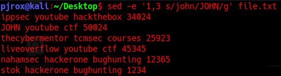  

**Viewing a range of Lines**  

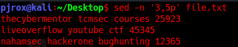  

**Viewing the entire file except a given range**  

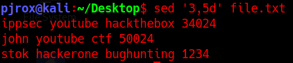  

**Viewing multiple ranges of lines inside a file**  

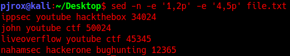  

**Start searching from nth pattern occurrence in a line you can use combination of /g with /1,/2,/3.**  

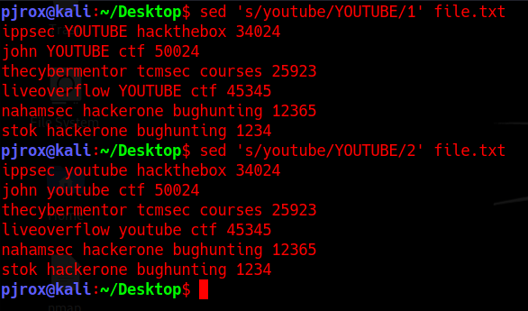  

use of `/1` results in a change in the text  
use of `/2` does not result in a change inthe text.  
There was only 1 occurrence of the string "youtube". The 2nd occurrence couldn't be found
`1g` or `2g` were not used because there were no further occurrences of the pattern  

**Log files with trailing spaces**  

hard to read; can be fixed using regex  

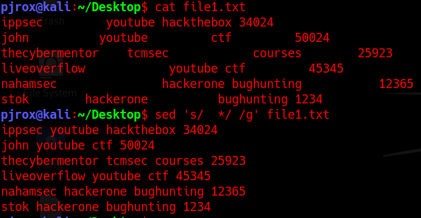  

**Making every line to start with a bullet point and enclose the digits in square brackets**  

`:> sed 's/\(^\b[[:alpha:] ]*\)\([[:digit:]]*\)/\=\> \1\[\2\]/g' file.txt`  

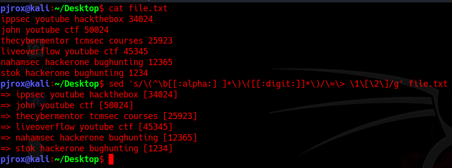  

#### sed Questions

How would you substitute every 3rd occurrence of the word 'hack' to 'back' on every line inside the file file.txt?  

How will you do the same operation only on 3rd and 4th line in file.txt?  

Try formatting the trailing spaces in [linux-module-sed1.txt](assets/linux-module-sed1.txt) with a colon(:).  

View [linux-module-sed2.txt](assets/linux-module-sed2.txt) file. Try putting all alphabetical values together, to get the answer for this question.  

What pattern did you use to reach that answer string?  

Alternatively, you can use tr to remove all the digits, and then pipe the output in sed to remove trailing whitespaces.  

`:> cat linux-module-sed2.txt | tr '[:digit:]' ' ' | sed 's/  *//g'`  

Another good way suggested by a room do-er. You can simply use `:> tr -d` command to delete all the digits from the file.

`:> cat linux-module-sed2.txt | tr -d '[:digit:]'`

What did she sed?(In double quotes)  

### xargs

a command line tool used to build and execute command from the standard input.  

#### xargs Flags

`-0` : Will terminate the arguments with null character (helps to handle spaces in the argument)  
`-a file` : allows xargs to read item from a file  
`-d <delimiter>` : specify the delimiter to be used when differentiating arguments in stdin  
`-L <int>` : Specifies max number non-blank inputs per command line  
`-s <int>` : sets the max-chars for the command, which includes it's initial arguments and terminating nulls as well. Default size is around 128kB (if not specified).  
`-x` : exit the command execution if the size specified is exceeded.(For security purposes.)  
`-E <str>` : specify the end-of-file string (You can use this in case you are reading arguments from a file)  
`-I <str>` : (Capital i) replace str occurrence in arguments with the one passed via stdin(More like creating a variable to use later)  
`-p` : prompt the user before running any command as a token of confirmation.  
`-r` : If the standard input is blank (i.e. no arguments passed) then it won't run the command.  
`-n <int>` : specifies the limit of max-args to be taken from command input at once. After the max-args limit is reached, it will pass the rest arguments into a new command line with the same flags issued to the previously ran command. (More like a looping)  
`-t` : verbose; (Print the command before running it).Note: This won't ask for a prompt  

**run multiple command with xargs in one line**  

a variable `argVar` to use later in the two commands ran with bash -c.  

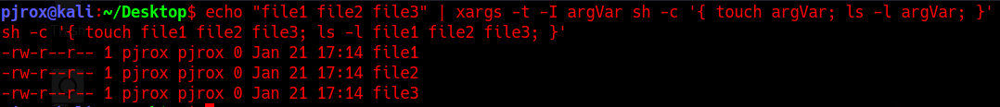  

** use `xargs` with conjunction with `find` command to enhance search results.  

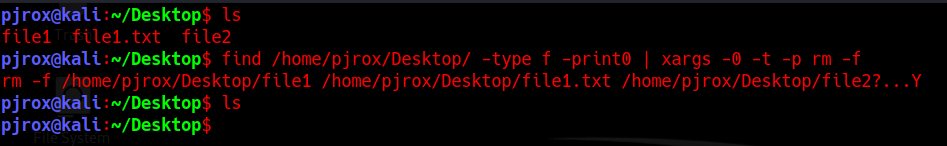  

Note: The find command prints results to standard output by default, so the -print option is normally not needed, but -print0 separates the filenames with a \0 (NULL) byte so that names containing spaces or newlines can be interpreted correctly.

**use xargs command to grep a text from any file in any directory meeting a specific pattern/criteria**  

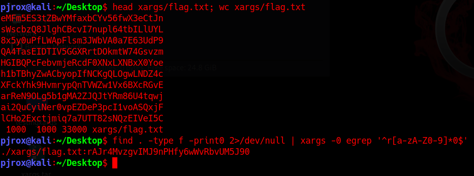  

this uses xargs to grep a pattern matching anything starting with r with any bunch of characters[:alnum:] and ending with 0  

Note: If the xargs is having same flags, that can also be interpreted by the following module, in that case you need not worry, because the flags used after the command are the one's that are interpreted. Just keep that in mind and you're good to go.

#### xargs Questions

You're working in a team and your team leader sent you a list of files that needs to be created ASAP within current directory so that he can fake the synopsis report (that needs to be submitted within a minute or 2) to the invigilator and change the permissions to read-only to only you(Numberic representation).  
You can find the files list in [linux-modules-xargs-file](assets/linux-modules-xargs-file).  

Use the following flags in ASCII order:

    Verbose
    Take argument as "files"

`:> cat linux-modules-xargs-file | xargs -I files -t sh -c "touch files; chmod 400 files"`  

Your friend trying to run multiple commands in one line, and wanting to create a short version of rockyou.txt, messed up by creating files instead of redirecting the output into "shortrockyou".  
Now he messed up his home directory by creating a ton of files.  
He deleted rockyou wordlist in that one liner and can't seem to download it and do all that long process again.  
He now seeks help from you, to create the wordlist and remove those extra files in his directory.  
You being a pro in linux, show him how it's done in one liner way.  
Use the following flags in ASCII order:

    Take argument as "word"
    Verbose
    Max number of arguments should be 1 in for each file

You can find the files for this task in [linux-modules-xargs-two](assets/linux-modules-xargs-two) folder.

`ls | xargs -I word -n 1 -t sh -c 'echo word >> shortrockyou; rm word'`  

Which flag to use to specify max number of arguments in one line.

How will you escape command line flags to positional arguments?  

### sort command

sorts the lines alphabetically and numerically, automatically. All you got to do is pipe the stdin into sort command.

#### sort flags

`-r` : Sorts in reverse order
`-c` : This flag is used to check whether the file is already sorted or not(If not, it will list, where the disorder started)
`-u` : To sort and removes duplicate lines(does work same as stdin redirected into uniq)
`-o <file.txt> `: To save into a output file

### uniq command

filters the output (from either a file or stdin) to remove any duplicates.  
greatly reduces stress on searching through file with repeated line outputs.  
only identifies the duplicate lines, if they are adjacent to each other. So you know why do we need a command to sort lines first.  

#### uniq flags 

`-c` : To count the occurrences of every line in file or stdin
`-d` : Will only print the lines that are repeated, not the one which are unique
`-u` : Will only print lines that are already uniq
`-i` : Ignores case(Default is case-sensitive)

## cURL

**crawl URL**  
outputs the data of a URLs webpage in a raw format)  

Syntax: `:> curl https://google.com/`

### curl Flags	

`-#` : Will display a progress meter for you to know how much the download has progressed.(or use --silent flag for a silent crawl)
`-o` : Saves the file downloaded with the name given following the flag.
`-O` : Saves the file with the name it was saved on the server.
`-C -` : This flag can resume your broken download without specifying an offset.
`--limit-rate` : Limits the download/upload rate to somewhere near the specified range (Units in 100K,100M,100G)
`-u` : Provides user authentication (Format: -u user:password)
`-T` : Helps in uploading the file to some server(In our case php-reverse-shell)
`-x` : If you have to view the page through a PROXY. You can specify the proxy server with this flag. (-x proxy.server.com -u user:password(Authentication for proxy server))
`-I` : (Caps i) Queries the header and not the webpage.
`-A` : You can specify user agent to make request to the server
`-L` : Tells curl to follow redirects
`-b` : This flag allows you to specify cookies while making a curl request(Cookie should be in the format "NAME1=VALUE1;NAME2=VALUE2")
`-d` : This flag can be used to POST data to the server(generally used for posting form data).
`-X` : To specify the HTTP method on the URL. (GET,POST,TRACE,OPTIONS)

## wget  

the command line way of downloading stuff with wget(web-get)

Syntax: `:> wget protocol://url.com/`

### wget Flags

`-b` : To background the downloading process  
`-c` : To continue to the partially downloaded file (It will look for the partially downloaded file in the directory and starts appending; takes no argument)  
`-t int` :To specify retries to the URL  
`-O download.txt` : To specify the output name of downloaded file  
`-o file` : To overwrite the logs into another file  
`-a file` : To append the logs into already existing file without deleting previous contents  
`-i file` : Read the list of URLs from a file.  
`--user=username` : To give a login username(Use --ftp-user and --http-user if doesn't work)  
`--password=password` : To give a login password( Use --ftp-password and --http-password if doesn't work)  
`--ask-password` : Ask for a password prompt if a login is necessary. (I recommend using this flag instead of --password because there are chances that password might start with $ or something else that can be interpreted as something else in your terminal)   
`--limit-rate=10k` : Similarly to curl(supports k and m notation for kB and mB respectively)  
`-w=<int>` : This is to specify the waiting time before the retrieval from a URL.(Takes time in seconds)  
`-T=<int>` : Timeout the retrieval after a specified amount of time.(Takes time in seconds)  
`-N` : Enables timestamping  
`-U` : To specify the user-agent while downloading the file  

## xxd

xxd, which is well known for hexdumps or even the reverse. This command is not very vast to explore, but still knowing this command thoroughly will help you handling hex strings and hex digits. Whether you're playing ctfs, or bypassing JWT with automation, xxd can do it all. This command can take input from a file or the input can be passed through piping or redirection.

### xxd Flags

`-b` : will give binary representation instead of hexdump
`-E` : Change the character encoding in the right hand column from ASCII to EBCDIC (Feel free to leave this flag if you don't know about BCD notation)
`-c int` : Sets the number of bytes to be represented in one row. (i.e. setting the column size in bytes; Default to 16); sets the number of bytes in one row 
`-g` : This flag is to set how many bytes/octets should be in a group i.e. separated by a whitespace (default to 2 bytes; Set -g0 if no space is needed); sets the number of bytes in one column of a row
`-i` : To output the hexdump in C include format ('0xff' integers)
`-l` : Specify the length of output(if the string is bigger than the length specified, hex of the rest of the string will not be printed)
`-p` : Second most used flag; Converts the string passed into plain hexdump style(continuous string of hex bytes)
`-r` : Most used flag, will revert the hexdump to binary(Interpreted as plain text).
`-u` : Use uppercase hex letters(default is lower case)
`-s` : seek at offset (will discuss this in a little brief in examples)

Note: if -g is set to 10 but -c is set to 9 (means bytes specified in one row is less than the size of a group), then there will only be one column and the group size will fall back to the limit specified by the column bytes. -c flag precedes over -g.  