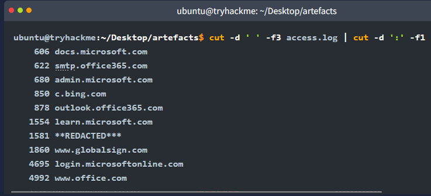
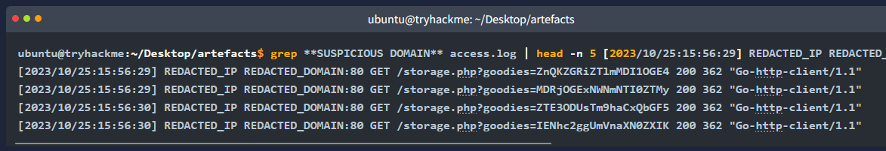
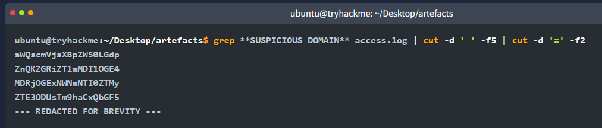
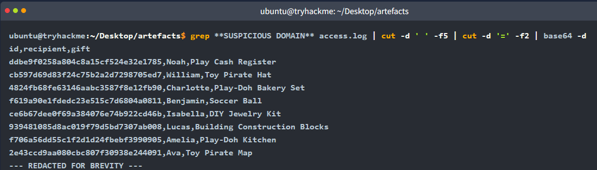

# Log Analysis

## View Linux Commands Discussion

These Linux commands are useful for quickly inspecting, trimming, and analyzing log files from the terminal.

### `cat`

- Short for **concatenate**.
- Combines and displays the contents of files.
- When used with a single file, it prints the file contents to the terminal.
- Best for short files or quick confirmation that a file contains readable data.

### `less`

- Views the contents of a file one page at a time.
- Useful for large log files because it prevents the terminal from being overwhelmed by too much output.
- Navigation:
  - `Up` / `Down`: move one line at a time.
  - `Page Up` or `b`: move one page up.
  - `Page Down` or `Space`: move one page down.
  - `q`: quit the viewer.

### `head`

- Displays the beginning of a file.
- Useful for quickly checking the structure, field order, or sample data in a log.
- Use `-n` to specify how many lines to display.

```bash
head -n 10 access.log
```

### `tail`

- Displays the end of a file.
- Useful for reviewing the most recent log entries.
- Use `-n` to specify how many lines to display.

```bash
tail -n 10 access.log
```

### `wc`

- Stands for **word count**.
- Counts lines, words, and characters in a file.
- Useful for quickly determining how many log entries exist when each entry is stored on a separate line.

```bash
wc -l access.log
```

### `nl`

- Stands for **number lines**.
- Displays file contents with line numbers.
- Useful when you need line references for trimming, reviewing, or documenting suspicious log entries.

```bash
nl access.log
```

### `cut`

- Extracts specific sections, or columns, from each line of a file or input stream.
- Common options:
  - `-d`: defines the delimiter.
  - `-f`: selects the field position.
- Useful for isolating specific log fields, such as source IP, domain, HTTP method, or status code.

```bash
cut -d ' ' -f3 access.log
```

### Pipe: `|`

- Connects two or more commands.
- The output of one command becomes the input for the next command.
- Useful for building lightweight log-analysis pipelines.

```bash
cut -d ' ' -f3 access.log | sort | uniq -c
```

### `grep`

- Searches for text within files or input streams.
- Useful for finding log entries that contain a domain, IP address, username, error code, or suspicious string.

```bash
grep "frostlings.bigbadstash.thm" access.log
```

### `sort`

- Sorts lines of text from a file or input stream.
- Useful before using `uniq`, because `uniq` only groups adjacent identical lines.

```bash
sort access.log
```

### `uniq`

- Filters or counts unique lines from sorted input.
- Often paired with `sort` and `uniq -c` to count repeated values.

```bash
cut -d ' ' -f3 access.log | sort | uniq -c
```

## Chopping Down the Proxy Log

Log McBlue configured the Squid proxy server to use the following log format. Understanding the field position is important because the later commands use `cut` to extract specific fields.

| Position | Field | Example Value |
|---:|---|---|
| 1 | Timestamp | `[2023/10/25:16:17:14]` |
| 2 | Source IP | `10.10.140.96` |
| 3 | Domain and Port | `storage.live.com:443` |
| 4 | HTTP Method | `GET` |
| 5 | HTTP URI | `/` |
| 6 | Status Code | `400` |
| 7 | Response Size | `630` |
| 8 | User Agent | `"Mozilla/5.0 (Windows NT 10.0; Win64; x64) AppleWebKit/537.36 (KHTML, like Gecko) Chrome/118.0.0.0 Safari/537.36"` |

Operationally, this means:

- Field 2 identifies which workstation made the request.
- Field 3 identifies the contacted domain and port.
- Field 5 identifies the requested URI path or query string.
- Field 6 identifies the HTTP response status.
- Field 8 can help identify the browser, script, or tool that generated traffic.

## Hunting Down the Malicious Traffic

### Identify the most frequently accessed domains

Start by listing the top domains accessed by users. The command extracts field 3, removes the port, sorts the domains, counts duplicates, sorts numerically, and displays the last 10 results.

```bash
cut -d ' ' -f3 access.log | cut -d ':' -f1 | sort | uniq -c | sort -n | tail -n 10
```

Because the list is sorted in ascending order, `tail -n 10` shows the domains with the highest connection counts.



### Investigate the suspicious domain

Most of the top domains appear to be Microsoft-owned domains. One domain stands out as unusual. Use `grep` with that suspicious domain and preview the first few matching events.

```bash
grep "SUSPICIOUS_DOMAIN" access.log | head -n 5
```

Replace `SUSPICIOUS_DOMAIN` with the unusual domain identified from the top-domain list.



### Extract the suspicious URI parameter

The requests to the suspicious domain contain unusual data in the `goodies` parameter. Extract the HTTP URI field, then split on the equals sign to isolate the encoded value.

```bash
grep "SUSPICIOUS_DOMAIN" access.log | cut -d ' ' -f5 | cut -d '=' -f2
```



### Decode suspected Base64 data

The extracted values appear to be Base64 encoded. Pipe the extracted value into `base64 -d` to decode it.

```bash
grep "SUSPICIOUS_DOMAIN" access.log | cut -d ' ' -f5 | cut -d '=' -f2 | base64 -d
```



The decoded output appears to contain sensitive AntarctiCrafts data. This indicates potential data exfiltration through proxy web requests.

## Answer the Questions Below

The Squid proxy log uses the same field structure described above. These commands are designed to answer the investigation questions from `access.log`.

### How many unique IP addresses are connected to the proxy server?

Use field 2 because it contains the source IP address.

```bash
cut -d ' ' -f2 access.log | sort | uniq | wc -l
```

### How many unique domains were accessed by all workstations?

Use field 3, then remove the port by splitting on `:`.

```bash
cut -d ' ' -f3 access.log | cut -d ':' -f1 | sort | uniq | wc -l
```

### What status code is generated by the HTTP requests to the least accessed domain?

The source notes identify `partnerservices.getmicrosoftkey.com` as the least accessed domain. Field 6 contains the HTTP status code.

```bash
grep "partnerservices.getmicrosoftkey.com" access.log | cut -d ' ' -f6 | uniq
```

### Based on the high count of connection attempts, what is the name of the suspicious domain?

Sort the domain counts in descending order and review the most frequently accessed domains.

```bash
cut -d ' ' -f3 access.log | cut -d ':' -f1 | sort | uniq -c | sort -n -r | head -n 10
```

The source notes identify the suspicious domain as:

```text
frostlings.bigbadstash.thm
```

### What is the source IP of the workstation that accessed the malicious domain?

Use `grep` to filter to the malicious domain, then extract field 2.

```bash
grep "frostlings.bigbadstash.thm" access.log | cut -d ' ' -f2 | sort | uniq
```

### How many requests were made on the malicious domain in total?

The original source repeated the previous source-IP command for this question. That command identifies the source workstation, but it does not count requests. To count total requests to the malicious domain, use one of the following commands.

```bash
grep -c "frostlings.bigbadstash.thm" access.log
```

or:

```bash
grep "frostlings.bigbadstash.thm" access.log | wc -l
```

### Having retrieved the exfiltrated data, what is the hidden flag?

Extract the encoded parameter value from field 5, decode it from Base64, and search for the flag format.

```bash
grep "frostlings.bigbadstash.thm" access.log | cut -d ' ' -f5 | cut -d '=' -f2 | base64 -d | grep 'THM{'
```

## Rapid Reference

### Proxy log field positions

| Needed Information | Field Position | Extraction Pattern |
|---|---:|---|
| Source workstation IP | 2 | `cut -d ' ' -f2` |
| Domain and port | 3 | `cut -d ' ' -f3` |
| Domain only | 3 | `cut -d ' ' -f3 | cut -d ':' -f1` |
| HTTP method | 4 | `cut -d ' ' -f4` |
| URI and query string | 5 | `cut -d ' ' -f5` |
| Status code | 6 | `cut -d ' ' -f6` |
| Response size | 7 | `cut -d ' ' -f7` |
| User agent | 8 | Use careful parsing because spaces may appear inside the quoted user agent. |

### Common log-analysis command patterns

| Goal | Command Pattern |
|---|---|
| Count unique values | `cut ... | sort | uniq | wc -l` |
| Count repeated values | `cut ... | sort | uniq -c` |
| Find top values | `cut ... | sort | uniq -c | sort -n -r | head` |
| Find bottom values | `cut ... | sort | uniq -c | sort -n | head` |
| Filter by indicator | `grep "indicator" access.log` |
| Preview matches | `grep "indicator" access.log | head -n 5` |
| Decode Base64 values | `... | base64 -d` |

### Investigation logic

1. Understand the log format before cutting fields.
2. Identify high-volume domains.
3. Separate normal high-volume services from suspicious domains.
4. Filter traffic to the suspicious domain.
5. Extract unusual parameters from the URI.
6. Decode suspicious encoded values.
7. Validate whether decoded content indicates sensitive data exposure or exfiltration.
