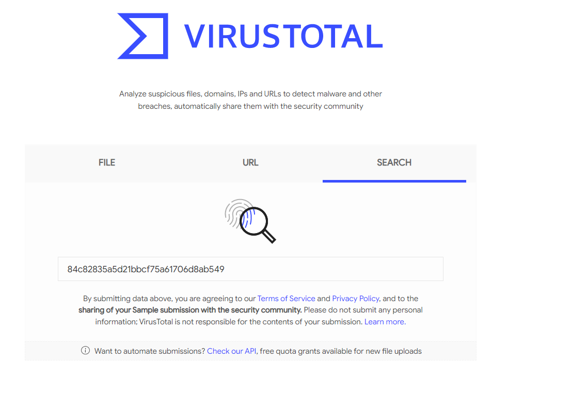
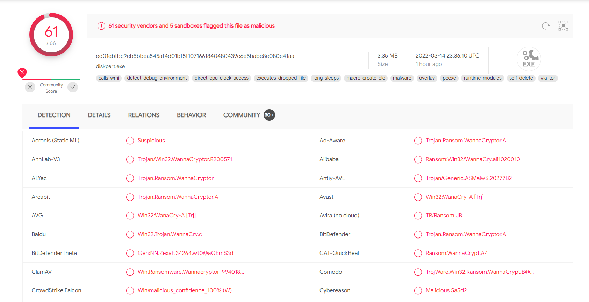
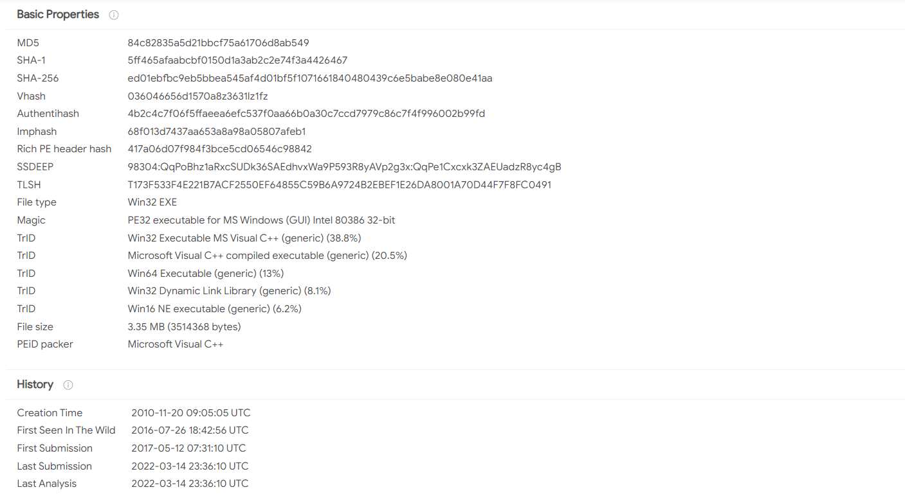
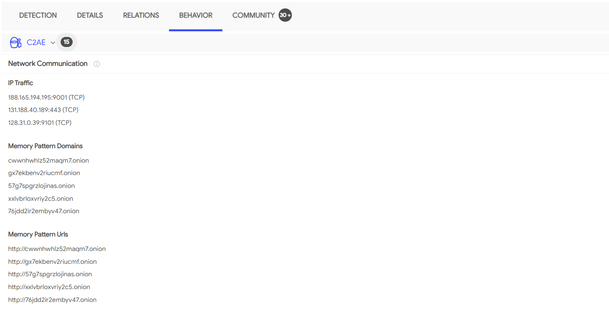
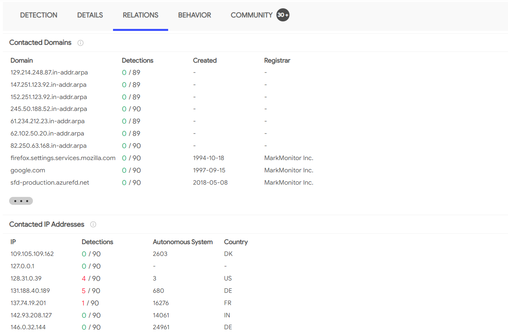
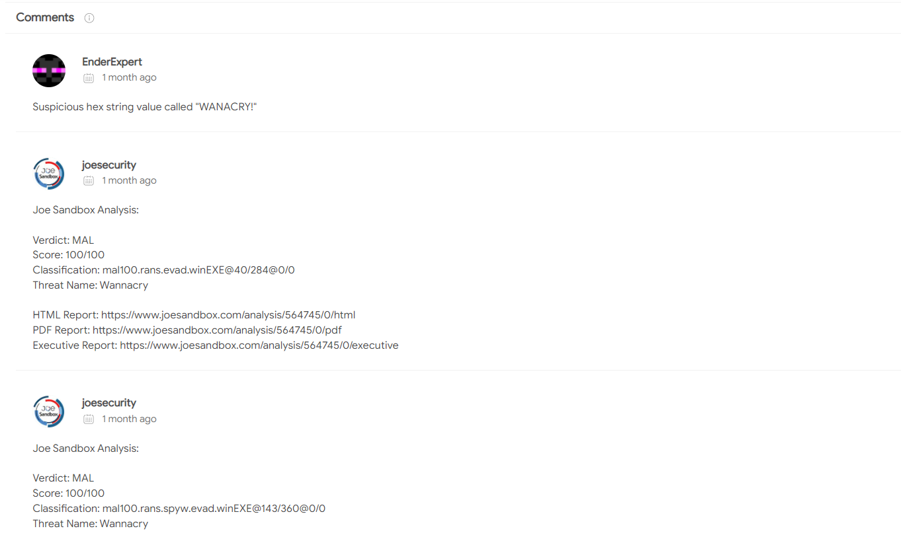
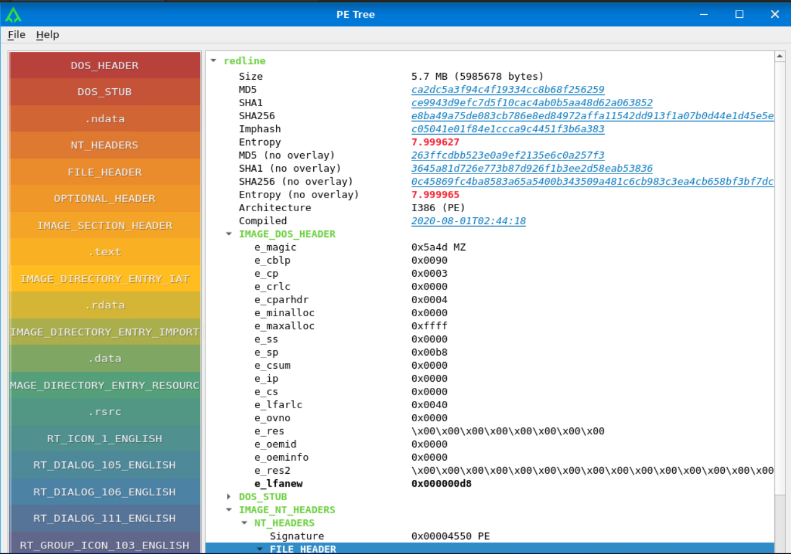

# Intro to Malware Analysis

## Malware Analysis

### Definition

* Malware = MALicious softWARE
* Any software with malicious purpose
* Malware is categorized by behavior

### Malware Analysis Goals

* Investigate suspicious software
* Determine:

  * Malware behavior
  * Environmental impact
  * Detection opportunities
  * Remediation requirements

### Security Roles Performing Malware Analysis

* Security Operations Teams

  * Analyze malware
  * Create detections for malicious activity
* Incident Response Teams

  * Determine damage
  * Remediate and revert changes
* Threat Hunt Teams

  * Identify IOCs
  * Hunt malware across networks
* Malware Researchers

  * Improve security product detections
* Threat Research Teams

  * Discover exploited vulnerabilities
  * Improve security features in applications/platforms

### Malware Analysis Safety

#### Key Principle

* Malware can be as dangerous as a weapon if handled carelessly

#### Safety Precautions

* Never analyze malware on systems not dedicated to malware analysis
* Store malware in password-protected archives when not in use
* Extract malware only inside isolated environments
* Use isolated environments that can revert to clean snapshots
* Disable or monitor internet connectivity
* Revert analysis environments after every session to avoid contamination

---

## Techniques of Malware Analysis

### General Concepts

* Malware analysis is similar to solving a puzzle
* Analysts use multiple tools and techniques to identify malware behavior

### Common Malware Artifacts

* Executable files

  * Binaries
  * PE files (Portable Executables)
* Malicious documents
* Packet captures (PCAPs)

### Primary Analysis Categories

* Static Analysis
* Dynamic Analysis

---

### Static Analysis

#### Definition

* Analyze malware without execution

#### Common Activities

* Review PE file properties
* Examine document properties
* Search for strings
* Inspect PE headers
* Review disassembled code

#### Purpose

* Gather information safely before execution
* Identify malware characteristics and capabilities

#### Common Malware Evasion Techniques

* Obfuscation
* Packing
* Hidden properties

#### Result

* Analysts often use Dynamic Analysis to bypass these protections

---

### Dynamic Analysis

#### Definition

* Execute malware in a controlled environment
* Observe runtime behavior

#### Important Concept

* Malware must execute to fulfill its purpose
* Obfuscation becomes less effective once malware runs

Image depicting a malware under observation with a microscope

#### Why Dynamic Analysis Is Important

* Static analysis may not reveal enough information
* Malware may hide functionality until runtime

#### Dynamic Analysis Techniques

* Execute malware in VMs
* Use monitoring tools
* Use automated sandboxes

#### Advantages

* Observe:

  * Process activity
  * File modifications
  * Registry changes
  * Network activity
* Reduce environmental noise
* Attribute observed behavior directly to malware

#### Dynamic Analysis Evasion

* Malware may detect controlled environments
* Malware may switch to benign execution paths when analysis is detected

---

### Advanced Malware Analysis

#### Purpose

* Analyze malware that evades basic analysis

#### Common Tools

* Disassemblers

  * Convert binaries into assembly code
  * Allow static instruction review
* Debuggers

  * Attach to running processes
  * Pause/resume execution
  * Inspect:

    * CPU state
    * Memory
    * Runtime instructions

---

## Basic Static Analysis

### Purpose

* Initial malware assessment
* “Size up” malware before deeper analysis

### Information Commonly Identified

* Windows API usage
* Packing indicators
* Malware complexity
* Estimated analysis effort

### Environment Recommendations

* Use isolated Virtual Machines
* Create clean snapshots before analysis
* Revert after each session
* Avoid production/live systems

### Recommended Distribution

* Remnux

  * Reverse Engineering Malware Linux
  * Purpose-built for malware analysis
  * Includes preinstalled analysis tools

---

### Examining File Types

#### Why File Type Validation Matters

* Malware authors may use misleading file extensions
* Analysts should verify actual file types independently

#### Linux `file` Command

* Determines actual file type

#### Help Commands

`man file` or `file --help`

#### Usage

`file <filename>`

```bash
    user@machine$ file wannacry 
    wannacry: PE32 executable (GUI) Intel 80386, for MS Windows
    user@machine$
```

#### Important Observations

* PE32 executable
* GUI application
* Compiled for Microsoft Windows
* Intel 80386 architecture

  * Indicates 32-bit x86 compatibility

---

### Examining Strings

#### Purpose

* Extract readable strings from files
* Identify clues about malware behavior

#### Linux `strings` Command

##### Help Commands

`man strings` or `strings --help`

##### Usage

`strings <filename>`

#### Why Strings Matter

* Strings often reveal:

  * Windows APIs
  * URLs
  * Libraries
  * Error messages
  * Behavioral indicators

#### Example

* `URLDownloadToFile`

  * Indicates likely internet download behavior

```bash

    user@machine$ strings wannacry
    !This program cannot be run in DOS mode.
    Rich
    .text
    `.rdata
    @.data
    .rsrc
    49t$
    TVWj
    PVVh
    tE9u
    .
    .
    .
    .
    inflate 1.1.3 Copyright 1995-1998 Mark Adler
    n;^
    Qkkbal
    i]Wb
    9a&g
    MGiI
    wn>Jj
    #.zf
    +o*7
    - unzip 0.15 Copyright 1998 Gilles Vollant
    CloseHandle
    GetExitCodeProcess
    TerminateProcess
    WaitForSingleObject
    CreateProcessA
    GlobalFree
    GetProcAddress
    LoadLibraryA
    GlobalAlloc
    SetCurrentDirectoryA
    GetCurrentDirectoryA
    GetComputerNameW
    SetFileTime
    SetFilePointer
    MultiByteToWideChar
    GetFileAttributesW
    GetFileSizeEx
    .
    .
    .
    .
    user@machine$

```

#### Key Observations from Example

* DOS Stub

  * `!This program cannot be run in DOS mode`
* Windows API references:

  * `CloseHandle`
  * `TerminateProcess`
  * `CreateProcessA`
* Compression library references:

  * zlib
  * unzip

#### Handling Large Output

##### Redirect Output to File

```bash
    user@machine$ strings wannacry>str
    user@machine$
```

##### Paginate Output

```bash

    user@machine$ strings wannacry | more
    !This program cannot be run in DOS mode.
    Rich
    .text
    `.rdata
    @.data
    .rsrc
    49t$
    TVWj
    PVVh
    tE9u
    PVVW
    SVWjcf
    X_^[
    X_^[
    ^t19
    QPPh
    tXVP
    X_^]
    ^t)9
    X_^[]
    WWWWWPj
    SjJ3
    X[_^
    Yu#j
    uSh8
    Yu8S
    SSh 
    hn!@
    SVWj@
    --more--
```

#### Additional Notes

* Spacebar scrolls through output
* Additional learning:

  * `Mal:Strings`

---

### Calculating Hashes

#### Purpose

* File identification
* Malware tracking
* Information sharing between analysts

#### Important Characteristics

* Even one-bit changes produce different hashes
* Hashes uniquely identify file versions

#### Common Hash Types

* MD5
* SHA1
* SHA256

#### Example Command

`md5sum <filename>`

```bash
    user@machine$ md5sum wannacry 
    84c82835a5d21bbcf75a61706d8ab549  wannacry
    user@machine$
```

#### Additional Commands

* `sha1sum`
* `sha256sum`

---

### AV scans and VirusTotal

#### Purpose

* Identify malware classifications
* Leverage community research

#### Operational Security Guidance

* Prefer searching hashes instead of uploading malware
* Upload samples only when appropriate and authorized

#### VirusTotal Capabilities

* 60+ AV engine results
* Vendor classifications
* Metadata
* Submission history
* Behavioral analysis
* Relationships between samples
* Community comments



#### Details Tab Information

* First submission
* Last submission
* Sample metadata





Sometimes it also provides information about the behaviour of a sample and its relations as seen in different environments online.

Image shows Virustotal interface




#### Community Comments

* Additional analyst context
* Shared observations



#### Example Outcome

* Sample identified as WannaCry ransomware

---

## The PE File Header



### Reference

* [PE File Header](https://learn.microsoft.com/en-us/windows/win32/debug/pe-format#file-headers)

### Purpose

* Stores metadata about PE files
* Provides valuable analysis information

### Information Commonly Found

* Imports/exports
* Sections
* Metadata
* Compilation details

---

### Imports/Exports

#### Why Imports Matter

* PE files reuse operating system functionality
* Reduces executable size
* Avoids reimplementing common functionality

#### Example

* `RegQueryValue`

  * Queries Windows Registry values

#### Behavioral Indicators

* `InternetOpen`

  * Internet communication
* `URLDownloadToFile`

  * File downloading behavior

#### Exports

* Functions exposed for other binaries
* Common in DLLs

---

#### Sections

##### Common PE Sections

* **.text**

  * Executable CPU instructions

* **.data**

  * Global variables/data

* **.rsrc**

  * Resources:

    * Images
    * Icons
    * Other assets

---

### Analysing header using the pecheck utility

#### Purpose

* Extract PE header details

```bash
user@machine$ pecheck wannacry 
PE check for 'wannacry':
Entropy: 7.995471 (Min=0.0, Max=8.0)
MD5     hash: 84c82835a5d21bbcf75a61706d8ab549
SHA-1   hash: 5ff465afaabcbf0150d1a3ab2c2e74f3a4426467
SHA-256 hash: ed01ebfbc9eb5bbea545af4d01bf5f1071661840480439c6e5babe8e080e41aa
SHA-512 hash: 90723a50c20ba3643d625595fd6be8dcf88d70ff7f4b4719a88f055d5b3149a4231018ea30d375171507a147e59f73478c0c27948590794554d031e7d54b7244
.text entropy: 6.404235 (Min=0.0, Max=8.0)
.rdata entropy: 6.663571 (Min=0.0, Max=8.0)
.data entropy: 4.455750 (Min=0.0, Max=8.0)
.rsrc entropy: 7.999868 (Min=0.0, Max=8.0)
Dump Info:
----------DOS_HEADER----------

[IMAGE_DOS_HEADER]
0x0        0x0   e_magic:                       0x5A4D    
0x2        0x2   e_cblp:                        0x90      
0x4        0x4   e_cp:                          0x3       
.
.
.
.
.
[IMAGE_IMPORT_DESCRIPTOR]
0xD5D0     0x0   OriginalFirstThunk:            0xD60C    
0xD5D0     0x0   Characteristics:               0xD60C    
0xD5D4     0x4   TimeDateStamp:                 0x0        [Thu Jan  1 00:00:00 1970 UTC]
0xD5D8     0x8   ForwarderChain:                0x0       
0xD5DC     0xC   Name:                          0xDC84    
0xD5E0     0x10  FirstThunk:                    0x8000    

ADVAPI32.dll.CreateServiceA Hint[100]
ADVAPI32.dll.OpenServiceA Hint[431]
ADVAPI32.dll.StartServiceA Hint[585]
ADVAPI32.dll.CloseServiceHandle Hint[62]
ADVAPI32.dll.CryptReleaseContext Hint[160]
ADVAPI32.dll.RegCreateKeyW Hint[467]
ADVAPI32.dll.RegSetValueExA Hint[516]
ADVAPI32.dll.RegQueryValueExA Hint[503]
ADVAPI32.dll.RegCloseKey Hint[459]
ADVAPI32.dll.OpenSCManagerA Hint[429]
. 
.
.
.
.
.
```

#### Important Information Revealed

* Entropy values
* File hashes
* Section information
* Imported APIs
* Linked libraries

#### Example Library

* `ADVAPI32.dll`

#### Important Note

* PECheck reveals significantly more information than covered in this lesson
* Future malware analysis modules cover deeper PE analysis

---

## Basic Dynamic Analysis

### Purpose

* Reveal runtime behavior hidden during static analysis

### Key Idea

* Malware often hides functionality until execution

### Environment Requirements

* Isolated VM
* Snapshot capability
* Revert capability

### Important Warning

* Never analyze malware on live systems

---

### Introduction to Sandboxes

#### Definition

* Isolated analysis environments
* Simulate target systems

#### Origin of the Term

* Borrowed from military planning/training concepts

#### Core Technology

* Virtual Machines

---

### Construction of a sandbox

#### Important Characteristics

* Realistic target environment
* Snapshot/revert capability
* Monitoring visibility
* Network control

#### Monitoring Tools

* Procmon
* ProcExplorer
* Regshot

#### Network Tools

* Wireshark
* tcpdump

#### Additional Infrastructure

* Dummy servers
* Controlled web servers
* Secure log/sample transfer mechanisms

#### Important Risk

* Shared folders can expose host files to malware

---

### Open Source Sandboxes

#### Benefits

* Ready-made frameworks
* Extensible/customizable
* Simplify dynamic analysis

---

#### Cuckoo's Sandbox

##### Reference

* [Cuckoo's Sandbox](https://github.com/kevoreilly/CAPEv2)

##### Background

* Originated from Google Summer of Code (2010)

##### Advantages

* Large community support
* Strong documentation
* Extensive customization
* Popular in SOCs and home labs

##### Current Status

* Archived
* No Python 3 support
* Considered obsolete

---

#### CAPE

##### Reference

* [CAPE Sandbox](https://github.com/kevoreilly/CAPEv2)

##### Features

* Memory dumping
* Debugging support
* Packed malware analysis
* Python 3 support
* Active development

##### Additional Note

* More advanced than Cuckoo
* Better suited for experienced analysts

---

#### Online Sandboxes

##### References

* [Online Cuckoo](https://cuckoo.cert.ee/)
* [Any.run](https://any.run/)
* [Intezer](https://analyze.intezer.com/))
* [Hybrid Analysis](https://hybrid-analysis.com/)

##### Advantages

* No local setup/maintenance required

##### Operational Guidance

* Prefer searching hashes before uploading samples
* Avoid exposing sensitive malware

---

## Anti-Analysis Techniques

### Purpose

* Prevent or hinder malware analysis

### Core Idea

* Malware authors actively attempt to defeat analyst tools and techniques

---

### Packing and Obfuscation

#### Goals

* Hide functionality
* Defeat static analysis

#### Common Techniques

* Compression
* Encryption
* Obfuscation

#### Typical Result

* Garbage/unreadable strings
* Hidden imports
* Reduced visibility

```bash
user@machine$ strings zmsuz3pinwl
!This program cannot be run in DOS mode.
RichH
.rsrc
.data
.adata
dApB
Qtq5
wn;3b:TC,n
*tVlr
D6j[
^sZ"4V
JIoL
j~AI
tYFu
7^V1
vYB09
"PeHy
M4AF#
3134
%}W\+
3A;a5
dLq<
```

#### Follow-Up Analysis with PECheck

```bash
user@machine$ pecheck zmsuz3pinwl 
PE check for 'zmsuz3pinwl':
Entropy: 7.978052 (Min=0.0, Max=8.0)
MD5     hash: 1ebb1e268a462d56a389e8e1d06b4945
SHA-1   hash: 1ecc0b9f380896373e81ed166c34a89bded873b5
SHA-256 hash: 98c6cf0b129438ec62a628e8431e790b114ba0d82b76e625885ceedef286d6f5
SHA-512 hash: 6921532b4b5ed9514660eb408dfa5d28998f52aa206013546f9eb66e26861565f852ec7f04c85ae9be89e7721c4f1a5c31d2fae49b0e7fdfd20451191146614a
 entropy: 7.999788 (Min=0.0, Max=8.0)
 entropy: 7.961048 (Min=0.0, Max=8.0)
 entropy: 7.554513 (Min=0.0, Max=8.0)
.rsrc entropy: 6.938747 (Min=0.0, Max=8.0)
 entropy: 0.000000 (Min=0.0, Max=8.0)
.data entropy: 7.866646 (Min=0.0, Max=8.0)
.adata entropy: 0.000000 (Min=0.0, Max=8.0)
Dump Info:
----------Parsing Warnings----------

Suspicious flags set for section 0. Both IMAGE_SCN_MEM_WRITE and IMAGE_SCN_MEM_EXECUTE are set. This might indicate a packed executable.

Suspicious flags set for section 1. Both IMAGE_SCN_MEM_WRITE and IMAGE_SCN_MEM_EXECUTE are set. This might indicate a packed executable.

Suspicious flags set for section 2. Both IMAGE_SCN_MEM_WRITE and IMAGE_SCN_MEM_EXECUTE are set. This might indicate a packed executable.

Suspicious flags set for section 3. Both IMAGE_SCN_MEM_WRITE and IMAGE_SCN_MEM_EXECUTE are set. This might indicate a packed executable.

Suspicious flags set for section 4. Both IMAGE_SCN_MEM_WRITE and IMAGE_SCN_MEM_EXECUTE are set. This might indicate a packed executable.

Suspicious flags set for section 5. Both IMAGE_SCN_MEM_WRITE and IMAGE_SCN_MEM_EXECUTE are set. This might indicate a packed executable.

Suspicious flags set for section 6. Both IMAGE_SCN_MEM_WRITE and IMAGE_SCN_MEM_EXECUTE are set. This might indicate a packed executable.

Imported symbols contain entries typical of packed executables.
```

#### Indicators of Packed Malware

* High entropy
* Missing `.text` section
* Executable/writeable sections
* Limited imports
* Suspicious section flags

#### Common Analyst Response

* Unpack malware before deeper analysis

---

### Sandbox Evasion

#### Long Sleep Calls

* Malware delays execution
* Attempts to outlast sandbox runtime limits

#### User Activity Detection

* Waits for:

  * Mouse movement
  * Keyboard input
* Detects automated sandbox interaction patterns

#### Footprinting User Activity

* Checks for:

  * Office history
  * Browser history
  * User-generated files
* Lack of activity suggests sandbox environments

#### Detecting VMs

* Identifies virtualization artifacts
* Detects:

  * VMware
  * VirtualBox
* Malware may terminate or alter execution

#### Important Note

* These examples are not exhaustive
* Advanced malware analysis explores these techniques further

