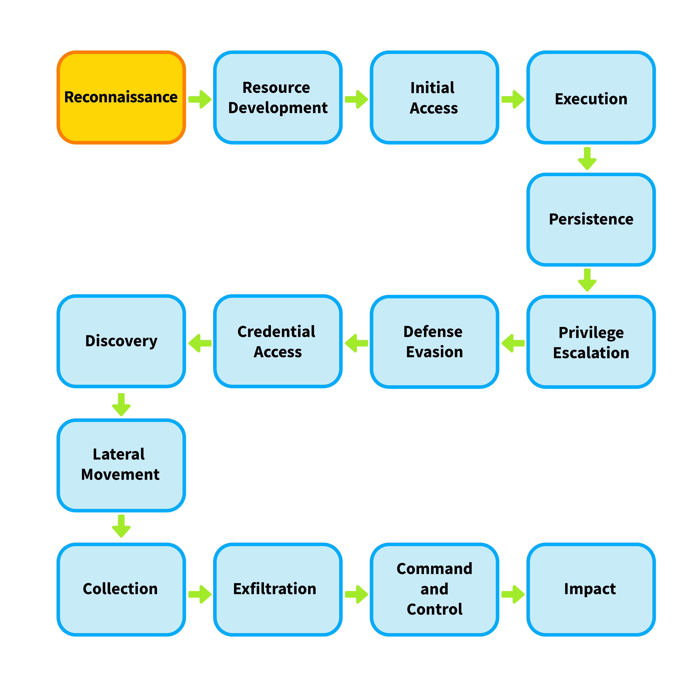
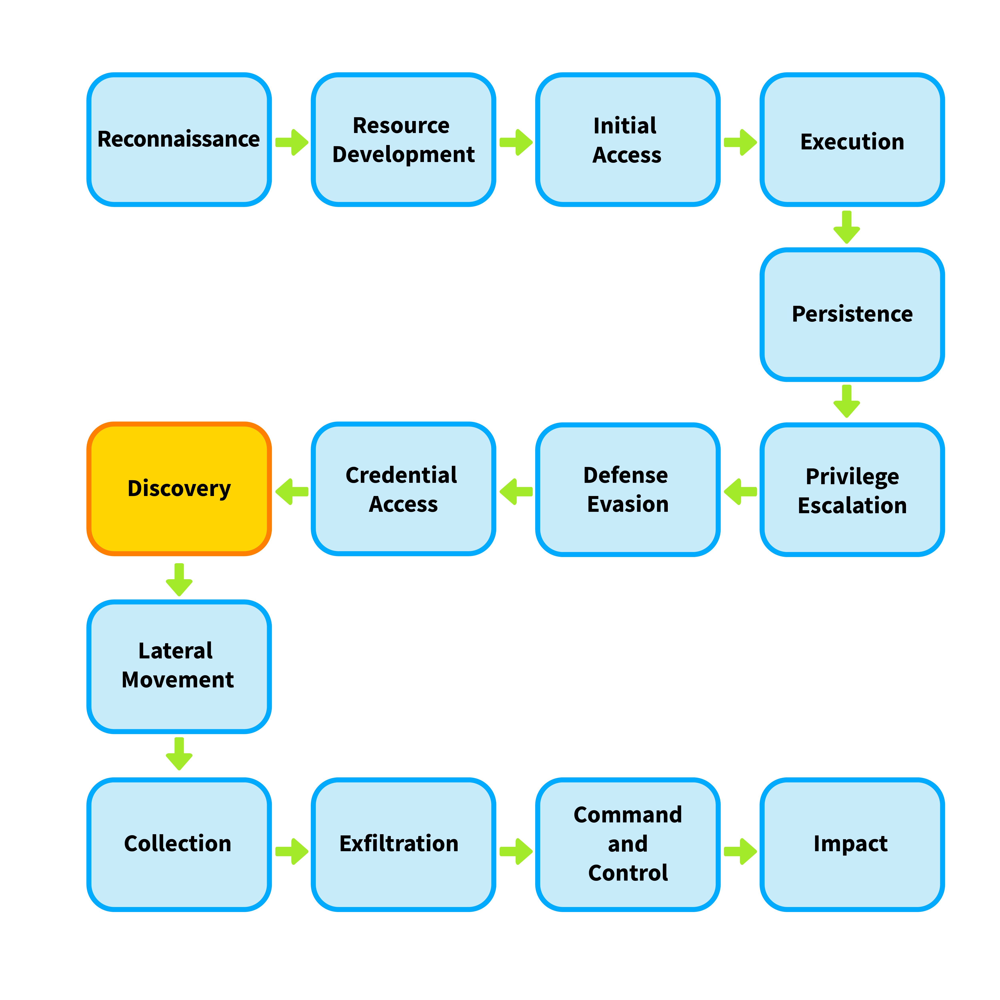

# Network Discovery Detection

## Network Discovery

### Attackers and Network Discovery

Discovery of attack surface  

- What assets can be accessed
- Identify IP addresses, ports, OS, and services running on these assets  
- Identify versions of services running
- Identify vulnerabilities in identified services

### Defenders and Network Discovery

- Inventory and document organizational assets
- Disabling IP, port, services not required for public facing purposes
- Patch, at a minimum, exploitable vulnerabilities

### The Challenge in Detecting Network Discovery

Attacker, defenders, and researchers all scan  

- allowlist known internal and benign external scanners to minimize false positive alerts
- Integrate threat intelligence with detection use cases and flag scanning activity only from known malicious or suspicious sources  
- Threat intelligence can be used to raise the severity of alerts instead of simply triggering alerts

## External vs. Internal Scanning

### External Scanning Activity

- source of the scan is an external IP
- destination of the IP is an organizational asset  
- represents reconnaissance phase of an attack  
- low-severity scanning  
- SOC analyst can block the offending IP addressses on the perimeter firewall
- Attackers switch IP addresses frequently  
- 
  

### Internal Scanning Activity

- source and destination are both internal, possibly private  
- Indicates **Discovery** phase of an attack
- Indicates attacker has a foothold in the network

  

- high severity  
- requires verification scans are not authorized
- blocking is ineffective  

## Horizontal vs. Vertical Scanning

### Horizontal Scanning

- Scanning the same port across multiple destination IP addresses  
- seeks to identify which hosts expose a particluar port  
- e.g. exploiting SMBv1 vulnerability "WannaCry" rnsomewhare
- shows as sam source IP, signle destination port, multiple destination IP

### Vertical Scanning

- single host IP address is scanned across multiple ports
- identify all exposed services on single host  
  
## The Mechanics of Scanning

### 1. Ping Sweep

* **Purpose:** Identify active (online) hosts on a network
* **Method:**

  * Sends **ICMP (Internet Control Message Protocol) Echo Requests**
  * Online hosts respond with **ICMP Echo Replies**
* **Advantages:**

  * Simple and fast
* **Limitations:**

  * Often blocked by firewalls or security controls
  * Less effective in modern environments

---

### 2. SYN Scan (Half-Open Scan)

* **Purpose:** Detect open ports and active hosts
* **Method:**

  * Exploits the **TCP three-way handshake**:

    1. SYN →
    2. SYN-ACK ←
    3. ACK →
  * Scanner sends **SYN**:

    * **SYN-ACK received:** Host is online, port is open
    * No full handshake completed (connection not fully established)
* **Advantages:**

  * Stealthier than full connection scans
  * Blends in with normal network traffic
* **Limitations:**

  * Still detectable by advanced monitoring systems

---

### 3. NULL Scan (Inferred)

* **Purpose:** Identify open or closed ports
* **Method:**

  * Sends a **packet with no flags set (empty packet)**
  * Responses:

    * **ICMP Port Unreachable:** Port is closed, host is online
    * **No response:** Possibly open (or filtered)
    * **Unexpected response:** Likely open
* **Advantages:**

  * Can bypass some basic filtering rules
* **Limitations:**

  * Slow due to timeout-based detection
  * Unreliable (lack of response is ambiguous)

---

## Organizational Use of Scanning

* **Common Goals:**

  * Identify vulnerabilities
  * Detect unauthorized (rogue) assets
  * Reduce attack surface

* **Operational Considerations:**

  * Track:

    * Source IP addresses of scans
    * Types of scans being used
    * Scheduled scan times
  * Exclude known internal scans from detection systems to:

    * Reduce alert noise
    * Improve detection accuracy

---

## Key Takeaways

* Different scanning techniques balance **speed, stealth, and reliability**
* Modern defenses reduce effectiveness of basic scans like ping sweeps
* Security teams must distinguish between **legitimate internal scans** and **malicious activity**
