# Network Traffic Basics

## What is the Purpose of Network Traffic Analysis

### DNS Tunneling and Beaconing

Receiving unusual number of DNS queries from a host to the same TLD

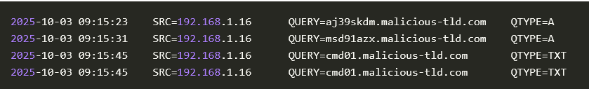  

DNS Logs review some information, but not enough to draw a conclusion

    Query and querytype
    Subdomain and top-level domain: We can check tools like abuseDB or VirusTotal to check if the domain is malicious
    Host IP: We can identify the system sending out the DNS queries
    Destination IP: We can use tools like AbuseIPDB (opens in new tab) or VirusTotal (opens in new tab) to verify if the IP is flagged as malicious
    Timestamp: We can build a timeline mapping out the different suspicious queries

Further investigation requires investigating the content of DNS query and replies.  

### Why should we analyze Network Traffic?

#### Purpose of Network Traffice Analysis

Monitor network performance  
Chekc for abnormalities in teh network (e.g. suddent performance peacks, slow network, etc..)  
Inspect the content of suspicious communications internally and exeternally (e.g. exfiltration via DNS, download of malicious ZIP file over HTTP, lateral movement, etc...)  

#### Benefit to the SOC

Detecting suspicious or malicious activity
Reconstructing attacks during incidnent response
Verifying and validating alerts

## What Network Traffic Can We Observe

### Application

Application Header Information  
Application data (payload) 

#### Example 

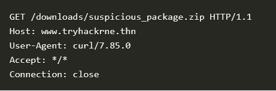  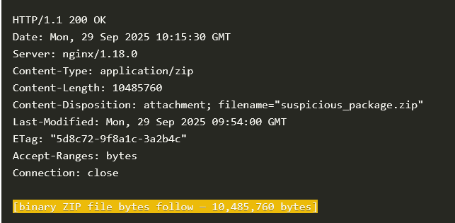  

Shows the client requests a file named `suspicious_package.zip`, but not the content of the suspicious file.  

### Transport

TCP or UDP headers from firewall logs

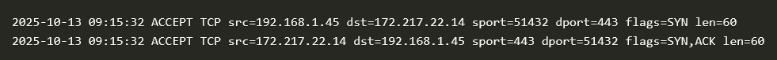  

Session hijacking is detected by analyzing sequence numbers included in headers. Sequence numbers with suddenly large spaces indicate further investigation.  

The first 3 lines show a normal TCP 3-way handshake
Lines 4 and 5 show legitimate data transfer
Line 6 shows a packet from another source trying to inject itself into the session. Note the massive jump in the sequence number

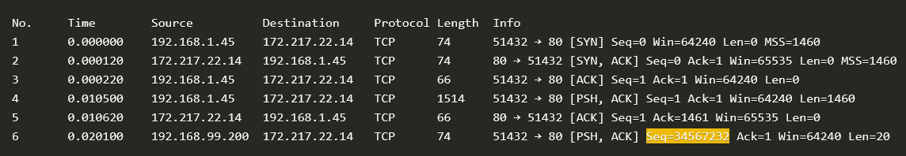  

### Internet

When the transport layer sends down a segment, the internet layer also adds its header.  
If the segment is larger than the Maximum Transmission Unit (MTU), it will be divided into fragments, and a header will be added to each fragment.  
The fields that are most often logged are the source and destination IP and TTL.  
Detecting fragmentation attacks requires inspection of fragment offsets and total length fields as well.  
There are different variations of a fragmentation attack.  
An attacker can create tiny fragments to evade the IDS or mess up the reassembly of fragments by using overlapping byte ranges.  
The example below shows overlapping byte ranges. The offset in line 3 (highlighted in yellow) overlaps with the one in line 2.  
This means that the complete packet can be reassembled one way or another.  
Attackers can use this technique to bypass an IDS, for example.  

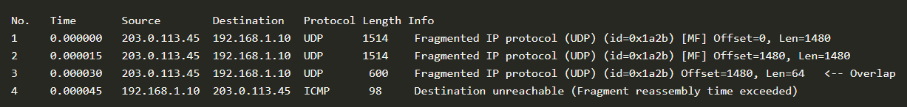  

### link

Once the internet layer finishes encapsulation, the IP packet is sent to the link layer.  
The link layer adds its header as well, containing more addressing information.  
Most logs will display the source and destination MAC addresses. For certain types of attacks, for example, ARP poisoning or spoofing, the information in the logs won't be sufficient.  
For these types of attacks, we need the full packet and context.  
What you, for example, can't see in a log is when the MAC address appears from multiple interfaces or when many gratuitous ARP packets are sent out with conflicting MAC addresses.  
The example below shows a packet capture detailing an ARP poisoning attack. The host with IP 192.168.1.200 is replying to each ARP request with the same MAC. 

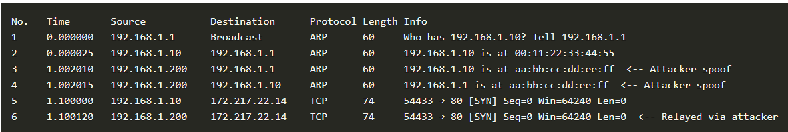  

## Network Traffic sources and Flows

## Summary: Network Traffic Sources and Flows

### 1. **Sources**

#### 1.1. **Intermediary Sources**

* These devices typically pass traffic but generate significantly less traffic than endpoint devices.
* Examples include:

  * **Firewalls**
  * **Switches**
  * **Web Proxies**
  * **Routers**
  * **Access Points**
  * **Wireless LAN Controllers**
  * Infrastructure of Internet Service Providers (ISP)
* **Traffic Types**:

  * Routing protocols (e.g., EIGRP, OSPF, BGP)
  * Management protocols (e.g., SNMP, PING)
  * Logging protocols (e.g., SYSLOG)
  * Other supporting protocols (e.g., STP)

#### 1.2. **Endpoint Sources**

* Devices where traffic originates and ends, taking up most of the network bandwidth.
* Examples include:

  * **Servers**
  * **Hosts**
  * **Printers**
  * **Virtual Machines**
  * **Cloud Resources**
  * **Mobile Devices (phones, tablets)**

### 2. **Network Traffic Flows**

#### 2.1. **North-South Traffic (NS Traffic)**

* Flows between the LAN and the WAN (inbound and outbound).
* Often monitored more closely due to its interaction with the external network.
* Common services in this category:

  * Client-server protocols (e.g., HTTPS)
  * Other protocols like <SMTP>, <POP3>, and <IMAP>
* Each protocol has two streams: **Ingress (inbound)** and **Egress (outbound)**
* Monitoring of these streams and setting up proper rules is critical for visibility.

#### 2.2. **East-West Traffic (EW Traffic)**

* Flows within the corporate LAN.
* Less frequently monitored but crucial for detecting internal threats and lateral movement during security breaches.
* Services in this category:

  * **Directory, Authentication & Identity Services**
  * **File Shares & Print Services**
  * **Router, Switching, and Infrastructure Services**
  * **Application Communication**
  * **Backup & Replication**
  * **Monitoring & Management**

### 3. **Flow Examples**

#### 3.1. **HTTPS Network Flow**

* A typical HTTPS flow involves the following steps:

  1. A host sends a request for a website.
  2. The request is sent to a Next-Generation Firewall (NGFW) with a web proxy.
  3. The web proxy acts as the web server and establishes a session with the actual server.
  4. The content is inspected by the proxy and forwarded to the host if deemed safe.

  * **Key Points**: Two sessions are established:

    * Between client and proxy.
    * Between proxy and web server.

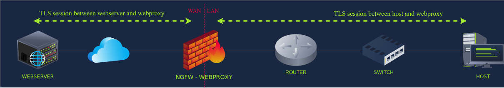

#### 3.2. **DNS Network Flow**

* A host sends a query to an internal DNS server (port 53).

  * If cached, the server returns the result.
  * If not cached, the DNS server queries external DNS servers through the router.
  * The response follows the reverse path.
  * **Flow**:

    * Host → Internal DNS → Router → External DNS → Response → Internal DNS → Host.

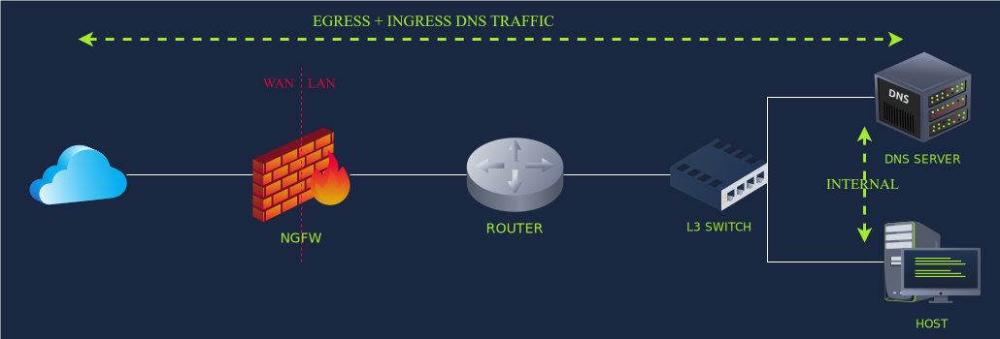

#### 3.3. **SMB with Kerberos**

* A host connects to a shared file server (e.g., \FILESERVER\MARKETING).

  * **Authentication**:

    1. User authenticates with the Key Distribution Center (KDC) via the Domain Controller.
    2. The host requests a **Ticket Granting Ticket (TGT)** from the KDC.
    3. The host uses the TGT to request a service ticket for the file server.
  * **Flow**:

    * Host → Authentication → Ticket Request → File Server Access.

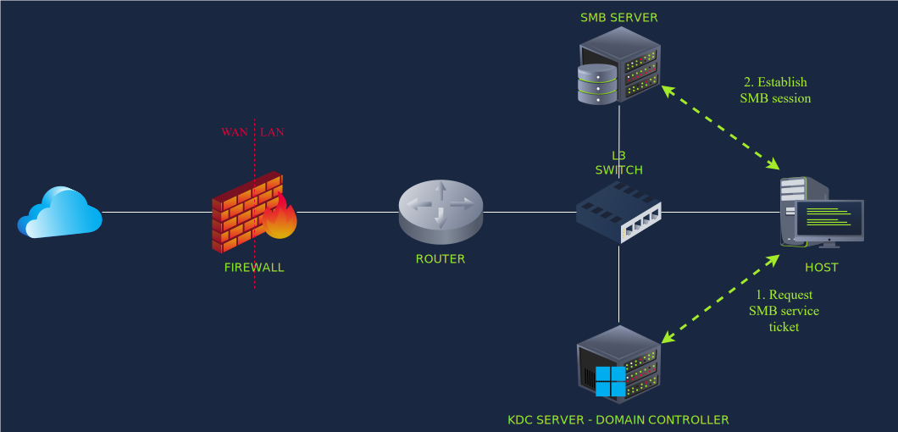

## How Can We Observe Network Traffic

### 🔍 Overview

* Network traffic analysis involves **collecting and correlating multiple data sources**, identifying patterns, and using insights to guide actions.
* Main data sources:

  * Logs
  * Full Packet Capture (FPC)
  * Network Statistics

---

### 🧾 Logs

* **Primary source of network insight**.
* No universal logging standard—each vendor defines:

  * Format (e.g., Windows Event Logs, Syslog, CLF)
  * Data captured (usually partial, not full packets).
* Common logged fields:

  * Source IP
  * Destination IP
* Standardized log transmission protocols:

  * **Syslog**
  * **SNMP**
* Limitation: Often insufficient alone → requires correlation with other data sources.

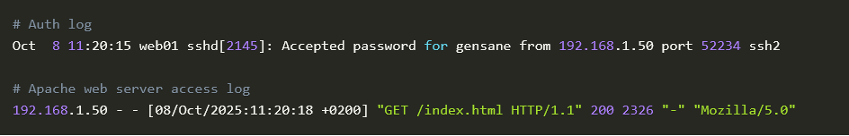

---

### 📦 Full Packet Capture (FPC)

* Captures **entire network packets** for deep inspection.

#### 🔧 Methods

1. **Network Tap**

   * Physical device placed inline.
   * Copies traffic without affecting performance.
   * Operates at the link layer (no IP/MAC needed).  

   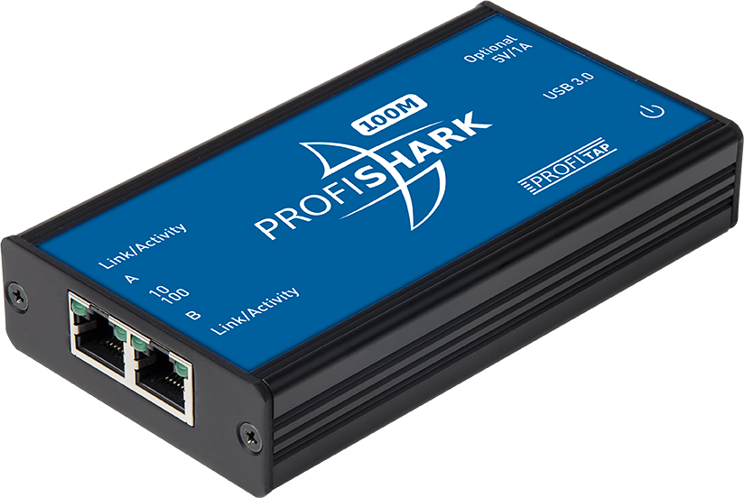

2. **Port Mirroring ()**

   * Software-based duplication of traffic on switches.
   * Vendor-specific (e.g., Cisco SPAN).
   * Can be configured on physical and virtual devices (e.g., VMware, AWS VPC mirroring).

   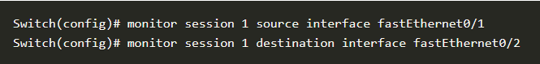  

#### ⚠️ Best Practices

* **Placement:** Capture at the correct network point.
* **Duration:** High storage demand (e.g., ~10.8 TB/day at 1 Gbps).
* **TAP vs Mirroring:**

  * TAP → minimal performance impact
  * Mirroring → may degrade performance under heavy load

#### 🛠️ Tools

* Wireshark
* TCPdump
* IDS tools like <Snort> and <Suricata>

---

### 📈 Network Statistics

* Focuses on **metadata (not full packets)** to detect anomalies.

#### 📡 Key Protocols

* **<NetFlow>**

  * Developed by Cisco.
  * Tracks traffic flows (e.g., source → destination).
  * Useful for detecting:

    * <DDoS> attacks
    * Data exfiltration
    * Lateral movement

* **<IPFIX> (Internet Protocol Flow Information Export)**

  * Successor to NetFlow.
  * Vendor-neutral standard (developed with <IETF>).
  * More flexible in defining captured data fields.

#### ⚙️ Implementation

* Built into most network devices.
* Requires:

  * Enabling the protocol
  * Configuring a destination for metadata
* Often integrated into:

  * <NGFWs> (Next-Generation Firewalls)
  * <SIEMs> (Security Information and Event Management systems)

---

### ✅ Key Takeaways

* Effective network analysis requires combining:

  * Logs (high-level events)
  * Packet captures (deep inspection)
  * Flow data (behavioral patterns)
* Each method complements the others to provide **complete visibility and threat detection**.
