# PowerShell for Pentesters

## Intro

PowerShell is useful in penetration testing because it combines a Windows shell, scripting language, and direct access to .NET capabilities. Common offensive and administrative PowerShell projects include **PowerSploit**, **PowerView**, and **Nishang**.

Operational notes:

- Many well-known offensive PowerShell scripts are detected by antivirus and endpoint security tools.
- The same detection point was repeated in the source material; the important takeaway is that common public tooling is often noisy in modern environments.
- Lab results may differ depending on endpoint protection signatures, execution policy settings, logging configuration, and PowerShell version.

The example below shows AVG antivirus detecting `Get-ComputerDetails.ps1`, which is part of PowerSploit.

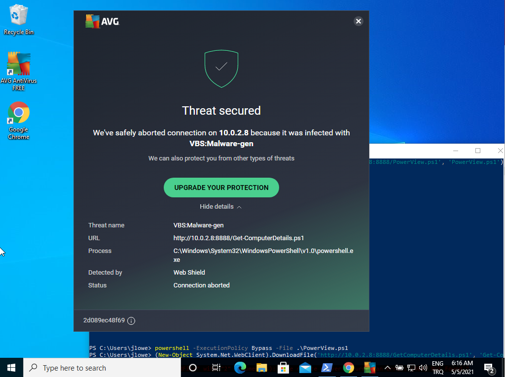

### Intro Questions

#### What useful PowerShell script did you find on Walter's desktop?

Use the lab environment to inspect Walter's desktop and identify the script name.

## Manipulating Files

PowerShell can start processes, inspect running processes, read files, copy or move files, and calculate file hashes. These are foundational skills for both system administration and authorized security testing.

The `Start-Process` cmdlet can be used to start a process.

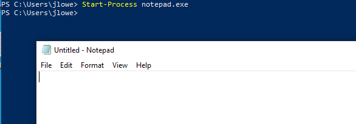

### Get-Process

`Get-Process` lists all running processes.

Useful patterns:

```powershell
Get-Process
Get-Process -Name <process-name>
```

Use `-Name` to filter for a specific process.

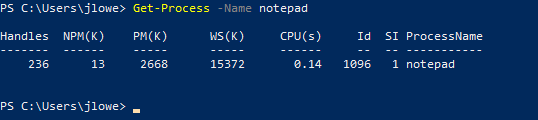

For command output that is difficult to read or needs later processing, pipe the output to `Export-Csv` to create a CSV file.

```powershell
Get-Process | Export-Csv -Path .\processes.csv -NoTypeInformation
```

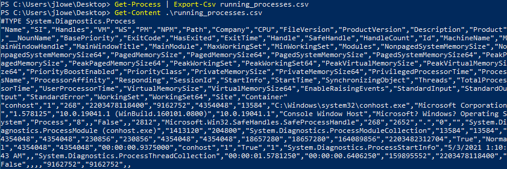

### Get-Content

`Get-Content` is similar to Linux `cat` or Windows command-line `type`. It displays the contents of a file.

```powershell
Get-Content .\file.txt
```

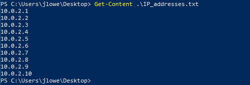

### Copy-Item

Use `Copy-Item` to copy files and `Move-Item` to move files.

```powershell
Copy-Item -Path .\source.txt -Destination .\copy.txt
Move-Item -Path .\copy.txt -Destination .\archive\copy.txt
```

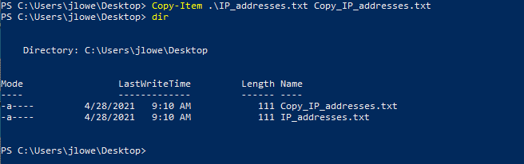

### Get-FileHash

`Get-FileHash` obtains hashes for many file formats. It is useful for file integrity checks, malware triage, and matching artifacts against known indicators.

```powershell
Get-FileHash -Algorithm MD5 .\file.exe
Get-FileHash -Algorithm SHA256 .\file.exe
```

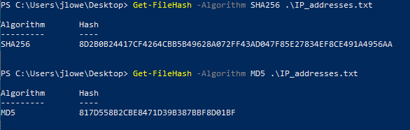

### File Manipulation Questions

#### What is the MD5 hash value of the file on Walter's desktop?

Use `Get-FileHash` with the MD5 algorithm against the target file.

```powershell
Get-FileHash -Algorithm MD5 <file-path>
```

## Downloading Files

The screenshot below shows a sample lab setup with Kali running a Python HTTP server on port `8888`.

```bash
python3 -m http.server 8888
```

The example connects to a remote host, `10.0.2.8`, downloads `meterpreter-64.ps1`, and saves it as `meterpreter.ps1`.

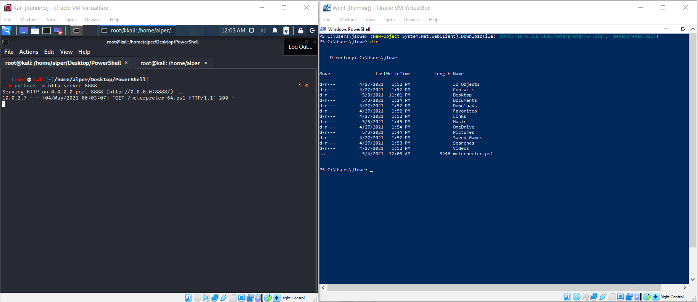

Microsoft states that `ExecutionPolicy` is **not** a security boundary. It is a safety feature that controls script execution behavior and can be bypassed by a user in some contexts.

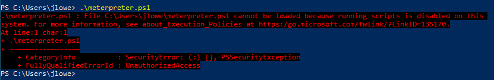

The current execution policy configuration can be viewed with:

```powershell
Get-ExecutionPolicy -List
```

Execution policy values include:

- `AllSigned`: Scripts can run, but all scripts must be signed by a trusted publisher.
- `Bypass`: All scripts can run, and no warnings or prompts are displayed.
- `Default`: Uses the platform default; this is typically `Restricted` on Windows clients and `RemoteSigned` on Windows servers.
- `RemoteSigned`: Scripts can run; local scripts do not require a digital signature.
- `Restricted`: Default on many Windows clients. Individual commands can run, but scripts do not run.
- `Undefined`: No specific execution policy is set at that scope, so default behavior applies.
- `Unrestricted`: Most scripts run.

The common execution policy bypass approach is shown below.

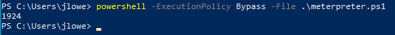

Another option is to use `Set-ExecutionPolicy Bypass` with process scope. The `-Scope Process` parameter changes the execution policy only for the current PowerShell session. When the session closes, the previous settings apply again.

```powershell
Set-ExecutionPolicy Bypass -Scope Process
```

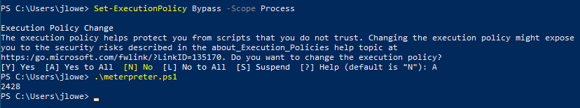

Another common way to download files from a remote server is `Invoke-WebRequest`.

```powershell
Invoke-WebRequest -Uri <url> -OutFile <local-file>
```

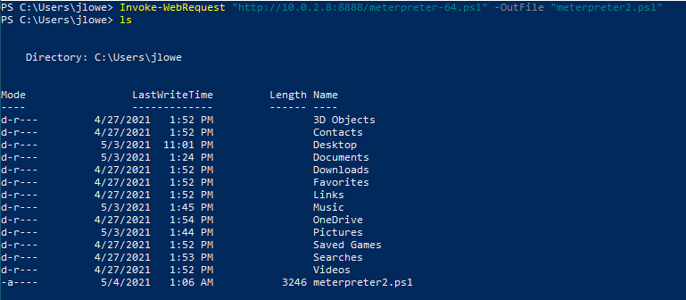

## System Reconnaissance

### Finding Missing Patches

Patch level affects post-compromise options, privilege escalation analysis, and defensive prioritization. Knowing which patches are installed can help identify potentially missing updates or vulnerable software conditions.

`Get-HotFix` enumerates installed patches.

```powershell
Get-HotFix
```

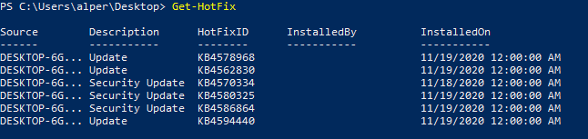

You can output `Get-HotFix` results in list format and use `findstr` to inspect installation dates. This can help identify patching cycles or locate updates installed on a specific date.

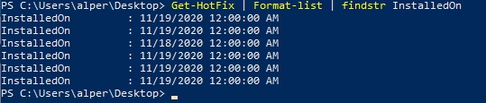

By default, `Get-HotFix` shows output in a table format. Use `Format-Table` with a selected column name to list only the data you need without relying on `findstr`.

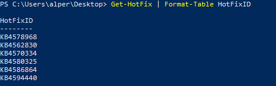

`Format-List` can also be used to gather more information about objects. The examples below use a simple `dir` command.

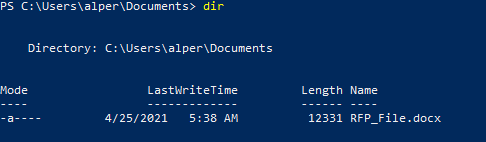

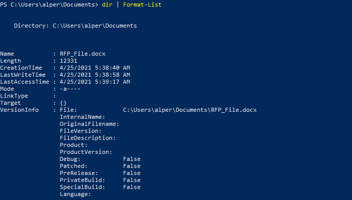

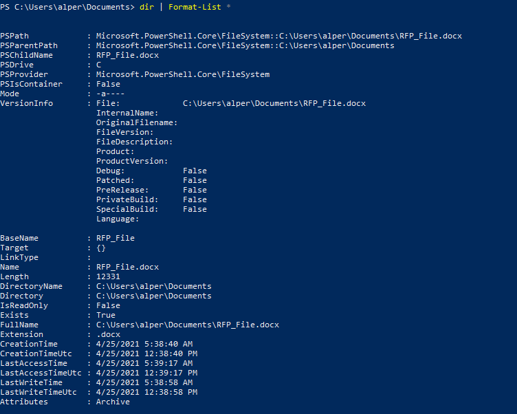

Using a wildcard after `Format-List` exposes additional file properties, such as `CreationTime`, `LastAccessTime`, and `LastWriteTime`.

```powershell
Get-ChildItem | Format-List *
```

At any stage, use `Out-File` to save output for later review.

```powershell
Get-HotFix | Out-File .\hotfixes.txt
```

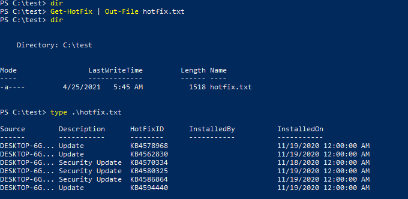

Use `Get-Content` to read the saved file.

```powershell
Get-Content .\hotfixes.txt
```

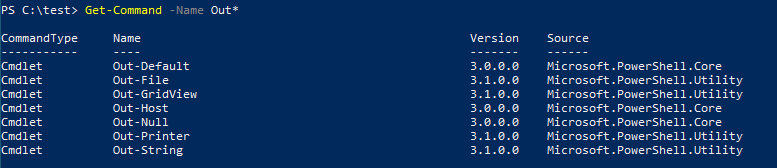

The GridView option provides a GUI with sortable columns for output that may be overwhelming in the CLI.

```powershell
Get-HotFix | Out-GridView
```

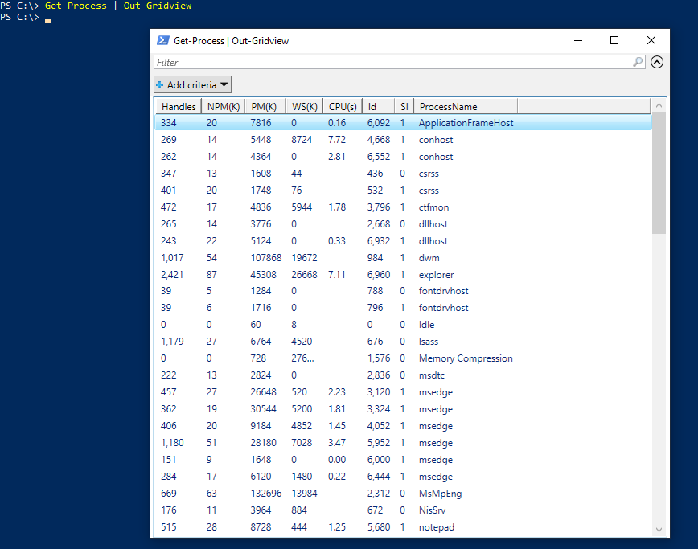

### System Reconnaissance Questions

#### What Windows Security Update was installed on 5/15/2019?

```powershell
Get-HotFix | Where-Object { $_.InstalledOn -like "*5/15/2019*" }
```

## Network Reconnaissance

The following command can be used to ping a given IP range. In this example, the command pings IP addresses from `10.0.2.1` through `10.0.2.15`.

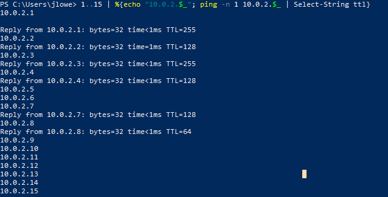

How the command works:

1. The first part of the command, delimited by `|`, sets the range for the last octet.
2. The second part generates and prints the IP address to be used, then pipes it to the command line.
3. The final part filters for lines that include the `TTL` string, which indicates a response.

A similar command can be built using socket and TCP client functions. The example below scans the first 1024 TCP ports of the target. The `2>$null` portion redirects errors to null, producing cleaner output.

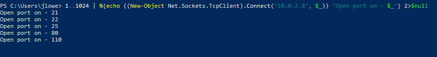

## Using PowerView

PowerView is a PowerShell reconnaissance tool for Active Directory environments. It is one of the most effective ways to gather domain information during authorized assessments.

PowerView module source:

```text
https://github.com/PowerShellMafia/PowerSploit/blob/dev/Recon/PowerView.ps1
```

Bypass the execution policy as needed in the lab to run the script.

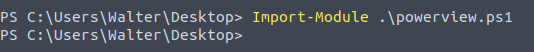

### Get-NetDomainController

Collect information about the domain controller.

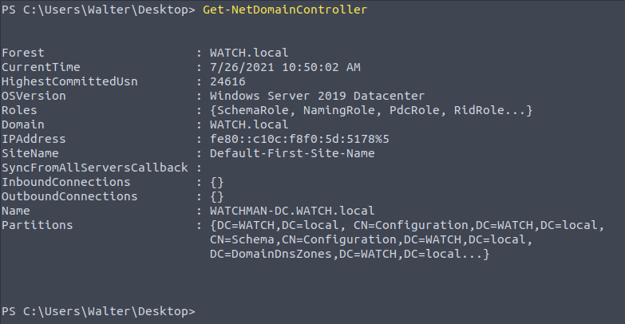

Knowing the IP address of the domain controller is useful because domain controllers are high-value systems and may be relevant to man-in-the-middle testing, credential targeting, and domain reconnaissance.

### Get-NetUser

Obtain a list of domain users.

Consider exporting the output to a CSV file or using `Out-GridView` for easier review.

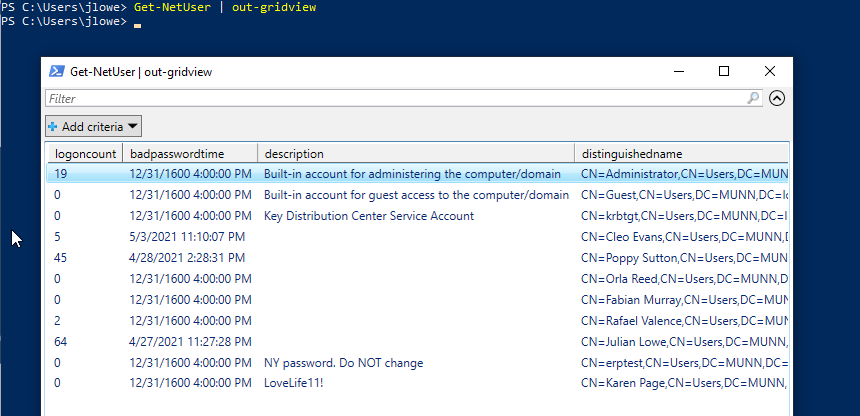

The output can be limited by selecting the property or criteria of interest.

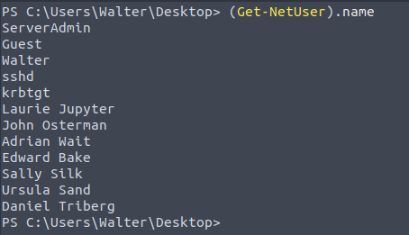

Values for a specific property can be listed. For example, to list users' last logon dates and times:

```powershell
Get-NetUser | Select-Object -ExpandProperty lastlogon
```

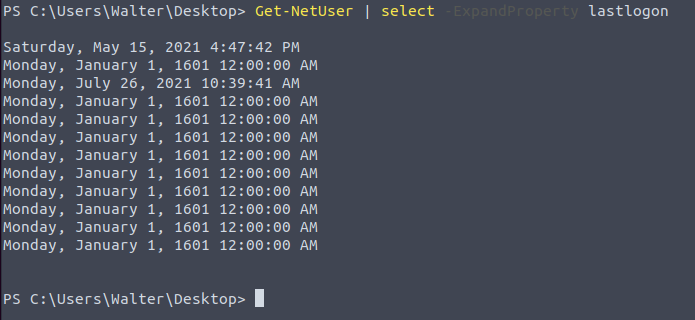

The same command can be modified to select the `description` field instead of `lastlogon`. Account descriptions sometimes contain operational notes or sensitive clues.

```powershell
Get-NetUser | Select-Object -ExpandProperty description
```

### Get-NetComputer

Enumerate systems connected to the domain.

Use the `-Ping` parameter to enumerate systems that are currently online.

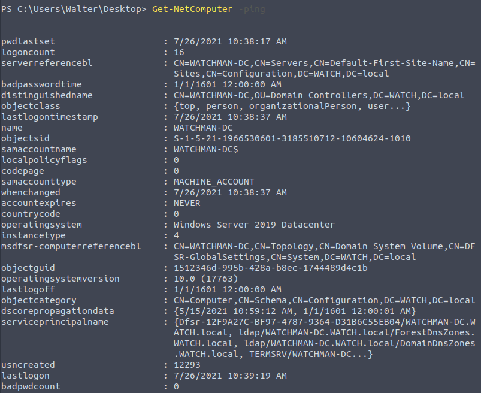

In the screenshot example, four systems exist in the domain, but only two are online.

### Get-NetGroup

Some accounts may belong to important groups, such as `Domain Admins`. Knowing which accounts have useful privileges or group memberships can support lateral movement analysis, privilege escalation assessment, and defensive review.

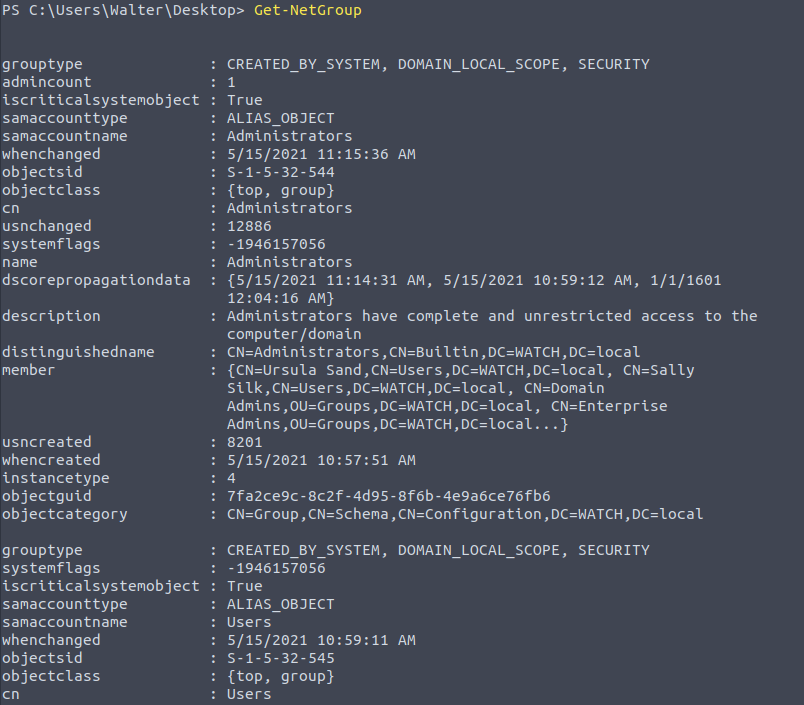

Use `Get-NetGroupMember` followed by `Domain Admins` to enumerate members of the group.

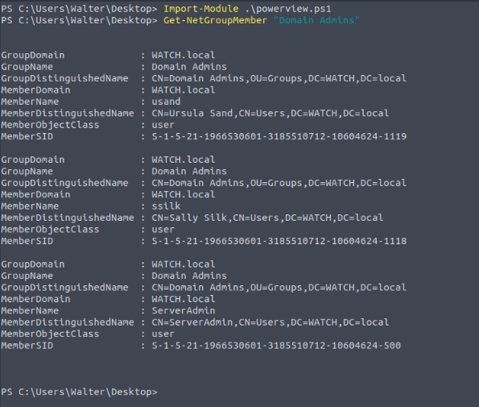

### Finding shares

`Find-DomainShare` lists available shares.

Use the `-CheckShareAccess` option to list only readable shares.

```powershell
Find-DomainShare
Find-DomainShare -CheckShareAccess
```

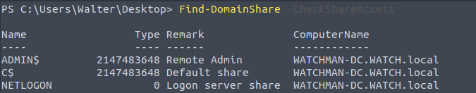

### Enumerate Group Policy

Group Policy configures computers and users connected to the domain.

`Get-NetGPO` gathers information about enforced policies.

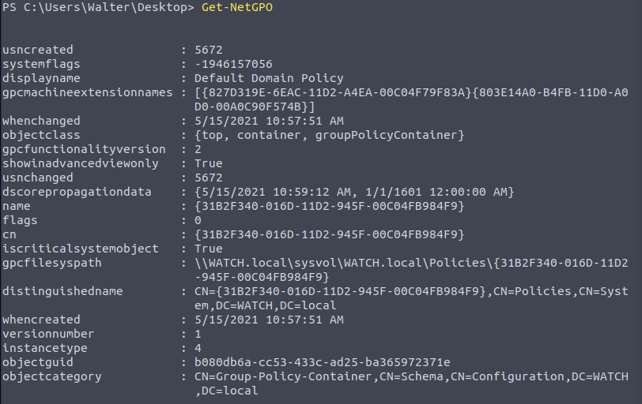

Reviewing Group Policy settings can reveal defensive posture and potential attack paths, such as whether Windows Defender or host firewalls are disabled.

A tested domain may also have a trust relationship with another domain. If so, reconnaissance may extend to the trusted domain. `Get-NetDomainTrust` lists any accessible domain trusts.

For many PowerView commands, add `-Domain` followed by the other domain name.

```powershell
Get-NetUsers -Domain infra.munn.local
```

### User Enumeration

Knowing which systems the current user can access with local administrator privileges can facilitate lateral movement analysis.

`Find-LocalAdminAccess` lists systems in the domain where the current user has local administrator access.

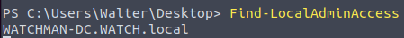

A useful PowerView reference was provided in the source material.

### PowerView Questions

Import the module before running the PowerView queries.

```powershell
Import-Module .\powerview.ps1
```

#### One of the accounts has a special description; what is it?

```powershell
Get-NetUser | Where-Object { $_.description -ne $null } | Format-Table description, displayname
```

#### How many accounts are disabled?

```powershell
(Get-NetUser | Where-Object { $_.useraccountcontrol -like "*disable*" }).Count
```

#### How many users are in the "domain admins" group?

```powershell
(Get-NetUser | Where-Object { $_.memberof -like "*domain admin*" }).Count
```

#### Which users are in the "domain admins" group?

Answer format requested in the source: alphabetically sorted, lowercase, comma-separated, using spaces.

```powershell
Get-NetUser | Where-Object { $_.memberof -like "*domain admin*" } | Select-Object distinguishedname
```

#### List shares; what is the name of the "interesting" share?

```powershell
Find-DomainShare
```

#### What is the name of the user-created Group Policy?

```powershell
Get-NetGPO
```

To identify user-created GPOs, filter for policies where `name` or `displayname` does not start with the standard built-in Microsoft GPO GUIDs:

- `{31B2F340-016D-11D2-945F-00C04FB984F9}`: Default Domain Policy
- `{6AC1786C-016F-11D2-945F-00C04FB984F9}`: Default Domain Controllers Policy

#### What are the first names of users whose accounts were disabled?

Answer format requested in the source: alphabetically sorted, lowercase, comma-separated, using spaces.

```powershell
Get-NetUser | Where-Object { $_.useraccountcontrol -like "*disable*" } | Select-Object givenname
```
