# Race Conditions

Learn about race conditions and how they affect web application security.

## Multi-Threading

### Programs

set of instructions to achieve a specific task  

### Processes

a program in execution (job)  

***Program:*** The executable code related to the process
***Memory:*** Temporary data storage
***State:*** A process usually hops between different states. After it is in the `New` state, i.e., just created, it moves to the `Ready` state, i.e., ready to run once given CPU time. Once the CPU allocates time for it, it goes to the `Running` state. Furthermore, it can be in the `Waiting` state pending I/O or event completion. Once it exits, it moves to the `Terminated` state.  

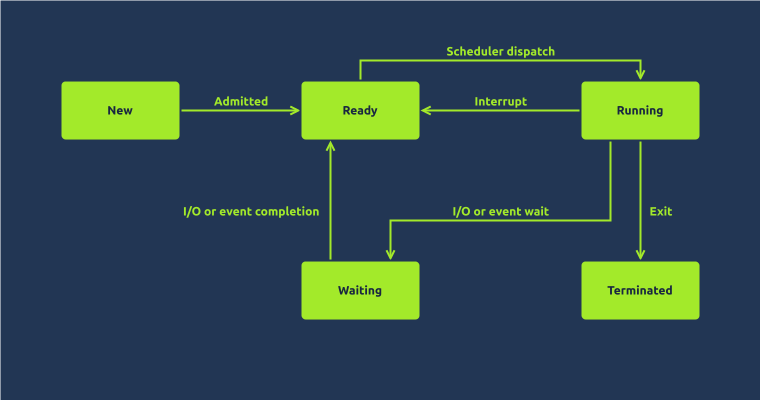  

### Threads

a lightweight unit of execution. It shares various memory parts and instructions with the process.  

***Serial:*** One process is running; it serves one user after the other sequentially. New users are enqueued.
***Parallel:*** One process is running; it creates a thread to serve every new user. New users are only enqueued after the maximum number of running threads is reached.

## Example Race Condition

***Situation***:  
You call a restaurant to reserve a table for a crucial business lunch. You are familiar with the restaurant and its setup. One particular table, number 17, is your preferred choice, considering it has a nice view and is relatively isolated. You call to make a reservation for Table 17; the host confirms it is free as no “Reserved” tag is placed on it. At the same time, another customer is talking with another host and making a reservation for the same table.  

Who really reserved the table? That’s a race condition.  

More than one host was taking reservations; furthermore, it took the host a few minutes to fetch the “Reserved” tag and put it on the table after updating the daily reservation book. There is at least a one-minute window for another client to reserve a reserved table.  

Similarly, when one thread checks a value to perform an action, another thread might change that value before the action takes place.  

### Scenario A

A bank account has $100.  
Two threads try to withdraw money at the same time.  
Thread 1 checks the balance (sees $100) and withdraws $45.  
Before Thread 1 updates the balance, Thread 2 also checks the balance (incorrectly sees $100) and withdraws $35.  

We cannot be 100% certain which thread will get to update the remaining balance first; however, let’s assume that it is Thread 1.  
Thread 1 will set the remaining balance to $55.  
Afterwards, Thread 2 might set the remaining balance to $65 if not appropriately handled. (Thread 2 calculated that $65 should remain in the account after the withdrawal because the balance was $100 when Thread 2 checked it.)  
In other words, the user made two withdrawals, but the account balance was deducted only for the second one because Thread 2 said so!  

### Scenario B  

Let’s consider another scenario:

A bank account has $75.  
Two threads try to withdraw money at the same time.  
Thread 1 checks the balance (sees $75) and withdraws $50.  
Before Thread 1 updates the balance, Thread 2 checks the balance (incorrectly sees $75) and withdraws $50.  

Thread 2 will proceed with the withdrawal, although such a transaction should have been declined.

Scenarios A and B demonstrate a ***Time-of-Check to Time-of-Use*** ***(TOCTOU)*** vulnerability.  

### Code Example

```python
import threading  # Imports Python's threading module to allow concurrent execution

x = 0  # Shared variable
# RACE CONDITION RISK:
# 'x' is a global shared variable accessed and modified by multiple threads.
# Because it is shared and unsynchronized, concurrent updates can interfere
# with each other, leading to lost updates and inconsistent results.

def increase_by_10():
    global x
    # The 'global' keyword allows both threads to access the SAME memory location.
    # This makes x vulnerable to race conditions because no synchronization
    # mechanism (like a Lock) is used.

    for i in range(1, 11):
        # CRITICAL SECTION (NOT PROTECTED):
        # The operation "x += 1" is NOT atomic.
        # It actually consists of multiple steps:
        #   1. Read current value of x
        #   2. Compute x + 1
        #   3. Write new value back to x
        #
        # If two threads execute this at the same time:
        #   - Both may read the same old value
        #   - Both compute the same incremented value
        #   - One update overwrites the other
        #
        # Result: Lost update → Final value of x may be less than expected.
        x += 1

        # PRINT INTERLEAVING:
        # The print statement itself is thread-safe at the interpreter level,
        # but output from multiple threads may interleave unpredictably.
        # The displayed value of x may not reflect a strictly increasing sequence.
        print(f"Thread {threading.current_thread().name}: {i}0% complete, x = {x}")

# Create two threads
thread1 = threading.Thread(target=increase_by_10, name="Thread-1")
thread2 = threading.Thread(target=increase_by_10, name="Thread-2")
# Two separate threads will execute increase_by_10() concurrently.
# Both modify the same shared variable x without synchronization.

# Start the threads
thread1.start()
thread2.start()
# Once started, thread scheduling is controlled by the OS and interpreter.
# Execution order becomes nondeterministic.
# This nondeterminism is what makes race conditions possible.

# Wait for both threads to finish
thread1.join()
thread2.join()
# join() ensures the main thread waits for completion.
# HOWEVER, join() does NOT prevent race conditions.
# It only waits for completion — it does not enforce mutual exclusion.

print("Both threads have finished completely.")
# Expected final value of x (if no race condition occurred):
# 2 threads × 10 increments = 20
#Due to race conditions, x may be LESS than 20.
# This is called a "lost update" problem.
```

Running this program multiple times will lead to different results. The output is not controlled. If the security of our application relies on one thread finishing before the other, then we need to set mechanisms in place to ensure proper protection. Consider the following two examples to better understand the bugs’ gravity when we leave things to chance.  

### Common Causes

***Parallel Execution:*** Web servers may execute multiple requests in parallel to handle concurrent user interactions. If these requests access and modify shared resources or application states without proper synchronization, it can lead to race conditions and unexpected behaviour.  

***Database Operations:*** Concurrent database operations, such as read-modify-write sequences, can introduce race conditions. For example, two users attempting to update the same record simultaneously may result in inconsistent data or conflicts. The solution lies in enforcing proper locking mechanisms and transaction isolation.  

***Third-Party Libraries and Services:*** Nowadays, web applications often integrate with third-party libraries, APIs, and other services. If these external components are not designed to handle concurrent access properly, race conditions may occur when multiple requests or operations interact with them simultaneously.  

## Web Application Architecture

### Typical Web Application  

A web application follows a multi-tier architecture. Such architecture separates the application logic into different layers or tiers. The most common design uses three tiers:

***Presentation tier:*** In web applications, this tier consists of the web browser on the client side. The web browser renders the HTML, CSS, and JavaScript code.
***Application tier:*** This tier contains the web application’s business logic and functionality. It receives client requests, processes them, and interacts with the data tier. It is implemented using server-side programming languages such as Node.js and PHP, among many others.
***Data tier:*** This tier is responsible for storing and manipulating the application data. Typical database operations include creating, updating, deleting, and searching existing records. It is usually achieved using a database management system (DBMS); examples of DBMS include MySQL and PostgreSQL.

### Sceanrio: Validating and Conducting Money Transfer

transferring money to a friend or your other account. The program will progress as follows:  

1. The user clicks on the “Confirm Transfer” button
2. The application queries the database to confirm that the account balance can cover the transfer amount
3. The database responds to the query
    a. If the amount is within the account limits, the application conducts the transaction
    b. If the amount is beyond the account limits, the application shows an error message

In an ideal scenario, the code above leads to two program states:
    1. Checking Balance <- Time spent is time to trigger the race condition
    2. Checking Account Limits <- Time spent is time to trigger the race condition
    3. Amount not sent
    4. Amount sent

### Scenario: Validating Coupon codes and Applying Discounts

applying a discount coupon. The user goes to their shopping cart and adds a coupon to get a discount. The steps might be something along the following lines:

1. The user enters a coupon code
2. The application queries the database to determine whether the coupon code is valid and whether any constraints exist
3. The database responds with validity and constraints
    a. The discount is applied if the code is valid and there are no constraints on applying it for this user.
    b. An error message is displayed if the code is invalid or there are constraints on applying it for this user.

The above code leads to a few program states:
    1. Checking coupon validity <- Time spent is time to trigger the race condition
    2. Checking coupon applicability <- Time spent is time to trigger the race condition
    3. Checking Coupon Constraints <- Time spent is time to trigger the race condition
    4. Coupon not applied
    5. Coupon applied
    6. Recalculating Total

There is a time window between the instant we try to add a coupon and the instant where the coupon is marked as applied and cannot be applied again.  
As long as the coupon is not marked as applied, most likely, no controls prevent it from being accepted repeatedly.  
We might be able to apply it multiple times during this time window.

Even in vulnerable applications, a “window of opportunity” is relatively short.  
Exploiting a window of opportunity necessitates requests reach the server simultaneously.  
In practice, threat actors aim to get our repeated requests to reach the server only milliseconds apart.

How can we get our duplicated requests to reach the server within this short window? We need a tool such as Burp Suite.  

## Exploiting Race Conditions

### Setup

Vulnerable Web App:  `http://10.80.157.182:8080`  

Belongs to a mobile operator and allows phone credit transfer.  
In this demo, we will check if the system is susceptible to a race condition vulnerability and try to exploit it by transferring more credit than we have in our account.  

credentials:  
User1: 07799991337:pass1234
User2: 07113371111:pass1234

### Enumerate  

Explore and study how the target web application receives HTTP requests and how it responds to them.  

First Get Request:  
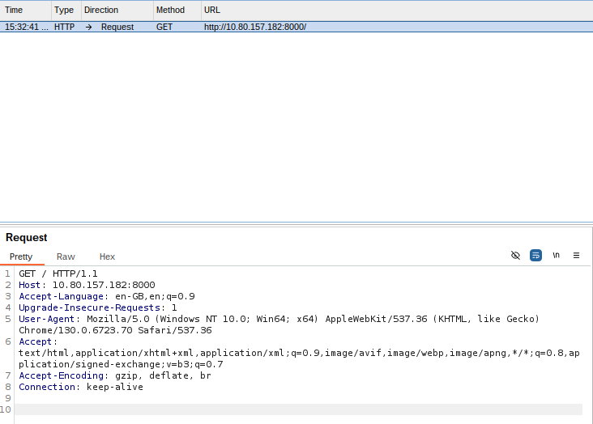  

Straight to the Login Page:  
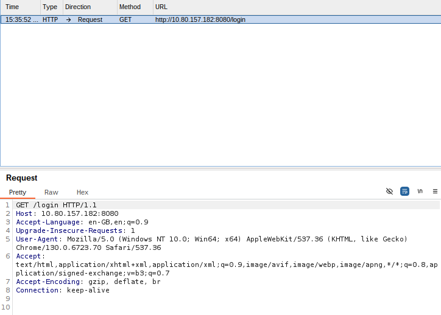

Log in as user1:  

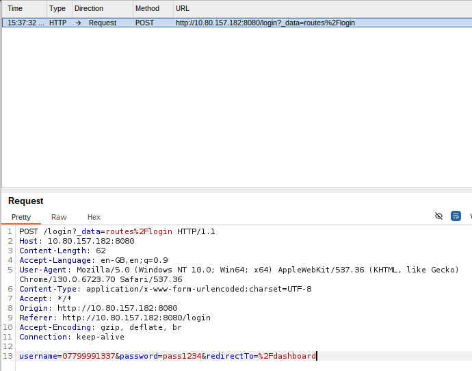  

Click the Pay & Recharge button.  
Let’s make a credit transfer: click the Transfer button and enter the mobile number of the other account along with the amount you want to transfer.  

$1000 Transfer Request
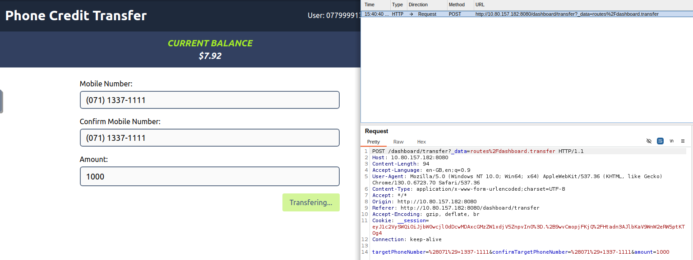  

$1000 Transfer Response  

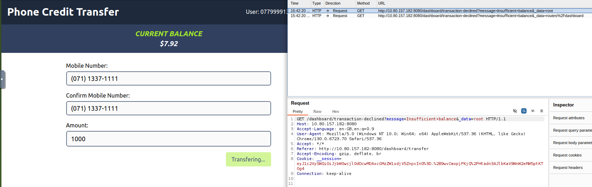  

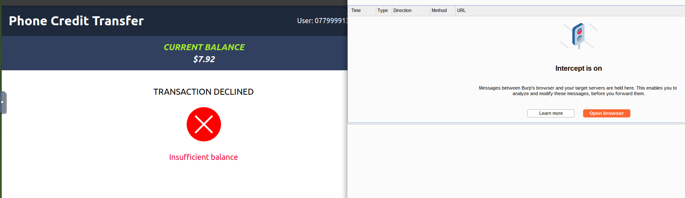  

$5 Transfer Request
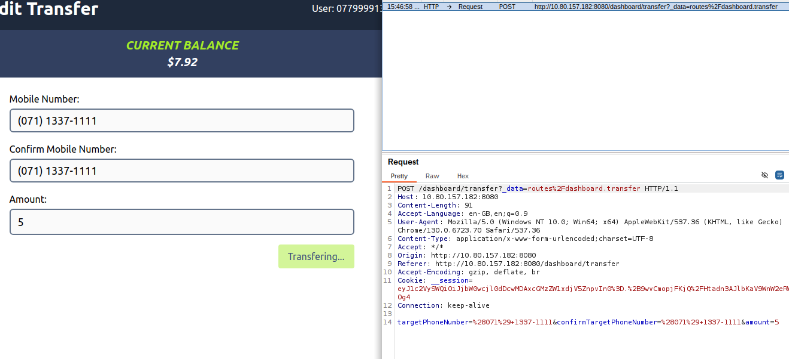  

$5 Transfer Response  

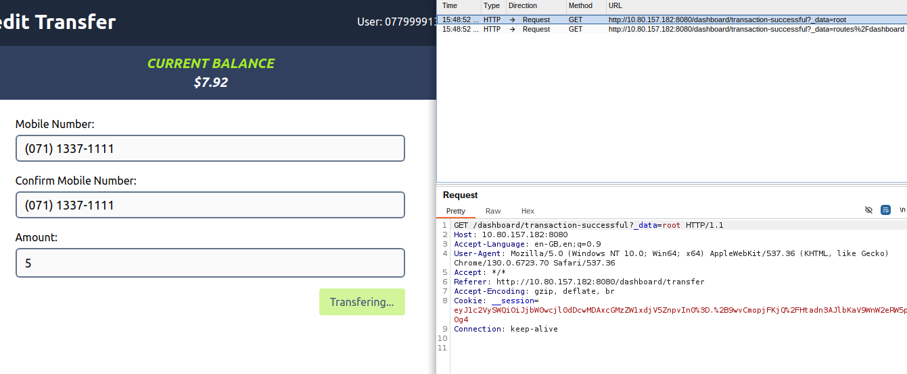  

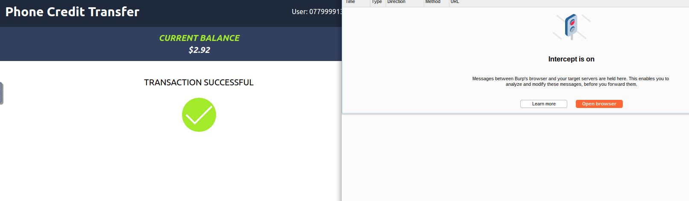  

### Burp Suite: Repeater  

The Successful `POST` request with all identifying information  

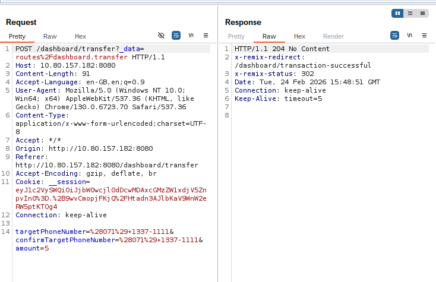  

***Send To Repeater***  

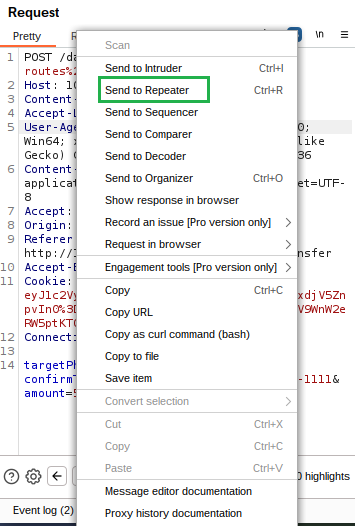  

#### Set up the Exploit

1. Click `+` to Create Tab Group
2. Assign the group a name, and include the successful post request just transferred
3. Click "Create"
4. Right-click on the group and duplicate the origial request 20 times  

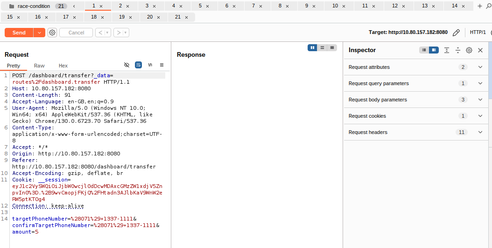  

5. Open the "Send" dropdown to see the options for sending the request.  

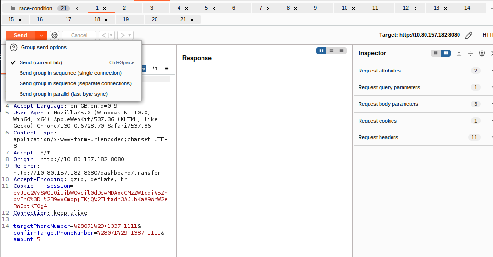  

### Sending Request Group in Sequence

#### Over a Single Connection

Establishes a single connection to the server  
sends all requests in the groups tab before closing the connection  
useful for testing client-side desync vulnerabilities  

#### Over Separate Connections

Establishes, sends, and closes one TCP connection per request  

### Send Request Group in Parallel

Triggers the Repeater to send all the requests in the group at once.  

### Exploit

First, maximize the value of User1 Account:  

  

Set a repeater group which contains more than enough $5 transactions to achieve the objective of >$100, and send the group in sequence using separate connections.  

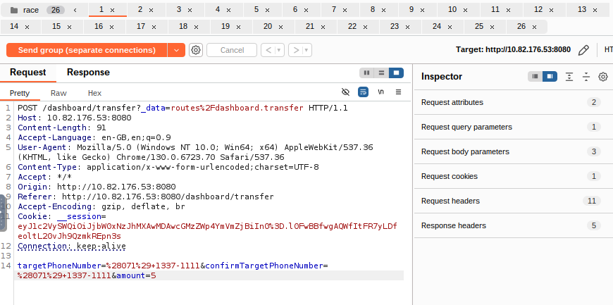  

The result is a total transfer of $10.  

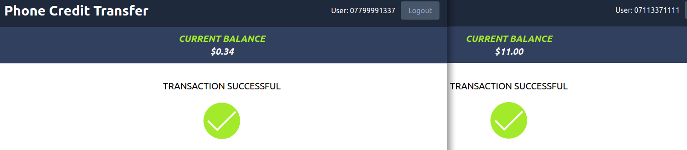  

Reset the accounts to maximize the value of User1 Account.  

Set the repeater group to send the group in parallel  

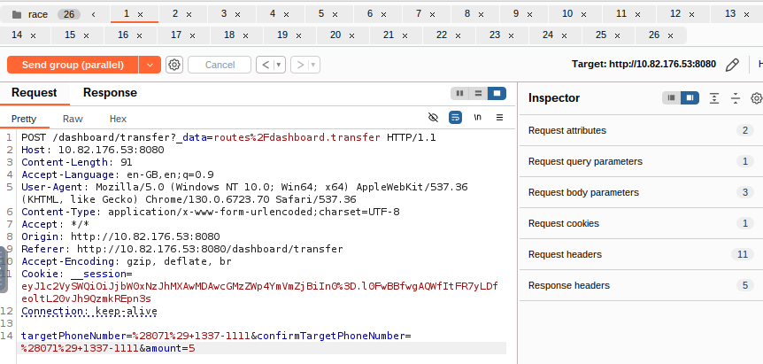  

Success!  

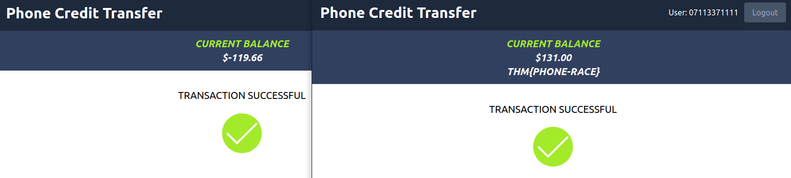  

## Detection and Mitigation

### Detection

logs are actively checked for certain behaviours  

Considering that race conditions can be used to exploit even more subtle vulnerabilities, it is clear that we need the help of penetration testers and bug bounty hunters to try to discover such vulnerabilities and report their findings.

Penetration testers must understand how the system behaves under normal conditions when enforced controls are enforced  

***controls:***  
use once  
vote once  
rate once  
limit to balance  
rate limiting  
et al.  

The next step would be to try to circumvent this limit by exploiting race conditions. Figuring out the different system’s states can help us make educated guesses about time windows where a race condition can be exploited. Tools such as Burp Suite Repeater can be a great starting point.

### Common Mitigations

***Synchronization Mechanisms:*** Modern programming languages provide synchronization mechanisms like locks. Only one thread can acquire the lock at a time, preventing others from accessing the shared resource until it’s released.  

***Atomic Operations:*** Atomic operations refer to indivisible execution units, a set of instructions grouped together and executed without interruption. This approach guarantees that an operation can finish without being interrupted by another thread.  

***Database Transactions:*** Transactions group multiple database operations into one unit. Consequently, all operations within the transaction either succeed as a group or fail as a group. This approach ensures data consistency and prevents race conditions from multiple processes modifying the database concurrently.

## Challenge Web App

### Credentials

This web application belongs to a bank and allows clients to transfer online money. You need to get one of the accounts to amass more than $1000.  

Name: Rasser Cond : 4621:blueApple  
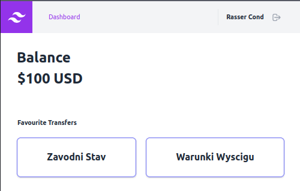  

Name: Zavodni Stav : 6282:whiteHorse  
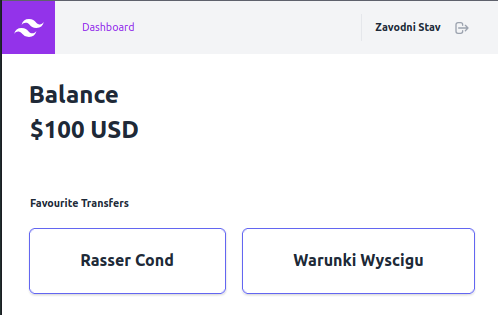  

Name: Warunki Wyscigu : 9317:greenOrange  
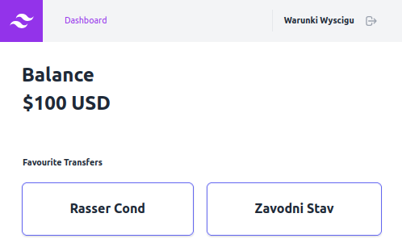  

### Maximize Rasser's Account

Notice the variable transfer fee.  

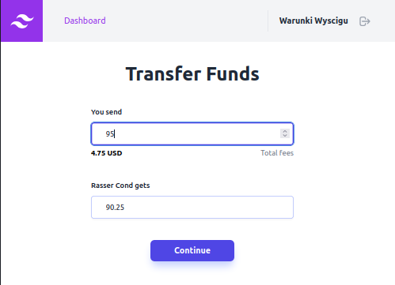 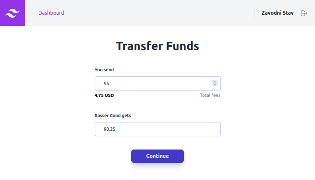  

Rasser's account after transfer:  
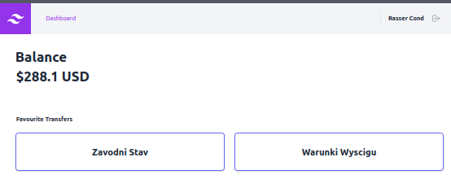  

Assumption: Even though fees are tiered based on the total transfer, all users pay the same fees for the same transfers.

### Test Transfer 1

Test with a transfer from Rasser to Zavodni  

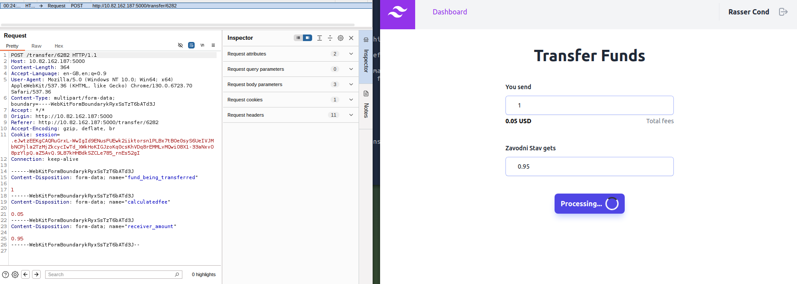  

And the response:  

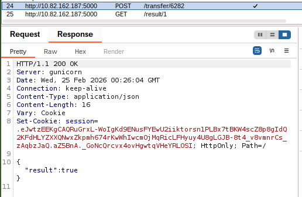  

Rasser Balance Post Transfer:  

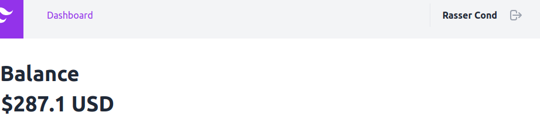  

Zavodni Balance Post Transfer:  

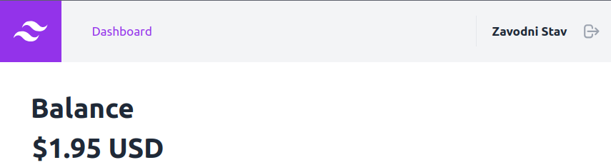  

### Test Transfer 2  

Test the ability to manipulate the fee with another transfer from Rasser to Zavodni  

Transfer Request:  

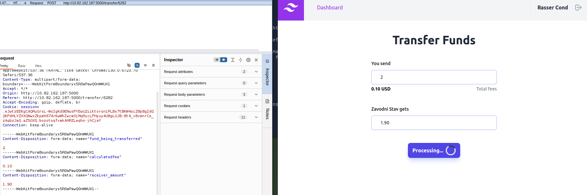  

Manipulated Transfer Request:  

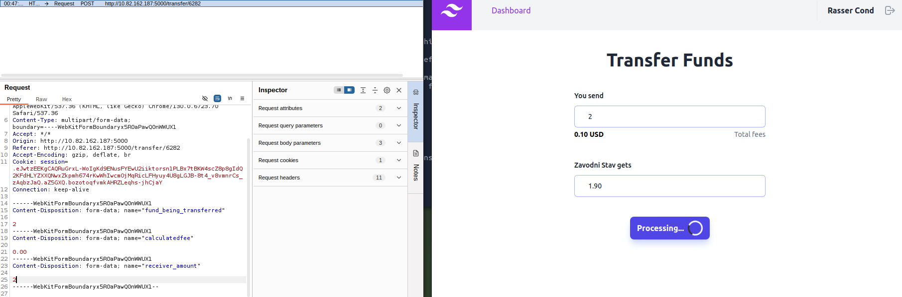  

Successful Transfer  

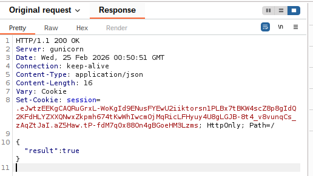  

Rasser Balance Post Transfer Test2:  

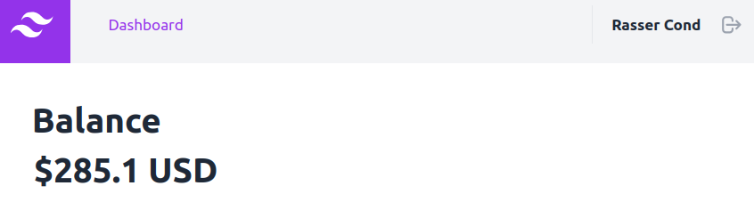  

Zavodni Balance Post Transfer:  

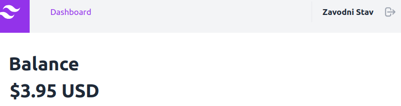  

Outcome: The transfers can be manipulated  

### Test 3: Verify Test 2

Manipulated Transfer Request:  

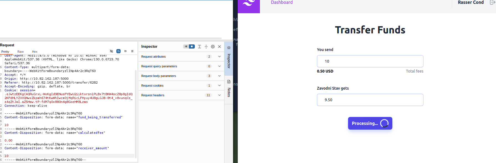  

Rasser Balance Post Transfer Test2:  

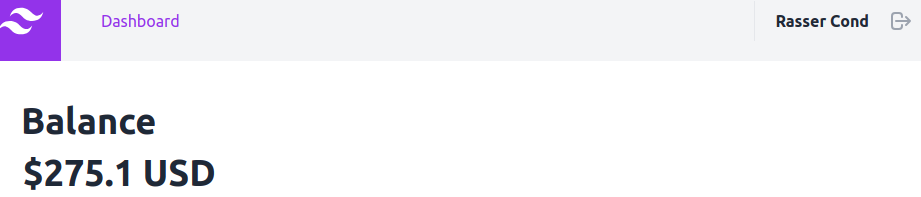  

Zavodni Balance Post Transfer:  

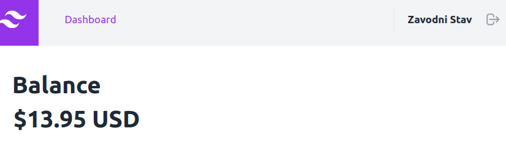  

### Exploit The App

Send the request from Test 3 to Repeater.  

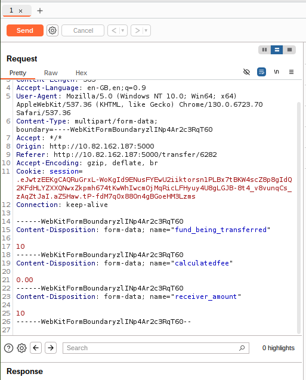  

Create the group with 100 duplicates  

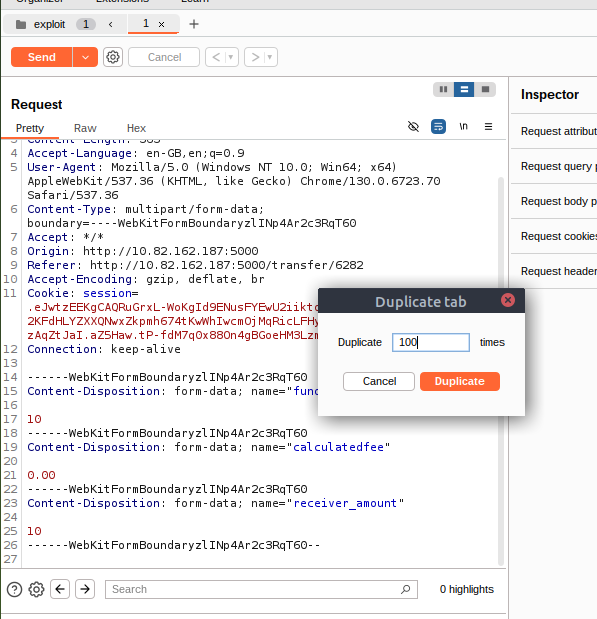  

Send the group in parallel and receive the response  

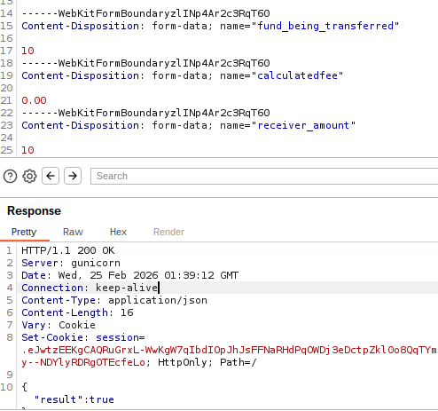  

Rasser Balance Post Transfer Test2:  

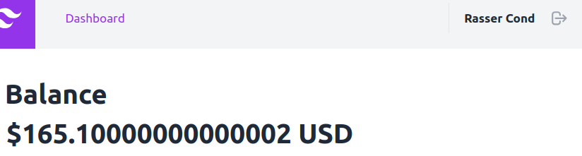  

Zavodni Balance Post Transfer:  

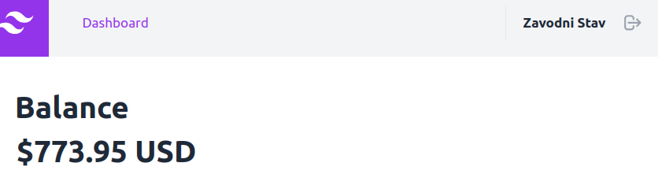  

Outcome: Rasser's account decreased by only $110; Zavodni's account increased $760  

Next Step: Repeat the exact same exploit.  

The final outcome:  

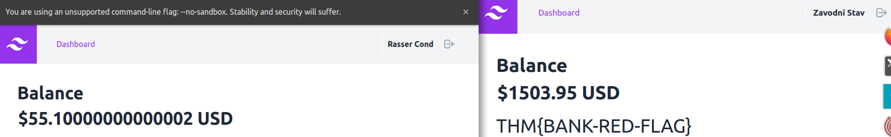