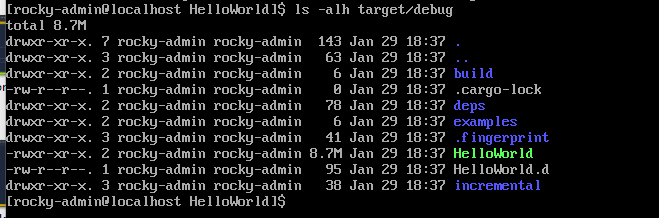

# Learn Rust

## What is Rust

### Fast
a compiled low level language, which aims (and succeeds) to be the same speed as C++, but while incorporating some higher level language features  

the data type of a variable is known at compile time  

Rust does not use garbage collection  

### Secure

completely memory safe

All Rust code follows these rules:

- Each value has a variable, called an owner.
- There can only be one owner at a time.
- When the owner goes out of scope, the value will be dropped.

Values can be moved or borrowed between variables, but no value can have more than 1 owner.

### Productive

Cargo: Package manager  
Clippy: development assistant  
RustFMT: automatic code formatting  
Cargo Test: built-in testing application  
Cargo docs: automatic code documentation generator; written in markdown
Rust-Analyzer: Labels wrong code, explains why the code is wrong, provides auto-fix  
The Book: Rust documentation

## Installing and Tooling


Install `:> curl --proto '=https' --tlsv1.2 -sSf https://sh.rustup.rs | sh`

Documentation: https://rust-lang.org/tools/install/

Install rustscan with cargo: `:> cargo install rustscan`  

format code: `:> cargo fmt`  

## Hello, World!  

Create a new folder: `:> mkdir HelloWorld`

Initilize the project: `:> cargo init`  

```rust
- Cargo.toml //project configuration file
- src/
    - main.rs
```

### Cargo.toml

The Cargo.toml file for each package is called its manifest. It is written in the TOML format. It contains [metadata](https://doc.rust-lang.org/cargo/reference/manifest.html) that is needed to compile the package. Checkout the cargo locate-project section for more detail on how cargo finds the manifest file.  

### main.rs

located in `src` folder

required file
every `main.rs` must have a `main` function  

```rust
fn main() {
    println!("Hello, world!");
}
```

### Execute Code  

`:> cargo run`  

Results in increased file structure  

  

Finding the binary  



Run the binary: `:> ./target/debut/hello_world`  

Optimise for release: `:> carge build --release`  

  


## Variables

All variables are immutable  

```rust
fn main() {
    let x = 5;
    println!("The value of x is: {}", x);
    x = 1;
    println!("The value of x is: {}", x);
}
```

This code does not compile**.** It returns with the error:

`error[E0384]: cannot assign twice to immutable variable x --> src/main.rs:4:5`

To make a variable mutable, we place the mut keyword in front of it like so: 

```rust
fn main() {     
    let mut x = 9;     
    println!("The value of x is: {}", x);     
    let x = 4;     
    println!("The value of x is: {}", x); }
```

This code compiles & runs correctly  

## Constant Variables

are always immutable  

can be declared in any scope, including the global scope. This means that we can use their value in any part of our code, or in multiple places at once  

`const HUNDRED_THOUSAND: u32 = 100_000;`  

### Shadowing

```rust
fn main(){
    let x = 6;
    let x = x + 1;
    println!("{}", x)
}
```

"The first variable is shadowed by the second"  

The program first binds `x` to the value of 6. Then it shadows `x` by repeating `let x`, taking the original value and adding 1 so the value is then 7.  

Effectively creates a new variable with the `let` command, allowing a change in type.  


Also allowed:  

```rust
let word = "hello";
let word = word.len();
```

## Data Structure

### type hinted variables

```md
arch    | integer | unsigned
8-bit   | i8      | u8
16-bit  | i16     | u16
32-bit  | i32     | u32
64-bit  | i64     | u64
128-bit | i128    | u128

```

### Strings

#### String 

growable allocated data structure

#### &str

immutable fixed-length string
is a string slice of string

## Functions

Rust returns the final expression of a function  

```rust
fn hello() -> u16{
    println!("hello!"); // print this line
    6 //return this value to the calling function
}
```

```rust
fn main(){
    println!("I do not return!") // prints this line, but returns nothing because it has no calling function
}
```

### Adding Arguements

```rust
fn print_name(name: String){  //function arguments must include the argument type
    println!("{}", name);
}
```

A function with arguments which returns a value:  

```rust
fn print_name(name: String) -> u16{ // function argument type and the type for the returned value
    println!("{}", name);
    6;                              // returned value, semi-colon is not mandatory
}
```

## Loops

loop: keyword, loops forever or until explicity stopped  

```rust
fn main(){
    loop {
        println!("TryHackMe Rocks!");
        break;                          //break keyword stops the loop
    }
}
```

### Conditional Loops

```rust
fn main() {
    let mut number = 3;             // creating of a mutable variable called "number" and set the value to 3

    while number != 0 {             // sets the condition for execution of the loop
        println!("{}!", number);    // action performed by the loop

        number -= 1;                // decrement the value of the variable, which is why it needs to be mutable
    }

    println!("LIFTOFF!!!");         // action taken after the conditional loop exits
}
```

### For Loops

```rust
fn main() {
    let a = [10, 20, 30, 40, 50];

    for element in a.iter() {                   // convert 'a' into an object which can be manipulated
        println!("the value is: {}", element);
    }
}
```

## Zero-Cost Abstraction

Rust has this really cool thing called Zero Cost Abstractions. 

Zero cost abstraction is: `What you don’t use, you don’t pay for. And what you do use, you couldn’t do any better if you coded by hand.`

Let’s talk about the 2 parts of this sentence.

### "What you don’t use, you don’t pay for."

The language shouldn’t have a global cost for a feature that isn’t used.  
Let’s say to use a for loop, the language needs to have some massive 1gb file that slows down everything else. If we never use a for loop, we still pay for the for loop!

### "And what you do use, you couldn’t do any better if you coded by hand."

Here’s the kicker.

Say you wrote some code, a function that calculated Fibonacci numbers. And you compiled this code down into assembly.

Now let’s say you hand-write assembly to do the same function — calculate Fibonacci numbers but this time in assembly.

Handwriting it in assembly would mean we would either gain no performance, or we would lose performance.

By using zero cost abstractions, we write abstracted code (not handwritten assembly) and we couldn’t do any better if we tried to hand-write assembly.  

### Iterators  

Iterators are a way of processing a series of items with Rust, much like a for loop. 

`a.iter()` turns the variable `a` into an iterator over the items of `a`.  

Iterators are lazy. You have to tell them to do something to get values from them.  

Let's take a look at a real example.  

```rust
let a = vec![1, 2, 3];
let a_iter = a.iter();
for val in a_iter {
    println!("The value is {}, val);
}
```

We make the iterator do something by calling it in this for loop.  

Now we can make the code do something and consume the iter using some nifty functional programming skills.  
To square every number in an iterator, and then to sum it we can do:

```rust
let a = vec![1, 2, 3];
a.iter()
.map(|&i| i * i
.sum()
```

Rust can separate applications of methods with new lines.

Read the entire chapter on them from the [Rust Book](https://doc.rust-lang.org/book/ch13-02-iterators.html#processing-a-series-of-items-with-iterators) here.

Iterators are zero cost abstractions in Rust. For loops are not.

By using iterators, we are taking advantage of the fantastic zero cost abstraction. Speeding up our entire program.  

## Rayon

External [Crate](https://crates.io/crates/rayon) for Rust.  

Rayon is a data-parallelism library for Rust.  

convert a sequential computation into a parallel computation

```rust
// single threaded code
fn sum_of_squares(input: &[i32]) -> i32 {
    input.iter()
         .map(|&i| i * i)
         .sum()
}
```

```rust
// multi-threaded code with rayon
use rayon::prelude::*;
fn sum_of_squares(input: &[i32]) -> i32 {
    input.par_iter() // <-- just change that!
         .map(|&i| i * i)
         .sum()
}
```

## IF Statements